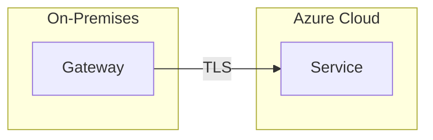

# Copilot Instructions for rfernandezdo.github.io

## Project Overview

This is a **MkDocs Material-based personal blog** focused on Azure, DevOps, security, and technical tutorials. The site is published to GitHub Pages via automated deployment.

## Architecture

### Core Components

- **MkDocs Material**: Static site generator with Material theme
- **Blog Plugin**: Powers `/docs/blog/posts/` with archive, tags, RSS feeds
- **Python Hook**: `scripts/splitMCSB.py` runs at build time to generate Azure security documentation
- **GitHub Actions**: `.github/workflows/publish-mkdocs.yml` builds and deploys on push to `main`
- **Virtual Environment**: `mysite/` contains isolated Python dependencies

### Content Structure

```
docs/
├── blog/posts/           # Blog articles organized by year (2023/, 2024/, 2025/)
│   └── template/         # Post templates (template1.md, template2.md)
├── Azure/Security/MCSB/  # Auto-generated security benchmark docs (from hook)
├── Tools/                # Standalone utilities (PowerShell scripts, Python tools)
└── assets/tables/        # Excel files and data tables
```

## Critical Workflows

### Local Development

```bash
# Activate virtual environment
source mysite/bin/activate  # Linux/Mac
# or
mysite/bin/Activate.ps1     # PowerShell

# Install/update dependencies
pip install -r requirements.txt

# Serve locally with live reload
mkdocs serve

# Build static site to site/
mkdocs build
```

### Deployment

- **Automatic**: Push to `main` triggers `.github/workflows/publish-mkdocs.yml`
- Workflow runs `mkdocs gh-deploy --force` to publish to `gh-pages` branch
- Cache key updates weekly (`date --utc '+%V'`) to balance freshness and speed

### Microsoft Security Benchmark Hook

The `splitMCSB.py` hook (configured in `mkdocs.yml` under `hooks:`) runs **before every build**:

1. Downloads `Microsoft_cloud_security_benchmark_v1.xlsx` from GitHub
2. Splits Excel sheets into `docs/assets/tables/MCSB/*.xlsx`
3. Generates Markdown files in `docs/Azure/Security/MCSB/` with `read_excel()` template tags
4. MkDocs table-reader plugin renders Excel data as HTML tables

**Important**: These files are build artifacts - don't edit manually; modify the hook or source Excel instead.

## Blog Post Conventions

### Required Frontmatter

All blog posts in `docs/blog/posts/YYYY/` must include:

```yaml
---
draft: false              # Set to true to hide from production
date: YYYY-MM-DD          # Publication date (format strictly YYYY-MM-DD)
authors:
  - rfernandezdo          # Author identifier (must match theme config)
categories:
  - Azure Services        # Main topic area
tags:
  - Tag1                  # Granular keywords
  - Tag2
---
```

### Naming Convention

Files follow `YYYYMMDD_descriptive_name.md` pattern:
- Example: `20251008_powerbi_onpremises_data_gateway.md`
- Year-based subdirectories: `2025/`, `2024/`, etc.

### Content Patterns (from templates)

1. **Technical Deep Dives** (`template1.md`):
   - Architecture diagrams (Mermaid syntax)
   - Deployment/configuration steps
   - Security and compliance sections
   - Monitoring and best practices

2. **Service Overviews** (`template2.md`):
   - Introduction with motivation
   - Scalability and performance
   - Use cases with code examples

### Markdown Extensions in Use

- **Mermaid diagrams**: Triple backtick `mermaid` blocks render flowcharts/sequences
- **Admonitions**: `!!! note` / `!!! warning` for callouts
- **Code highlighting**: Language-specific syntax with line numbers
- **Tabbed content**: `===` syntax for multi-option displays
- **Footnotes**: `[^1]` reference style

## Project-Specific Patterns

### Spanish Language Primary

- **All blog posts are in Spanish** (primary audience)
- English translations via Google Translate links (configured in `mkdocs.yml` extra.alternate)
- Keep technical terms in English when commonly understood (e.g., "Power BI", "gateway")

### Excel Table Integration

To embed Excel data in any Markdown file:

```markdown
{{ read_excel('docs/assets/tables/your-file.xlsx', engine='openpyxl') }}
```

Requires the file to exist in `docs/assets/tables/` and `mkdocs-table-reader-plugin` installed.

### Mermaid Diagram Style

Use flowchart LR/TB for architecture diagrams with descriptive subgraphs:



### Draft Management

- Set `draft: true` in frontmatter to work on unpublished posts
- Draft posts won't appear in production but are visible locally with `mkdocs serve`

## Common Pitfalls

1. **Date Format**: Must be `YYYY-MM-DD` (ISO 8601), not `DD/MM/YYYY` or other formats
2. **Author Name**: Must match `rfernandezdo` exactly (case-sensitive) or won't link to profile
3. **Virtual Environment**: Always activate `mysite/` venv before running `mkdocs` commands
4. **Hook Dependencies**: If `splitMCSB.py` fails, check `pandas` and `openpyxl` are installed
5. **Asset Paths**: Reference assets as `docs/assets/...` in Markdown, not `../assets/...`

## External Integrations

- **RSS Feeds**: Auto-generated (`feed_rss_created.xml`, `feed_json_created.json`) via rss plugin
- **Social Cards**: `mkdocs-material[imaging]` generates Open Graph images for sharing
- **Lightbox**: `mkdocs-glightbox` enables image zoom (skip with `skip-lightbox` class)
- **Minification**: JS/CSS minified in production builds (HTML minification disabled)

## Testing Changes

Before committing blog posts:

1. Run `mkdocs serve` and preview at `http://127.0.0.1:8000`
2. Check post appears in blog archive and tags pages
3. Verify Mermaid diagrams render correctly
4. Test RSS feed updates: `/feed_rss_created.xml`

## Key Files Reference

- `mkdocs.yml`: Master configuration (theme, plugins, nav, extensions)
- `requirements.txt`: Python dependencies (update when adding plugins)
- `scripts/splitMCSB.py`: Security benchmark processing hook
- `docs/blog/posts/template/`: Reusable post structures
- `.github/workflows/publish-mkdocs.yml`: CI/CD deployment pipeline
