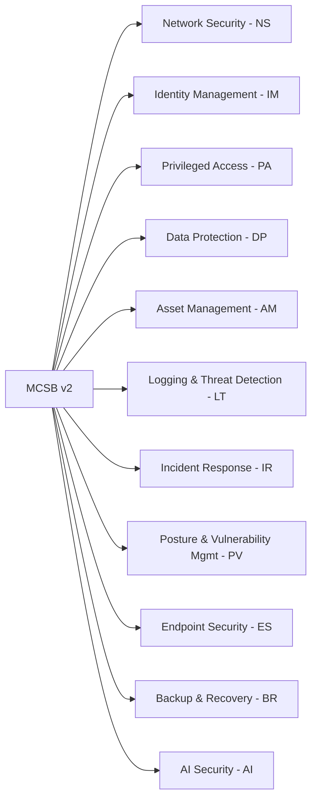

# Microsoft Cloud Security Benchmark v2

!!! tip "Descarga el Excel completo"
    Puedes descargar todos los controles MCSB v2 con Azure Policy mappings, control mappings y ejemplos de implementación:

    **[📥 Descargar Microsoft_cloud_security_benchmark_v2.xlsx](./Microsoft_cloud_security_benchmark_v2.xlsx)**


## Resumen

El Microsoft Cloud Security Benchmark v2 (MCSB v2) es la evolución del benchmark de seguridad para entornos cloud de Microsoft. Proporciona controles de seguridad técnicos y guías de implementación para proteger servicios y datos en Azure, Microsoft 365, y otros servicios cloud de Microsoft.

## ¿Qué es MCSB v2?

MCSB v2 es un framework de seguridad que:

- Define **controles de seguridad técnicos** organizados en dominios
- Proporciona **guías de implementación prácticas** para cada control
- Incluye **Azure Policy mappings** para automatizar compliance
- Ofrece **control mappings** con frameworks estándar (NIST, CIS, PCI-DSS, ISO 27001, SOC 2)
- Soporta estructura **jerárquica padre-hijo** para mayor granularidad

## Estructura de MCSB v2

### Dominios de Seguridad



### Controles Padre e Hijos

MCSB v2 introduce una estructura jerárquica:

- **Controles Padre** (ej: NS-1): Definen el principio de seguridad general
- **Controles Hijo** (ej: NS-1.1, NS-1.2): Implementaciones específicas del control padre

Ejemplo:
```
NS-1: Establish network segmentation boundaries (Padre)
  ├─ NS-1.1: Create segmentation using VNet and subnets (Hijo)
  └─ NS-1.2: Restrict network traffic using NSG (Hijo)
```

## Componentes de cada Control

Cada control incluye:

- **Control ID**: Identificador único (ej: NS-1)
- **Implementation ID**: ID de implementación específica para controles hijo (ej: NS-1.1)
- **Control Name**: Nombre descriptivo
- **Control Type**: Parent o Child
- **Core Pillar**: Pilar estratégico del control
- **Azure Policy**: Policies asociadas para enforcement automático
- **Security Principle**: Principio de seguridad subyacente
- **Risk to mitigate**: Riesgos que el control mitiga
- **MITRE ATT&CK**: Técnicas y tácticas relacionadas
- **Implementation example**: Ejemplos prácticos de implementación
- **Criticality**: Must have, Should have, o Nice to have
- **Control mapping**: Referencias a NIST SP 800-53, PCI-DSS v4, CIS Controls v8.1, NIST CSF v2.0, ISO 27001:2022, SOC 2

## Navegación

Explora cada dominio para ver:

- Controles organizados jerárquicamente
- Azure Policies aplicables con hyperlinks
- Ejemplos de implementación
- Mappings con frameworks estándar

## Referencias

- [MCSB v2 Documentation](https://learn.microsoft.com/en-us/security/benchmark/azure/overview)
- [Azure Policy Mappings](https://learn.microsoft.com/en-us/security/benchmark/azure/mcsb-v2-controls-policy-mapping)
- [Security Baselines](https://learn.microsoft.com/en-us/security/benchmark/azure/security-baselines-overview)
