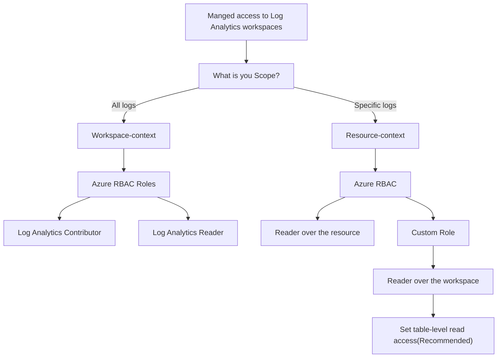

# Azure Monitor log Analytics

## What is Azure Monitor log Analytics?

Azure Monitor log Analytics is a service that helps you collect and analyze data generated by resources in your cloud and on-premises environments. It provides real-time insights using integrated search and custom dashboards to readily analyze millions of records across all of your workloads and servers regardless of their physical location.

## Managed access to Log Analytics workspaces

