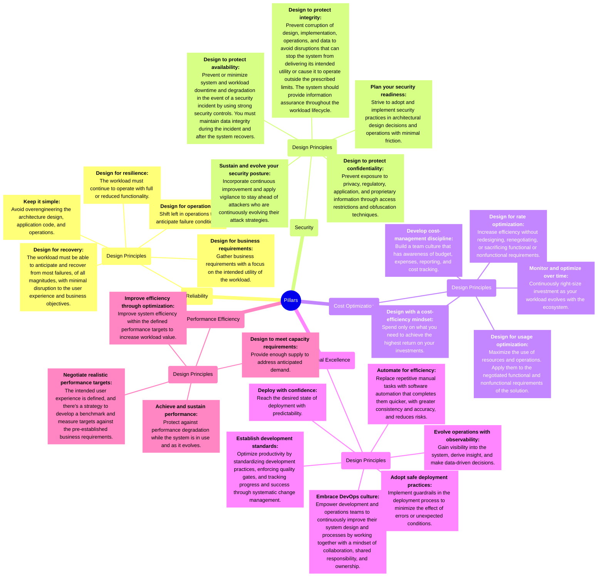

# Azure Well-Architected Framework (WAF) mind maps

## Microsoft Well-Architected Framework Pillars Design Principles Mind Map


Para cuando lo renderice correctamente materials:



[English Mermaid Live Editor](https://mermaid.live/edit#pako:eNqtWV1v3LoR_SuEXuoEG2PdONeO39IbowiKNEZyX9q6D1yJklhLpEJS62yC_Pd7Zkh9rK1dG0UWSLymhtR8njlD_8hyW6jsKmu1KVrZ3RqBj7M2nJzc6KaRzr94IdInPqTPZ9VoudGNDruT2fcXkwR93iuvK3PjtMl11yh_EhfEtPJgw7RJlNaJTe-1Ud4Lp7722qlWmeD_c5u9fPmU0NXLl49P_rsMtTqwQdzrUAuJE_PeC2sERIU2QZlCFaIPbJ6wJa_fW3fXWFmc3mb_PWqAw9dGK5Orh1pPTxZV_WP2FtH2PojcmqBNr0SwwnbKyaCizmXfNIJPLPocupa9yYO2RpLGz9Awt1vldo_1i-vP1G6jhNw0rJyEnggu6SdNMRwkSmdb0VrIllI3PexfkTsllG9lZXToC1pik5CLupWNKLR3fUfG0MHk-d7jKPUN9rPv-A1jPO3mfwqmb5V_0uzoQRz8KJ2mJ4umf6l1GUSj8J82M-EHlicbKWqFZoFllf6hVCd0EF63KAfWZX9pUYl3W6sLQW5VpoLt8Iap2D_S5bUO8AK9vGCrVkJ2XaNz1lNQta_YbZPu-6p9UXnvqK6HL7-iqG8aacTO9k74dCoSQxYcN7b6mMByIIJDpNnthe0Cm8Qeo3KeDumcRErkylO4Zt6h7Ip6FyrXnkO475X9VCyd5qo6mllQpnOWXkCBL3UBVTTX4TzLDkstGnrj1JZMQtZbT2Hl_Xor890KPqr6RgbrdnthjhHGWyCognQ7WI_kbmMOhNrZvgLa5XmEQR-SdckHm7L3KV-gZm301_6JmprZRKBZucM2j8-PWptbN5Q-UGLI5DHAycopWtHiQgbJKcEFMsEHyrOWOBQ55oPtuFT8zgfVRlwq0MK2sYp08Au477AX2EN1OcNf2weP8PFxHdyYO73Brka3OOWUYTK9xde2bzgiW9owj4b0iKokMEtxwal7XQbnlSrf5Y16bgjkFvCTWvKBKMxFjgYCpnMN6O-jMeTpUbnC3iN92wjFBSIri2iXjj00nQKkn4qSgIKyXmx2gsC7QlScpR-DBHU7Zxs48V-2jy2mlQgL_sUgj1kkin5Ev_Fc0kWWAb1iFunUiQ4k8he8g06nrWprG2DLPhyh-ghV2Z_PFV70rPhgkN2d5RRKbd2CdCC5kR4Rv9gA1PNObHWFQHF6WLhJ7oSsAYzs0RBkfgeLxH2NnHfz07CTFUuu0S5Jk6fx3krHgn5E7H6H4p9QM4g3h_GEFsR85ddwvK1qUIc5Dn_VSiOraDYqlvYA9VPaPiW26OC_9Rq1BiBQshV533AzZACoJRDuHp6KfKEEdygqFVZMKYwnAuIUIgMnVhFR6NUCLsvvsHS0_hKBZF1VWYIJgKHsqHgKr8K8DI9LLnc7qIeYG4QVpXVPtiDhBFp_wXiHvqa2EYhqXdVAdBgCuw2Jc2pqA14UmOs-yY56D08D5aagP2RJjyUW1f4ov0XkSNyNXA6chD7UkR-wEPGOEx6i7UD3jKosemPYo7W8z6BzTit7TD6RdG-b_smOzVSXofyIsY8EFm1FVYOxwMZZSCnSBOfg5nwcpxVlXzSLf8ULvETnoE0o1plVeHLYzGWzPlowaeyLrg3R-cy_CaPZsOMii6b9PocVh_wKrzztmnIKXSym2dgXIiwmFsWNAPnOQLyv-achAWRz_S1XTUO8_mS2KqblXwA91-0GxawIgT51fkAHdszyoyWHXLedvYfDiohPI2LPxwFgDw8Fe5CcID4hcupLiYcmxkaUDG5DZyRXMnxbQBQNrgk3Ek5QnucWE_rGukSHfA1oo5HLd9BBx-6e2P69QaOodbeYN9doLJtG-3rPJCyaQroiMvQnZJb89GlIL9iF4RSjGfVGmDbs0t_JwPl5I18HJhNJ4pr42jM9FhUKMTG9AZLp6MoRmtOq7yOlHRhu9DC8k4u8lgaQNXWRZUfEZv5wCrAbzJ3bOaN6juCBSwjwhq0eokNExs5Yygre4MFGI4AotGhtK-8U855XBT2cDS2LVrxXXWMj-owjxngFsfRoSdPPCl2FNaMEpbxC1IKKdJwO4XjxQeC-BQaIZPaiSu_6YFuejAE9E0KyTgeeLbrvM15NRYo2rYKmYZ9CivwQQfq7FAVvy0BdXsh4chx6aACwNEAgiWKXAZoSf0q3DkgjSZQxp9pBLAjAmYflIHU8bcX7DLpmwdSk8bplU3ke9bJUc0eNiR1NPi6zZPqHcbitepSOA3_3A8neO8PGErATb2f4LUvi_Yiecs6CM1IXN8R7cmqvhy4qbpTjUQVJcj1G5mS2KqblhXvC_xem_zk0froFAOhQBXezl2KmBShGXz5Tdsmnf-xd8j24W9Iefi1BMosEOcBg9RdPg0zk0DtycgIvrG6wq26lu4slCy7AvDO-XcgKhe_DMCu-UgOcqmL5RvJAZQ-DXKsUDbSdzONdyfIF6VHBJY_cpAlVmQigfeRkdMtSJJgdLrlo3IOHl29B3yVGGlE5TkuzoMQiOC5zYCxN82ty5zzQ8-nzvtaNmk9_mouFOCjXtKdRPnGURQM-pFY9Y3NDV3nEFZ8pu0wb096k5gPyONY35-FSWlNs9EA9R_a1lU3P1wXZKmsVdugiu8p-0OtvM8I-dZtd4Sua8N1tdmt-Qo7A8svO5NlVKRuvVlnfwZnqvZZwazuudtL821r8Hlwff82ufmTfsqvL9en64uzyfH15_vri7OLizSrbZVdnb9enb84uL9--eXtx_tvb9fry5yr7zgesTy_Xv52tz9dv_np-8frs7PXFKkMjATn9GP8mwX-a-PknXG1C6Q)

[Spanish Mermaid Live Editor](https://mermaid.live/edit#pako:eNqtWU1v3EYS_SsET7IxK1ga20p0MyJtECCODee2qxx6yJpxa8luppuc1cjwj9HRBx-C3PY6f2xfVTc_huJII9hCEFFkf1XVq1ev2p_SzOaUnqelNnmpqiuT4MdZWx8dvdeFcuSfPUviT_jIP__UaqELnav8qH981n_nn_dOm0xX2voLutCetn_Zo_5dklMS347m8U_4olxSKaeSAsMd_dlor2s8UlnhWMppVZD_91X6_Pnhw8-fP7-_2wfKbKULenBmklmTNCYhs7R_NoTfSaGSpg62Jxi51r5WbBfeZ8qt5Ll2aqGu7fFV-sejZips7rEewUdqyrCdAZOm_Hp_azwuiE9fa9NgKVuRUya3YtCywVLWqGBEZsuqIBhhsVHeZHh58MGzhtfN9PZvs-_ogyFPO3wFjLpEwQKAB0tuusWcp-jxUm2s236NAfDJUhX4NZO1bI4X_LJUK6PrJid8CPHExO1Xo0uVaFOTc00l54uL0g02Ce7GmyJpPDyoLQ7AULGLa6r1eoyUQ1xmgyesmUTw4Ouko950nmCjYEiuw2g-NhtuAzz9cKXpY72FV8mQwxSvOfpynHtvJ49xuda1uMnbhSNtVmQ0SQywO7yVh_yOvlQOiVVTVjdOzfhztv0716vuc1XoLICD3fvQ2X-nVeOEfLqn78g97wtl9FJzjvuG85pDEs4Fs3y7o_jpwLHT3vPLZvvFZeQZ4IB3bqsaIaVEPF6S4b8qt73LEG0lp-5WbOObUwayakPfOrxzNQ6iM4brwJch753Owjkj_A8BbeVsTStyQnDWLHUumVF07jh8-KRH3oNDASEXM896HY7IS-m1YjrKZ0j9VVNEW2YdbMQyuA7s7MoYAhyg0qAzpGVSUq4Z1MygtRjfOk1lCAH7qN5-yUzrabtsfITjU13DRLJyBzilH_ioOzI7pKYutWYDrMjH2U6kN0muuJDJzqhPDKie5mQIQ7dqKFe8ruQ8p6ZHKaNSuBRLw-OYCIDfr3Y2-agyzOFlYi3hBxxB0hp7F9uvJbDoeY7PHBfW4-RyuMUicAZHyzqpRm4A9MAOO3HlEo-XTrgDPKKzQlhkjQnfUH-HoYF_K2t0VDaPxHF38MOxtAmUli71rRJH1xqlQw6vjUKer6PNvX82U-aEtznQo_KebwBdWQoqhakO6VbTLmtIAG_b6l87W9CIVzh2iNZxcsGFt4x1YBetbWgDuHLwOW-EM_e7AnnkK_CbLC96qTfJU1u_6aGitGLjaW2LJsCKGdZ6Lh87Rx4UrANnTEboF4McAwBhNF1bF-qqSCbOI6YZtmKtV1DFogcEBq2DIocjcCo6nR2kkJX8d0gzEM_2zvTn68LAm5TiNt94HuYUXK0DEWENTGY_3VPh76pakCQAuKCfYKr1RztveYXw_nuqc5Y6wA5SkLGPKQXQGxXxCudvd85k55A9T5szGaKfrIFvmo0S3ZY1RRtZluzIInZyQAG8mg1kG1NPA5bDyjMJzErxJuE5UIuwJWMUIIH7EA3bn-YR9uiUJNNw0WYILXV_hh1XPH3epDt-hhGAjI1qL9hvCNUMRB-F5KKjdNHHyLvaOiOmMda0WQO7D8jDeyrejtDFmthOC_7JoZOWvFU3GJkJSTSBw5ggnLd-V7scJ28qFBQYKuk1bti6bkaiCTOHLwytLJyaB3SLauU8PLDAT9iTsLJYKn-Y9e3oaUHfhPxn4dOH32vDfVhcmZVPtIHLiFcophir3D4P2JEH9nAtKhcwQdJWtYcO2OzqU6DYAwbuS1tQ3PZ_4LLrBqKBaU_qiWAvFHSWZyjeUUjfK3c9Z7b7oWWP5WTXrMubjApx3zuGDSqqOurfJd3L70iHb6JwL3pOuqD1uyoAY-_X6aaglF6XIrYDsQVt3xLoWM6HOiQ1y90rJ8MerFcUEC-seX30r0TkujEMoGlOymyhFta1GhN0CsHj24sfuTdQruYIbqLqxutpvF0CAYuCWDQalnQj48Rnj4yZ9Fwoe5nkEI6QN52aIsEcsu82Qs-Puqp-ZdHTwDnxwIqlUBiRRVdsEggD6GFZSAqLXbnQPeCv7ZcbZAhCB7euo_QZVrcQgO0dbxyUqyoXeo82vewg78bdsATJLjy5tRoq1KdNmfbiIhRQqPtWzw7V6CxUlNVIkKN3siUNm9GF8oovXVCYRCVO2_jLoNHlA0qXqMxtuPza-3WaQgtIrVBCOOA5Q95T-D3ukmS50MO0Vk4f8E0Dw8AXty2x9-wcknv_9z03jWBJNK9SDUgupJCsTNaOKqo1M1OIlepW7gqIt8v6v5gmLBkufuS6Dop1e4cVtneVzm242ArVHk8SOKE-zkwJkKTwRm74brNYQzX51b4otQy2mzRjl4q6Vrucd9CMaTXejqVk1SiX64ClkHLSr08sGJhw2F7RkrIg5NDzonZxURxel2n8j5MEUB2VkS6OF1R8AB1ETXh0OVRnRTL4NHFN_q2V5beu3Hc3jSKNuj3xDGYC3IPfnzB-3wXsvhvPruOXLgaflvBzrhhIdMMYk6rR9y4hGPlA9aMrrZooqx0C41pYcu13owtV6U4fvsrnI1EsFMD9QQLWI6P8Um4sRksLyVfhjmlC0B02cU_r395rcEEO8JHazEiFv2zYAW4zebxPANOiYHUX3vtu4X9F8RE11rXpCNgg2mLHY4P2nbmma9WFYXTXkO8ukcgvbpkHTX7ACXK2kfK4I_F6ObdHk0Y1syuHx3V1R2EHifr0edP9CK8zVuP5zr0YX560bf7ebItZ0t7AqSZWM6y0VoXcF-y7rEpnaUkosDpPz9NPfMSrtP4ItrtKz_EIOfOfq_TKfMY4LhW_b0yWni9V4WmWNhVqLshGIWRl97ZSJj3_lN6k5_PjF_MfTuZz_Pdq_vrHs_nZLN2k5_84mR-fzF-dzk_PXv3w4uXrlyfzz7P01lqscXJ8Nn99dvLy7PTF2enrFyfz01mKeKIfeBv-_VD-GVE2-ZdMQJ9On_8PwOHHng)

## Microsoft Well-Architected Framework Pillars Tradeofs Mind Map


Para cuando lo renderice correctamente materials:

```mermaid
mindmap
    root((Pillars))        
        Reliability(Reliability)
            Tradeoffs(Tradeoffs)
                Reliability tradeoffs with Security["`**Reliability tradeoffs with Security**`"]
                     Tradeoff: Increased workload surface area. The Security pillar prioritizes a reduced and contained surface area to minimize attack vectors and reduce the management of security controls.["`**Tradeoff: Increased workload surface area.** The Security pillar prioritizes a reduced and contained surface area to minimize attack vectors and reduce the management of security controls.`"]
                        Tradeoff: Security control bypass. The Security pillar recommends that all controls remain active in both normal and stressed systems.["`**Tradeoff: Security control bypass.** The Security pillar recommends that all controls remain active in both normal and stressed systems.`"]
                            Tradeoff: Old software versions. The Security pillar encourages a *get current, stay current* approach to vendor security patches.["`**Tradeoff: Old software versions.** The Security pillar encourages a *get current, stay current* approach to vendor security patches.`"]
                Reliability tradeoffs with Cost Optimization["`**Reliability tradeoffs with Cost Optimization**`"]
                    Tradeoff: Increased implementation redundancy or waste. A cost-optimized workload minimizes underutilized resources and avoids over-provisioning resources.["`**Tradeoff: Increased implementation redundancy or waste.** A cost-optimized workload minimizes underutilized resources and avoids over-provisioning resources.`"]
                        Tradeoff: Increased investment in operations that aren't aligned with functional requirements. One approach to cost optimization is evaluating the value that's provided by any deployed solution.["`**Tradeoff: Increased investment in operations that aren't aligned with functional requirements.** One approach to cost optimization is evaluating the value that's provided by any deployed solution.`"]
                Reliability tradeoffs with Operational Excellence["`**Reliability tradeoffs with Operational Excellence**`"]
                    Tradeoff: Increased operational complexity. Operational Excellence, like Reliability itself, prioritizes simplicity.["`**Tradeoff: Increased operational complexity.** Operational Excellence, like Reliability itself, prioritizes simplicity.`"]
                        Tradeoff: Increased effort to generate team knowledge and awareness. The Operational Excellence pillar recommends keeping and maintaining a documentation repository for procedures and topologies. ["`**Tradeoff: Increased effort to generate team knowledge and awareness.** The Operational Excellence pillar recommends keeping and maintaining a documentation repository for procedures and topologies.`"]
                Reliability tradeoffs with Performance Efficiency["`**Reliability tradeoffs with Performance Efficiency**`"]
                    Tradeoff: Increased latency. Performance Efficiency requires a system to achieve performance targets for user and data flows.["`**Tradeoff: Increased latency.** Performance Efficiency requires a system to achieve performance targets for user and data flows.`"]
                        Tradeoff: Increased over-provisioning. The Performance Efficiency pillar discourages over-provisioning, instead recommending the use of just enough resources to satisfy demand.["`**Tradeoff: Increased over-provisioning.** The Performance Efficiency pillar discourages over-provisioning, instead recommending the use of just enough resources to satisfy demand.`"]
        Security(Security)
            Tradeoffs(Tradeoffs)
                Security tradeoffs with Reliability["`**Security tradeoffs with Reliability**`"]
                    Tradeoff: Increased complexity. The Reliability pillar prioritizes simplicity and recommends that points of failure are minimized.["`**Tradeoff: Increased complexity.** The Reliability pillar prioritizes simplicity and recommends that points of failure are minimized.`"]
                        Tradeoff: Increased critical dependencies. The Reliability pillar recommends minimizing critical dependencies. A workload that minimizes critical dependencies, especially external ones, has more control over its points of failure.["`**Tradeoff: Increased critical dependencies.** The Reliability pillar recommends minimizing critical dependencies. A workload that minimizes critical dependencies, especially external ones, has more control over its points of failure.`"]
                            Tradeoff: Increased complexity of disaster recovery. A workload must reliably recover from all forms of disaster.["`**Tradeoff: Increased complexity of disaster recovery.** A workload must reliably recover from all forms of disaster.`"]
                                Tradeoff: Increased rate of change. A workload that experiences runtime change is exposed to more risk of reliability impact due to that change.["`**Tradeoff: Increased rate of change.** A workload that experiences runtime change is exposed to more risk of reliability impact due to that change.`"]
                Security tradeoffs with Cost Optimization["`**Security tradeoffs with Cost Optimization**`"]
                    Tradeoff: Additional infrastructure. One approach to cost optimizing a workload is to look for ways to reduce the diversity and number of components and increase density.["`**Tradeoff: Additional infrastructure.** One approach to cost optimizing a workload is to look for ways to reduce the diversity and number of components and increase density.`"]
                        Tradeoff: Increased demand on infrastructure. The Cost Optimization pillar prioritizes driving down demand on resources to enable the use of cheaper SKUs, fewer instances, or reduced consumption.["`**Tradeoff: Increased demand on infrastructure.** The Cost Optimization pillar prioritizes driving down demand on resources to enable the use of cheaper SKUs, fewer instances, or reduced consumption.`"]
                            Tradeoff: Increased process and operational costs. Personnel process costs are part of the overall total cost of ownership and are factored into a workload's return on investment. Optimizing these costs is a recommendation of the Cost Optimization pillar.["`**Tradeoff: Increased process and operational costs.** Personnel process costs are part of the overall total cost of ownership and are factored into a workload's return on investment. Optimizing these costs is a recommendation of the Cost Optimization pillar.`"]
                Security tradeoffs with Operational Excellence["`**Security tradeoffs with Operational Excellence**`"]
                    Tradeoff: Complications in observability and serviceability. Operational Excellence requires architectures to be serviceable and observable. The most serviceable architectures are those that are the most transparent to everyone involved.["`**Tradeoff: Complications in observability and serviceability.** Operational Excellence requires architectures to be serviceable and observable. The most serviceable architectures are those that are the most transparent to everyone involved.`"]
                        Tradeoff: Decreased agility and increased complexity. Workload teams measure their velocity so that they can improve the quality, frequency, and efficiency of delivery activities over time. Workload complexity factors into the effort and risk involved in operations["`**Tradeoff: Decreased agility and increased complexity.** Workload teams measure their velocity so that they can improve the quality, frequency, and efficiency of delivery activities over time. Workload complexity factors into the effort and risk involved in operations`"]
                            Tradeoff: Increased coordination efforts. A team that minimizes external points of contact and review can control their operations and timeline more effectively.["`**Tradeoff: Increased coordination efforts.** A team that minimizes external points of contact and review can control their operations and timeline more effectively.`"]             
                Security tradeoffs with Performance Efficiency["`**Security tradeoffs with Performance Efficiency**`"]
                    Tradeoff: Increased latency and overhead. A performant workload reduces latency and overhead.["`**Tradeoff: Increased latency and overhead.** A performant workload reduces latency and overhead.`"]
                        Tradeoff: Increased chance of misconfiguration. Reliably meeting performance targets depends on predictable implementations of the design.["`**Tradeoff: Increased chance of misconfiguration.** Reliably meeting performance targets depends on predictable implementations of the design.`"]
        Cost Optimization["Cost Optimization`"]
            Tradeoffs(Tradeoffs)
                Cost Optimization tradeoffs with Reliability["`**Cost Optimization tradeoffs with Reliability**`"]
                    Tradeoff: Reduced resiliency. A workload incorporates resiliency measures to attempt to avoid and withstand specific types and quantities of malfunction.["`**Tradeoff: Reduced resiliency.** A workload incorporates resiliency measures to attempt to avoid and withstand specific types and quantities of malfunction.`"]
                        Tradeoff: Limited recovery strategy. A workload that's reliable has a tested incident response and recovery plan for disaster scenarios.["`**Tradeoff: Limited recovery strategy.** A workload that's reliable has a tested incident response and recovery plan for disaster scenarios.`"]
                            Tradeoff: Increased complexity. A workload that uses straightforward approaches and avoids unnecessary or overengineered complexity is generally easier to manage in terms of reliability.["`**Tradeoff: Increased complexity.** A workload that uses straightforward approaches and avoids unnecessary or overengineered complexity is generally easier to manage in terms of reliability.`"]
                Cost Optimization tradeoffs with Security["`**Cost Optimization tradeoffs with Security**`"]
                    Tradeoff: Reduced security controls. Security controls are established across multiple layers, sometimes redundantly, to provide defense in depth.["`**Tradeoff: Reduced security controls.** Security controls are established across multiple layers, sometimes redundantly, to provide defense in depth.`"]
                        Tradeoff: Increased workload surface area. The Security pillar prioritizes a reduced and contained surface area to minimize attack vectors and the management of security controls.["`**Tradeoff: Increased workload surface area.** The Security pillar prioritizes a reduced and contained surface area to minimize attack vectors and the management of security controls.`"]
                            Tradeoff: Removed segmentation. The Security pillar prioritizes strong segmentation to support the application of targeted security controls and to control the blast radius.["`**Tradeoff: Removed segmentation.** The Security pillar prioritizes strong segmentation to support the application of targeted security controls and to control the blast radius.`"]
                Cost Optimization tradeoffs with Operational Excellence["`**Cost Optimization tradeoffs with Operational Excellence**`"]
                    Tradeoff: Compromised software development lifecycle SDLC capacities. A workload's SDLC process provides rigor, consistency, specificity, and prioritization to change management in a workload.["`**Tradeoff: Compromised software development lifecycle capacities.** A workload's SDLC process provides rigor, consistency, specificity, and prioritization to change management in a workload.`"]
                        Tradeoff: Reduced observability. Observability is necessary to help ensure that a workload has meaningful alerting and successful incident response.["`**Tradeoff: Reduced observability.** Observability is necessary to help ensure that a workload has meaningful alerting and successful incident response.`"]
                            Tradeoff: Deferred maintenance. Workload teams are expected to keep code, tooling, software packages, and operating systems patched and up to date in a timely and orderly way.["`**Tradeoff: Deferred maintenance.** Workload teams are expected to keep code, tooling, software packages, and operating systems patched and up to date in a timely and orderly way.`"]
                Cost Optimization tradeoffs with Performance Efficiency["`**Cost Optimization tradeoffs with Performance Efficiency**`"]
                    Tradeoff: Underprovisioned or underscaled resources. A performance-efficient workload has enough resources to serve demand but doesn't have excessive unused overhead, even when usage patterns fluctuate.["`**Tradeoff: Underprovisioned or underscaled resources.** A performance-efficient workload has enough resources to serve demand but doesn't have excessive unused overhead, even when usage patterns fluctuate.`"]
                        Tradeoff: Lack of optimization over time. Evaluating the effects of changes in functionality, changes in usage patterns, new technologies, and different approaches on the workload is one way to try to increase efficiency.["`**Tradeoff: Lack of optimization over time.** Evaluating the effects of changes in functionality, changes in usage patterns, new technologies, and different approaches on the workload is one way to try to increase efficiency.`"]
        Operational Excellence["Operational Excellence"]
            Tradeoffs(Tradeoffs)
                Operational Excellence tradeoffs with Reliability["`**Operational Excellence tradeoffs with Reliability**`"]
                    Tradeoff: Increased complexity. Reliability prioritizes simplicity, because simple design minimizes misconfiguration and reduces unexpected interactions.["`**Tradeoff: Increased complexity.** Reliability prioritizes simplicity, because simple design minimizes misconfiguration and reduces unexpected interactions.`"]
                        Tradeoff: Increased potentially destabilizing activities. The Reliability pillar encourages the avoidance of activities or design choices that can destabilize a system and lead to disruptions, outages, or malfunctions["`**Tradeoff: Increased potentially destabilizing activities.** The Reliability pillar encourages the avoidance of activities or design choices that can destabilize a system and lead to disruptions, outages, or malfunctions.`"]
                Operational Excellence tradeoffs with Security["`**Operational Excellence tradeoffs with Security**`"]
                    Tradeoff: Increased surface area. The Security pillar recommends a reduced workload surface area in terms of components and exposure to operations. This reduction minimizes attack vectors and produces a smaller scope for security control and testing.["`**Tradeoff: Increased surface area.** The Security pillar recommends a reduced workload surface area in terms of components and exposure to operations. This reduction minimizes attack vectors and produces a smaller scope for security control and testing.`"]
                        Tradeoff: Increased desire for transparency. A secure workload is based on designs that protect the confidentiality of data that flows through the components of the system.["`**Tradeoff: Increased desire for transparency.** A secure workload is based on designs that protect the confidentiality of data that flows through the components of the system.`"]
                            Tradeoff: Reduced segmentation. A key security approach for isolating access and function is to design a strong segmentation strategy. This design is implemented through resource isolation and identity controls.["`**Tradeoff: Reduced segmentation.** A key security approach for isolating access and function is to design a strong segmentation strategy. This design is implemented through resource isolation and identity controls.`"]                    
                Operational Excellence tradeoffs with Cost Optimization["`**Operational Excellence tradeoffs with Cost Optimization**`"]
                     Tradeoff: Increased resource spending. A major cost driver for a workload is the cost of its resources. Deploying fewer resources, right-sizing resources, and reducing consumption generally helps keep costs low.["`**Tradeoff: Increased resource spending.** A major cost driver for a workload is the cost of its resources. Deploying fewer resources, right-sizing resources, and reducing consumption generally helps keep costs low.`"]
                        Tradeoff: Decreased focus on delivery activities. Workload team members deliver increased workload value by efficiently performing tasks that are aligned to their capabilities.["`**Tradeoff: Decreased focus on delivery activities.** Workload team members deliver increased workload value by efficiently performing tasks that are aligned to their capabilities.`"]
                            Tradeoff: Increased tooling demands and diversity. The Cost Optimization pillar recommends the reduction of tooling sprawl, consolidation of vendors, and a right-sized approach to all tooling purchases.["`**Tradeoff: Increased tooling demands and diversity.** The Cost Optimization pillar recommends the reduction of tooling sprawl, consolidation of vendors, and a right-sized approach to all tooling purchases.`"]
                Operational Excellence tradeoffs with Performance Efficiency["`**Operational Excellence tradeoffs with Performance Efficiency**`"]
                    Tradeoff: Increased resource utilization. The Performance Efficiency pillar recommends the allocation of as much of the available compute and network as possible to the requirements of the workload.["`**Tradeoff: Increased resource utilization.** The Performance Efficiency pillar recommends the allocation of as much of the available compute and network as possible to the requirements of the workload.`"]
                        Tradeoff: Increased latency. To create performant workloads, teams look for ways to reduce the time and resources that workloads consume to perform their tasks.["`**Tradeoff: Increased latency.** To create performant workloads, teams look for ways to reduce the time and resources that workloads consume to perform their tasks.`"]
        Performance Efficiency("Performance Efficiency")
            Tradeoffs(Tradeoffs)
                Performance Efficiency tradeoffs with Reliability["`**Performance Efficiency tradeoffs with Reliability**`"]
                    Tradeoff: Reduced replication and increased density. A cornerstone of reliability is ensuring resilience by using replication and limiting the blast radius of malfunctions.["`**Tradeoff: Reduced replication and increased density.** A cornerstone of reliability is ensuring resilience by using replication and limiting the blast radius of malfunctions.`"]
                        Tradeoff: Increased complexity. Reliability prioritizes simplicity.["`**Tradeoff: Increased complexity.** Reliability prioritizes simplicity.`"]
                            Tradeoff: Testing and observation on active environments. Avoiding the unnecessary use of production systems is a self-preservation approach for reliability.["`**Tradeoff: Testing and observation on active environments.** Avoiding the unnecessary use of production systems is a self-preservation approach for reliability.`"]                  
                Performance Efficiency tradeoffs with Security["`**Performance Efficiency tradeoffs with Security**`"]
                    Tradeoff: Reduction of security controls. Security controls are established across multiple layers, sometimes redundantly, to provide defense in depth["`**Tradeoff: Reduction of security controls.** Security controls are established across multiple layers, sometimes redundantly, to provide defense in depth.`"]
                        Tradeoff: Increased workload surface area. Security prioritizes a reduced and contained surface area to minimize attack vectors and reduce the management of security controls.["`**Tradeoff: Increased workload surface area.** Security prioritizes a reduced and contained surface area to minimize attack vectors and reduce the management of security controls.`"]
                            Tradeoff: Removing segmentation. The Security pillar prioritizes strong segmentation to enable fine-grained security controls and reduce blast radius.["`**Tradeoff: Removing segmentation.** The Security pillar prioritizes strong segmentation to enable fine-grained security controls and reduce blast radius.`"]                   
                Performance Efficiency tradeoffs with Cost Optimization["`**Performance Efficiency tradeoffs with Cost Optimization**`"]
                    Tradeoff: Too much supply for demand. Both Cost Optimization and Performance Efficiency prioritize having just enough supply to serve demand.["`**Tradeoff: Too much supply for demand.** Both Cost Optimization and Performance Efficiency prioritize having just enough supply to serve demand.`"]
                        Tradeoff: More components. One cost optimization technique is to consolidate with a smaller number of resources by increasing density, removing duplication, and co-locating functionality.["`**Tradeoff: More components.** One cost optimization technique is to consolidate with a smaller number of resources by increasing density, removing duplication, and co-locating functionality.`"]
                        Tradeoff: Increased investment on items that aren't aligned with functional requirements. One approach to cost optimization is evaluating the value provided by any solution that's deployed.["`**Tradeoff: Increased investment on items that aren't aligned with functional requirements.** One approach to cost optimization is evaluating the value provided by any solution that's deployed.`"]                    
                Performance Efficiency tradeoffs with Operational Excellence["`**Performance Efficiency tradeoffs with Operational Excellence**`"]
                    Tradeoff: Reduced observability. Observability is necessary to provide a workload with meaningful alerting and help ensure successful incident response.["`**Tradeoff: Reduced observability.** Observability is necessary to provide a workload with meaningful alerting and help ensure successful incident response.`"]
                        Tradeoff: Increased complexity in operations. A complex environment has more complex interactions and a higher likelihood of a negative impact from routine, ad hoc, and emergency operations.["`**Tradeoff: Increased complexity in operations.** A complex environment has more complex interactions and a higher likelihood of a negative impact from routine, ad hoc, and emergency operations.`"]
                            Tradeoff: Culture stress. Operational Excellence is rooted in a culture of blamelessness, respect, and continuous improvement.["`**Tradeoff: Culture stress.** Operational Excellence is rooted in a culture of blamelessness, respect, and continuous improvement.`"]

                
```

[English Mermaid Live Editor](https://mermaid.live/edit#pako:eNrdXN1v3DYS_1eIfWlqrI0muTiJ33JJHw7XIkWT4oA7H1Ba4q5YS6JKUrveBv3fOzOkJGr1sdI6_moegrUkkvPF4cyPQ35ZRCoWi4tFJvM448VlzuCfVso-e_aTTFOuzbffMv_PvcR_P4tU8iuZSrt7Fvz-tvkC_33WPBZqtTLP6l97X-z1xWz1HdtKm7BPIio1PP_f5eLXk5MJH56c_Hq5-H93jBY5F-xfeaQFNyJmW6WvU8VjZkq94pFgHF6csc-JqPtkBcmBFVoq-Fv-IQzjTIu4jKADnscsUrnlMhftXphVDKQqM2jBuLU8umYbEVmlDbVyPTALQ2U852uRidwytWKmGhj71So1Z47_6fSfnDw2DkbU0tLMp72W7GpXcGP6NaJFpDIYMzZAA7eMp2k9IrzMgCPGIys3gsGvKwWGkiud8ZSoN1YLgzI0O2NF1pXyEC0D0v3K1IxLrC21jym0Uyu7Ba2BhrSRKh-QmcgjVWrQFZrAyVpYBu816G0JJPBd9dcJ40WhFY8SNIINcKV0o9aC2ygRXYn10zEgr69KSb-0RjzGe2Us-1hYNG5ugc6DPqbTYszZ9M1VmRUpTRFqTbMnj3ke7RhwtOWg9jP2DkzG2FPlhgkneDURDYNWQpcWiMQPwGxAjJFwU5JvlAQDVCD8U5DaRqIKZL5uPhtxJhMIBF3eA4lTvUVAer4RxpL_gcmlCqGJh2oqgiF9gzNSrtHHkTpXZR7hJzD_tPi9lJo4h1nzMRctk0NumQr0zqRhYsPTEv4CstH94V-CxvrGMGIqhnGudsDwjsWiSNUOp7ZKS-xgTAVfjQ_Q1D1wMnvefaxYAnq_v4lEmoIfEAcnX3-zuTNQBb2AswZrv4GxzgZ6X7JUXosWM9Iaka6WrZXU4LSREXY0rNeBkVFJX2ns-XNGrFZKWzSMtciRCNC74Bm7ztU2FfFauOmKzjwX1RrcT27PGngtRIFGhX3g2ofxBf3NYhWVoZcplJEQU-wYkIMmB0FJqb2zsKpQqVpLcApsWLpzOfEr0sPxMnva_CT0CoMFpO_71QpUDqQejov7m82dNikIFJqdDXRX-R1cx130gpoAnyMFxDpF0MZyDeu8IeGURmgSS8wtZ6tUbceWpooE0NxdEzF_InWWMjdVBgj15hVLU8c_nQ6W4P2BBx43Vlg5aCAZQ-zfSvDlIlflOgnWV2DZgCmaFfpqGDkec0kdqv20eBR0t7VQxY7Pqh9HZZp1BLo3S4IJ5MQ14cO5cyhcblDI4aTtSc8ax-4zrXZuUShwQgblueIyBQ-DoUEdf41pvb343D0l82dThCNH4JIh2oBxwPbI-w-QGtDjB0WDG-jjXROrEvFNwNrbYMmEKUQkIZPbMXFjhcaVQuX4JuEwoAJWq-QQ5wKu0V2JjGmjl85hxTwFbuckrn12iX2Bk8F0wzEMQ-1a3GToQzRJJ91Vn7CVVhkl3ei8TNjLpOnQPyzlO8cPfFgWQ_KgIAa6ihKer0VXmeIG1jR0zKBOXeYQ0wv_LQX1NxCIiJgAHFSbluYae9NhPJkVPLIsxnBfuU79YMPi2qOqLZ07p6tfmkPOeiDDn_z5NA__Lo6lDyFlvtKgdl1GFufBaPrlosdadJKWwFSpawpLtnxHDwKALZaEp3gvnJfZFVgeagIMGOYozkF8Ib2qYGbnpi8lGab3QMJ4bxTPXzFcyMAwn91TAbrRjmL7VrlYyw1yGKttHvTXilBEDtNehMFMlAgO5s4-_fsXcJIrsUWnCAEQhk7wQOkaZAW_acqsOJD9DzLiV4RHx8pxvp7yIuPU306MDQIwEH8alecirT-kFxRYFFwTwoyUo_NFt2uV9Y3xDXAN7RNZuJwP2qw4QtYErmBKUNvwNwjLgnhzJ_AKeDmrJOwjVyP8-NKh5n4FdvL3pAwpZkTX40Jwec7fRgzzPPcYRjSvzTQf_l5RiOuRNsTdriAv3FQLEsHz8LeMhH80hBgFSaiGzNMKmr00465E00fq8IhqlNQ7qgyl1_qo1Qnq0CawfNZYoNt5wVYgjNwUCG8QCiIwdgEfi-pU6aYnIZjP8iBU9XiZnrqSfBDVpOTrhn_Zm7v9p452BIdgL4MvSkeU1GwjUkWZkvGBCzzesYjnGNRAmuyI_73kOAh4WZQc5tZLGlA0uTbGkBASIUduzwh8u8-3GYZUAR1BBOtmuHETHEfyuBjlbRhpVZJpY8v7tjFDHGAUf0OBHJvBKB3L3Pk9NxAlYYRE7iVgdXrVpE-0BRt52sRGii3JqUq4nDyDDQFCFIHzVObCBdMwpqD9xXQ3mvH0kEmB_IMQirJuiXb6MjGGic5rcyQg6hwamCDETjGquoYZbRMou7DJ9Lc5CHi2Pyc1zR7kCAgmIQGBsjNE-_KVXJdOnWcelYD0NxOCdo36sFWHKxiMKAqgTUaWfHt7g9FUYUMsjFyPxcUj9IBI7o6ituT6EsrOs66wp2GT3dDpEEg5p8U0A__ZR_iw8EIrB_kH-T2sAEoXCjEAE3xTuXxa8bm1AnID-on7vGSJSA1mEhBTIMAEs47ZXeF3RcD559Z7c9AvT6sNzY499JDXBiDum8CpE-sHUJEVcY0qYbEH0LjedWAdisXJmgVhbhycsrG0PkUyxkAH2IDs2YgajKUOixQ8MObhNYJlIsjxICvsbqoMU9OFc-6Cntvig10sDFJYQ1zIdWJh1C3XcY1jtKsOSkioMJfimooakFqRr2FlErqNBkKW4_YSCQ3lRmKgoXydE4YLwJQD-wLsajLu_ng56NfOQV_TrtSb_Pk8v9QtK-vUaLmMAWwUTFaaBGPYSCvInbMytRJEA0vkDhLjJUSkmcCwxNR1LjaFuBMk5KseYBFYCbRsiTBKYZNBh9SlC1R8r5TNX-IfsPDxCVc83r7Ucd-yM7UhC1rXQchhJYCjUBDmhI1oB7UsCiqDSAjFrdJ7imkoCuozVV-ZEIbv7CrluM_BY1maHqPvIXmC-O-V6CO92BjwdGTj6QiUVhDciqCAMhaYPhdkaamElGkXgZf49OGH95BwFTyimCRcDWG1prcVXujdBfgRuVZ6ScitNNYl2FWkQ4k3yrNWVq0bv28TGDyWsNbD9YJKE7kIGGgth_fNwlTHWbn6Fkx2xj62UDNYcZu1GQZPRFowcNQOD0H4qvFetKMqOBZNrMqU8VRoW5UYmTLCXvB5J84aXITalCFad_-0zXF9H2AN0xiyUEEVBIcwWTrwGi2ZN6Bm6zYNsRCL4YkFXA5VShUntaWBRV1jWcoyxNTR5biKal8r7Nx_WWB3MW5nkkEQQOHzZh0LDb-3vBvP9RLdBcEemuwj3d8YoHJk42nu7xcsF67riNCYtSshNhEYX1BA3AJZInFaIYS2bby99UUwGUS1H3ZVWhYrYbCaNuEb1BZaNdbml3lZVUcherJEXDln2wT-Kw1GzgWmkDo3bJXi7hzoomMm0_lpIzqPh6PJqS1GSLjdFFpGgMp-364udsifaUoIaO-hKWEmTx68adO3BBe2hSkWJbkvpHRzJpbQLW0DBCkTWiiMGG5Y4-YATA8qK3BesN58bqDmbr48ziJo8Aky2dbvYNzT_-JIiGtg--gQzjW72W1K81o1V71VcEt2JSKOu-b0rMIKA8x8H6MMzkph-l4vDLiCaE5GYSYjBw9G4PwUs1CwQlpXTxZT4ovnQSiQqHdwBuv6gtNBlBog-FGBwOEGkK7YixIlyTFSwRDPgyFFUxOMnKZYn4rLqDS6pDoGLHAorVuEoccA4zMjG_hT2Bsu5XssDA4odtqsa8M-89rMnaaHgYqgOrJJ9nvxghb8tVeQRDVqFBarYBsLR5QOkSG5BdOpBycAB-1mE-gFhJ0SAAqdESa6n866bBaUiTXYw_Y2Be_4O0jgmPovI7XruakJcJsXNFJ7gbxy1e-5n1dVHbNWWHRAc5GcY-wmd1UZiucD6EM6JAA_NQVk7vNaen77yM3F0UKvfoopHHxQmuehVxX-GaJX7yDd2TUqrusJkVlpVOoCJR7V1U-VK_I1hd7d8V7EqNk5IWP038KveiMPMy7PaBUtV8P6lc6JaQxt7GWMdPPkWOvsrw9us0_z3gNVtUc2nn1ev-bbFO5sCdpbxn8DBVDlGxY_Ykk2_L1XrJqIujYO69aDlPIDnWpEzbmyx_rVElGnxJ4at6wHz-uAicrvm4LIYMcFARZTZf5YNwdzcKyyusMY2dvTYW1-sdVKRaVxTq1T2bOHBLFMYPmwqT4NqpFqSbiTq1e7Os2xQKpPrSk14-a6OUdbH6J1lUFSEyRJIZrsOSQ9kep9KOje6T5uc9WDUh5LMD7f9OXbB6qoWweCRBAe4Lri-zWF5tvUobfwpCkadcf5vdXxxiZF3KpDd-Wtrq8C7DQBqsdSpnF-DhVTPxxHtwnFx8C72_QwN0yvHZk7_h9saY2fK9yTOghINVtBCEiXIDkfq_ANlykVJWAcU1pXfZALi5MKP4b41UiqcFdeh83J-KqTwW2MA7xMOiX5cNzMD5_r472fFcNnVvTVmIFJO3B77MwHHfdxK0gNVKLjqjvxKwqx4gfxbozc3LQTwI-AzraU-23h2eWi_8Xl4qjjqwMWdwg_m91sbrFYs2nbrhOuDvTQjSEajyNYBCf3j3sZtw3lwxBXs0XrYWncs3b_KZYvVVBruOm7V51lRurHDlHsbzl5AJqPqNWchV5-RZxxVqzx2SX34REA5w3rO5FEvpGQFPlLWN4hHFYfHQ9KnvxxJQcvuLzJ75PRuRS8IuO0AJ3UI7SStLFarZkkoo3cPZH96duxvqEN181rM8MrVOvcA9dr9c7_YdqebM1WAwI-qRvqHgPZs2u15B5qc3Sxlj-BuQLuTtfaM9lb5-TZOVyU1aHt-Kqs21E3gDkd67UGIKcjG0_zY5-VcjE61qel7joffzMJ-6fq65ekMZQU1BLHvXnUU3gNih9ib0e_uz4NkwSKvieipjqtH91lERXI7A7Dd-8fo21u-XspPEDapNPCqa_ZPWgOkDcxOwRcPnhz2T5Fb0u8bNHNhris47CldyinLhFDRCzckO9Ie58Bfzr-MbNwq1vzEKOmCOU-L8zbv1-uulauOntQ3Tc37cK841m41V15k5mYDsVPc21j1aq36WFe_jerIrIKhgIAmwgZqjYMqxTvoyryzui7TV7XPpzq0ml6FyYk4RU97mVYveHRyESuE3BAeLVgKhOlYkKjQARr7u6ldVev0IU2WoEV5wKcDrCpIn8iNxN67Q7kNgRNul2nzYNPsB8TF3NCwfcQ_pPK6dLewdsAcLdcKVdJAwRGvhVQC-FSJlJoi9cRLslMIIBd1kGvzEtVmuqQNF3H0Cm2btMwfDz_q1KBUlosFyDAjMt4cbH4gjK7XIA7zMTl4gJ-xlxfXy4u8z_hO15a9WmXR4uLFU-NWC7KAhfGD5JDVJnVTwueLy6-LG4WF69en704f_72u1fnL16e_-P521fLxW5x8fzNq7M35y_enr99-fLN-ctXL_5cLv5QCjr47uztqzevz1-_fv389Yvv3sBHy4WI8QrGH9295nS9OY3wX2pgdSn-_Auzs7K2)

[Spanish Mermaid live editor](https://mermaid.live/edit#pako:eNrlHcmS28b1V1A8jaeYKUuKtrklklyVilxxWXEOiVLlJtCkewKi6W5gMpTLH-OjDzqkfPOVP5a3dGMjmmyQIw1HmhMFoBvvvX77Av00SXUmJ5eTpSqypVi9LRL4M1qXZ2ffqFwYab_4InF_fBP_vlJipnKVieys-flFcx__XujlyuilstqetX73nuo9mWQymdc7JqkukjdyURn817_eTr4_P498-Pz8-7eTf2-_q_fCy-RP1VIWpca9cpHYaiXNXKVK4oXSiJm40hfJqzxZITXwYv2KZGWUNuqdSKqis9LIrErhiWSNMJWywN8rYUQCVFZLWGGSHMC_lmmpgcK4qyjFj5WEFbzYIDALaUu1-a0g2OB53MzonBdYD8ZFny5xOJ2fnzZWO46vd4J_Xq-EpdVuq-5GATSNTGG9LAAJBLHUGcDShQdQX4pCvktFkYi0VNdwtxRIWFkkVtlSLoVNCg1P4eOwH9yxJeAuYLOBc9kDafBIPjysu6ndp_g_pLFKF7APvEEtKsFnp-flf0FjhCg-18iVyFcA01wjJnD_HMAGZoIdJQJeiRw4KdPngLRdISslArjGNvdSfnObcvAPeKPR11Jm2gwQfg_AQcJ_NJCH6b9b1_1tVZLYpV6aXmhbahujJgNLdynNsH5B2QbWLFIlErwGNDAZqAxiPbivlqtcEh3pdRfJd6BYUmEWoqWPEu1AAh6HZSnBU2sWYnaQgsogPraaVaVioltQLvJalYI0nZ4ZiURV1iPmF-3VkmOxAJ65Ezzi9WIXP1VcoxDgdgCXBuw8WyJXF6QNNr-A8shVIQF6Ui4O3h8rAATxmFcFLkIVgsfYFgrdZymHOrxAXou8AtECjodf2tAbAcyVNrRbkoKYwDukAczzyu9ggeALgGTv0d06anS2Hwm5QyT_1U0qc0ms-jfEFtS9iBH7oXWHyTzYD0DginauCS7yi-S1GHzLFIifoOLNiT6wQ-M3ThuXA3kfBU2lUZ5NCAo4v1uF4xCZy4E55pU07zQ7SQs0GMAncA46VWjN4TFypcC5IiCBd3EV8Mqq53IOYdJ2Crw9gv3qn2CyQIdoZG7ACnfJdFo1CoyhAsBTmTlwUAeVwLi5XmzeC5DwXfQ_Er-eyb0jDA8SPnKHCVSkwrcAn9s9SgSDqw8TxFyUtBtLXnBz1nTSSGL7qnYJQRzAY0zZE9ezK8meIxmcZjEREp-Y59UV364sKD1FBM1EGWFfa0CdcN4hqIea0J5Z7sloGCHQ9gLO3sqrIes-ZT5HNi8ydterJK8WbFMqq9vmP7mqyPAQmhbExM5FKimuyoBGRYS17GPRl8RTwaN7SrVPflb_uq18Q-OTo4A29mBQnEMPH21Gu9zUbBwyShRUd8JC5PpVRVoO9Y7Icw3gOt8zlcUYc9rnig8Cz4FyiNut4C3EpODLmc37UqVorwIQt-1Ik6rYsc-gY48oNX58cPU0oSBQiRxBZnjlTSlNgfdKAAO22fxSx-4sRiArW8Tad15B-MNnd18pMS49EXYSfaiXVuwtopeA7gSpNsqGBFDO5EzW6zDuR9AwmUL2PefMmsbQArGkOwS-33eUKxsBZSj6PBrO_ZTeTe1SWAIoFcuZ0jsYSN4AiIrTK_ywRZsBbLFc0WbyCtBg5Cl-wxUV_AJHgNnGKGkX9ChoIZGWPlJveVxADpVhOkbaGqR9J9HDIETpO8Uhym_tmqox2aKolbEW7y_F3AhMNVZpWYG1F5RVoWCxFWSTI-DDbOOSm9YpgWroACD2nlUWLrfYuJVmzhQlBdgygQNSbH5fSqM5eIfjKVAnoU8oOGRwvkdhA5FnGI1utuDEEDnU13VemE9-dZHvWtoAf3QcBcKnfqC3fzsnxjGbNEtVqrbj-Oav31kWmRk8AdtPEwAXFqgCxIktj-6-JkfutdVyv8jvRrZnTk8f3cOtZYdZKXK2GMS3citoIV8PPkYJbeBUfIo5mSJwMls5Pw-mpxS5W7RSknka1Bo5A5S9SyvSppwrMBJC-2IgzRcQpYv6cAzq2wZMkA98vg5QGprtO9Y9vBNFMIx4PyeSHWCdojOa-5fF2iX8DbGLTxWz7OuZlea6tr1rcs0EWGbvmOFtVPzBTGc3fUFlIAMXSknKxMIGcMi0pa8I8YbINe7lLGRbK9lXHlgJ_JNgnTXHt-Fb8QI9DYdcWOAoNhGkbJriITAHJqRNoFh5JH3COdh7SqF4S_pSWQiPqrb-F4uaYiKcAUAtwflR23YQlirjbMq1zDVTmgAld6MClQC4yCtt2PSnwmWz52hlmPbgOLTTOr46qa7xSaYVwGTkQpBYgZCzD0tcvh2abLkwYDLzai19itcnhslfcS5um5bMTLZdqtnmv0Op6LTtZ0rHo2y_f6FrUdAmU0VTtHUk7YX_nSQPRvIUxWAyyFcvOean52TT-gBExki_Xa1b49mkRhd6YcSSCIM9DcbFSnIukdRiv0negYdz1k8EEzytzuGMNZvjahGxi48rRbBVoGQOMXggCeAkqXTBzu4tYqsLWwtD4fuot8er_q_FWht01Wat-B3OnnRUMVdAfy9QLyq0r2YrQ-Nr08ESh8u2ef3Tbkwg5lsBRjJVM26pAt9RWbn531AUFA8tkPGjw9ulesDZPAtcv63iQKjyH1EqiFsaK2vfSgsLmD99K15AslSRarPSqG1kpjKfUWjWk9VTWEbFdAG1nRhSdFhqgyMuyXKuYeeidJaNUrmb93NM7DomqVsm-JwH-GsQ5pBE3hHU8bL9ygKopVyw6e-mZ3M46VIET8SJCue8KwjycuG6eqzLB66H8r1AEnRZyDNFIc1cfVPaVBZc09ydY44COXQgHwfoW0rt78g0ux4rn6HDAANAzPNuz1XbO1NFISGEAGCxF4wMgSoWsoCgZfPetzq4qoZ0Ycd88wts6i39FXJokZSbXw04GP1OgLGVuPuEWlTwv0s17u73jloZr1M7abpwM7LL3wzdw1wMCgOISsr5mOXm9xx0EbXZQixqp4nApmhex6bTNxuWclp3qfiGMUN5lwx8xMJSVgfugc7KAowTjUOdhbp7LA5uwLiN7vyWCB3V0n5yDfofH7FxuvsVWpxCtAN62KrdGByBLwZ2pewuZMzESq85chcub1VriEGOz5RRC8Wdt00kh4G2yLidTN6sAHkCbcC07sMm7vzuCJ-jtXR0wnbsJtGDOy982pEJkao0JywxF8NxBJo5oAJf9s3-yZuXr1-QSYSNJDqKrnHE5eTpdqhU1-7rBWprM6WiCzaoIRa-42Fet8T4s3b-UU-2clfPRf04mJwfyMoeiPU54nXew9ux6CliHm8ivu3X2ro5akq99dLWQLvGC2JhIzkSxvUcDhCA3WCRg7hijlotCkSWWBYlbgG7QNjxzhm-xkeWN9hejgX_xjHeb8a3sOB0-qnhMc4AfE2du3VaQM0laC6w328kcY9p2sZayduhNCm3AC8EZUnTzW8ZMOSUkgs_SGM4skOPhVJ6aNVK2Rn4QSOH8xd-LEo75aNte56HauogUOgXNwk8FIMSSbNOtAEyDA8oBFCFU7z3yB5vOsYlLQ_bKjYEeIk0URik2gp9I4hJfRNx04qa_J0m6XIRLP7TPF2-s63ZK0QInah9nTpg4WhqEdbjunqjIAeGu3vYR6RPuR2w7mrhqB5CzbQAHbVnEgftkUbFSEMImLHAlgnTbpip-y5crww2Kre6ZcCKsVfnr1ctzwu9qj_kOiWBcQ_UQ0MBP38LHxfM3xeMbmfYTHK-VwfmsfSHHDVr-S2YiIIrtzpsdjRqR42ajUZuq960VXYacsnPhi7eVoJdNnvrukMgIrsese4WevJfi4jW92myFn5YxRUv-HanTXqoruIn411lBFQE3HBlEWAg8hPQUR-ZLzwRqA_SHu1y-kpzdOHykXCJclRuZNbsaPn3g9sAO6VBa2lqb69RfNNmONtTodUP0HmlaU8jgVeVg0CahGsSxlQr3gkDI1PS9kC7brXB7jzIcaiHu_xPFfk41zEo2LsTw_uXHaYORuUcW_MVEcm5fha9284rb3C2sQmfOx0GF1ja6fSZdvoYBvN6gCAJbVXUo3SU3l-BZaKj5zJNXs9j4JJKzsQHzWZ-DiQ7bH4YxU87KrgeNRr0HKwGcdyPafyZ4IS7E2jrB9JLueAePlLmPK1T1_yRAjQcSU9TExKSEHa_3vxqmzRwQ22E0KmDi91zwgE8QnWtO8VkXEJjK2nTy2e3PLs0F9eym7DlhI2yLk0LJpSbh70XzlMjDnuXj3HpYtmp6_az6LZs1LmVrYaLDh1yfnfdpNGEEuvtnD8lfOIqUAN58E-RDvtd6bH2bcyEzthNDvgcVp4shOWBpPrjI3iSQEYw8VzqX66q3GrTClPoMENjLnVTe8Zjfs2-L12MYtyYg78zhQNcYixLJUXwLeBGKdw8YXuQovnEVDMI0a1mi3WV0dyV_34AQmVbLfx71Ng2NZizP116HNzxnNfi7hpUh3tkuawOgrecGc2i6BozA6lQt44zIdS7xnFw4HGB4xCCnde636-ZRS3BErl28MEPxOCJpE255WJvi3Is2q4Sf28QP6JFx_okIH19oZlkczfbGey4obKWuzg0ZwVQ5Jhsb9b1kuSiSarVj9Sf4SInsvWtL4F5TkHDl83QLJXQuJ2sA37EtHYsJSInzk6XFscFeiMLBAfsc1go6Lqt0q1vcsV-QKN7YAKLb50GAhZt37-YYDDjZraR0FXZTr-gZwMuLLfNin6KcVgx7I3dghjGfyTkznE8NGfdfEnnG7TZKehIw7t3hkiQsVrdzdNOCY_meIuBOd56EsQ5lbWd9iNQgy-yCCC7ELU-R-XMCnzUJ3fuC07d0wvz2Vn41q1lprtvaLe0x-SnY1cf2KyI5OvUckRvpNkNgFOQjYOjGGQVi8pJcPcbAyBercI_7d30XWM7Nrm37c_4dF7NrcT01Z_BdiMfdQ-kBCPCyTg8XTrhdDE9VC-Nr0d8kHLBSC_wG0qD2WZmM61LZgVNKFv_mVqwntzK74jedChzXOT7Ftg5qXmD5pPbhTNRlXoFp9m8zBfDdzZejwAUjeDHA3U4wXCs1tqTRI9cfJjOuu_N1Z9dYzUohk-qn_pE8TmpNur6YyTRjcdzKsZ0Ek4n0kL9wXAJJH-PVc6jMsAHbRWvuJtvVLtPPFKTCRZ23fdxUpHTdxGGqzg0_t6ZlW9DyE2otvK5qf4XcejDDSZpt7JN8TQ1ttjUA2kY-FvX5uxndcEIF2CbhZlin2qOVjqtuLmJNodDdwVvvDXPq7Tc_C6KQd0fTYJQKeu-ESHefHwl8nKge6330YNXrmGJwkmceddNAa75XFq_62y69cA20NwAW1QSu5ZLmRb-k74uFqWOWyZqPRvnaoYDeXjSImR5scTjJ0zb39NqTnGAU6KIQc7jJ0gO5JnJdLLE_39CZZPLyU_IQW8n5Q9yKd9OLuFnJsx_3k7eFj_Dc-j6vlkX6eRyLnIrp5NqlYlSvlQCv5RQX12JYnL50-Rmcvn46cXDJw-ef_n4ycNHT_744Pnj6WQ9uXzw7PHFsycPnz95_ujRsyePHj_8eTp5pzVs8OXF88fPnj55-vTpg6cPv3wGN6cTCOvAPn_N_9MN_Yc39IZ_0oISAoCf_w9kFKmE)
                
## References 

- [Microsoft Well-Architected Framework pillars](https://learn.microsoft.com/en-us/azure/well-architected/pillars)


