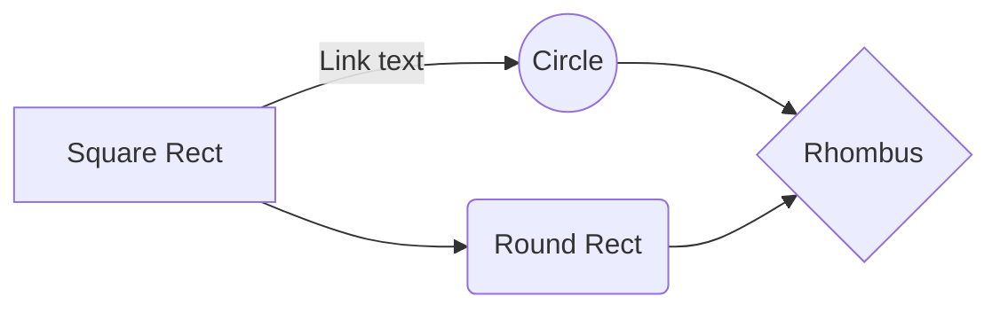

# Enhance your mkdocks.yml

In the previous post I explained how to [create a blog with MkDocs] and mkdocs-material theme.

mkdocs.yml is the configuration file for MkDocs. In this file we can configure the theme, the plugins, the pages, etc.

In this post I am going to explain you how to create a blog with MkDocs and mkdocs-material theme, add some plugins and configure it.

[create a blog with MkDocs]: 20231018_1_mkdocs.md#install-mkdocs-material-and-plugins

## Minimal configuration for mkdocs.yml with mkdocs-material

```yml
site_name: My Site
theme: 
  name: material
#plugins:

#markdown_extensions:
```

## Theme 

I only change the palette for now.

```yml
theme: 
  name: material
  palette:
    primary: blue
    accent: white  
```

## Plugins for mkdoc

### glightbox

glightbox add image zoom functionality to your documentation.

```txt title="requirements.txt"
mkdocs-glightbox
```

```txt title="mkdocs.yml"
plugins:
  - glightbox
```

Example:
<figure markdown>

</figure>

<a href="https://www.freepik.es/foto-gratis/siluetas-amigos-felices-saltando-al-atardecer_13870656.htm#query=alegria&position=7&from_view=keyword&track=sph">Imagen de marymarkevich</a> en Freepik

### mkdocs-minify-plugin

An MkDocs plugin to minify HTML, JS or CSS files prior to being written to disk.


```txt title="requiremets.txt"
mkdocs-minify-plugin
```

## Extensions
### Material for MkDocs 

MkDocs supports a large number of Python Markdown extensions

### mermaid

mermaid2 is a plugin for MkDocs that allows you to embed diagrams written in mermaid.js in your Markdown documentation.


```yml title="mkdocs.yml"
  - pymdownx.superfences:
      custom_fences:
        - name: mermaid
          class: mermaid
          format: !!python/name:pymdownx.superfences.fence_code_format
```


```markdown title="Example"
  ```mermaid
  graph LR
      A[Square Rect] -- Link text --> B((Circle))
      A --> C(Round Rect)
      B --> D{Rhombus}
      C --> D
  ```
```




You can find more information about mermaid.js in [https://mermaid-js.github.io/mermaid/#/](https://mermaid-js.github.io/mermaid/#/)

### Admonitions

Admonitions is a markdown extension of materials for MkDocs that allows you to add admonition blocks to your Markdown documentation.


```txt title="mkdocs.yml"
markdown_extensions:
  - admonition
  - pymdownx.details
  - pymdownx.superfences
```

Example:

```markdown
!!! Example
    Example
!!! Error
    Error
!!! Warning
    Warning    
!!! Success
    Success
!!! Info
    Info    
!!! Tip
    Tip
!!! Question
    Question
!!! Quote
    Quote
```
!!! Example
    Example
!!! Error
    Error
!!! Warning
    Warning    
!!! Success
    Success
!!! Info
    Info    
!!! Tip
    Tip
!!! Question
    Question
!!! Quote
    Quote


### Icons, Emojis

With material you can use more than 10000 icons and thousand of emojis in your documentation.

```txt title="mkdocs.yml"
markdown_extensions:  
  - attr_list
  - pymdownx.emoji:
      emoji_index: !!python/name:material.extensions.emoji.twemoji
      emoji_generator: !!python/name:material.extensions.emoji.to_svg
```

Example:

```markdown
:smile:
:man_head:
:face_with_monocle:
:jack_o_lantern:


```

:smile:
:man_raising_hand:
:face_with_monocle:
:jack_o_lantern:

### Annotations

One of the flagship features of Material for MkDocs is the ability to inject annotations – little markers that can be added almost anywhere in a document and expand a tooltip containing arbitrary Markdown on click or keyboard focus.

```txt title="mkdocs.yml"
markdown_extensions:
  - attr_list
  - md_in_html
  - pymdownx.superfences
```

Examples:

```markdown
This is a paragraph with a annotation(1).
{ .annotate }
  
1.  :man_raising_hand: I'm an annotation! I can contain `code`, __formatted
    text__, images, ... basically anything that can be expressed in Markdown.
```

This is a paragraph with a annotation(1).
{ .annotate }
  
1.  :man_raising_hand: I'm an annotation! I can contain `code`, __formatted
    text__, images, ... basically anything that can be expressed in Markdown.

```markdown
This is a paragraph with a annotation(1).
{ .annotate }
  
1.  :man_raising_hand: I'm an annotation! with a nested annotation(1)
    { .annotate }
    
    1. I'm a nested annotation!
```

This is a paragraph with a annotation(1).
{ .annotate }
  
1.  :man_raising_hand: I'm an annotation! with a nested annotation(1)
    { .annotate }
    
    1. I'm a nested annotation!

### Buttons 

```txt title="mkdocs.yml"
markdown_extensions:
  - attr_list  
```

Examples:

```markdown
[This is a button](#)
{ .md-button }
```

[This is a button](#)
{ .md-button }

```markdown
[This is a button](#)
{ .md-button .md-button--primary }
```

[This is a button](#)
{ .md-button .md-button--primary }


```markdown
[Send :fontawesome-regular-face-laugh-wink:](#){ .md-button }
```

[Send :fontawesome-regular-face-laugh-wink:](#){ .md-button }

### Content tabs

```txt title="mkdocs.yml"
markdown_extensions:
  - pymdownx.superfences
  - pymdownx.tabbed:
      alternate_style: true 
```


Example:
  
```markdown
=== "azcli"

    ``` azcli    
    az group create --name myResourceGroup --location westeurope
    ```

=== "pwsh"

    ``` pwsh    
    New-AzResourceGroup -Name myResourceGroup -Location westeurope    
    ```
```

=== "azcli"

    ``` azcli title="bubble_sort.py"
    az group create --name myResourceGroup --location westeurope
    ```

=== "pwsh"

    ``` pwsh    
    New-AzResourceGroup -Name myResourceGroup -Location westeurope    
    ```


### Footnotes 

```txt title="mkdocs.yml"
markdown_extensions:
  - footnotes
```

Example:

```markdown
This is a paragraph with a footnote[^1].

[^1]: And here is the definition.
```

This is a paragraph with a footnote[^1].

[^1]: And here is the definition.
 

### Formatting

```txt title="mkdocs.yml"
markdown_extensions:
  - pymdownx.critic
  - pymdownx.caret
  - pymdownx.keys
  - pymdownx.mark
  - pymdownx.tilde
```

Example:

```markdown
- ~~Mistaken text.~~
- ^^Superscript^^
- ==Marked text.==
```

- ~~Mistaken text.~~
- ^^Superscript^^
- ==Marked text.==


### mkdocs.yml complete 

```yml
site_name: My Site
site_description: A blog about Azure, DevOps and other stuff
site_author: Rafael Fernández
site_url: https://rfernandezdo.github.io

theme: 
  name: material
  palette:
    primary: blue
    accent: white
  features:
    - navigation.tabs
    - navigation.expand
    - navigation.sections
    - toc.integrate
    - toc.nested
    - toc.smoothscroll
    - footer
    - content.code.copy
    - content.code.annotate
    - content.tooltips
extra:
  social:
    - icon: fontawesome/brands/linkedin
      link: https://www.linkedin.com/in/rafaelfernandezd/
      name: LinkedIn
    - icon: fontawesome/brands/github
      link: https://github.com/rfernandezdo
      name: GitHub
    - icon: fontawesome/solid/square-rss
      link: https://rfernandezdo.github.io/feed_rss_created.xml
      name: RSS feed
copyright: Copyright &copy; 2023-now Rafael Fernández

plugins:
  - search  
  - mermaid2
  - blog  
  - tags:
      tags_file: tags.md    
  - rss:
      match_path: blog/posts/.* 
      date_from_meta:
        as_creation: date
      categories:
        - categories
        - tags
  - minify:
      minify_html: true
      minify_js: true
      minify_css: true
      htmlmin_opts:
          remove_comments: true
      cache_safe: true
  - glightbox:
      zoomable: true
      draggable: true
      skip_classes:
        - skip-lightbox
    #- meta in insiders, review in next release
  - social
markdown_extensions:
  - admonition
  - pymdownx.details
  - pymdownx.superfences:
      custom_fences:
        - name: mermaid
          class: mermaid
          format: !!python/name:pymdownx.superfences.fence_code_format
  - md_in_html
  - attr_list
  - pymdownx.emoji:
      emoji_index: !!python/name:material.extensions.emoji.twemoji
      emoji_generator: !!python/name:material.extensions.emoji.to_svg
  - pymdownx.tabbed:
      alternate_style: true
  - pymdownx.highlight:
      anchor_linenums: true
      line_spans: __span
      pygments_lang_class: true
  - pymdownx.inlinehilite
  - pymdownx.snippets
  - footnotes
  - pymdownx.critic
  - pymdownx.caret
  - pymdownx.keys
  - pymdownx.mark
  - pymdownx.tilde
  - def_list
  - pymdownx.tasklist:
      custom_checkbox: true
```    


### urls for reference
- [Font Awesome](https://fontawesome.com/search)
- [Emojis](https://emojipedia.org/)
...
