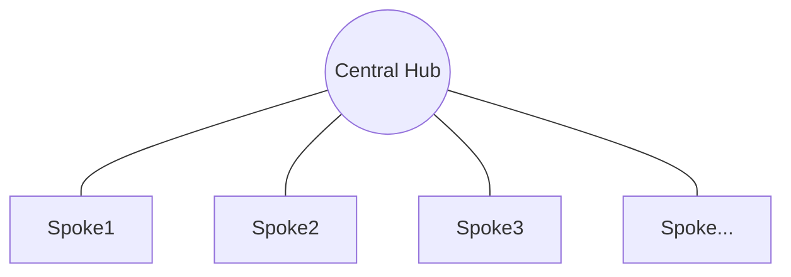
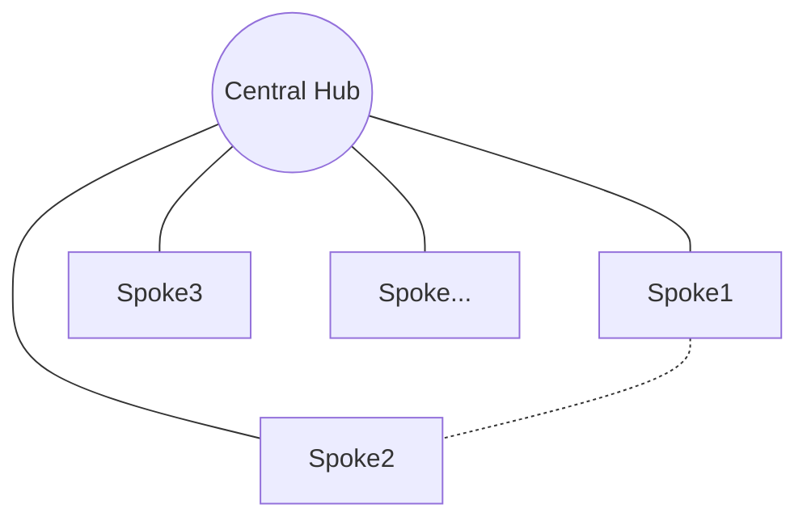

# Azure Network, Hub-and-Spoke Topology

Hub and Spoke is a network topology where a central Hub is connected to multiple Spokes. The Hub acts as a central point of connectivity and control, while the Spokes are isolated networks that connect to the Hub. This topology is common in Azure to simplify the connectivity and management of virtual networks.



## Key Features of the Hub and Spoke Topology

1. **Centralized Connectivity:** The Hub centralizes the connectivity between the Spoke networks. This simplifies the administration and maintenance of the network.

2. **Traffic Control:** The Hub acts as a traffic control point between the Spoke networks. This allows for centralized application of security and routing policies.

3. **Scalability:** The Hub and Spoke topology is highly scalable and can grow to meet the organization's connectivity needs.

4. **Resilience:** The Hub and Spoke topology provides redundancy and resilience in case of network failures.

## How to Use the Hub and Spoke Topology in Azure

To implement the Hub and Spoke topology in Azure, follow these steps:

```sh
# Step 1: Create a virtual network for the Hub
az network vnet create --name HubVnet --resource-group MyResourceGroup --location eastus --address-prefix

# Step 2: Create virtual networks for the Spokes
az network vnet create --name Spoke1Vnet --resource-group MyResourceGroup --location eastus --address-prefix
az network vnet create --name Spoke2Vnet --resource-group MyResourceGroup --location eastus --address-prefix
az network vnet create --name Spoke3Vnet --resource-group MyResourceGroup --location eastus --address-prefix

# Step 3: Connect the Spokes to the Hub
az network vnet peering create --name Spoke1ToHub --resource-group MyResourceGroup --vnet-name Spoke1Vnet --remote-vnet HubVnet --allow-vnet-access
az network vnet peering create --name Spoke2ToHub --resource-group MyResourceGroup --vnet-name Spoke2Vnet --remote-vnet HubVnet --allow-vnet-access
az network vnet peering create --name Spoke3ToHub --resource-group MyResourceGroup --vnet-name Spoke3Vnet --remote-vnet HubVnet --allow-vnet-access

# Step 4: Configure routing between the Hub and the Spokes
az network vnet peering update --name Spoke1ToHub --resource-group MyResourceGroup --vnet-name Spoke1Vnet --set virtualNetworkGateway:AllowGatewayTransit=true
az network vnet peering update --name Spoke2ToHub --resource-group MyResourceGroup --vnet-name Spoke2Vnet --set virtualNetworkGateway:AllowGatewayTransit=true
az network vnet peering update --name Spoke3ToHub --resource-group MyResourceGroup --vnet-name Spoke3Vnet --set virtualNetworkGateway:AllowGatewayTransit=true

# Step 5: Configure routing in the Hub
az network vnet peering update --name HubToSpoke1 --resource-group MyResourceGroup --vnet-name HubVnet --set virtualNetworkGateway:UseRemoteGateways=true
az network vnet peering update --name HubToSpoke2 --resource-group MyResourceGroup --vnet-name HubVnet --set virtualNetworkGateway:UseRemoteGateways=true
az network vnet peering update --name HubToSpoke3 --resource-group MyResourceGroup --vnet-name HubVnet --set virtualNetworkGateway:UseRemoteGateways=true

```
## Variant of the Hub and Spoke Topology

A variant of the Hub and Spoke topology is the Hub and Spoke with peering between spokes that is generally used to allow direct connectivity between the Spoke networks without going through the Hub. This can be useful in scenarios where direct connectivity between the Spoke networks is required, such as data replication or application communication.


In this case, it would be connecting the Spoke networks to each other via virtual network peering, for example:

```sh
# Connect Spoke1 to Spoke2
az network vnet peering create --name Spoke1ToSpoke2 --resource-group MyResourceGroup --vnet-name Spoke1Vnet --remote-vnet Spoke2Vnet --allow-vnet-access
```


## Scalability and Performance

The Hub and Spoke topology in Azure is highly scalable and can handle thousands of virtual networks and subnets. In terms of performance, the Hub and Spoke topology provides efficient and low-latency connectivity between the Spoke networks and the Hub.

## Security and Compliance

The Hub and Spoke topology in Azure provides centralized control over network security and compliance. Security and routing policies can be applied centrally at the Hub, ensuring consistency and compliance with the organization's network policies.

## Monitoring and Logging

Use Network Watcher to monitor and diagnose network problems in the Hub and Spoke topology. Network Watcher provides the following tools: 

-   Monitoring
    -   [Topology view](https://docs.microsoft.com/en-us/azure/network-watcher/view-network-topology) shows you the resources in your virtual network and the relationships between them.
    -   [Connection monitor](https://docs.microsoft.com/en-us/azure/network-watcher/connection-monitor-overview) allows you to monitor connectivity and latency between endpoints within and outside of Azure.
-   Network diagnostic tools
    -   [IP flow verify](https://docs.microsoft.com/en-us/azure/network-watcher/network-watcher-ip-flow-verify-overview) helps you detect traffic filtering issues at the virtual machine level.
    -   [NSG diagnostics](https://docs.microsoft.com/en-us/azure/network-watcher/network-watcher-network-configuration-diagnostics-overview) helps you detect traffic filtering issues at the virtual machine, virtual machine scale set, or application gateway level.
    -   [Next hop](https://docs.microsoft.com/en-us/azure/network-watcher/network-watcher-next-hop-overview) helps you verify traffic routes and detect routing issues.
    -   [Connection troubleshoot](https://docs.microsoft.com/en-us/azure/network-watcher/network-watcher-connectivity-portal) enables a one-time check of connectivity and latency between a virtual machine and the Bastion host, application gateway, or another virtual machine.
    -   [Packet capture](https://docs.microsoft.com/en-us/azure/network-watcher/network-watcher-packet-capture-overview) allows you to capture traffic from your virtual machine.
    -   [VPN troubleshoot](https://docs.microsoft.com/en-us/azure/network-watcher/network-watcher-troubleshoot-overview) runs multiple diagnostic checks on your gateways and VPN connections to help debug issues.
-   Traffic
    -   [Network security group flow logs](https://docs.microsoft.com/en-us/azure/network-watcher/network-watcher-nsg-flow-logging-overview) and [virtual network flow logs](https://docs.microsoft.com/en-us/azure/network-watcher/vnet-flow-logs-overview) let you log network traffic passing through your network security groups (NSGs) and virtual networks respectively.
    -   [Traffic analytics](https://docs.microsoft.com/en-us/azure/network-watcher/traffic-analytics) processes data from your network security group flow log allowing you to visualize, query, analyze, and understand your network traffic.


Virtual network flow logs have recently been released which allows for monitoring network traffic in Azure virtual networks.

## Use Cases and Examples

The Hub and Spoke topology is ideal for organizations that require centralized connectivity and traffic control between multiple virtual networks in Azure. For example, an organization with multiple branches or departments can use the Hub and Spoke topology to securely and efficiently connect their virtual networks in the cloud.

## Best Practices and Tips

When implementing the Hub and Spoke topology in Azure, it is recommended to follow these best practices:

- **Security:** Apply consistent security policies at the Hub and Spokes to ensure network protection.
- **Resilience:** Configure redundancy and resilience in the topology to ensure network availability in case of failures.
- **Monitoring:** Use monitoring tools like Azure Monitor to monitor network traffic and detect potential performance issues.

## Conclusion

The Hub and Spoke topology is an effective way to simplify the connectivity and management of virtual networks in Azure. It provides centralized control over network connectivity and traffic, making it easier to implement security and routing policies consistently across the network. By following the recommended best practices and tips, organizations can make the most of the Hub and Spoke topology to meet their cloud connectivity needs.

## References

- [Network Watcher frequently asked questions (FAQ)](https://docs.microsoft.com/en-us/azure/network-watcher/frequently-asked-questions)
- [Azure Topology](https://docs.microsoft.com/en-us/azure/architecture/reference-architectures/hybrid-networking/hub-spoke)