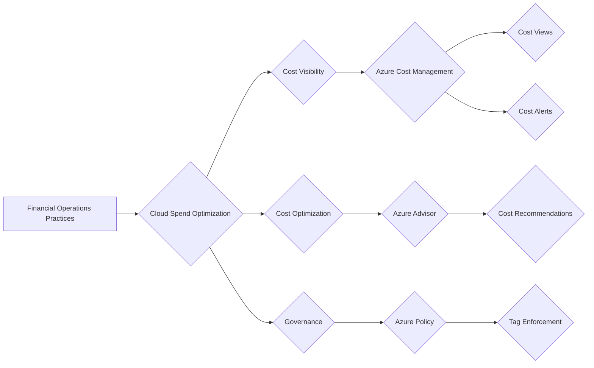

# FinOps for Azure: Optimizing Your Cloud Spend

In the cloud era, optimizing cloud spend has become a critical aspect of financial management. FinOps, a set of financial operations practices, empowers organizations to get the most out of their Azure investment. This blog post dives into the core principles of FinOps, explores the benefits it offers, and outlines practical strategies for implementing FinOps in your Azure environment.

## Understanding the Cloud Cost Challenge

Traditional IT expenditure followed a capital expenditure (capex) model, where businesses purchased hardware and software upfront. Cloud computing introduces a paradigm shift with the operational expenditure (opex) model. Here, businesses pay for resources as they consume them, leading to variable and unpredictable costs.

FinOps tackles this challenge by providing a framework for managing cloud finances. It encompasses three key pillars:

* **People:** Establish a FinOps team or designate individuals responsible for overseeing cloud costs. This team should possess a blend of cloud technical expertise, financial acumen, and business process knowledge.
* **Process:**  Define processes for budgeting, forecasting, and monitoring cloud expenses. This involves setting spending limits, creating chargeback models for different departments, and regularly reviewing cost reports.
* **Tools:** Leverage Azure Cost Management, a suite of tools that provides granular insights into your Azure spending. It enables cost allocation by resource, service, department, or any other relevant dimension.

It's essential to adopt a FinOps mindset that encourages collaboration between finance, IT, and business teams to drive cost efficiency and value realization in the cloud.

It's important to note that FinOps is not just about cost-cutting; it's about optimizing cloud spending to align with business objectives and maximize ROI.

## Azure Cost Management: Optimizing Your Azure Spending

Azure Cost Management empowers you to analyze your Azure spending patterns and identify cost-saving opportunities. Here's a glimpse into its key functionalities:

* **Cost Views:** Generate comprehensive reports that categorize your Azure spending by various attributes like resource group, service, or department.
* **Cost Alerts:** Set up proactive alerts to notify you when your spending exceeds predefined thresholds.
* **Reservations:** Purchase reserved instances of frequently used Azure resources for significant upfront discounts.
* **Recommendations:** Azure Cost Management analyzes your usage patterns and recommends potential cost-saving measures, such as rightsizing resources or leveraging spot instances.

## The Power of Tags and Azure Policy

Tags are metadata labels that you can attach to your Azure resources to categorize and track them effectively. They play a pivotal role in FinOps by enabling you to:

* Associate costs with specific departments, projects, or applications.
* Identify unused or underutilized resources for potential cost savings.
* Simplify cost allocation and chargeback processes.

Azure Policy helps enforce tagging standards and governance rules across your Azure environment. You can define policies that mandate specific tags for all resources, ensuring consistent cost allocation and data accuracy.

## Benefits of Implementing FinOps

A well-defined FinOps strategy empowers you to:

* **Gain Visibility into Cloud Spending:**  Obtain a clear picture of your Azure expenditures, enabling informed budgeting and cost control decisions.
* **Optimize Cloud Costs:** Identify and eliminate wasteful spending through cost-saving recommendations and proactive measures.
* **Improve Cloud Governance:**  Enforce tagging policies and spending limits to ensure responsible cloud resource utilization.
* **Align Cloud Spending with Business Value:**  Make data-driven decisions about cloud investments that support your business objectives.

## Getting Started with FinOps in Azure

Implementing FinOps doesn't necessitate a complex overhaul. Here's a recommended approach:

1. **Establish a FinOps Team:**  Assemble a cross-functional team comprising representatives from finance, IT, and business departments.
2. **Set Clear Goals and Objectives:**  Define your FinOps goals, whether it's reducing costs by a specific percentage or improving budget forecasting accuracy.
3. **Leverage Azure Cost Management:**  Start by exploring Azure Cost Management to understand your current spending patterns.
4. **Implement Basic Tagging Standards:**  Enforce basic tagging policies to categorize your Azure resources for cost allocation purposes.
5. **Continuously Monitor and Refine:**  Regularly review your cloud cost reports and identify areas for further optimization.

By following these steps and embracing a FinOps culture, you can effectively manage your Azure expenses and derive maximum value from your cloud investment.

## Toolchain for FinOps in Azure

To streamline your FinOps practices in Azure, consider leveraging the following tools:

This toolchain combines Azure Cost Management, Azure Advisor, and Azure Policy to provide a comprehensive suite of capabilities for managing your Azure spending effectively.

**Highly recommended**, you can check [FinOps toolkit](https://microsoft.github.io/finops-toolkit/), it's a set of tools and best practices to help you implement FinOps in your organization, it includes tools for cost allocation, budgeting, and forecasting, as well as best practices for FinOps implementation.

## Conclusion

FinOps is an essential practice for organizations leveraging Azure. It empowers you to make informed decisions about your cloud finances, optimize spending, and achieve your business goals. As an Azure Solutions Architect, I recommend that you establish a FinOps practice within your organization to unlock the full potential of Azure and achieve financial efficiency in the cloud.

This blog post provides a foundational understanding of FinOps in Azure. 

By embracing FinOps, you can transform your cloud cost management practices and drive business success in the cloud era.

## References

- [Thanks John Savill](https://www.youtube.com/watch?v=YHUptdFtozQ)
- [FinOps toolkit](https://microsoft.github.io/finops-toolkit/)