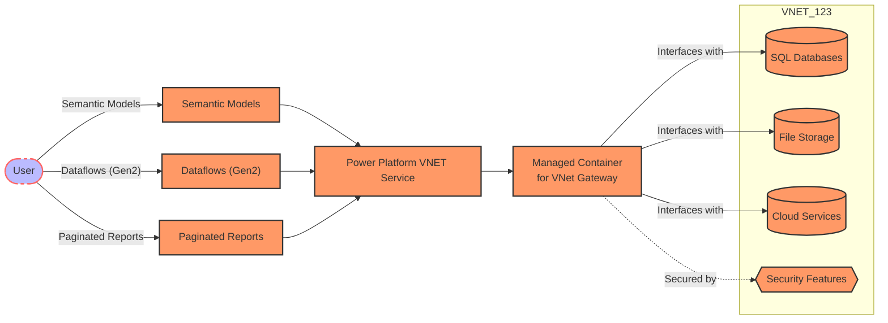

# Securely connect Power BI to data sources with a VNet data gateway

In this post, I will show you how to securely connect Power BI to your Azure data services using a Virtual Network (VNet) data gateway.


## What is a Virtual Network (VNet) data gateway?

The virtual network (VNet) data gateway helps you to connect from Microsoft Cloud services to your Azure data services within a VNet without the need of an on-premises data gateway. The VNet data gateway securely communicates with the data source, executes queries, and transmits results back to the service.

## The Role of a VNet Data Gateway

A VNet data gateway acts as a bridge that allows for the secure flow of data between the Power Platform and external data sources that reside within a virtual network. This includes services such as SQL databases, file storage solutions, and other cloud-based resources. The gateway ensures that data can be transferred securely and reliably, without exposing the network to potential threats or breaches.

## How It Works



The process begins with a user leveraging Power Platform services like Semantic Models, Dataflows (Gen2), and Paginated Reports. These services are designed to handle various data-related tasks, from analysis to visualization. They connect to the Power Platform VNET Service, which is the heart of the operation, orchestrating the flow of data through the managed container for the VNet gateway.

This managed container is a secure environment specifically designed for the VNet gateway’s operations. It’s isolated from the public internet, ensuring that the data remains protected within the confines of the virtual network. Within this secure environment, the VNet gateway interfaces with the necessary external resources, such as SQL databases and cloud storage, all while maintaining strict security protocols symbolized by the padlock icon in our diagram.

If you need to connect to services on others VNets, you can use [VNet peering](https://docs.microsoft.com/en-us/azure/virtual-network/virtual-network-peering-overview) to connect the VNets, and maybe access to on-premises resources using [ExpressRoute](https://docs.microsoft.com/en-us/azure/expressroute/expressroute-introduction) or other VPN solutions.

## The Benefits

By utilizing a VNet data gateway, organizations can enjoy several benefits:

- Enhanced Security: The gateway provides a secure path for data, safeguarding sensitive information and complying with organizational security policies.
- Network Isolation: The managed container and the virtual network setup ensure that the data does not traverse public internet spaces, reducing exposure to vulnerabilities.
- Seamless Integration: The gateway facilitates smooth integration between Power Platform services and external data sources, enabling efficient data processing and analysis.

## Getting Started

To set up a VNet data gateway, follow these steps:

### Register Microsoft.PowerPlatform as a resource provider

Before you can create a VNet data gateway, you need to register the Microsoft.PowerPlatform resource provider. This can be done using the Azure portal or the Azure CLI.

```azurecli
az provider register --namespace Microsoft.PowerPlatform
```

### Associate the subnet to Microsoft Power Platform

Create a VNet in your Azure subscription and a subnet where the VNet data gateway will be deployed. Next, you need to delegate subnet to service **Microsoft.PowerPlatform/vnetaccesslinks**. 

!!! note
    - This subnet can't be shared with other services.
    - Five IP addresses are reserved in the subnet for basic functionality. You need to reserve additional IP addresses for the VNet data gateway, add more IPs for future gateways.
    - You need a role with the Microsoft.Network/virtualNetworks/subnets/join/action permission


This can be done using the Azure portal or the Azure CLI.

```azurecli
# Create a VNet and address prefix 10.0.0.0/24
az network vnet create --name MyVNet --resource-group MyResourceGroup --location eastus --address-prefixes 10.0.0.0/24


# Create a Netwrok Security Group
az network nsg create --name MyNsg --resource-group MyResourceGroup --location eastus

# Create a subnet with delegation to Microsoft.PowerPlatform/vnetaccesslinks and associate the NSG
az network vnet subnet create --name MySubnet --vnet-name MyVNet --resource-group MyResourceGroup --address-prefixes 10.0.0.1/27 --network-security-group MyNsg --delegations Microsoft.PowerPlatform/vnetaccesslinks
```

### Create a VNet data gateway

!!! Note
    A Microsoft Power Platform User with with Microsoft.Network/virtualNetworks/subnets/join/action permission on the VNet is required. Network Contributor role is not necessary.


1. Sign in to the [Power BI homepage](https://app.powerbi.com/).
2. In the top navigation bar, select the settings gear icon on the right.
3. From the drop down, select the Manage connections and gateways page, in Resources and extensions.
4. Select **Create a virtual network data gateway.**.
5. Select the license capacity, subscription, resource group, VNet and the Subnet. Only subnets that are delegated to Microsoft Power Platform are displayed in the drop-down list. VNET data gateways require a [Power BI Premium capacity](https://learn.microsoft.com/en-us/power-bi/enterprise/service-premium-what-is) license (A4 SKU or higher or any P SKU) or [Fabric license](https://learn.microsoft.com/en-us/fabric/enterprise/buy-subscription) to be used (any SKU).
6. By default, we provide a unique name for this data gateway, but you could optionally update it.
7. Select **Save**. This VNet data gateway is now displayed in your **Virtual network data gateways** tab. A VNet data gateway is a managed gateway that could be used for controlling access to this resource for Power platform users.


## Conclusion

The VNet data gateway is a powerful tool that enables secure data transfer between the Power Platform and external data sources residing within a virtual network. By leveraging this gateway, organizations can ensure that their data remains protected and compliant with security standards, all while facilitating seamless integration and analysis of data. If you are looking to enhance the security and reliability of your data connections, consider implementing a VNet data gateway in your environment.


