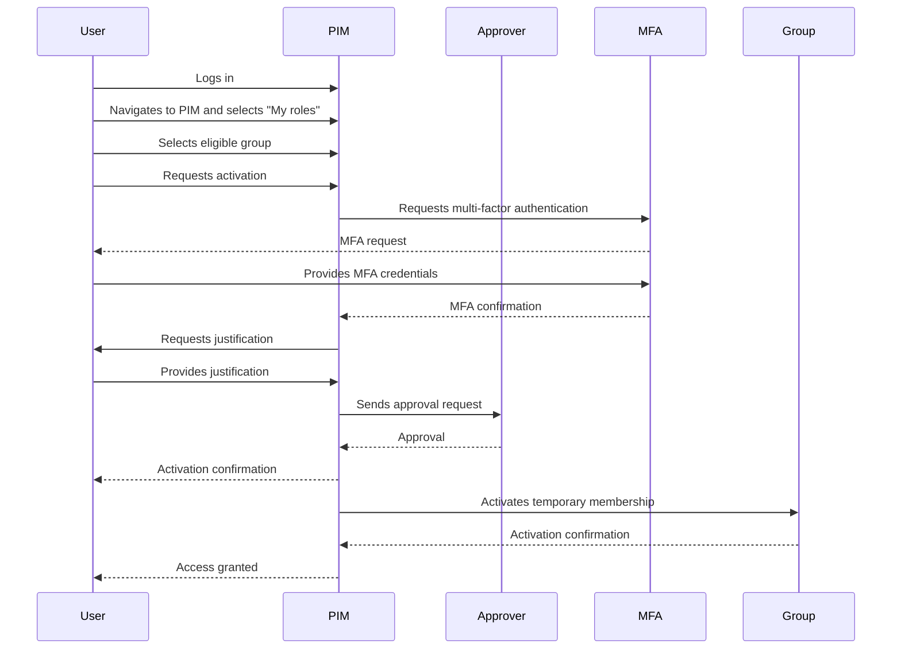

# Microsoft Entra ID Privileged Identity Management

In this post, I will show you how to use Microsoft Entra ID Privileged Identity Management (PIM) to manage and monitor access to privileged roles in your organization.

## What is Microsoft Entra ID Privileged Identity Management?

Microsoft Entra ID Privileged Identity Management (PIM) is a service that helps you manage, control, and monitor access within your organization. It provides just-in-time privileged access to Azure AD and Azure resources, along with access reviews and monitoring capabilities.

## Reasons to Use Microsoft Entra ID PIM

There are several reasons to use Microsoft Entra ID PIM:

- **Security**: Microsoft Entra ID PIM helps you reduce the risk of unauthorized access to privileged roles.
- **Compliance**: Microsoft Entra ID PIM helps you meet compliance requirements by providing access reviews and monitoring capabilities.
- **Efficiency**: Microsoft Entra ID PIM provides just-in-time access to privileged roles, reducing the risk of unauthorized access.
- **Monitoring**: Microsoft Entra ID PIM provides monitoring and alerts that help you detect and respond to suspicious activities.
- **Traceability**: Microsoft Entra ID PIM provides an audit trail of all access requests and approvals, helping you track who has access to privileged roles.

Maybe you can't use Microsoft Entra ID PIM to log all changess that the users do in the system, but you can use [Actor Change](https://techcommunity.microsoft.com/t5/azure-governance-and-management/announcing-the-general-availability-of-change-actor/ba-p/4171801) for that.

## Key Features of Microsoft Entra ID PIM

Microsoft Entra ID PIM offers several key features that help you manage and monitor access to privileged roles:

- Provide just-in-time privileged access to Microsoft Entra ID and Azure resources.
- Assign time-bound access to resources using start and end dates.
- Require approval to activate privileged roles.
- Enforce multifactor authentication to activate any role.
- Use justification to understand why users activate.
- Get notifications when users activate privileged roles.
- Conduct access reviews to ensure users still need roles.
- Download audit history for internal or external audit.
- Prevent removal of the last active Global Administrator and Privileged Role Administrator role assignments.

## How to Use Microsoft Entra ID PIM

We can manage three types of "things" in Microsoft Entra ID PIM:

- **Microsoft Entra roles.** Microsoft Entra roles are also referred to as directory roles. They include built-in and custom roles to manage Microsoft Entra ID and other Microsoft 365 online services.
- **PIM for Groups.** To set up just-in-time access to the member and owner role of a Microsoft Entra security group. PIM for Groups provides an alternative way to set up PIM for Microsoft Entra roles and Azure roles. It also allows you to set up PIM for other permissions across Microsoft online services like Intune, Azure Key Vaults, and Microsoft Entra ID Protection.
- **Azure roles.** Azure's role-based access control roles that grant access to management groups, subscriptions, resource groups, and resources.

### Microsoft Entra ID roles

!!! note
    If you want to use groups, you need create eligible groups, for now the maximum number of eligible groups is 500.

In the Microsoft Entra ID portal, you can manage Microsoft Entra ID roles by selecting the "Roles" tab. Here you can see all the roles that are available to you, as well as the roles that you have activated.

You can made the following actions:

- **Assign**: Create assignments for Microsoft Entra ID roles, update existing assignments to ensure that users have just-in-time access to privileged roles.
- **Activate**: Activate your eligible assignments to get just-in-time access to privileged roles. 
- **Approve**: List, approve, or deny activation requests for Microsoft Entra ID roles.
- **Audit**: View and export a history of all assignments and activations done in PIM so you can identify attacks and stay compliant.
 
Ok, let's see how to assign a role to a group.

In the "Roles" tab, click on the role that you want to assign. 

In Role settings, edit the settings for the role, modify Activation, Assignment, and Notification settings and then click "Update. These are the default settings:

**Activation**

| Setting | State |
| --- | --- |

| Activation maximum duration (hours) | 8 hour(s) |
| --- | --- |
| On activation, require | None |
| Require justification on activation | Yes |
| Require ticket information on activation | No |
| Require approval to activate | No |
| Approvers | None |

**Assignment**

| Setting | State |
| --- | --- |

| Allow permanent eligible assignment | Yes |
| --- | --- |
| Expire eligible assignments after | - |
| Allow permanent active assignment | Yes |
| Expire active assignments after | - |
| Require Azure Multi-Factor Authentication on active assignment | No |
| Require justification on active assignment | Yes |

**Send notifications when members are assigned as eligible to this role:**

| Type | Default recipients | Additional recipients | Critical emails only |
| --- | --- | --- | --- |

| Role assignment alert | Admin | None | False |
| --- | --- | --- | --- |
| Notification to the assigned user (assignee) | Assignee | None | False |
| Request to approve a role assignment renewal/extension | Approver | None | False |

**Send notifications when members are assigned as active to this role:**

| Type | Default recipients | Additional recipients | Critical emails only |
| --- | --- | --- | --- |

| Role assignment alert | Admin | None | False |
| --- | --- | --- | --- |
| Notification to the assigned user (assignee) | Assignee | None | False |
| Request to approve a role assignment renewal/extension | Approver | None | False |

**Send notifications when eligible members activate this role:**

| Type | Default recipients | Additional recipients | Critical emails only |
| --- | --- | --- | --- |

| Role activation alert | Admin | None | False |
| --- | --- | --- | --- |
| Notification to activated user (requestor) | Requestor | None | False |
| Request to approve an activation | Approver | None | False |

In the "Assignments" tab, click on "Add assignments". In Membership, select the scope type: Application, Device, Directory, Group, Service Principal or User (It's dependes of each role)  and select the identity related that you want to assign the role to. We are going to select Directory and a eligible group,  and then click "Next". 

!!! info
    App registrations are supported in PIM for Microsoft Entra ID roles but only in active assignments. 

In the "Settings" tab, you can set the Assigment type: Eligible or I need to do something to activate and Active or I don't need to do nothing to activate my role. You can configure too if you want that the duration of the assignment is permanent or if you want to expire the assignment after a certain period of time. Once you're done, click "Assign".

You can set the activation settings, assignment settings, and notification settings for the assignment. Once you're done, click "Assign".

### PIM for Groups

In the Microsoft Entra ID portal, you can manage PIM for Groups by selecting the "Groups" tab. 

First you need to discover the groups that you want to manage. In the "Groups" tab, click on "Discover groups". In the "Discover groups" pane, you can search for groups by name. Once you've found the group you want to manage, click on "Add to PIM".

!!! info
    You must be an owner of the group or have Microsoft Entra role that allows to discover and manage group in PIM.

Now, in the "Groups" tab, you can see all the groups that you have discovered.

In the "Groups" tab, click on the group that you want to manage. You can made the following actions under manage:

- **Assign**: Create assignments for the member and owner role of the group, update existing assignments to ensure that users have just-in-time access to privileged roles.
- **Activate**: Activate your eligible assignments to get just-in-time access to privileged roles.
- **Approve**: List, approve, or deny activation requests for the member and owner role of the group.
- **Audit**: View and export a history of all assignments and activations done in PIM so you can identify attacks and stay compliant.

Ok, let's see how to assign a role to a group.

In the "Groups" tab, click on the group that you want to assign a role to. 

In Role settings, edit the settings for the role, modify Activation, Assignment, and Notification settings for members or users, these settings are the same that we saw in the Microsoft Entra ID roles section.

In the "Assignments" tab, click on "Add assignments". In Select role, select the scope type: Member or Owner and in Select members select the identity related that you want to assign the role to or groupm, if you select a group, you doesn't need a eligible group,  and then click "Next".

In the "Settings" tab, you can set the Assigment type: Eligible or I need to do something to activate and Active or I don't need to do nothing to activate my role. You can configure too if you want that the duration of the assignment is permanent or if you want to expire the assignment after a certain period of time. Once you're done, click "Assign".

!!! info
    App registrations are supported in PIM for Groups but only in active assignments. I think that this is very useful for IaC for example because you can assign a role to a service principal and you can activate the role when you need it.

Example of a sequence diagram of the activation process for a group:

### Azure roles

In the Microsoft Entra ID portal, you can manage Azure roles by selecting the "Azure resources" tab. Here you can see all the Azure roles that are available to you by scope, as well as the roles that you have activated.

First you need to select the Azure resource that you want to manage: Management groups, Subscriptions, Resource groups or Resources and follow Manage Resource.

Once here, same as the other sections, you can made the following actions for this scope:

- **Assign**: Create assignments for the member and owner role of the group, update existing assignments to ensure that users have just-in-time access to privileged roles.
- **Activate**: Activate your eligible assignments to get just-in-time access to privileged roles.
- **Approve**: List, approve, or deny activation requests for the member and owner role of the group.
- **Audit**: View and export a history of all assignments and activations done in PIM so you can identify attacks and stay compliant.

Ok, let's see how to assign a role to a identity in a scope.

!!! Info
    We already have a scope selected

In the "Assignments" tab, click on "Add assignments". In Select role, select the role that you want to assign and in Select members select the identity related that you want to assign the role to or group, if you select a group, you doesn't need a eligible group,  and then click "Next".

In the "Settings" tab, you can set the Assigment type: Eligible or I need to do something to activate and Active or I don't need to do nothing to activate my role. You can configure too if you want that the duration of the assignment is permanent or if you want to expire the assignment after a certain period of time. Once you're done, click "Assign".

!!! info
    App registrations are supported in PIM for Azure roles but only in active assignments. I think that this is very useful for IaC for example because you can assign a role to a service principal and you can activate the role when you need it.

Don't forget review settings for the role, modify Activation, Assignment, and Notification settings for members or users, these settings are the same that we saw in the Microsoft Entra ID roles section.

## Conclusion

Microsoft Entra ID Privileged Identity Management (PIM) is a powerful service that helps you manage and monitor access to privileged roles in your organization. By using Microsoft Entra ID PIM, you can reduce the risk of unauthorized access, meet compliance requirements, and improve the efficiency of your organization. I hope this post has helped you understand how to use Microsoft Entra ID PIM and how it can benefit your organization.

If you want to play with Microsoft Enter ID PIM, you can use a test on a new tenant or the current one if you haven't used it before.

