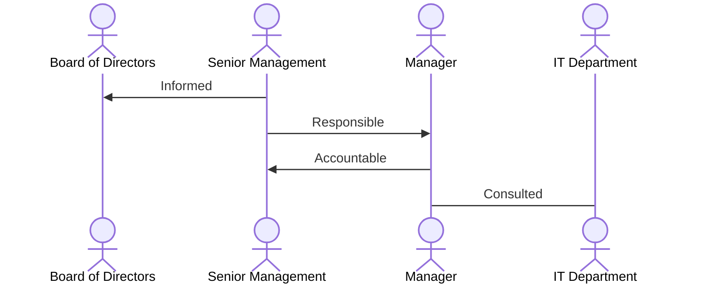
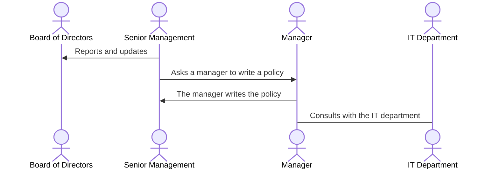
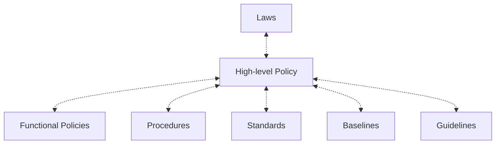

# CISSP Certification: Some Tips Useful for me

## Introduction

The Certified Information Systems Security Professional (CISSP) certification is a globally recognized standard for information security professionals. It is designed to validate the skills and knowledge required to effectively design, implement, and manage security programs to protect organizations from cyber threats.

In this post, I will share some tips that I found useful while preparing for the CISSP exam. These tips cover various aspects of the exam, including study materials, study strategies, and exam preparation techniques.

## Study Materials

When preparing for the CISSP exam, it is essential to use a variety of study materials to ensure that you have a comprehensive understanding of the exam topics. Some useful study materials include:

- **Official Study Guide**: The official CISSP study guide is an excellent resource for learning the exam topics in detail. It covers all the domains of the exam and provides in-depth explanations of the concepts.

- **Practice Questions**: Practice questions are an essential part of exam preparation. They help you test your knowledge and identify areas where you need to focus more.

- **Online Courses**: Online courses are a great way to supplement your study materials. They provide interactive learning experiences and help you understand complex topics more easily.

- **Study Groups**: Joining a study group can be beneficial as it allows you to discuss exam topics with other candidates and share study tips and strategies.

## Study Strategies

When preparing for the CISSP exam, it is essential to have a study plan and follow a structured approach to cover all the exam topics. Some useful study strategies include:

- **Create a Study Schedule**: Create a study schedule that outlines the topics you need to cover and the time you will spend on each topic. This will help you stay organized and focused.

- **Focus on Weak Areas**: Identify your weak areas and focus on them more during your study sessions. This will help you improve your knowledge and confidence in those areas.

- **Use Flashcards**: Flashcards are a great way to memorize key concepts and definitions. Create flashcards for important terms and concepts and review them regularly.

- **Take Breaks**: Take regular breaks during your study sessions to avoid burnout. Taking breaks will help you stay focused and retain information better.

## Exam Preparation

When preparing for the CISSP exam, it is essential to practice time management and test-taking strategies to ensure that you can complete the exam within the allotted time. Some useful exam preparation tips include:

## RACI 

RACI is a matrix that defines the roles and responsibilities of a project. It is a simple tool that helps to identify who is responsible, accountable, consulted, and informed for each task in a project.

RACI stands for:

- **Responsible**: The person who is responsible for completing the task.
- **Accountable**: The person who is ultimately accountable for the task.
- **Consulted**: The person who provides input to the task.
- **Informed**: The person who is kept informed about the task.

For example:

## Risk Management

Risk management is the process of identifying, assessing, and controlling risks to an organization's assets. It involves identifying potential risks, assessing the likelihood and impact of those risks, and implementing controls to mitigate or eliminate those risks.

The risk management process consists of the following steps:

1. **Risk Identification**: Identify potential risks to the organization's assets.
2. **Risk Assessment**: Assess the likelihood and impact of each risk.
3. **Risk Mitigation**: Implement controls to mitigate or eliminate the risks.
4. **Risk Monitoring**: Monitor the effectiveness of the controls and adjust them as needed.

## Policy Tree 

- High-level Policy: Defines the organization's overall security objectives and goals. Not specific to any technology.
  - Functional Policies: Specific policies that address different areas of the organization's security program.
    - Procedures: Step-by-step instructions on how to implement the policy.
    - Standards: Specific requirements that must be met to comply with the policy.
    - Baselines: Minimum requirements that must be met to comply with the policy.
    - Guidelines: Recommendations on how to implement the policy.

## `Good` Policy

- Up-to-date
- Communicated
- Legal
- Exceptions
- Concise
- Unambiguous
- Senior Management Sign-off