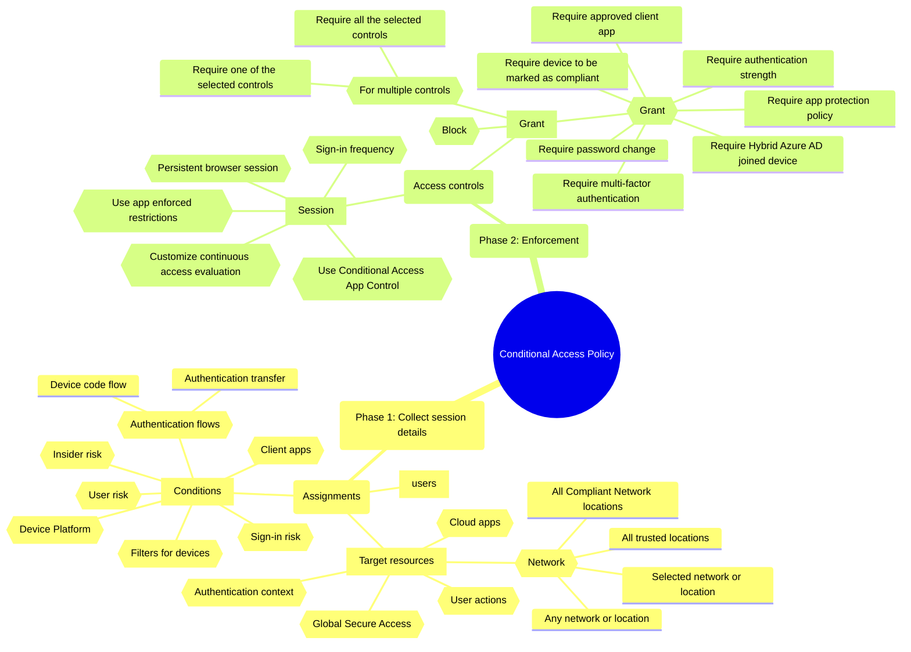

#  Microsoft Entra Conditional Access

In this post, I will show you how to configure Conditional Access in Microsoft Entra.

## What is Conditional Access?

Conditional Access is a feature of Microsoft Entra that allows you to control access to your organization's resources based on specific conditions. With Conditional Access, you can enforce policies that require users to meet certain criteria before they can access resources, such as multi-factor authentication, device compliance, or location-based restrictions.

You have three main components in Conditional Access:

- **Signals**: These are the conditions that trigger a policy. Signals can include user sign-in, device state, location, and more.
- **Decisions**: These are the actions that are taken when a policy is triggered. Decisions can include requiring multi-factor authentication, blocking access, or granting access with conditions.
- **Enforcement**: This is the mechanism that enforces the policy. Enforcement can be done at the application level, the network level, or the device level.

Really, all the Conditional Access policies are based on the following flow:

1. **Assignments**: Define who and where the policy applies to.
2. **Access Controls**: Define what to do when the the who and where are met.

For that reason, we can define the followin phases:

- **Phase 1**: Collect session details
  - **Assignments**: Define who and where the policy applies to.    
    - **users**: users and groups selected and excluded
    - **Target resources**: Control access base on Cloud apps, actions, and authentication context.
      - **Cloud apps**: Include and exclude. Many of the existing Microsoft cloud applications are included in the list of applications that can be targeted by Conditional Access policies:  Office 365, Windows Azure Service Management API, Microsoft Admin Portals and Others
      - **User actions**: Tasks that a user performs: Register security information and Register or join devices
      - **Global Secure Access**: Targeting members in your tenant with Global Secure Access (GSA) as a resource,enable administrators to define and control how traffic is routed through Microsoft Entra Internet Access and Microsoft Entra Private Access.
      - **Authentication context**: With this option you can define a authentication context for the policy, for example, you can define that the policy is applied only when the user is accessing to Higly Confidential information. You can create labels with ID c1 to c99 and tag your information with these labels. Not all apps support authentication contexts, you can check the [official documentation](https://learn.microsoft.com/en-us/purview/sensitivity-labels-teams-groups-sites#more-information-about-the-dependencies-for-the-authentication-context-option) to see which apps support it.
      - **Network**: Include and Exclude. Control user access based on their network location or physical location.
        - **Any network or location**: This option allows you to apply the policy to all network locations.
        - **All trusted locations**: This option allows you to apply the policy to all trusted locations.
        - **All Compliant Network locations**: This option allows you to apply the policy to all compliant network locations.
        - **Selected network or location**: This option allows you to apply the policy to selected network locations: Countries(GPS),Countries(IP) and IP ranges.
    - **Conditions**: Control access based in signals from conditions.
        - **User risk**: Control access based on the user risk level calculated by Microsoft Entra Identity Protection. User risk represents the probability that a given identity or account is compromised, for example: Published credentials in Dark Web.
        - **Sign-in risk**: Control access based on the sign-in risk level calculated by Microsoft Entra Identity Protection. Sign-in risk represents the probability that a given authentication request wasn't made by the identity owner. For example, sign-in from a new location or new device.
        - **Insider risk**: Control access for users who are assigned specific risk levels from Adaptive Protection, a Microsoft Purview Insider Risk Management feature. Insider risk represents the probability that a given user is engaged in risky data-related activities.
        - **Device Platform**: Include and Exclude. Control access based on the platform of the device used to sign in.
        - **Client apps**: Include and Exclude. Control access based on the client apps used to sign in.
        - **Filters for devices**: Include and Exclude. Control access based on configured filters to apply policy to specific devices
        - **Authentication flows**: Control access based on the authentication flow used to sign in: 
          - Device code flow: Device code flow is a method of authentication that allows users to sign in to a device using a code displayed on the device. This flow is used for devices that don't have a browser or can't use a browser to sign in.
          - Authentication transfer: Authentication transfer is a new flow that offers a seamless way to transfer authenticated state from one device to another.

- **Phase 2**: Enforcement
  - **Access controls**: Define what to do when the the who and where are met.
    - **Grant**: Control access enforcement to block or grant access.
      - **Block**: Block access to the resource.
      - **Grant**: Grant access to the resource. You can also define the following options:
        - **Require multi-factor authentication**: Require users to perform multi-factor authentication.
        - **Require authentication strength**:  Require a combination of authentication methods to access the resource.
        - **Require device to be marked as compliant**: Require the device to be marked as compliant by Microsoft Entra Intune.
        - **Require Hybrid Azure AD joined device**: Require the device to be Hybrid Azure AD joined.
        - **Require approved client app**: Require the use of an approved client app.
        - **Require app protection policy**: Require that an Intune app protection policy is present on the client app before access is available to the selected applications
        - **Require password change**: Require the user to change their password.
      - For multiple controls, you can define the following options:
        - **Require all the selected controls**: Require all the selected controls to be met.
        - **Require one of the selected controls**: Require one of the selected controls to be met.
  - **Session**: Control access based on session controls to enable limited experiences within specific cloud applications.
    - **Use app enforced restrictions**: Enforce app restrictions to control access based on the app's own restrictions. When selected, the cloud app uses the device information to provide users with a limited or full experience. Limited when the device isn't managed or compliant and full when the device is managed and compliant.
    - **Use Conditional Access App Control**: Enforce real-time monitoring and control of user sessions. Conditional Access App Control enables user app access and sessions to be monitored and controlled in real time based on access and session policies. Access and session policies are used within the Defender for Cloud Apps portal to refine filters and set actions to take.
    - **Sign-in frequency**: Enforce sign-in frequency to control how often users are prompted to sign in. Sign-in frequency setting works with apps that implement OAUTH2 or OIDC protocols according to the standards.
    - **Persistent browser session**: Enforce persistent browser session to control users can remain signed in after closing and reopening their browser window.
    - **Customize continuous access evaluation**: Enable custom continuous access evaluation to revoke access tokens based on critical events and policy evaluation in real time.Continuous Access Evaluation (CAE) allows access tokens to be revoked based on critical events and policy evaluation in real time rather than relying on token expiration based on lifetime.


Example of Conditional Access policy configuration:

1. **Block access to all users from all locations except for a specific group of users from a specific location**:
   - **Assignments**:
     - **users**: 
       - Include:All users
       - Exclude: Group_of_excluded_users
     - **Target resources**:
       - **Cloud apps**: All cloud apps
       - **Network**: All trusted locations
   - **Access controls**:
     - **Grant**: Block

Mindmaps of the Conditional Access policies flow:

```markmap
# Conditional Access Policy
## Phase 1: Collect session details
### Assignments
#### users
#### Target resources
##### Cloud apps
##### User actions
##### Global Secure Access
##### Authentication context
##### Network
###### Any network or location
###### All trusted locations
###### All Compliant Network locations
###### Selected network or location
#### Conditions
##### User risk
##### Sign-in risk
##### Insider risk
##### Device Platform
##### Client apps
##### Filters for devices
##### Authentication flows
###### Device code flow
###### Authentication transfer
## Phase 2: Enforcement
### Access controls
#### Grant
##### Block
##### Grant
###### Require multi-factor authentication
###### Require authentication strength
###### Require device to be marked as compliant
###### Require Hybrid Azure AD joined device
###### Require approved client app
###### Require app protection policy
###### Require password change
##### For multiple controls
###### Require all the selected controls
###### Require one of the selected controls
#### Session
##### Use app enforced restrictions
##### Use Conditional Access App Control
##### Sign-in frequency
##### Persistent browser session
##### Customize continuous access evaluation
```



## Resources

- [Conditional Access documentation](https://learn.microsoft.com/en-us/entra/identity/conditional-access/overview)