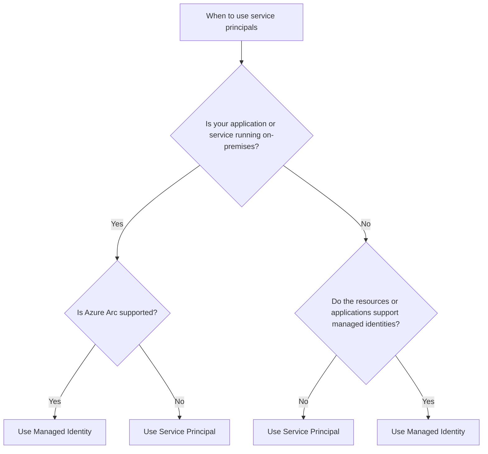

# When to use service principals

In Azure, there are two ways to authenticate your applications and services: service principals and managed identities. 

Basically, **don't use service principals if you can use managed identities**. Managed identities are a more secure way to authenticate your applications and services in Azure. However, there are some scenarios where you need to use service principals instead of managed identities. Here are some scenarios where you should use service principals:

## Conclusion

In conclusion, you should use managed identities whenever possible. However, if your application or service is running on-premises or if the resources or applications do not support managed identities, you should use service principals instead.

