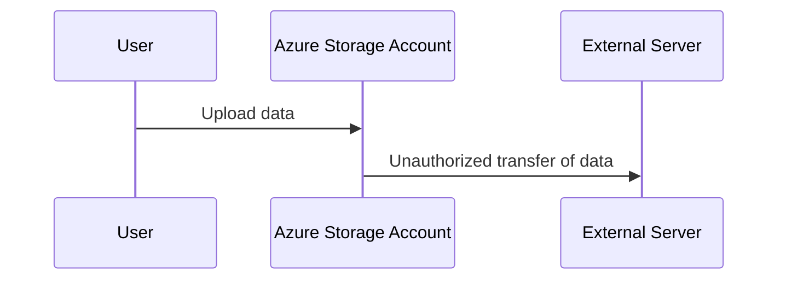
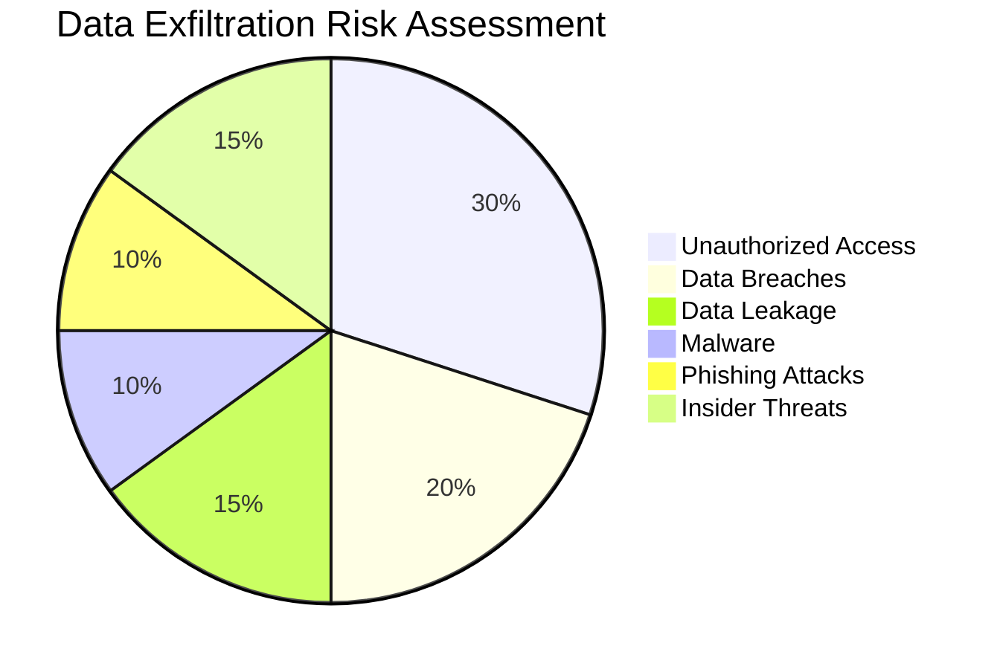
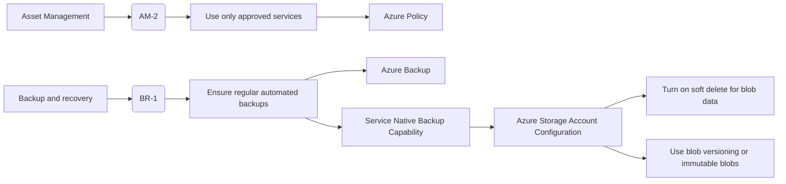
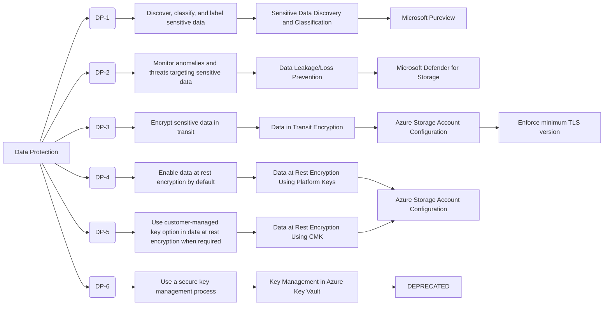
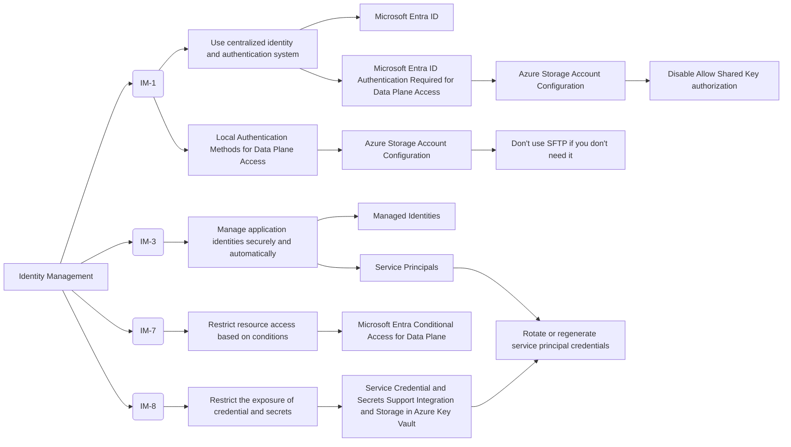
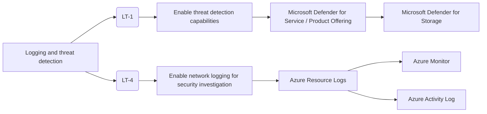
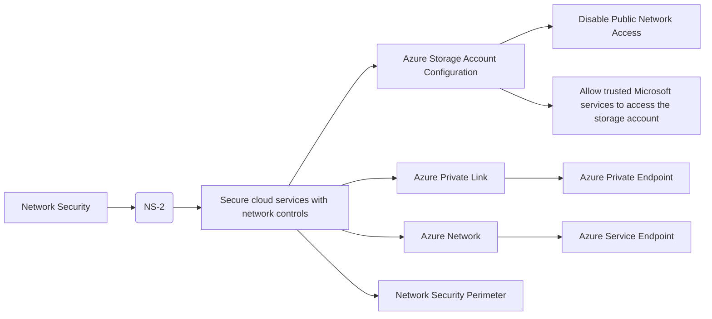
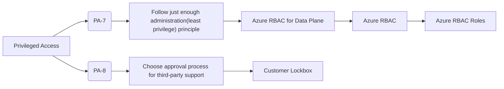

# Data threat modeling in Azure storage accounts

!!! info
    I apologize in advance if this is a crazy idea and there is some mistake!! I am just trying to learn and share knowledge.

Azure Storage Account is a service that provides scalable, secure, and reliable storage for data. It is used to store data such as blobs, files, tables, and queues. However, it is important to ensure that the data stored in Azure Storage Account is secure and protected from security threats. In this article, we will discuss how to perform data threat modeling in Azure storage accounts.

## What is data threat modeling?

Data threat modeling is a process of identifying and analyzing potential threats to data security. It helps organizations understand the risks to their data and develop strategies to mitigate those risks. Data threat modeling involves the following steps:

1. **Identify assets**: Identify the data assets stored in Azure storage accounts, such as blobs, files, tables, and queues.
2. **Identify threats**: Identify potential threats to the data assets, such as unauthorized access, data breaches, data leakage, malware, phishing attacks, insider threats, and data loss.
3. **Assess risks**: Assess the risks associated with each threat, such as the likelihood of the threat occurring and the impact of the threat on the data assets.
4. **Develop mitigation strategies**: Develop strategies to mitigate the risks, such as implementing security controls, access controls, encryption, monitoring, and auditing.

By performing data threat modeling, organizations can identify and address security vulnerabilities in Azure storage accounts and protect their data from security threats.

## Identify assets in Azure storage accounts

Azure storage accounts can store various types of data assets, including:

- **Blobs**: Binary large objects (blobs) are used to store unstructured data, such as images, videos, and documents.
- **Files**: Files are used to store structured data, such as text files, configuration files, and log files.
- **Tables**: Tables are used to store structured data in a tabular format, such as customer information, product information, and transaction data.
- **Queues**: Queues are used to store messages for communication between applications, such as task messages, notification messages, and status messages.
- **Disks**: Disks are used to store virtual machine disks, such as operating system disks and data disks.

Identifying the data assets stored in Azure storage accounts is the first step in data threat modeling. It helps organizations understand the types of data stored in Azure storage accounts and the potential risks to those data assets.

## Identify threats to data in Azure storage accounts

There are several threats to data stored in Azure storage accounts, including:

- **Unauthorized access**: Unauthorized users gaining access to Azure storage accounts and stealing data.
- **Data breaches**: Data breaches can expose sensitive data stored in Azure storage accounts.
- **Data leakage**: Data leakage can occur due to misconfigured access controls or insecure data transfer protocols.
- **Data loss**: Data loss can occur due to accidental deletion, corruption, or hardware failure.
- **Ransomware**: Ransomware can encrypt data stored in Azure storage accounts and demand a ransom for decryption.
- **DDoS attacks**: DDoS attacks can disrupt access to data stored in Azure storage accounts.
- **Phishing attacks**: Phishing attacks can trick users into providing their login credentials, which can be used to access and steal data.
- **Malware**: Malware can be used to steal data from Azure storage accounts and transfer it to external servers.
- **Insider threats**: Employees or contractors with access to sensitive data may intentionally or unintentionally exfiltrate data.
- **Data exfiltration**: Unauthorized transfer of data from Azure storage accounts to external servers.

For example, the flow of data exfiltration in Azure storage accounts can be summarized as follows:

In this flow, the user uploads data to the Azure Storage Account, and the data is then transferred to an external server without authorization. This unauthorized transfer of data is known as data exfiltration.

## Assess risks to data in Azure storage accounts

Assessing the risks associated with threats to data in Azure storage accounts is an important step in data threat modeling. Risks can be assessed based on the likelihood of the threat occurring and the impact of the threat on the data assets. Risks can be categorized as low, medium, or high based on the likelihood and impact of the threat.

For example, the risk of unauthorized access to Azure storage accounts may be categorized as high if the likelihood of unauthorized access is high and the impact of unauthorized access on the data assets is high. Similarly, the risk of data leakage may be categorized as medium if the likelihood of data leakage is medium and the impact of data leakage on the data assets is medium.

By assessing risks to data in Azure storage accounts, organizations can prioritize security measures and develop strategies to mitigate the risks.

For example, the risk of data exfiltration in Azure storage accounts can be assessed as follows:

## Develop mitigation strategies for data in Azure storage accounts

Developing mitigation strategies is an essential step in data threat modeling. Mitigation strategies help organizations protect their data assets from security threats and reduce the risks associated with those threats. Mitigation strategies could include the following:

1. **Implement access controls**: Implement access controls to restrict access to Azure storage accounts based on user roles and permissions.
2. **Encrypt data**: Encrypt data stored in Azure storage accounts to protect it from unauthorized access.
3. **Monitor and audit access**: Monitor and audit access to Azure storage accounts to detect unauthorized access and data exfiltration.
4. **Implement security controls**: Implement security controls, such as firewalls, network security groups, and intrusion detection systems, to protect data in Azure storage accounts.
5. **Use secure transfer protocols**: Use secure transfer protocols, such as HTTPS, to transfer data to and from Azure storage accounts.
6. **Implement multi-factor authentication**: Implement multi-factor authentication to protect user accounts from unauthorized access.
7. **Train employees**: Train employees on data security best practices to prevent data exfiltration and other security threats.
8. **Backup data**: Backup data stored in Azure storage accounts to prevent data loss due to accidental deletion or corruption.
9. **Update software**: Keep software and applications up to date to protect data stored in Azure storage accounts from security vulnerabilities.
10. **Implement data loss prevention (DLP) policies**: Implement DLP policies to prevent data leakage and unauthorized transfer of data from Azure storage accounts.

As it is not an easy task, Microsoft provides us with tools for this, in the case of using a security framework we can always use the MCSB (Microsoft Cloud Security Baseline) which is a set of guidelines and best practices for securing Azure services, including Azure storage accounts. The MCSB provides recommendations for securing Azure storage accounts, such as enabling encryption, implementing access controls, monitoring access, and auditing activities:

| Control Domain | ASB Control ID | ASB Control Title | Responsibility | Feature Name |
| --- | --- | --- | --- | --- |
| Asset Management | AM-2 | Use only approved services | Customer | Azure Policy Support | Azure Policy |
| Backup and recovery | BR-1 | Ensure regular automated backups | Customer | Azure Backup | Azure Backup |
| Backup and recovery | BR-1 | Ensure regular automated backups | Customer | Service Native Backup Capability | 
| Data Protection | DP-1 | Discover, classify, and label sensitive data | Customer | Sensitive Data Discovery and Classification |
| Data Protection | DP-2 | Monitor anomalies and threats targeting sensitive data | Customer | Data Leakage/Loss Prevention | Microsoft Defender for Storage |
| Data Protection | DP-3 | Encrypt sensitive data in transit | Microsoft | Data in Transit Encryption | 
| Data Protection | DP-4 | Enable data at rest encryption by default | Microsoft | Data at Rest Encryption Using Platform Keys |
| Data Protection | DP-5 | Use customer-managed key option in data at rest encryption when required | Customer | Data at Rest Encryption Using CMK |
| Data Protection | DP-6 | Use a secure key management process | Customer | Key Management in Azure Key Vault |
| Identity Management | IM-1 | Use centralized identity and authentication system | Microsoft | Azure AD Authentication Required for Data Plane Access |
| Identity Management | IM-1 | Use centralized identity and authentication system | Customer | Local Authentication Methods for Data Plane Access |
| Identity Management | IM-3 | Manage application identities securely and automatically | Customer | Managed Identities |
| Identity Management | IM-3 | Manage application identities securely and automatically | Customer | Service Principals |
| Identity Management | IM-7 | Restrict resource access based on conditions | Customer | Conditional Access for Data Plane |
| Identity Management | IM-8 | Restrict the exposure of credential and secrets | Customer | Service Credential and Secrets Support Integration and Storage in Azure Key Vault |
| Logging and threat detection | LT-1 | Enable threat detection capabilities | Customer | Microsoft Defender for Service / Product Offering |
| Logging and threat detection | LT-4 | Enable network logging for security investigation | Customer | Azure Resource Logs |
| Network Security | NS-2 | Secure cloud services with network controls | Customer | Disable Public Network Access |
| Network Security | NS-2 | Secure cloud services with network controls | Customer | Azure Private Link |
| Privileged Access | PA-7 | Follow just enough administration(least privilege) principle | Customer | Azure RBAC for Data Plane |
| Privileged Access | PA-8 | Choose approval process for third-party support | Customer | Customer Lockbox |

And part of MCSB can be complemented with Azure Well Architected Framework, which provides guidance on best practices for designing and implementing secure, scalable, and reliable cloud solutions. The Well Architected Framework includes security best practices for Azure storage accounts, such as implementing security controls, access controls, encryption, monitoring, and auditing:

1. **Enable Azure Defender for all your storage accounts**: Azure Defender for Storage provides advanced threat protection for Azure storage accounts. It helps detect and respond to security threats in real-time.
2. **Turn on soft delete for blob data**: Soft delete helps protect your blob data from accidental deletion. It allows you to recover deleted data within a specified retention period.
3. **Use Microsoft Entitlement Management to authorize access to blob data**: Microsoft Entitlement Management provides fine-grained access control for Azure storage accounts. It allows you to define and enforce access policies based on user roles and permissions.
4. **Consider the principle of least privilege**: When assigning permissions to a Microsoft Entitlement security principal through Azure RBAC, follow the principle of least privilege. Only grant the minimum permissions required to perform the necessary tasks.
5. **Use managed identities to access blob and queue data**: Managed identities provide a secure way to access Azure storage accounts without storing credentials in your code.
6. **Use blob versioning or immutable blobs**: Blob versioning and immutable blobs help protect your business-critical data from accidental deletion or modification.
7. **Restrict default internet access for storage accounts**: Limit default internet access to Azure storage accounts to prevent unauthorized access.
8. **Enable firewall rules**: Use firewall rules to restrict network access to Azure storage accounts. Only allow trusted IP addresses to access the storage account.
9. **Limit network access to specific networks**: Limit network access to specific networks or IP ranges to prevent unauthorized access.
10. **Allow trusted Microsoft services to access the storage account**: Allow only trusted Microsoft services to access the storage account to prevent unauthorized access.
11. **Enable the Secure transfer required option**: Enable the Secure transfer required option on all your storage accounts to enforce secure connections.
12. **Limit shared access signature (SAS) tokens to HTTPS connections only**: Limit shared access signature (SAS) tokens to HTTPS connections only to prevent unauthorized access.
13. **Avoid using Shared Key authorization**: Avoid using Shared Key authorization to access storage accounts. Use Azure AD or SAS tokens instead.
14. **Regenerate your account keys periodically**: Regenerate your account keys periodically to prevent unauthorized access.
15. **Create a revocation plan for SAS tokens**: Create a revocation plan and have it in place for any SAS tokens that you issue to clients. This will help you revoke access to the storage account if necessary.
16. **Use near-term expiration times on SAS tokens**: Use near-term expiration times on impromptu SAS, service SAS, or account SAS to limit the exposure of the token.

## Mixed strategies for data protection in Azure storage accounts

Diagram of the mixed strategies for data protection in Azure storage accounts:

## Example of mixed strategies for data protection in Azure storage accounts

The following example illustrates how to implement mixed strategies for data protection in Azure storage accounts:

## Conclusion

In conclusion, data threat modeling is an important process for identifying and addressing security vulnerabilities in Azure storage accounts. By identifying assets, threats, risks, and developing mitigation strategies, organizations can protect their data from security threats and ensure the security and integrity of their data assets. By following best practices and implementing security measures, organizations can prevent and detect data threats in Azure storage accounts and protect their data from security threats.

## References

- [Azure Storage Account Documentation](https://docs.microsoft.com/en-us/azure/storage/common/storage-account-overview)
- [Azure security baseline for Storage](https://learn.microsoft.com/en-us/azure/well-architected/service-guides/storage-accounts/security)
- [Well Architected Framework - Storage Accounts and security](https://learn.microsoft.com/en-us/azure/well-architected/service-guides/storage-accounts/security)
- [Microsoft Defender for Storage](https://learn.microsoft.com/en-us/azure/defender-for-storage/overview)
- [Azure MAPPINGS](https://center-for-threat-informed-defense.github.io/mappings-explorer/external/azure/)

