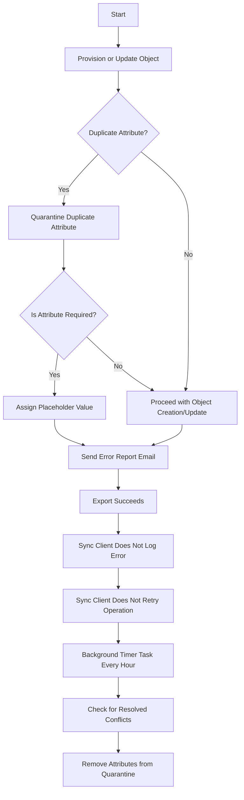

# Microsoft Entra Attribute Duplicate Attribute Resiliency

Microsoft Entra Attribute Duplicate Attribute Resiliency feature is also being rolled out as the default behavior of Microsoft Entra ID. This will reduce the number of synchronization errors seen by Microsoft Entra Connect (as well as other sync clients) by making Microsoft Entra ID more resilient in the way it handles duplicated ProxyAddresses and UserPrincipalName attributes present in on premises AD environments. This feature does not fix the duplication errors. So the data still needs to be fixed. But it allows provisioning of new objects which are otherwise blocked from being provisioned due to duplicated values in Microsoft Entra ID. This will also reduce the number of synchronization errors returned to the synchronization client. If this feature is enabled for your Tenant, you will not see the InvalidSoftMatch synchronization errors seen during provisioning of new objects.

## Behavior with Duplicate Attribute Resiliency

