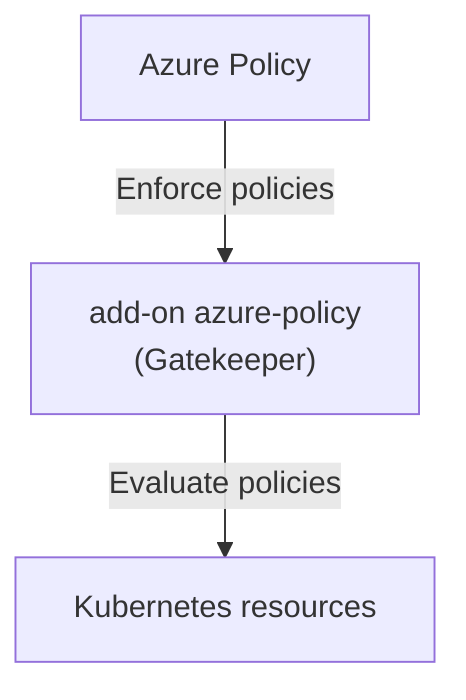

# Custom Azure Policy for Kubernetes

Azure Policy is a service in Azure that you can use to create, assign, and manage policies that enforce different rules and effects over your resources. These policies can help you stay compliant with your corporate standards and service-level agreements. In this article, we will discuss how to create a custom Azure Policy for Kubernetes.

## How Azure Policy works in kubernetes

Azure Policy for Kubernetes is an extension of Azure Policy that allows you to enforce policies on your Kubernetes clusters. You can use Azure Policy to define policies that apply to your Kubernetes resources, such as pods, deployments, and services. These policies can help you ensure that your Kubernetes clusters are compliant with your organization's standards and best practices.

Azure Policy for Kubernetes uses Gatekeeper, an open-source policy controller for Kubernetes, to enforce policies on your clusters. Gatekeeper uses the Open Policy Agent (OPA) policy language to define policies and evaluate them against your Kubernetes resources. You can use Gatekeeper to create custom policies that enforce specific rules and effects on your clusters.



Azure Policy for Kubernetes supports the following cluster environments:

- Azure Kubernetes Service (AKS), through Azure Policy's Add-on for AKS
- Azure Arc enabled Kubernetes, through Azure Policy's Extension for Arc

## Prepare your environment

Before you can create custom Azure Policy for Kubernetes, you need to set up your environment. You will need an Azure Kubernetes Service (AKS) cluster with the Azure Policy add-on enabled. You will also need the Azure CLI and the [Azure Policy extension](https://learn.microsoft.com/en-us/azure/governance/policy/how-to/extension-for-vscode) for Visual Studio Code.

To set up your environment, follow these steps:

1. Create a resource group
    
    ```azcli
    az group create --name myResourceGroup --location spaincentral
    ```

2. Create an Azure Kubernetes Service (AKS) cluster with default settings and one node:

    ```azcli
    az aks create --resource-group myResourceGroup --name myAKSCluster --node-count 1
    ```

3. Enable Azure Policies for the cluster:

    ```azcli
    az aks enable-addons --resource-group myResourceGroup --name myAKSCluster --addons azure-policy
    ```

4. Check the status of the add-on:

    ```azcli
    az aks show --resource-group myResourceGroup --name myAKSCluster --query addonProfiles.azurepolicy.enabled
    ```
   
5. Check the status of gatekeeper:

    ```azcli
    # Install kubectl and kubelogin
    az aks install-cli --install-location .local/bin/kubectl --kubelogin-install-location .local/bin/kubelogin
    # Get the credentials for the AKS cluster
    az aks get-credentials --resource-group myResourceGroup --name myAKSCluster --overwrite-existing
    # azure-policy pod is installed in kube-system namespace
    kubectl get pods -n kube-system
    # gatekeeper pod is installed in gatekeeper-system namespace
    kubectl get pods -n gatekeeper-system
    ```

6. Install vscode and the Azure Policy extension

    ```bash
    code --install-extension ms-azuretools.vscode-azurepolicy
    ```


Once you have set up your environment, you can create custom Azure Policy for Kubernetes.


## How to create a custom Azure Policy for Kubernetes

To create a custom Azure Policy for Kubernetes, you need to define a policy in the Open Policy Agent (OPA) policy language and apply it to your Kubernetes cluster. You can define policies that enforce specific rules and effects on your Kubernetes resources, such as pods, deployments, and services.

!!! Info 
    It`s recommended to review Constraint Templates in [How to use Gatekeeper](https://open-policy-agent.github.io/gatekeeper/website/docs/howto/)


To create a custom Azure Policy for Kubernetes, follow these steps:

1. Define a constraint template for the policy, I will use an existing constraint template from the Gatekeeper library that requires Ingress resources to be HTTPS only:

    ```yaml title="gatekeeper-library/library/general/httpsonly/template.yaml"
    apiVersion: templates.gatekeeper.sh/v1
    kind: ConstraintTemplate
    metadata:
        name: k8shttpsonly
        annotations:
            metadata.gatekeeper.sh/title: "HTTPS Only"
            metadata.gatekeeper.sh/version: 1.0.2
            description: >-
            Requires Ingress resources to be HTTPS only.  Ingress resources must
            include the `kubernetes.io/ingress.allow-http` annotation, set to `false`.
            By default a valid TLS {} configuration is required, this can be made
            optional by setting the `tlsOptional` parameter to `true`.

            https://kubernetes.io/docs/concepts/services-networking/ingress/#tls
    spec:
    crd:
        spec:
        names:
            kind: K8sHttpsOnly
        validation:
            # Schema for the `parameters` field
            openAPIV3Schema:
            type: object
            description: >-
                Requires Ingress resources to be HTTPS only.  Ingress resources must
                include the `kubernetes.io/ingress.allow-http` annotation, set to
                `false`. By default a valid TLS {} configuration is required, this
                can be made optional by setting the `tlsOptional` parameter to
                `true`.
            properties:
                tlsOptional:
                type: boolean
                description: "When set to `true` the TLS {} is optional, defaults 
                to false."
    targets:
        - target: admission.k8s.gatekeeper.sh
        rego: |
            package k8shttpsonly

            violation[{"msg": msg}] {
            input.review.object.kind == "Ingress"
            regex.match("^(extensions|networking.k8s.io)/", input.review.object.apiVersion)
            ingress := input.review.object
            not https_complete(ingress)
            not tls_is_optional
            msg := sprintf("Ingress should be https. tls configuration and allow-http=false annotation are required for %v", [ingress.metadata.name])
            }

            violation[{"msg": msg}] {
            input.review.object.kind == "Ingress"
            regex.match("^(extensions|networking.k8s.io)/", input.review.object.apiVersion)
            ingress := input.review.object
            not annotation_complete(ingress)
            tls_is_optional
            msg := sprintf("Ingress should be https. The allow-http=false annotation is required for %v", [ingress.metadata.name])
            }

            https_complete(ingress) = true {
            ingress.spec["tls"]
            count(ingress.spec.tls) > 0
            ingress.metadata.annotations["kubernetes.io/ingress.allow-http"] == "false"
            }

            annotation_complete(ingress) = true {
            ingress.metadata.annotations["kubernetes.io/ingress.allow-http"] == "false"
            }

            tls_is_optional {
            parameters := object.get(input, "parameters", {})
            object.get(parameters, "tlsOptional", false) == true
            }
    ```

This constrains requires Ingress resources to be HTTPS only

2. Create an Azure Policy for this constraint template

    1. Open the restriction template created earlier in Visual Studio Code.
    2. Click on Azure Policy icon in the Activity Bar.
    3. Click on View > Command Palette.
    4. Search for the command "Azure Policy for Kubernetes: Create Policy Definition from Constraint Template or Mutation", select base64, this command will create a policy definition from the constraint template.
    ```json title="Untitled.json"
    {
    "properties": {
        "policyType": "Custom",
        "mode": "Microsoft.Kubernetes.Data",
        "displayName": "/* EDIT HERE */",
        "description": "/* EDIT HERE */",
        "policyRule": {
        "if": {
            "field": "type",
            "in": [
            "Microsoft.ContainerService/managedClusters"
            ]
        },
        "then": {
            "effect": "[parameters('effect')]",
            "details": {
            "templateInfo": {
                "sourceType": "Base64Encoded",
                "content": "YXBpVmVyc2lvbjogdGVtcGxhdGVzLmdhdGVrZWVwZXIuc2gvdjEKa2luZDogQ29uc3RyYWludFRlbXBsYXRlCm1ldGFkYXRhOgogIG5hbWU6IGs4c2h0dHBzb25seQogIGFubm90YXRpb25zOgogICAgbWV0YWRhdGEuZ2F0ZWtlZXBlci5zaC90aXRsZTogIkhUVFBTIE9ubHkiCiAgICBtZXRhZGF0YS5nYXRla2VlcGVyLnNoL3ZlcnNpb246IDEuMC4yCiAgICBkZXNjcmlwdGlvbjogPi0KICAgICAgUmVxdWlyZXMgSW5ncmVzcyByZXNvdXJjZXMgdG8gYmUgSFRUUFMgb25seS4gIEluZ3Jlc3MgcmVzb3VyY2VzIG11c3QKICAgICAgaW5jbHVkZSB0aGUgYGt1YmVybmV0ZXMuaW8vaW5ncmVzcy5hbGxvdy1odHRwYCBhbm5vdGF0aW9uLCBzZXQgdG8gYGZhbHNlYC4KICAgICAgQnkgZGVmYXVsdCBhIHZhbGlkIFRMUyB7fSBjb25maWd1cmF0aW9uIGlzIHJlcXVpcmVkLCB0aGlzIGNhbiBiZSBtYWRlCiAgICAgIG9wdGlvbmFsIGJ5IHNldHRpbmcgdGhlIGB0bHNPcHRpb25hbGAgcGFyYW1ldGVyIHRvIGB0cnVlYC4KCiAgICAgIGh0dHBzOi8va3ViZXJuZXRlcy5pby9kb2NzL2NvbmNlcHRzL3NlcnZpY2VzLW5ldHdvcmtpbmcvaW5ncmVzcy8jdGxzCnNwZWM6CiAgY3JkOgogICAgc3BlYzoKICAgICAgbmFtZXM6CiAgICAgICAga2luZDogSzhzSHR0cHNPbmx5CiAgICAgIHZhbGlkYXRpb246CiAgICAgICAgIyBTY2hlbWEgZm9yIHRoZSBgcGFyYW1ldGVyc2AgZmllbGQKICAgICAgICBvcGVuQVBJVjNTY2hlbWE6CiAgICAgICAgICB0eXBlOiBvYmplY3QKICAgICAgICAgIGRlc2NyaXB0aW9uOiA+LQogICAgICAgICAgICBSZXF1aXJlcyBJbmdyZXNzIHJlc291cmNlcyB0byBiZSBIVFRQUyBvbmx5LiAgSW5ncmVzcyByZXNvdXJjZXMgbXVzdAogICAgICAgICAgICBpbmNsdWRlIHRoZSBga3ViZXJuZXRlcy5pby9pbmdyZXNzLmFsbG93LWh0dHBgIGFubm90YXRpb24sIHNldCB0bwogICAgICAgICAgICBgZmFsc2VgLiBCeSBkZWZhdWx0IGEgdmFsaWQgVExTIHt9IGNvbmZpZ3VyYXRpb24gaXMgcmVxdWlyZWQsIHRoaXMKICAgICAgICAgICAgY2FuIGJlIG1hZGUgb3B0aW9uYWwgYnkgc2V0dGluZyB0aGUgYHRsc09wdGlvbmFsYCBwYXJhbWV0ZXIgdG8KICAgICAgICAgICAgYHRydWVgLgogICAgICAgICAgcHJvcGVydGllczoKICAgICAgICAgICAgdGxzT3B0aW9uYWw6CiAgICAgICAgICAgICAgdHlwZTogYm9vbGVhbgogICAgICAgICAgICAgIGRlc2NyaXB0aW9uOiAiV2hlbiBzZXQgdG8gYHRydWVgIHRoZSBUTFMge30gaXMgb3B0aW9uYWwsIGRlZmF1bHRzCiAgICAgICAgICAgICAgdG8gZmFsc2UuIgogIHRhcmdldHM6CiAgICAtIHRhcmdldDogYWRtaXNzaW9uLms4cy5nYXRla2VlcGVyLnNoCiAgICAgIHJlZ286IHwKICAgICAgICBwYWNrYWdlIGs4c2h0dHBzb25seQoKICAgICAgICB2aW9sYXRpb25beyJtc2ciOiBtc2d9XSB7CiAgICAgICAgICBpbnB1dC5yZXZpZXcub2JqZWN0LmtpbmQgPT0gIkluZ3Jlc3MiCiAgICAgICAgICByZWdleC5tYXRjaCgiXihleHRlbnNpb25zfG5ldHdvcmtpbmcuazhzLmlvKS8iLCBpbnB1dC5yZXZpZXcub2JqZWN0LmFwaVZlcnNpb24pCiAgICAgICAgICBpbmdyZXNzIDo9IGlucHV0LnJldmlldy5vYmplY3QKICAgICAgICAgIG5vdCBodHRwc19jb21wbGV0ZShpbmdyZXNzKQogICAgICAgICAgbm90IHRsc19pc19vcHRpb25hbAogICAgICAgICAgbXNnIDo9IHNwcmludGYoIkluZ3Jlc3Mgc2hvdWxkIGJlIGh0dHBzLiB0bHMgY29uZmlndXJhdGlvbiBhbmQgYWxsb3ctaHR0cD1mYWxzZSBhbm5vdGF0aW9uIGFyZSByZXF1aXJlZCBmb3IgJXYiLCBbaW5ncmVzcy5tZXRhZGF0YS5uYW1lXSkKICAgICAgICB9CgogICAgICAgIHZpb2xhdGlvblt7Im1zZyI6IG1zZ31dIHsKICAgICAgICAgIGlucHV0LnJldmlldy5vYmplY3Qua2luZCA9PSAiSW5ncmVzcyIKICAgICAgICAgIHJlZ2V4Lm1hdGNoKCJeKGV4dGVuc2lvbnN8bmV0d29ya2luZy5rOHMuaW8pLyIsIGlucHV0LnJldmlldy5vYmplY3QuYXBpVmVyc2lvbikKICAgICAgICAgIGluZ3Jlc3MgOj0gaW5wdXQucmV2aWV3Lm9iamVjdAogICAgICAgICAgbm90IGFubm90YXRpb25fY29tcGxldGUoaW5ncmVzcykKICAgICAgICAgIHRsc19pc19vcHRpb25hbAogICAgICAgICAgbXNnIDo9IHNwcmludGYoIkluZ3Jlc3Mgc2hvdWxkIGJlIGh0dHBzLiBUaGUgYWxsb3ctaHR0cD1mYWxzZSBhbm5vdGF0aW9uIGlzIHJlcXVpcmVkIGZvciAldiIsIFtpbmdyZXNzLm1ldGFkYXRhLm5hbWVdKQogICAgICAgIH0KCiAgICAgICAgaHR0cHNfY29tcGxldGUoaW5ncmVzcykgPSB0cnVlIHsKICAgICAgICAgIGluZ3Jlc3Muc3BlY1sidGxzIl0KICAgICAgICAgIGNvdW50KGluZ3Jlc3Muc3BlYy50bHMpID4gMAogICAgICAgICAgaW5ncmVzcy5tZXRhZGF0YS5hbm5vdGF0aW9uc1sia3ViZXJuZXRlcy5pby9pbmdyZXNzLmFsbG93LWh0dHAiXSA9PSAiZmFsc2UiCiAgICAgICAgfQoKICAgICAgICBhbm5vdGF0aW9uX2NvbXBsZXRlKGluZ3Jlc3MpID0gdHJ1ZSB7CiAgICAgICAgICBpbmdyZXNzLm1ldGFkYXRhLmFubm90YXRpb25zWyJrdWJlcm5ldGVzLmlvL2luZ3Jlc3MuYWxsb3ctaHR0cCJdID09ICJmYWxzZSIKICAgICAgICB9CgogICAgICAgIHRsc19pc19vcHRpb25hbCB7CiAgICAgICAgICBwYXJhbWV0ZXJzIDo9IG9iamVjdC5nZXQoaW5wdXQsICJwYXJhbWV0ZXJzIiwge30pCiAgICAgICAgICBvYmplY3QuZ2V0KHBhcmFtZXRlcnMsICJ0bHNPcHRpb25hbCIsIGZhbHNlKSA9PSB0cnVlCiAgICAgICAgfQ=="
            },
            "apiGroups": [
                "/* EDIT HERE */"
            ],
            "kinds": [
                "/* EDIT HERE */"
            ],
            "namespaces": "[parameters('namespaces')]",
            "excludedNamespaces": "[parameters('excludedNamespaces')]",
            "labelSelector": "[parameters('labelSelector')]",
            "values": {
                "tlsOptional": "[parameters('tlsOptional')]"
            }
            }
        }
        },
        "parameters": {
        "effect": {
            "type": "String",
            "metadata": {
            "displayName": "Effect",
            "description": "'audit' allows a non-compliant resource to be created or updated, but flags it as non-compliant. 'deny' blocks the non-compliant resource creation or update. 'disabled' turns off the policy."
            },
            "allowedValues": [
            "audit",
            "deny",
            "disabled"
            ],
            "defaultValue": "audit"
        },
        "excludedNamespaces": {
            "type": "Array",
            "metadata": {
            "displayName": "Namespace exclusions",
            "description": "List of Kubernetes namespaces to exclude from policy evaluation."
            },
            "defaultValue": [
            "kube-system",
            "gatekeeper-system",
            "azure-arc"
            ]
        },
        "namespaces": {
            "type": "Array",
            "metadata": {
            "displayName": "Namespace inclusions",
            "description": "List of Kubernetes namespaces to only include in policy evaluation. An empty list means the policy is applied to all resources in all namespaces."
            },
            "defaultValue": []
        },
        "labelSelector": {
            "type": "Object",
            "metadata": {
            "displayName": "Kubernetes label selector",
            "description": "Label query to select Kubernetes resources for policy evaluation. An empty label selector matches all Kubernetes resources."
            },
            "defaultValue": {},
            "schema": {
            "description": "A label selector is a label query over a set of resources. The result of matchLabels and matchExpressions are ANDed. An empty label selector matches all resources.",
            "type": "object",
            "properties": {
                "matchLabels": {
                "description": "matchLabels is a map of {key,value} pairs.",
                "type": "object",
                "additionalProperties": {
                    "type": "string"
                },
                "minProperties": 1
                },
                "matchExpressions": {
                "description": "matchExpressions is a list of values, a key, and an operator.",
                "type": "array",
                "items": {
                    "type": "object",
                    "properties": {
                    "key": {
                        "description": "key is the label key that the selector applies to.",
                        "type": "string"
                    },
                    "operator": {
                        "description": "operator represents a key's relationship to a set of values.",
                        "type": "string",
                        "enum": [
                        "In",
                        "NotIn",
                        "Exists",
                        "DoesNotExist"
                        ]
                    },
                    "values": {
                        "description": "values is an array of string values. If the operator is In or NotIn, the values array must be non-empty. If the operator is Exists or DoesNotExist, the values array must be empty.",
                        "type": "array",
                        "items": {
                        "type": "string"
                        }
                    }
                    },
                    "required": [
                    "key",
                    "operator"
                    ],
                    "additionalProperties": false
                },
                "minItems": 1
                }
            },
            "additionalProperties": false
            }
        },
        "tlsOptional": {
            "type": "Boolean",
            "metadata": {
            "displayName": "/* EDIT HERE */",
            "description": "/* EDIT HERE */"
            }
        }
        }
    }
    }
    ```
    5. Fill the fields with "/* EDIT HERE */" in the policy definition JSON file with the appropriate values, such as the display name, description, API groups, and kinds. For example, in this case you must configure apiGroups:
     ["extensions", "networking.k8s.io"] and kinds: ["Ingress"]
    6. Save the policy definition JSON file.


This is the complete policy:

```json title="https-only.json"
    {
    "properties": {
        "policyType": "Custom",
        "mode": "Microsoft.Kubernetes.Data",
        "displayName": "Require HTTPS for Ingress resources",
        "description": "This policy requires Ingress resources to be HTTPS only. Ingress resources must include the `kubernetes.io/ingress.allow-http` annotation, set to `false`. By default a valid TLS configuration is required, this can be made optional by setting the `tlsOptional` parameter to `true`.",
        "policyRule": {
        "if": {
            "field": "type",
            "in": [
            "Microsoft.ContainerService/managedClusters"
            ]
        },
        "then": {
            "effect": "[parameters('effect')]",
            "details": {
            "templateInfo": {
                "sourceType": "Base64Encoded",
                "content": "YXBpVmVyc2lvbjogdGVtcGxhdGVzLmdhdGVrZWVwZXIuc2gvdjEKa2luZDogQ29uc3RyYWludFRlbXBsYXRlCm1ldGFkYXRhOgogIG5hbWU6IGs4c2h0dHBzb25seQogIGFubm90YXRpb25zOgogICAgbWV0YWRhdGEuZ2F0ZWtlZXBlci5zaC90aXRsZTogIkhUVFBTIE9ubHkiCiAgICBtZXRhZGF0YS5nYXRla2VlcGVyLnNoL3ZlcnNpb246IDEuMC4yCiAgICBkZXNjcmlwdGlvbjogPi0KICAgICAgUmVxdWlyZXMgSW5ncmVzcyByZXNvdXJjZXMgdG8gYmUgSFRUUFMgb25seS4gIEluZ3Jlc3MgcmVzb3VyY2VzIG11c3QKICAgICAgaW5jbHVkZSB0aGUgYGt1YmVybmV0ZXMuaW8vaW5ncmVzcy5hbGxvdy1odHRwYCBhbm5vdGF0aW9uLCBzZXQgdG8gYGZhbHNlYC4KICAgICAgQnkgZGVmYXVsdCBhIHZhbGlkIFRMUyB7fSBjb25maWd1cmF0aW9uIGlzIHJlcXVpcmVkLCB0aGlzIGNhbiBiZSBtYWRlCiAgICAgIG9wdGlvbmFsIGJ5IHNldHRpbmcgdGhlIGB0bHNPcHRpb25hbGAgcGFyYW1ldGVyIHRvIGB0cnVlYC4KCiAgICAgIGh0dHBzOi8va3ViZXJuZXRlcy5pby9kb2NzL2NvbmNlcHRzL3NlcnZpY2VzLW5ldHdvcmtpbmcvaW5ncmVzcy8jdGxzCnNwZWM6CiAgY3JkOgogICAgc3BlYzoKICAgICAgbmFtZXM6CiAgICAgICAga2luZDogSzhzSHR0cHNPbmx5CiAgICAgIHZhbGlkYXRpb246CiAgICAgICAgIyBTY2hlbWEgZm9yIHRoZSBgcGFyYW1ldGVyc2AgZmllbGQKICAgICAgICBvcGVuQVBJVjNTY2hlbWE6CiAgICAgICAgICB0eXBlOiBvYmplY3QKICAgICAgICAgIGRlc2NyaXB0aW9uOiA+LQogICAgICAgICAgICBSZXF1aXJlcyBJbmdyZXNzIHJlc291cmNlcyB0byBiZSBIVFRQUyBvbmx5LiAgSW5ncmVzcyByZXNvdXJjZXMgbXVzdAogICAgICAgICAgICBpbmNsdWRlIHRoZSBga3ViZXJuZXRlcy5pby9pbmdyZXNzLmFsbG93LWh0dHBgIGFubm90YXRpb24sIHNldCB0bwogICAgICAgICAgICBgZmFsc2VgLiBCeSBkZWZhdWx0IGEgdmFsaWQgVExTIHt9IGNvbmZpZ3VyYXRpb24gaXMgcmVxdWlyZWQsIHRoaXMKICAgICAgICAgICAgY2FuIGJlIG1hZGUgb3B0aW9uYWwgYnkgc2V0dGluZyB0aGUgYHRsc09wdGlvbmFsYCBwYXJhbWV0ZXIgdG8KICAgICAgICAgICAgYHRydWVgLgogICAgICAgICAgcHJvcGVydGllczoKICAgICAgICAgICAgdGxzT3B0aW9uYWw6CiAgICAgICAgICAgICAgdHlwZTogYm9vbGVhbgogICAgICAgICAgICAgIGRlc2NyaXB0aW9uOiAiV2hlbiBzZXQgdG8gYHRydWVgIHRoZSBUTFMge30gaXMgb3B0aW9uYWwsIGRlZmF1bHRzCiAgICAgICAgICAgICAgdG8gZmFsc2UuIgogIHRhcmdldHM6CiAgICAtIHRhcmdldDogYWRtaXNzaW9uLms4cy5nYXRla2VlcGVyLnNoCiAgICAgIHJlZ286IHwKICAgICAgICBwYWNrYWdlIGs4c2h0dHBzb25seQoKICAgICAgICB2aW9sYXRpb25beyJtc2ciOiBtc2d9XSB7CiAgICAgICAgICBpbnB1dC5yZXZpZXcub2JqZWN0LmtpbmQgPT0gIkluZ3Jlc3MiCiAgICAgICAgICByZWdleC5tYXRjaCgiXihleHRlbnNpb25zfG5ldHdvcmtpbmcuazhzLmlvKS8iLCBpbnB1dC5yZXZpZXcub2JqZWN0LmFwaVZlcnNpb24pCiAgICAgICAgICBpbmdyZXNzIDo9IGlucHV0LnJldmlldy5vYmplY3QKICAgICAgICAgIG5vdCBodHRwc19jb21wbGV0ZShpbmdyZXNzKQogICAgICAgICAgbm90IHRsc19pc19vcHRpb25hbAogICAgICAgICAgbXNnIDo9IHNwcmludGYoIkluZ3Jlc3Mgc2hvdWxkIGJlIGh0dHBzLiB0bHMgY29uZmlndXJhdGlvbiBhbmQgYWxsb3ctaHR0cD1mYWxzZSBhbm5vdGF0aW9uIGFyZSByZXF1aXJlZCBmb3IgJXYiLCBbaW5ncmVzcy5tZXRhZGF0YS5uYW1lXSkKICAgICAgICB9CgogICAgICAgIHZpb2xhdGlvblt7Im1zZyI6IG1zZ31dIHsKICAgICAgICAgIGlucHV0LnJldmlldy5vYmplY3Qua2luZCA9PSAiSW5ncmVzcyIKICAgICAgICAgIHJlZ2V4Lm1hdGNoKCJeKGV4dGVuc2lvbnN8bmV0d29ya2luZy5rOHMuaW8pLyIsIGlucHV0LnJldmlldy5vYmplY3QuYXBpVmVyc2lvbikKICAgICAgICAgIGluZ3Jlc3MgOj0gaW5wdXQucmV2aWV3Lm9iamVjdAogICAgICAgICAgbm90IGFubm90YXRpb25fY29tcGxldGUoaW5ncmVzcykKICAgICAgICAgIHRsc19pc19vcHRpb25hbAogICAgICAgICAgbXNnIDo9IHNwcmludGYoIkluZ3Jlc3Mgc2hvdWxkIGJlIGh0dHBzLiBUaGUgYWxsb3ctaHR0cD1mYWxzZSBhbm5vdGF0aW9uIGlzIHJlcXVpcmVkIGZvciAldiIsIFtpbmdyZXNzLm1ldGFkYXRhLm5hbWVdKQogICAgICAgIH0KCiAgICAgICAgaHR0cHNfY29tcGxldGUoaW5ncmVzcykgPSB0cnVlIHsKICAgICAgICAgIGluZ3Jlc3Muc3BlY1sidGxzIl0KICAgICAgICAgIGNvdW50KGluZ3Jlc3Muc3BlYy50bHMpID4gMAogICAgICAgICAgaW5ncmVzcy5tZXRhZGF0YS5hbm5vdGF0aW9uc1sia3ViZXJuZXRlcy5pby9pbmdyZXNzLmFsbG93LWh0dHAiXSA9PSAiZmFsc2UiCiAgICAgICAgfQoKICAgICAgICBhbm5vdGF0aW9uX2NvbXBsZXRlKGluZ3Jlc3MpID0gdHJ1ZSB7CiAgICAgICAgICBpbmdyZXNzLm1ldGFkYXRhLmFubm90YXRpb25zWyJrdWJlcm5ldGVzLmlvL2luZ3Jlc3MuYWxsb3ctaHR0cCJdID09ICJmYWxzZSIKICAgICAgICB9CgogICAgICAgIHRsc19pc19vcHRpb25hbCB7CiAgICAgICAgICBwYXJhbWV0ZXJzIDo9IG9iamVjdC5nZXQoaW5wdXQsICJwYXJhbWV0ZXJzIiwge30pCiAgICAgICAgICBvYmplY3QuZ2V0KHBhcmFtZXRlcnMsICJ0bHNPcHRpb25hbCIsIGZhbHNlKSA9PSB0cnVlCiAgICAgICAgfQ=="
            },
            "apiGroups": [
                "extensions",
                "networking.k8s.io"
            ],
            "kinds": [
                "Ingress"
            ],
            "namespaces": "[parameters('namespaces')]",
            "excludedNamespaces": "[parameters('excludedNamespaces')]",
            "labelSelector": "[parameters('labelSelector')]",
            "values": {
                "tlsOptional": "[parameters('tlsOptional')]"
            }
            }
        }
        },
        "parameters": {
        "effect": {
            "type": "String",
            "metadata": {
            "displayName": "Effect",
            "description": "'audit' allows a non-compliant resource to be created or updated, but flags it as non-compliant. 'deny' blocks the non-compliant resource creation or update. 'disabled' turns off the policy."
            },
            "allowedValues": [
            "audit",
            "deny",
            "disabled"
            ],
            "defaultValue": "audit"
        },
        "excludedNamespaces": {
            "type": "Array",
            "metadata": {
            "displayName": "Namespace exclusions",
            "description": "List of Kubernetes namespaces to exclude from policy evaluation."
            },
            "defaultValue": [
            "kube-system",
            "gatekeeper-system",
            "azure-arc"
            ]
        },
        "namespaces": {
            "type": "Array",
            "metadata": {
            "displayName": "Namespace inclusions",
            "description": "List of Kubernetes namespaces to only include in policy evaluation. An empty list means the policy is applied to all resources in all namespaces."
            },
            "defaultValue": []
        },
        "labelSelector": {
            "type": "Object",
            "metadata": {
            "displayName": "Kubernetes label selector",
            "description": "Label query to select Kubernetes resources for policy evaluation. An empty label selector matches all Kubernetes resources."
            },
            "defaultValue": {},
            "schema": {
            "description": "A label selector is a label query over a set of resources. The result of matchLabels and matchExpressions are ANDed. An empty label selector matches all resources.",
            "type": "object",
            "properties": {
                "matchLabels": {
                "description": "matchLabels is a map of {key,value} pairs.",
                "type": "object",
                "additionalProperties": {
                    "type": "string"
                },
                "minProperties": 1
                },
                "matchExpressions": {
                "description": "matchExpressions is a list of values, a key, and an operator.",
                "type": "array",
                "items": {
                    "type": "object",
                    "properties": {
                    "key": {
                        "description": "key is the label key that the selector applies to.",
                        "type": "string"
                    },
                    "operator": {
                        "description": "operator represents a key's relationship to a set of values.",
                        "type": "string",
                        "enum": [
                        "In",
                        "NotIn",
                        "Exists",
                        "DoesNotExist"
                        ]
                    },
                    "values": {
                        "description": "values is an array of string values. If the operator is In or NotIn, the values array must be non-empty. If the operator is Exists or DoesNotExist, the values array must be empty.",
                        "type": "array",
                        "items": {
                        "type": "string"
                        }
                    }
                    },
                    "required": [
                    "key",
                    "operator"
                    ],
                    "additionalProperties": false
                },
                "minItems": 1
                }
            },
            "additionalProperties": false
            }
        },
        "tlsOptional": {
            "type": "Boolean",
            "metadata": {
            "displayName": "TLS Optional",
            "description": "Set to true to make TLS optional"
            }
        }
        }
    }
    }
    ```
    

Now you have created a custom Azure Policy for Kubernetes that enforces the HTTPS only constraint on your Kubernetes cluster. You can apply this policy to your cluster to ensure that all Ingress resources are HTTPS only creating a policy definition and assigning it to the management group, subscription or resource group where the AKS cluster is located.

## Conclusion

In this article, we discussed how to create a custom Azure Policy for Kubernetes. We showed you how to define a policy in the Open Policy Agent (OPA) policy language and apply it to your Kubernetes cluster. We also showed you how to create a constraint template for the policy and create an Azure Policy for the constraint template. By following these steps, you can create custom policies that enforce specific rules and effects on your Kubernetes resources.

## References

- [Understand Azure Policy for kubernetes clusters](https://learn.microsoft.com/en-us/azure/governance/policy/concepts/policy-for-kubernetes#install-azure-policy-add-on-for-aks)
- [Gatekeeper Library](https://github.com/open-policy-agent/gatekeeper-library/tree/master/library/general/httpsonly)
- [Azure Policy extension for Visual Studio Code](https://learn.microsoft.com/en-us/azure/governance/policy/how-to/extension-for-vscode)
- [How to use Gatekeeper](https://open-policy-agent.github.io/gatekeeper/website/docs/howto/)