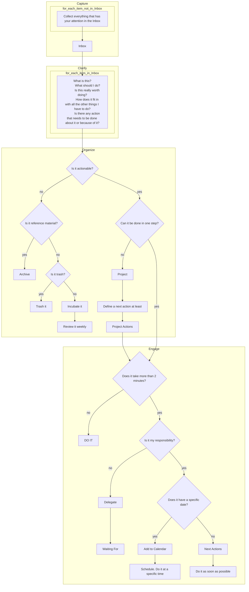
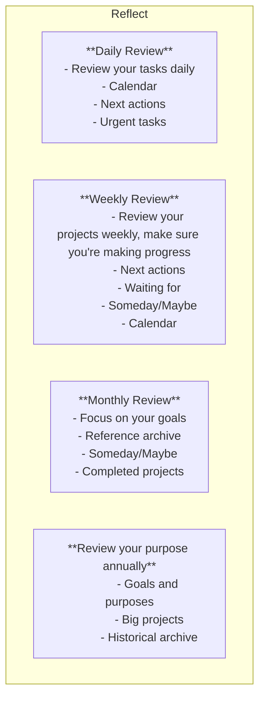
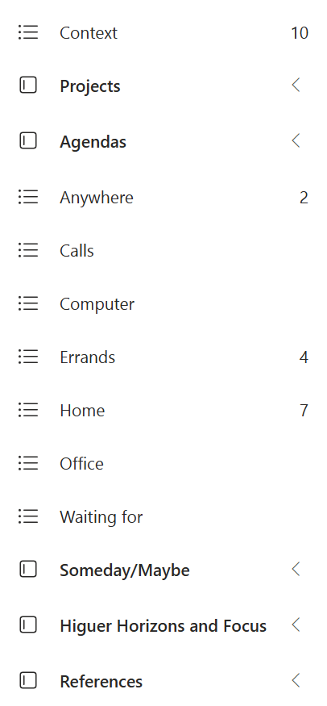

# GTD in Outlook with Microsoft To Do

In this post, we will see how to use GTD in Outlook.

Firs of all, let's define what GTD is. GTD stands for Getting Things Done, a productivity method created by David Allen. The GTD method is based on the idea that you should get things out of your head and into a trusted system, so you can focus on what you need to do.

!!! Important
    The GTD method is not about doing more things faster. It's about doing the right things at the right time.
    This method needs to be aligned with your purpose, objectives, and goals, so you can focus on what really matters to you.

## The GTD workflow

The GTD workflow consists of five steps:

1. Capture: Collect everything that has your attention.
2. Clarify: Process what you've captured.
3. Organize: Put everything in its place.
4. Reflect: Review your system regularly.
5. Engage: Choose what to do and do it.

The detailed flowchart of the GTD method is shown below:

It's important to note that the GTD method is not a one-size-fits-all solution. You can adapt it to your needs and preferences. The key is to find a system that works for you and stick to it.

And now, let's see how to use GTD in Outlook and Microsoft To Do.

## How to use GTD in Outlook with Microsoft To Do

When it comes to implementing the GTD method in Outlook, the key is to use the right tools and techniques. Microsoft To Do is a great tool for managing your tasks and projects, and it integrates seamlessly with Outlook.

You can use Outlook to implement the GTD method by following these steps:

1. Capture:
    - emails: Use the Inbox to collect everything that has your attention.
    - Other Things: Use Microsoft To Do Taks default list to capture tasks and projects.
2. Clarify: Process what you've captured by asking yourself the following questions:
    - What is this?
    - What should I do?
    - Is this really worth doing?
    - How does it fit in with all the other things I have to do?
    - Is there any action that needs to be done about it or because of it?
3. Organize: Put everything in its place by following these steps:
    - Inbox:
        - Move emails to the appropriate folder or delete them.
        - Categories: Use categories to organize your emails by context and folder to organize your emails by project or client.
        - Use search folders to find emails quickly by category or categories, you can clear categories after processing.
        - Flags emails to add to To Do.
        - Create rules to automate repetitive tasks when clarifying one type of email has allways the same action.
    - Tasks: Organize your tasks and projects in Microsoft To Do.
        - Lists: Create lists for different types of tasks, one by context or use #tags for that in one lists. For example:
            - In the case of lists: Agendas, Anywhere, Calls, Computed, Errands, Home, Office, Waiting For, Someday/Maybe.
            - In the case of tags, one list with: #Agendas, #Anywhere, #Calls, #Computed, #Errands, #Home, #Office, #WaitingFor, #SomedayMaybe.
        - Use tag #nextaction to identify the next task to do.
        - Use tag #urgent to identify urgent tasks.
    - Projects
        - Group Lists: Group lists by category of projects or client.
        - One list per project: Create a list for each project and add tasks to it.
        - Use #nextaction tag to identify the next task in each project.
    - Reference Material:
        - Store reference material in folders, better in OneDrive or SharePoint.
        - Use a folder structure to organize your reference material
        - Use search folders to find it quickly.
        - Use tags to identify the context of the reference material. You can use [FileMeta](https://github.com/Dijji/FileMeta?tab=readme-ov-file) to add tags to files in Windows for non-taggeable files.
4. Reflect: Review your system regularly to make sure it's up to date.
    - Daily Review
    - Weekly Review
    - Monthly Review
    - Annual Review
5. Engage: Choose what to do and do it.
    - Use the My Day Bar to see your tasks and events at a glance or in search bar type #nextaction to see all your next actions.

These are just some ideas to get you started. You can adapt the GTD method to your needs and preferences. The key is to find a system that works for you and stick to it.

My example of GTD in Outlook with Microsoft To Do:

Outlook:

To Do:

I'm using a mix of lists and tags with the same name to organize my tasks and projects. I have lists for different types of tasks, such as Agendas, Anywhere, Calls, Computed, Errands, Home, Office, Waiting For, and Someday/Maybe. I also use tags to identify the next action, urgent tasks and context of the task in projects.

In the case of emails, I use categories to organize them by context and folders to organize them by project or client. I also use search folders to find emails quickly by category or categories and filter by unreads. The reason for this is that I can clear categories after processing and in the mayorie of cases, I only need a quick review of the emails without the need to convert them into tasks.

By following these steps, you can implement the GTD method in Outlook and Microsoft To Do and improve your productivity and focus.

Good luck! 🍀

## References

- [How to use Microsoft To Do for Getting Things Done (GTD)](https://youtu.be/Nob50sN4be0)
- [Getting Things Done: The Art of Stress-Free Productivity](https://gettingthingsdone.com/)
- [Manage email messages by using rules in Outlook](https://support.microsoft.com/en-us/office/manage-email-messages-by-using-rules-in-outlook-c24f5dea-9465-4df4-ad17-a50704d66c59)
- [FileMeta](https://github.com/Dijji/FileMeta?tab=readme-ov-file)