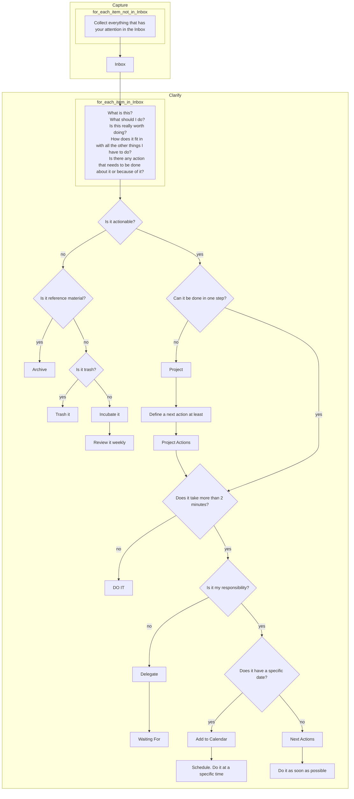

# How to use GTD in Outlook and Microsoft To Do

In this post, we will see how to use GTD in Outlook.

Firs of all, let's define what GTD is. GTD stands for Getting Things Done, a productivity method created by David Allen. The GTD method is based on the idea that you should get things out of your head and into a trusted system, so you can focus on what you need to do.

## The GTD workflow

The GTD workflow consists of five steps:

1. Capture: Collect everything that has your attention.
2. Clarify: Process what you've captured.
3. Organize: Put everything in its place.
4. Reflect: Review your system regularly.
5. Engage: Choose what to do and do it.

The detailed flowchart of the GTD method is shown below:

## How to use GTD in Outlook

You can use Outlook to implement the GTD method by following these steps:

1. Capture: Use the Inbox to collect everything that has your attention.
2. Clarify: Process your emails and tasks. Decide what to do with each item: do it, delegate it, defer it, or delete it.
3. Organize: Use folders, categories, and flags to organize your emails and tasks.
4. Reflect: Review your system regularly. Use the To-Do Bar to see your tasks and appointments.
5. Engage: Choose what to do and do it. Use the Tasks and Calendar features to manage your time.

## How to use GTD in Microsoft To Do

You can also use Microsoft To Do to implement the GTD method by following these steps:

1. Capture: Use the Inbox to collect everything that has your attention.
2. Clarify: Process your tasks. Decide what to do with each task: do it, delegate it, defer it, or delete it.
3. Organize: Use lists, tags, and due dates to organize your tasks.
4. Reflect: Review your system regularly. Use the My Day feature to see your tasks for the day.
5. Engage: Choose what to do and do it. Use the Today and Upcoming features to manage your time.

By following these steps, you can use Outlook and Microsoft To Do to implement the GTD method and increase your productivity.