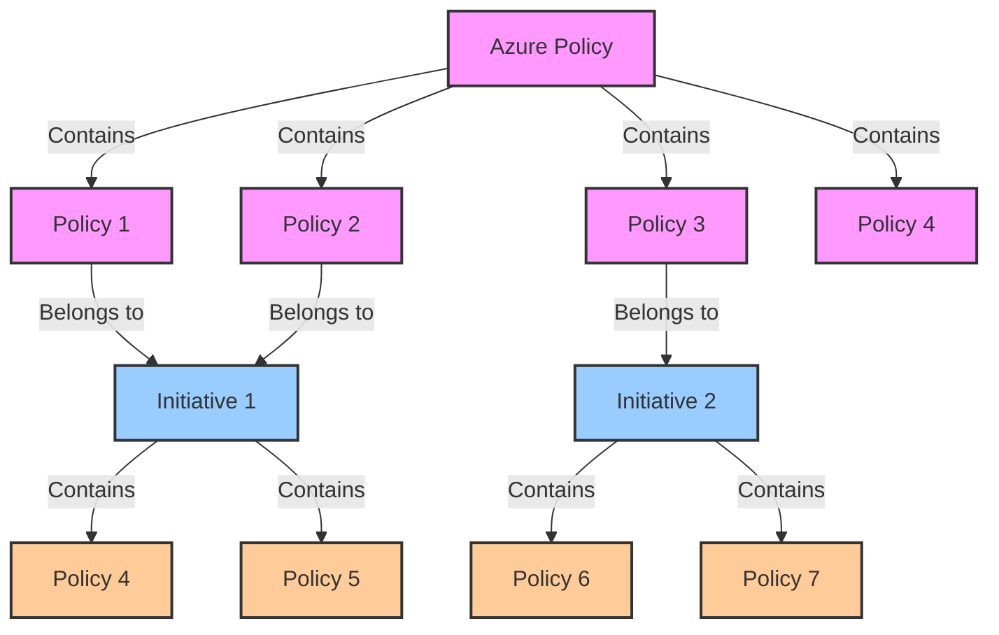

# Azure Policy

Azure Policy serves as a powerful tool for implementing governance across your Azure environment. It helps ensure resource consistency, regulatory compliance, security, cost management, and efficient operations

As organizations leverage the power of Azure for their cloud infrastructure, ensuring governance, compliance, and security becomes paramount. Azure Policy, along with policies and initiatives, provides a robust framework to enforce and assess compliance with organizational standards and regulatory requirements. Let's delve into these concepts to understand how they work together.

## Azure Policy Overview

**Azure Policy** is a service in Azure that allows you to create, assign, and manage policies. These policies enforce different rules and effects over resources, so those resources stay compliant with corporate standards and service-level agreements.

Azure Policy helps to address questions like:

- Are all virtual machines encrypted using Azure Disk Encryption?
- Are resources deployed only in certain Azure regions?
- Are specific tags applied to resources for tracking and organization?

Policies in Azure Policy are defined using JSON-based policy definitions. These definitions can be simple or complex, depending on the requirements. Once a policy is created, it can be assigned to specific scopes within Azure, such as subscriptions, resource groups, or even individual resources.

!!! Info
    It's important to recognize that with the introduction of Azure Arc, you can extend your policy-based governance across different cloud providers and even to your local datacenters.

## Policies

**Policies** in Azure Policy are rules that enforce different requirements and effects on resources. These policies can be related to security, compliance, or management. For instance, you can have a policy that ensures all publicly accessible storage accounts are secured with a firewall or a policy that enforces a specific naming convention for virtual machines.

Key attributes of policies include:
- **Effect**: Determines what happens when the condition in the policy is met (e.g., deny the action, audit the action, append a tag).
- **Condition**: Defines when the policy is enforced based on properties of the resource being evaluated.
- **Action**: Specifies what happens when a resource violates the policy (e.g., deny deployment, apply audit).

Policies can be built-in (provided by Azure) or custom (defined by the organization). They play a vital role in maintaining compliance and security standards across Azure environments.

## Initiatives

**Initiatives** in Azure Policy are collections of policies that are grouped together as a single unit. This simplifies the process of assigning multiple policies to different scopes simultaneously. Initiatives help in enforcing complex requirements and compliance standards by grouping related policies together.

Initiatives allow you to:

- Apply multiple policies at once to a scope (like a subscription or management group).
- Monitor compliance against a set of defined standards or regulations.
- Streamline governance by organizing policies logically.

By using initiatives, you can efficiently manage and enforce compliance with regulatory standards (e.g., CIS benchmarks, PCI DSS) or organizational best practices.

## Conclusion

In conclusion, Azure Policy, policies, and initiatives are fundamental components of Azure's governance framework. They enable organizations to define and enforce rules for Azure resources, ensuring adherence to compliance standards, security protocols, and operational guidelines. By leveraging these capabilities, Azure users can maintain control over their cloud environment while promoting consistency and security across deployments. If you're looking to enhance governance and compliance within Azure, exploring Azure Policy, policies, and initiatives is a crucial step forward.

## References

- [Azure Policy overview](https://docs.microsoft.com/en-us/azure/governance/policy/overview)
