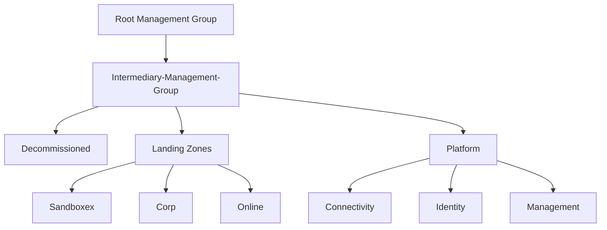
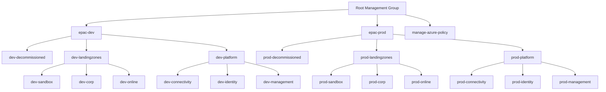

# Using Enterprise Azure Policy as Code (EPAC)

In this blog post, we will show how to use Enterprise Azure Policy as Code (EPAC) to manage your Azure environment.

## Use case

- Determine desired state strategy.
  - We have some existing Azure Policies that we want to manage as code.
  - For simplicity, we will suppose that we have a unique Centralized Team that manages the policies.
  - We will use a Git repository to store the policies and the CI/CD process to deploy them.
  - We doesn't have any exclude resources in the environment.
- How to handle Defender for Cloud Policy Assignments:
  - We will use Defender for Cloud to manage the Policy Assignments for Defender Plans when a plan is enabled.
  - EPAC will manage Defender for Cloud Security Policy Assignments at the management group level. This is the default behavior.
- Design your CI/CD process:
  - We will use Release Flow

### Management Groups for Enterprise Scale Landing Zone

This is the common structure for the Management Groups in the Enterprise Scale Landing Zone, now Accelerator Landing Zone: 



For this use case, we will use the `Landing Zones` Management Group for duplicate and old Management Group hierarchy (manage-azure-policy):



!!! note
    You could also use two different tenants for the different environments, but this is not the case for this use case.

You can create this Management Groups hierarcly using the Azure CLI with the following commands:

```powershell
az account management-group create --name "MyManagementGroup"
az account management-group move --name "ChildGroup" --new-parent "NewParentGroup"
```

For the use case, we will use the following commands:

```bash

az account management-group create --name "epac-dev"
az account management-group create --name "dev-decommissioned" --parent "epac-dev"
az account management-group create --name "dev-landingzones" --parent "epac-dev"
az account management-group create --name "dev-platform" --parent "epac-dev"
az account management-group create --name "dev-sandbox" --parent "dev-landingzones"
az account management-group create --name "dev-corp" --parent "dev-landingzones"
az account management-group create --name "dev-online" --parent "dev-landingzones"
az account management-group create --name "dev-connectivity" --parent "dev-platform"
az account management-group create --name "dev-identity" --parent "dev-platform"
az account management-group create --name "dev-management" --parent "dev-platform"
az account management-group create --name "epac-prod"
az account management-group create --name "prod-decommissioned" --parent "epac-prod"
az account management-group create --name "prod-landingzones" --parent "epac-prod"
az account management-group create --name "prod-platform" --parent "epac-prod"
az account management-group create --name "prod-sandbox" --parent "prod-landingzones"
az account management-group create --name "prod-corp" --parent "prod-landingzones"
az account management-group create --name "prod-online" --parent "prod-landingzones"
az account management-group create --name "prod-connectivity" --parent "prod-platform"
az account management-group create --name "prod-identity" --parent "prod-platform"
az account management-group create --name "prod-management" --parent "prod-platform"


```

## Installation

To install EPAC, follow these steps:

```powershell
    Install-Module Az -Scope CurrentUser
    Install-Module EnterprisePolicyAsCode -Scope CurrentUser
```

## Create an empty repository in github and clone it

Create a [repository in github](https://docs.github.com/en/repositories/creating-and-managing-repositories/quickstart-for-repositories)  and clone it

```powershell
    git clone https://github.com/user/demo-EPAC.git
```

Create a branch for the feature/firstcommit

```powershell
    git checkout -b feature/firstcommit
```
        
!!! info "Note"
    From this moment on, we will execute all commands within the repository directory.

## Create Definitions

```powershell
New-EPACDefinitionFolder -DefinitionsRootFolder Definitions
```

This command creates a folder structure for the definitions. The  `Definitions` folder Structure is as follows:


-   Define the Azure environment(s) in file `global-settings.jsonc`
-   Create custom Policies (optional) in folder `policyDefinitions`
-   Create custom Policy Sets (optional) in folder `policySetDefinitions`
-   efine the Policy Assignments in folder `policyAssignments`
-   Define the Policy Exemptions (optional) in folder `policyExemptions`
-   Define Documentation in folder `policyDocumentations]`


## Configure global-settings.jsonc

global-settings.jsonc is the file where you define the Azure environment(s) that you want to manage with EPAC. The file should be located in the Definitions folder. Here is an example of the content of the file:


```json
{
    "$schema": "https://raw.githubusercontent.com/Azure/enterprise-azure-policy-as-code/main/Schemas/global-settings-schema.json",
    "pacOwnerId": "ff2ce5e1-da8a-4cfb-883b-aee9fbfb85d6",
    "pacEnvironments": [
        {
            "pacSelector": "epac-dev",
            "cloud": "AzureCloud",
            "tenantId": "e18e4e7e-d0cc-40af-9907-84923ca55499",
            "deploymentRootScope": "/providers/Microsoft.Management/managementGroups/epac-dev",
            "desiredState": {
                "strategy": "full",
                "keepDfcSecurityAssignments": false
            },
            "managedIdentityLocation": "france"
        },
        {
            "pacSelector": "tenant",
            "cloud": "AzureCloud",
            "tenantId": "e18e4e7e-d0cc-40af-9907-84923ca55499",
            "deploymentRootScope": "/providers/Microsoft.Management/managementGroups/epac-prod",
            "desiredState": {
                "strategy": "full",
                "keepDfcSecurityAssignments": false
            },
            "managedIdentityLocation": "france",
            "globalNotScopes": [
                "/providers/Microsoft.Management/managementGroups/mg-Epac-Dev",
                "/providers/Microsoft.Management/managementGroups/manage-azure-policy"
            ]
        },
        {
            "pacSelector": "manage-azure-policy",
            "cloud": "AzureCloud",
            "tenantId": "e18e4e7e-d0cc-40af-9907-84923ca55499",
            "deploymentRootScope": "/providers/Microsoft.Management/managementGroups/manage-azure-policy",
            "desiredState": {
                "strategy": "full",
                "keepDfcSecurityAssignments": false
            },
            "managedIdentityLocation": "france"
        }
    ]

}
```
!!! info
    The pacOwner helps to identify who or what owns an Assignment or Policy definition deployment and needs to be unique to your EPAC environment. The pacOwnerId is used to identity policy resources that are deployed by your EPAC repository, or another EPAC isntance, legacy or another solution entirely.
    
    You can generate a new id with `New-Guid`


## Extracting existing Policy Resources

```
Export-AzPolicyResources
```

This command extracts all existing Policy Resources in the Azure environment(s) defined in the global-settings.jsonc file. The extracted resources are saved in the Output/Definitions folder. 

You needs review the extracted resources and move them to the correct folder in the Definitions folder.

## Syncing ALZ Definitions

```powershell
Sync-ALZPolicies -DefinitionsRootFolder .\Definitions -CloudEnvironment AzureCloud # Also accepts AzureUSGovernment or AzureChinaCloud
```

You can sync the ALZ Definitions manually or use a GitHub action creating `.github\workflows\alz-sync.yaml` in your repository with the following content:

```yaml
name: Sync ALZ Policy Objects

env:
  REVIEWER: anwather # Change this to your GitHub username
  DefinitionsRootFolder: Definitions # Change this to the folder where your policy definitions are stored

on:
  workflow_dispatch

jobs:
    sync:
        runs-on: ubuntu-latest
        steps:
        - name: Checkout
          uses: actions/checkout@v4
        - shell: pwsh
          name: Install Required Modules
          run: |
            Install-Module EnterprisePolicyAsCode -Force
            Sync-ALZPolicies -DefinitionsRootFolder $env:DefinitionsRootFolder
            $branchName = "caf-sync-$(Get-Date -Format yyyy-MM-dd-HH-mm)"
            git config user.name "GitHub Actions Bot"
            git config user.email "<>"
            git checkout -b $branchName
            git add .
            git commit -m "Updated ALZ policy objects"
            git push --set-upstream origin $branchName
            gh pr create -B main -H $branchName --title "Verify Synced Policies - $branchName" -b "Checkout this PR branch and validate changes before merging." --reviewer $env:REVIEWER
        env:
            GITHUB_TOKEN: ${{ secrets.GITHUB_TOKEN }}
```	


## CI/CD with Github Flow  

We can open a second terminal and execute the following command to create the Github Actions in one upper level folder of our repository. This command will create the Github Actions in the `.github\workflows` folder of the repository. :

```powershell
git clone https://github.com/Azure/enterprise-azure-policy-as-code
cd enterprise-azure-policy-as-code
New-PipelinesFromStarterKit -StarterKitFolder .\StarterKit -PipelinesFolder ..\global-azure-2024-demo-EPAC\.github\workflows -PipelineType GitHubActions -BranchingFlow github -ScriptType Module 
```

Now, we need to create some environments with secrets in the repository to use in the Github Actions. We need to create the following environments:

| Environment | Purpose | [App Registration](https://azure.github.io/enterprise-azure-policy-as-code/ci-cd-app-registrations/) (SPN) |
| --- | --- | --- |
| EPAC-DEV | Plan and deploy to `epac-dev` | ci-cd-epac-dev-owner |
| TENANT-PLAN | Build deployment plan for `tenant` | ci-cd-root-policy-reader |
| TENANT-DEPLOY-POLICY | Deploy Policy resources for `tenant` | ci-cd-root-policy-contributor |
| TENANT-DEPLOY-ROLES | Deploy Roles for `tenant` | ci-cd-root-user-assignments |

You need  to [Configure a federated identity credential on an app](https://learn.microsoft.com/en-us/entra/workload-id/workload-identity-federation-create-trust?pivots=identity-wif-apps-methods-azp#configure-a-federated-identity-credential-on-an-app) too.


## First Commit

Now we can commit the changes to the repository and make a pull request to the main branch.


## References

-  [EPAC official documentation](https://azure.github.io/enterprise-azure-policy-as-code/).


