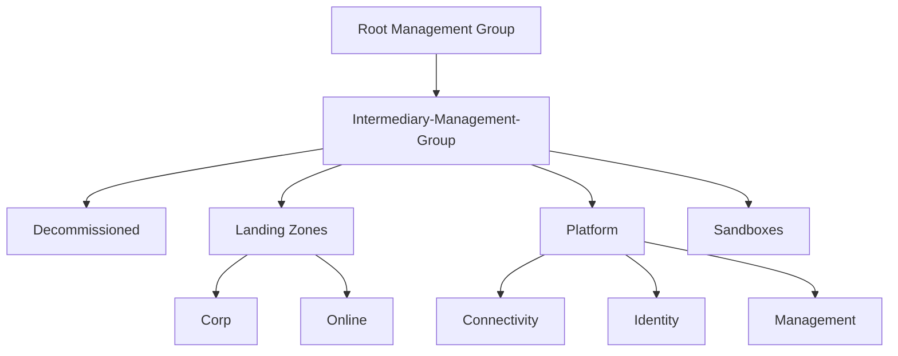
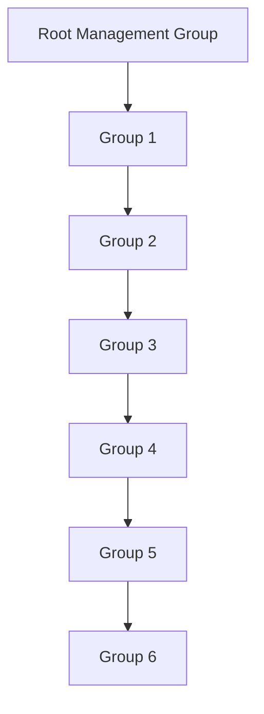
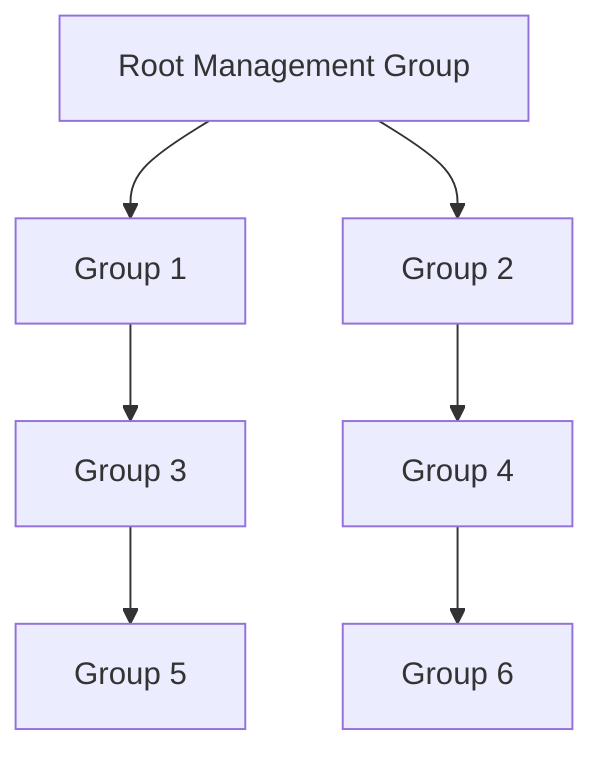
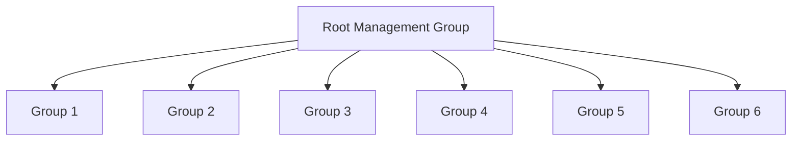
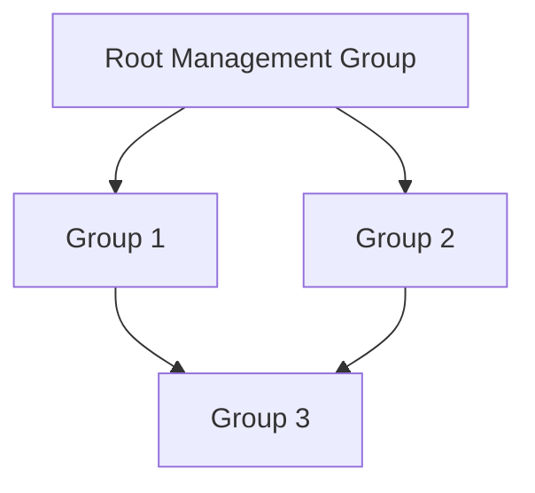
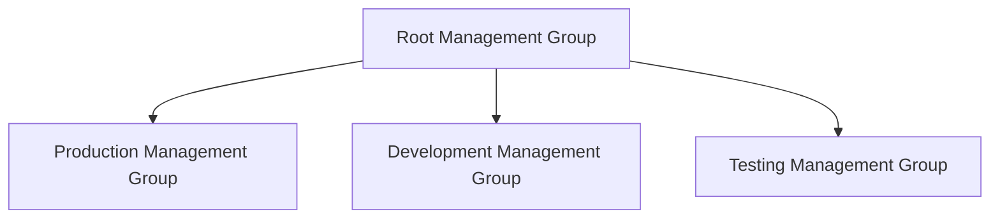

# Management Groups 

## What are Management Groups?

Management Groups are a way to manage access, policies, and compliance for multiple subscriptions. They provide a way to manage access, policies, and compliance for multiple subscriptions. Management groups are containers that help you manage access, policy, and compliance for multiple subscriptions. You organize subscriptions into containers called "management groups" and apply your governance conditions to the management groups. All subscriptions within a management group automatically inherit the conditions applied to the management group.

## Management Groups Hierarchy

The management group hierarchy is a level of management groups that represent the different levels of your organization. The hierarchy starts with a single root management group, which represents the Microsoft Entra ID tenant. The root management group is the highest level in the hierarchy. All other management groups are subgroups of the root management group.

## Management group design considerations

When designing your management group hierarchy, consider the following:

- How does your organization differentiate services that are managed or run by particular teams?

- Are there any specific operations that need to be isolated due to business or regulatory compliance requirements?

- Management groups can be utilized to consolidate policy and initiative assignments through Azure Policy.

- A management group hierarchy can accommodate up to six nested levels. The tenant root level and the subscription level are not included in this count.

- Any principal, be it a user or service principal, within a Microsoft Entra tenant has the authority to establish new management groups. This is due to the fact that Azure role-based access control (RBAC) authorization for managing group activities is not activated by default. For additional details, refer to the guide on safeguarding your resource hierarchy.

- By default, all newly created subscriptions will be assigned to the tenant root management group.

## Management group recommendations

- Maintain a relatively flat management group hierarchy, ideally with three to four levels maximum. This practice minimizes managerial complexity and overhead.

- Refrain from mirroring your organizational structure into a deeply nested management group hierarchy. Utilize management groups primarily for policy assignment rather than billing. This strategy aligns with the Azure landing zone conceptual architecture, which applies Azure policies to workloads that need similar security and compliance at the same management group level.

- Establish management groups under your root-level group representing different types of workloads you will host. These groups should reflect the security, compliance, connectivity, and feature requirements of the workloads. By doing this, you can apply a set of Azure policies at the management group level for all workloads with similar needs.

- Leverage resource tags for querying and horizontally traversing across the management group hierarchy. Resource tags, enforced or appended via Azure Policy, allow you to group resources for search purposes without relying on a complex management group hierarchy.

- Set up a top-level sandbox management group. This allows users to immediately experiment with Azure and try out resources not yet permitted in production environments. The sandbox provides isolation from your development, testing, and production settings.

- Create a platform management group beneath the root management group to support common platform policy and Azure role assignments. This ensures distinct policies can be applied to subscriptions used for your Azure foundation and centralizes billing for common resources in one foundational subscription set.

- Minimize the number of Azure Policy assignments made at the root management group scope. This reduces the debugging of inherited policies in lower-level management groups.

- Implement policies to enforce compliance requirements either at the management group or subscription scope to achieve policy-driven governance.

- Ensure only privileged users have operational access to management groups in the tenant. Enable Azure RBAC authorization in the management group [hierarchy settings](https://learn.microsoft.com/en-us/azure/governance/management-groups/how-to/protect-resource-hierarchy#setting-require-authorization) to fine-tune user privileges. By default, all users are authorized to create their own management groups under the root management group.

- Set up a default, dedicated management group for new subscriptions. This prevents any subscriptions from being placed under the root management group. This is particularly important if there are users eligible for Microsoft Developer Network (MSDN) or Visual Studio benefits and subscriptions. A sandbox management group could be a suitable candidate for this type of management group. For more information, see [Setting - default management group](https://learn.microsoft.com/en-us/azure/governance/management-groups/how-to/protect-resource-hierarchy#setting---default-management-group).

- Avoid creating management groups for production, testing, and development environments. If needed, separate these groups into different subscriptions within the same management group.

## Management Group Structure in the Enterprise Scale Landing Zone

This is the common structure for the Management Groups in the Enterprise Scale Landing Zone: 

1. **Root Management Group**
    - Intermediary-Management-Group
        - Decommissioned: This could be where resources that are being phased out or decommissioned are managed.
        - Sandboxes: This could be an area where developers can test and experiment without affecting production systems.
        - Landing Zones
            - Corp: This could represent corporate resources or applications.
            - Online: This could represent online or customer-facing applications.
        - Platform
            - Connectivity: This could manage resources related to network connectivity.
            - Identity: This could manage resources related to identity and access management.
            - Management: This could manage resources related to overall platform management.

This structure allows for clear segmentation of resources based on their purpose and lifecycle. For example, decommissioned resources are separated from active ones, and resources within the 'Platform' are further categorized based on their function (Connectivity, Identity, Management). The 'Landing Zones' group appears to separate resources based on their use case or environment (Sandbox, Corp, Online).

The exact interpretation would depend on the specific context and conventions of your organization.

## Bad Examples 

### Example 1: Deeply Nested Hierarchy

**Why it's bad:** This hierarchy is too deep. It becomes difficult to manage and increases complexity. Azure supports up to six levels of nested management groups but it's recommended to keep the hierarchy as flat as possible for simplicity.

### Example 2: Unorganized Structure

**Why it's bad:** The structure is not well-organized and doesn't follow a logical grouping or hierarchy. This can lead to confusion and difficulty in managing resources and policies.

### Example 3: Single Level Hierarchy

**Why it's bad:** Although this structure is simple, it lacks the ability to group related subscriptions together under a common management group. This makes it harder to apply consistent policies across related subscriptions.

### Example 4: Overlapping Hierarchies

**Why it's bad:** In this example, `Group 3` is a subgroup of both `Group 1` and `Group 2`. This can create confusion and potential conflicts with policy assignments. It's better to have a clear, non-overlapping hierarchy where each group is a subgroup of only one higher-level group.

### Example 5: Environment-Based Hierarchy

**Why it's bad:** This structure separates environments into different management groups, which can lead to duplication of policies and increased complexity. It's better to use subscriptions within the same management group to separate environments and apply policies accordingly.

## Good examples

:smile:

##  References

- https://learn.microsoft.com/en-us/azure/cloud-adoption-framework/ready/landing-zone/design-area/resource-org-management-groups
- https://learn.microsoft.com/en-us/azure/governance/management-groups/overview