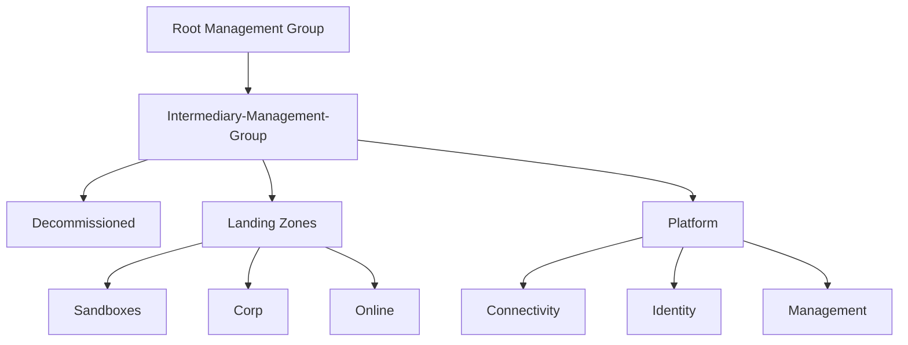

# How to create a Management Group diagram with draw.io

I nedd to create a diagram of the Management Groups in Azure, and I remembered a project that did something similar but with PowerShell: https://github.com/PowerShellToday/new-mgmgroupdiagram.

## Export your Management Group structure from Azure Portal or ask for it


If you can access the Azure Portal, you can export the Management Group structure to a CSV file. To do this, follow these steps:

1. Go to the **Azure portal**.
2. Navigate to **Management groups**.
3. Click on **Export**.
4. Save the CSV file to your local machine.

If you don't have access to the Azure Portal, you can ask your Azure administrator to export the Management Group structure for you.


The file has the following columns:

- id: The unique identifier of the Management Group or subscription.
- displayName: The name of the Management Group or subscription.
- itemType: The type of the item (Management Group or subscription).
- path: The path to the management or subscription group, its parent.
- accessLevel: Your access level.
- childSubscriptionCount: The number of child subscriptions at this level.
- totalSubscriptionCount: The total number of subscriptions.


## Create a CSV to be imported into draw.io

1. Import the CSV file to excel, rename the sheet to "Export_Portal"
2. Create a second sheet with the following columns:
    - id: reference to the id in the first sheet
    - displayName: reference to the displayName in the first sheet
    - itemType: reference to the itemType in the first sheet
    - Parent: Use the following formula to get the parent of the current item:
        ```excel
        =IF(ISERROR(FIND(","; Export_Portal!D2)); Export_Portal!D2; TRIM(RIGHT(SUBSTITUTE(Export_Portal!D2; ","; REPT(" "; LEN(Export_Portal!D2))); LEN(Export_Portal!D2))))
        ```
3. Export the second sheet to a CSV file.

## Import the CSV file into draw.io

1. Go to [draw.io](https://app.diagrams.net/) and create a new diagram.
2. Click on Arrange > Insert > Advanced > CSV.
3. Insert the header for the columns: id, displayName, itemType, Parent:

    ```csv	    
        #label: %displayName%
        #stylename: itemType
        #styles: {"Management Group": "label;image=img/lib/azure2/general/Management_Groups.svg;whiteSpace=wrap;html=1;rounded=1; fillColor=%fill%;strokeColor=#6c8ebf;fillColor=#dae8fc;points=[[0.5,0,0,0,0],[0.5,1,0,0,0]];",\
        #"Subscription": "label;image=img/lib/azure2/general/Subscriptions.svg;whiteSpace=wrap;html=1;rounded=1; fillColor=%fill%;strokeColor=#d6b656;fillColor=#fff2cc;points=[[0.5,0,0,0,0],[0.5,1,0,0,0]];imageWidth=26;"}
        #
        #
        #namespace: csvimport-
        #
        #connect: {"from": "ParentId", "to": "displayName", "invert": true, "style": "curved=1;endArrow=blockThin;endFill=1;fontSize=11;edgeStyle=orthogonalEdgeStyle;"}
        #
        ## Node width and height, and padding for autosize
        #width: auto
        #height: auto
        #padding: -12
        #
        ## ignore: id,image,fill,stroke,refs,manager
        #
        ## Column to be renamed to link attribute (used as link).
        ## link: url
        #
        ## Spacing between nodes, heirarchical levels and parallel connections.
        #nodespacing: 40
        #levelspacing: 100
        #edgespacing: 40
        #
        ## layout: auto
        #layout: verticaltree
        #
        ## ---- CSV below this line. First line are column names. ----
        ```	
4. Paste the content of the CSV file.
5. Click on Import.

You should see a diagram with the Management Groups and Subscriptions.


For example:


This is the common structure for the Management Groups in the Enterprise Scale Landing Zone, now Accelerator Landing Zone: 



And this is the CSV file to import into draw.io:


```csv	
#label: %displayName%
#stylename: itemType
#styles: {"Management Group": "label;image=img/lib/azure2/general/Management_Groups.svg;whiteSpace=wrap;html=1;rounded=1; fillColor=%fill%;strokeColor=#6c8ebf;fillColor=#dae8fc;points=[[0.5,0,0,0,0],[0.5,1,0,0,0]];",\
#"Subscription": "label;image=img/lib/azure2/general/Subscriptions.svg;whiteSpace=wrap;html=1;rounded=1; fillColor=%fill%;strokeColor=#d6b656;fillColor=#fff2cc;points=[[0.5,0,0,0,0],[0.5,1,0,0,0]];imageWidth=26;"}
#
#
#namespace: csvimport-
#
#connect: {"from": "ParentId", "to": "displayName", "invert": true, "style": "curved=1;endArrow=blockThin;endFill=1;fontSize=11;edgeStyle=orthogonalEdgeStyle;"}
#
## Node width and height, and padding for autosize
#width: auto
#height: auto
#padding: -12
#
## ignore: id,image,fill,stroke,refs,manager
#
## Column to be renamed to link attribute (used as link).
## link: url
#
## Spacing between nodes, heirarchical levels and parallel connections.
#nodespacing: 40
#levelspacing: 100
#edgespacing: 40
#
## layout: auto
#layout: verticaltree
#
## ---- CSV below this line. First line are column names. ----
id,displayName,itemType,ParentId
1,Tenant Root Group,Management Group,
2,Intermediary Management Group,Management Group,Tenant Root Group
3,Decommissioned,Management Group,Intermediary Management Group
4,Landing Zones,Management Group,Intermediary Management Group
5,Platform,Management Group,Intermediary Management Group
6,Sandboxes,Management Group,Landing Zones
7,Corp,Management Group,Landing Zones
8,Online,Management Group,Landing Zones
9,Connectivity,Management Group,Platform
10,Identity,Management Group,Platform
11,Management,Management Group,Platform
12,subcr-1,Subscription,Decommissioned
13,subcr-2,Subscription,Sandboxes
14,subcr-3,Subscription,Corp
15,subcr-4,Subscription,Online
16,subcr-5,Subscription,Connectivity
17,subcr-6,Subscription,Identity
18,subcr-7,Subscription,Management
```

## Make your diagram animated and interactive

You can make your diagram animated and interactive by following these steps:

1. File > Export as > URL
2. Add &p=ex after the first ? in the URL.


For example, the URL should look like this:

```url
https://viewer.diagrams.net/?&p=ex?tags=%7B%7D&highlight=0000ff&edit=_blank&layers=1&nav=1&title=MGs.drawio#R7Zxbc5s4FMc%2FjR%2BbAQkEPK7dJHWn3XbW6exMX3ZkkLFakDxCvvXTr7jFxrZi1k0Wg5lxYnR0QfqfHxqOBB7AUbx5FHgx%2F8wDEg2AEWwG8P0AAGAgQ32llm1uMU0X5pZQ0KCw7QwT%2BosUxqJiuKQBSSoFJeeRpIuq0eeMEV9WbFgIvq4Wm%2FGoetYFDsmRYeLj6Nj6Nw3kvBwG8nYZHwgN58WpXeDkGTEuCxcjSeY44Os9E7wfwJHgXOZH8WZEolS9Upe83oMm97ljgjB5osK3hIgv0x%2BpJsCI8FQ5Jis0AHZAk0WEt3%2FimKhU3k7Z7HBLxq7x42mcwOHy%2B0dn9PCRvIOFz%2FYrZqWfCMMsPcFf6TCA8Sj4clE0KEn8tF0UBT9jpoSKCTso9TXr%2Fjgo%2B5YNKcI%2BmStHEbHvvKoMidyWLioGN6Rx7ksah0qFiE7Vf%2FxrKUgqSkgYEVjVfNh15Z%2BsI8ldsgpV9fVcdXmyUOdWbawVzso2l3Eqm6kOVVEWkKBIpSjRKBrxiIusF3aaTNWEw0QK%2FpPssiDyXTKdqZxqFRhg4s58ZV9wymQ2VnuoPsadcsrIqPzZqsLoOc88zFOftFOpfCsiJNloIdnX8pHwmEixVUWKCpYD7goituU1nCfXO%2FqB4ea2%2BR74dmHDhc%2FC57Z3TKqDwoFlco%2FS16fW0lA7ZpKImAQUZ0PXsXkJwS9cED3WDWINnQOsTegec%2B20g2tbw%2FV74vM4pklCOVMuvRjimtdHD3RzQJezcjlJ2%2BiIZtNrB81IQ%2FMnzALKFCLGd4Vz0uPcYZyhZ57nuSWzs6Ph%2BWuE5YyLuAe5wyB7rn0eZKsdILsakCdqYp7yze9MySfn9p7bBu8nAKxwCx3rmFvUDm49DbcjLn4jsuuRvTJkLWieRxa0AlnL0CD7hUWUkR7azkBre955aGE7oDW182y2FE9XVG4vR7d6u9wz2xyzjuN05d7AAhpmx4ESo%2Be1E7wexmBtnmN1G2%2F7TPbEtp1Y00Q1wq92rH9Zul23ZDn1xTvzFK%2BT5TTxBV1IytkpUk9tbLwxr%2FtdentWAzRFNjpmdTabAf8VWc0GXz7HANAr3dPWmG5bEofpdtZydsEl7B6slvXYXgu2wKrOuZYHWsutbg8t5xZewu1utaxH9lqQPVzyajOyum2yHFnrEmT3V8t6aK8FWmRYnYFWtyWWQ2tfAu3xalmP7rWg63hOZ9DV7Yrl6KJL0K0umvXYXgu2nmd0BVtbtzOWY%2Btcgu3h2lkP7rWAa5qu2yS5Ry9ZnGayGNcKR0tSog2qjPhLsXp2IGHBH%2BmrKCo5jbj%2F82lOWW5%2BSB2ZF5pxJovXX8ysUhCSSdEgF3LOQ85wdL%2BzFoKn5V6WW3WML4VPXhhS%2BYKHxCIk8qWC1mkHChJhdQ9T7cl%2FcEZN5UH3lLfqKm83qjy8YeVRo8pbN6y806jydveUR3WVdxtVHt2w8l6jyju3q3z%2BFF5jyrvdU96pq7wmLPiflPduWHnQpPLlrwPcpPKwUeU7GMPadZVvNIZFHYxh3brKNxrDog7GsF5d5RuNYVH3YtjylY3zyjcaw6LuxbDlewfnlW80hkXdi2HLp%2BfPK99oDIu6F8Naddfn7TeKYVVy90tVWd7eD37B%2B38B#%7B%22pageId%22%3A%22w8n0-1ttzMvXkpLX30Md%22%7D
```

You can check it [here](https://viewer.diagrams.net/?&p=ex?tags=%7B%7D&highlight=0000ff&edit=_blank&layers=1&nav=1&title=MGs.drawio#R7Zxbc5s4FMc%2FjR%2BbAQkEPK7dJHWn3XbW6exMX3ZkkLFakDxCvvXTr7jFxrZi1k0Wg5lxYnR0QfqfHxqOBB7AUbx5FHgx%2F8wDEg2AEWwG8P0AAGAgQ32llm1uMU0X5pZQ0KCw7QwT%2BosUxqJiuKQBSSoFJeeRpIuq0eeMEV9WbFgIvq4Wm%2FGoetYFDsmRYeLj6Nj6Nw3kvBwG8nYZHwgN58WpXeDkGTEuCxcjSeY44Os9E7wfwJHgXOZH8WZEolS9Upe83oMm97ljgjB5osK3hIgv0x%2BpJsCI8FQ5Jis0AHZAk0WEt3%2FimKhU3k7Z7HBLxq7x42mcwOHy%2B0dn9PCRvIOFz%2FYrZqWfCMMsPcFf6TCA8Sj4clE0KEn8tF0UBT9jpoSKCTso9TXr%2Fjgo%2B5YNKcI%2BmStHEbHvvKoMidyWLioGN6Rx7ksah0qFiE7Vf%2FxrKUgqSkgYEVjVfNh15Z%2BsI8ldsgpV9fVcdXmyUOdWbawVzso2l3Eqm6kOVVEWkKBIpSjRKBrxiIusF3aaTNWEw0QK%2FpPssiDyXTKdqZxqFRhg4s58ZV9wymQ2VnuoPsadcsrIqPzZqsLoOc88zFOftFOpfCsiJNloIdnX8pHwmEixVUWKCpYD7goituU1nCfXO%2FqB4ea2%2BR74dmHDhc%2FC57Z3TKqDwoFlco%2FS16fW0lA7ZpKImAQUZ0PXsXkJwS9cED3WDWINnQOsTegec%2B20g2tbw%2FV74vM4pklCOVMuvRjimtdHD3RzQJezcjlJ2%2BiIZtNrB81IQ%2FMnzALKFCLGd4Vz0uPcYZyhZ57nuSWzs6Ph%2BWuE5YyLuAe5wyB7rn0eZKsdILsakCdqYp7yze9MySfn9p7bBu8nAKxwCx3rmFvUDm49DbcjLn4jsuuRvTJkLWieRxa0AlnL0CD7hUWUkR7azkBre955aGE7oDW182y2FE9XVG4vR7d6u9wz2xyzjuN05d7AAhpmx4ESo%2Be1E7wexmBtnmN1G2%2F7TPbEtp1Y00Q1wq92rH9Zul23ZDn1xTvzFK%2BT5TTxBV1IytkpUk9tbLwxr%2FtdentWAzRFNjpmdTabAf8VWc0GXz7HANAr3dPWmG5bEofpdtZydsEl7B6slvXYXgu2wKrOuZYHWsutbg8t5xZewu1utaxH9lqQPVzyajOyum2yHFnrEmT3V8t6aK8FWmRYnYFWtyWWQ2tfAu3xalmP7rWg63hOZ9DV7Yrl6KJL0K0umvXYXgu2nmd0BVtbtzOWY%2Btcgu3h2lkP7rWAa5qu2yS5Ry9ZnGayGNcKR0tSog2qjPhLsXp2IGHBH%2BmrKCo5jbj%2F82lOWW5%2BSB2ZF5pxJovXX8ysUhCSSdEgF3LOQ85wdL%2BzFoKn5V6WW3WML4VPXhhS%2BYKHxCIk8qWC1mkHChJhdQ9T7cl%2FcEZN5UH3lLfqKm83qjy8YeVRo8pbN6y806jydveUR3WVdxtVHt2w8l6jyju3q3z%2BFF5jyrvdU96pq7wmLPiflPduWHnQpPLlrwPcpPKwUeU7GMPadZVvNIZFHYxh3brKNxrDog7GsF5d5RuNYVH3YtjylY3zyjcaw6LuxbDlewfnlW80hkXdi2HLp%2BfPK99oDIu6F8Naddfn7TeKYVVy90tVWd7eD37B%2B38B#%7B%22pageId%22%3A%22w8n0-1ttzMvXkpLX30Md%22%7D)


References:
- [Automatically create draw.io diagrams from CSV files](https://drawio-app.com/blog/automatically-create-draw-io-diagrams-from-csv-files/)
- [Animation and Automatic Layout: Explore Complex Diagrams](https://drawio-app.com/blog/animation-and-automatic-layout-explore-complex-diagrams/)

    
    


	


