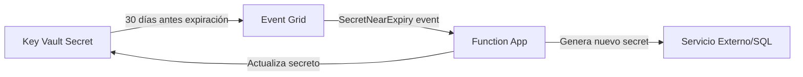

# Rotación automática de secretos en Azure Key Vault

## Resumen

Rotar secretos manualmente es error-prone y tedioso. Azure Key Vault soporta rotación automatizada mediante Event Grid + Azure Functions. Aquí te muestro cómo implementarla paso a paso.

## ¿Por qué rotar secretos?

- **Compliance**: PCI-DSS, SOC2 exigen rotación periódica
- **Seguridad**: Limita ventana de exposición si hay leak
- **Best practice**: NIST recomienda rotación cada 90 días

!!! note "Keys vs Secrets"
    - **Keys criptográficas**: Tienen rotación nativa con rotation policy
    - **Secrets** (passwords, API keys): Requieren Event Grid + Function App
    
    Este artículo cubre **secrets**. Para keys, ver [Configure key rotation](https://learn.microsoft.com/en-us/azure/key-vault/keys/how-to-configure-key-rotation).

## Arquitectura de rotación automática

Azure Key Vault usa Event Grid para notificar cuando un secreto está cerca de expirar:



**Proceso:**
1. Key Vault publica evento `SecretNearExpiry` 30 días antes de expiración
2. Event Grid llama a Function App vía HTTP POST
3. Function genera nuevo secreto y actualiza el servicio
4. Function actualiza Key Vault con nueva versión del secreto

## Implementación: Rotar SQL Server password

### 1. Crear secreto con fecha de expiración

### 1. Crear secreto con fecha de expiración

```bash
# Variables
RG="my-rg"
KV_NAME="my-keyvault"
SECRET_NAME="sql-admin-password"
SQL_SERVER="my-sql-server"

# Crear secreto con expiración 90 días
EXPIRY_DATE=$(date -u -d "+90 days" +'%Y-%m-%dT%H:%M:%SZ')

az keyvault secret set \
  --vault-name $KV_NAME \
  --name $SECRET_NAME \
  --value "InitialP@ssw0rd!" \
  --expires $EXPIRY_DATE
```

### 2. Desplegar Function App de rotación

Usar template oficial de Microsoft:

```bash
# Deploy ARM template con Function App preconfigurada
az deployment group create \
  --resource-group $RG \
  --template-uri https://raw.githubusercontent.com/Azure-Samples/KeyVault-Rotation-SQLPassword-Csharp/main/ARM-Templates/Function/azuredeploy.json \
  --parameters \
    sqlServerName=$SQL_SERVER \
    keyVaultName=$KV_NAME \
    functionAppName="${KV_NAME}-rotation-func" \
    secretName=$SECRET_NAME \
    repoUrl="https://github.com/Azure-Samples/KeyVault-Rotation-SQLPassword-Csharp.git"
```

Este template despliega:
- Function App con managed identity
- Event Grid subscription a `SecretNearExpiry`
- Access policy de Key Vault para la función
- Código de rotación preconfigura do

### 3. Código de la función (incluido en el template)

### 3. Código de la función (incluido en el template)

La función C# incluida en el template maneja:
- Recibe evento `SecretNearExpiry` de Event Grid
- Extrae nombre del secreto y versión
- Genera nuevo password aleatorio
- Actualiza SQL Server con nuevo password
- Crea nueva versión del secreto en Key Vault

```csharp
// Código simplificado (el template incluye implementación completa)
[FunctionName("AKVSQLRotation")]
public static void Run([EventGridTrigger]EventGridEvent eventGridEvent)
{
    var secretName = eventGridEvent.Subject;
    var keyVaultName = ExtractVaultName(eventGridEvent.Topic);
    
    // Rotar password
    SecretRotator.RotateSecret(log, secretName, keyVaultName);
}
```

## Implementación: Rotar Storage Account keys

Para servicios con **dos sets de credenciales** (primary/secondary keys):

```bash
# Deploy template para Storage Account rotation
az deployment group create \
  --resource-group $RG \
  --template-uri https://raw.githubusercontent.com/Azure-Samples/KeyVault-Rotation-StorageAccountKey-PowerShell/master/ARM-Templates/Function/azuredeploy.json \
  --parameters \
    storageAccountName=$STORAGE_ACCOUNT \
    keyVaultName=$KV_NAME \
    functionAppName="${KV_NAME}-storage-rotation"

# Crear secret con metadata para rotación
EXPIRY_DATE=$(date -u -d "+60 days" +'%Y-%m-%dT%H:%M:%SZ')
STORAGE_KEY=$(az storage account keys list -n $STORAGE_ACCOUNT --query "[0].value" -o tsv)

az keyvault secret set \
  --vault-name $KV_NAME \
  --name storageKey \
  --value "$STORAGE_KEY" \
  --tags CredentialId=key1 ProviderAddress="/subscriptions/{sub}/resourceGroups/$RG/providers/Microsoft.Storage/storageAccounts/$STORAGE_ACCOUNT" ValidityPeriodDays=60 \
  --expires $EXPIRY_DATE
```

**Estrategia dual-key:**
1. Key1 almacenada en Key Vault
2. Evento `SecretNearExpiry` activa rotación
3. Function regenera Key2 en Storage Account
4. Actualiza secreto en Key Vault con Key2
5. Próxima rotación alterna a Key1

## Monitoreo de rotaciones

```bash
# Ver versiones de un secreto
az keyvault secret list-versions \
  --vault-name $KV_NAME \
  --name $SECRET_NAME \
  --query "[].{Version:id, Created:attributes.created, Expires:attributes.expires}"

# Ver última actualización
az keyvault secret show \
  --vault-name $KV_NAME \
  --name $SECRET_NAME \
  --query "attributes.{Updated:updated, Expires:expires, Enabled:enabled}"

# Ver logs de rotación en Function App
az monitor app-insights query \
  --app ${KV_NAME}-rotation-func \
  --analytics-query "traces | where message contains 'Rotation' | top 10 by timestamp desc"
```

## Notificaciones por email

```bash
# Action Group para alertas
az monitor action-group create \
  --resource-group $RG \
  --name secret-rotation-alerts \
  --short-name SecRot \
  --email-receiver EmailAdmin admin@company.com

# Alert rule
az monitor metrics alert create \
  --resource-group $RG \
  --name secret-rotation-failed \
  --scopes /subscriptions/{sub-id}/resourceGroups/$RG/providers/Microsoft.KeyVault/vaults/$KV_NAME \
  --condition "count SecretRotationFailed > 0" \
  --action secret-rotation-alerts
```

## Buenas prácticas

- **Overlap period**: Mantén versión anterior válida 7-30 días
- **Testing**: Rota primero en entorno de dev/staging
- **Documentación**: Registra qué servicios usan cada secreto
- **Backup**: Exporta secretos críticos a offline storage encriptado
- **Notificaciones**: Configura alertas para rotaciones fallidas

!!! warning "Secretos hardcodeados"
    La rotación no sirve de nada si tienes secretos hardcodeados en código o config files. Usa referencias a Key Vault (`@Microsoft.KeyVault(SecretUri=...)` en App Settings).

!!! tip "Templates oficiales"
    Microsoft proporciona templates ARM completos para diferentes escenarios:
    - [SQL password rotation](https://github.com/Azure-Samples/KeyVault-Rotation-SQLPassword-Csharp)
    - [Storage Account keys rotation](https://github.com/Azure-Samples/KeyVault-Rotation-StorageAccountKey-PowerShell)
    - Adaptables para otros servicios (Cosmos DB, Redis, APIs externas)

## Referencias

- [Automate secret rotation (single credential)](https://learn.microsoft.com/en-us/azure/key-vault/secrets/tutorial-rotation)
- [Automate secret rotation (dual credentials)](https://learn.microsoft.com/en-us/azure/key-vault/secrets/tutorial-rotation-dual)
- [Understanding autorotation in Key Vault](https://learn.microsoft.com/en-us/azure/key-vault/general/autorotation)
- [Key Vault Event Grid integration](https://learn.microsoft.com/en-us/azure/key-vault/general/event-grid-overview)
