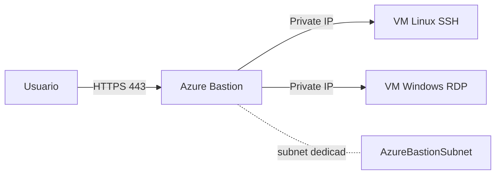

# Azure Bastion: SSH y RDP sin exponer IPs públicas

## Resumen

Azure Bastion te permite conectarte a tus VMs sin asignarles IP pública. Funciona como jump server managed que accedes desde el portal de Azure. Ideal para cumplir con políticas de seguridad estrictas.

## ¿Qué es Azure Bastion?

Azure Bastion es un servicio PaaS que despliegas en tu VNet y proporciona:

- Conectividad RDP/SSH segura sobre SSL (puerto 443)
- Sin necesidad de IP pública en las VMs
- Sin agentes ni software cliente
- Protección contra port scanning y zero-day exploits

## Arquitectura



## Despliegue básico

```bash
# Variables
RG="my-rg"
LOCATION="westeurope"
VNET_NAME="my-vnet"
BASTION_NAME="my-bastion"

# Crear subnet específica para Bastion (nombre obligatorio)
az network vnet subnet create \
  --resource-group $RG \
  --vnet-name $VNET_NAME \
  --name AzureBastionSubnet \
  --address-prefixes 10.0.255.0/26

# Crear IP pública para Bastion
az network public-ip create \
  --resource-group $RG \
  --name ${BASTION_NAME}-pip \
  --sku Standard \
  --location $LOCATION

# Crear Azure Bastion
az network bastion create \
  --resource-group $RG \
  --name $BASTION_NAME \
  --public-ip-address ${BASTION_NAME}-pip \
  --vnet-name $VNET_NAME \
  --location $LOCATION
```

!!! warning "Requisitos de subnet"
    - El subnet DEBE llamarse `AzureBastionSubnet`
    - Mínimo /26 (64 IPs)
    - No puede tener NSG restrictivo

## Conexión a VMs

### Desde el Portal

1. Ir a la VM → Connect → Bastion
2. Introducir credenciales
3. Conectar en el navegador

### Desde CLI (requiere Standard SKU)

```bash
# Conectar a VM Linux
az network bastion ssh \
  --resource-group $RG \
  --name $BASTION_NAME \
  --target-resource-id /subscriptions/{sub-id}/resourceGroups/$RG/providers/Microsoft.Compute/virtualMachines/my-linux-vm \
  --auth-type password \
  --username azureuser

# Conectar a VM Windows (requiere native client)
az network bastion rdp \
  --resource-group $RG \
  --name $BASTION_NAME \
  --target-resource-id /subscriptions/{sub-id}/resourceGroups/$RG/providers/Microsoft.Compute/virtualMachines/my-windows-vm
```

## SKUs disponibles

| SKU | Características | Precio aprox. |
|-----|----------------|---------------|
| **Basic** | RDP/SSH desde portal | ~140€/mes |
| **Standard** | + CLI access, file copy, IP-based connection | ~140€/mes + instancias |
| **Premium** | + Kerberos auth, session recording | En preview |

## Standard SKU: Funcionalidades avanzadas

```bash
# Actualizar a Standard SKU y habilitar features
az network bastion update \
  --resource-group $RG \
  --name $BASTION_NAME \
  --sku Standard \
  --enable-tunneling true \
  --enable-ip-connect true

# Escalar instancias (2-50) para alta disponibilidad
az network bastion update \
  --resource-group $RG \
  --name $BASTION_NAME \
  --scale-units 3
```

**Nuevas capacidades con Standard:**
- **Native client support**: Conectar con tu cliente SSH/RDP local vía `az network bastion`
- **IP-based connection**: Conectar a cualquier IP dentro de la VNet
- **File transfer**: Upload/download archivos vía tunnel
- **Tunneling**: Crear túneles SSH para port forwarding
- **Shareable link**: Generar URLs para acceso temporal (requiere Premium)

## Copiar archivos (Standard SKU con tunneling)

```bash
# Crear tunnel SSH para file transfer
az network bastion tunnel \
  --resource-group $RG \
  --name $BASTION_NAME \
  --target-resource-id /subscriptions/{sub}/resourceGroups/$RG/providers/Microsoft.Compute/virtualMachines/my-vm \
  --resource-port 22 \
  --port 2222

# En otra terminal: upload archivo
scp -P 2222 local-file.txt azureuser@localhost:/home/azureuser/

# Download archivo
scp -P 2222 azureuser@localhost:/home/azureuser/remote-file.txt ./
```

**Tunnel para RDP:**
```bash
# Crear tunnel RDP (puerto 3389)
az network bastion tunnel \
  --resource-group $RG \
  --name $BASTION_NAME \
  --target-resource-id /subscriptions/{sub}/resourceGroups/$RG/providers/Microsoft.Compute/virtualMachines/my-windows-vm \
  --resource-port 3389 \
  --port 13389

# Conectar con cliente RDP local a localhost:13389
mstsc /v:localhost:13389
```

## Monitoreo

```bash
# Ver métricas de sesiones
az monitor metrics list \
  --resource /subscriptions/{sub-id}/resourceGroups/$RG/providers/Microsoft.Network/bastionHosts/$BASTION_NAME \
  --metric "Sessions"

# Diagnostic logs
az monitor diagnostic-settings create \
  --resource /subscriptions/{sub-id}/resourceGroups/$RG/providers/Microsoft.Network/bastionHosts/$BASTION_NAME \
  --name bastion-logs \
  --workspace /subscriptions/{sub-id}/resourceGroups/$RG/providers/Microsoft.OperationalInsights/workspaces/my-law \
  --logs '[{"category": "BastionAuditLogs", "enabled": true}]'
```

## Buenas prácticas

- **NSG en subnets de VMs**: Permite solo tráfico desde AzureBastionSubnet
- **JIT Access**: Combina con Microsoft Defender for Cloud JIT
- **Session recording**: Habilita en Premium SKU para compliance
- **Firewall rules**: Bastion necesita acceso saliente a Internet (servicios Azure)
- **Disaster recovery**: Despliega Bastion en múltiples regiones

## Restricciones de red (NSG)

El subnet `AzureBastionSubnet` requiere reglas NSG específicas:

```bash
# Crear NSG para AzureBastionSubnet
az network nsg create \
  --resource-group $RG \
  --name ${BASTION_NAME}-nsg

# Inbound: HTTPS desde Internet
az network nsg rule create \
  --resource-group $RG \
  --nsg-name ${BASTION_NAME}-nsg \
  --name AllowHttpsInbound \
  --priority 100 \
  --source-address-prefixes Internet \
  --destination-port-ranges 443 \
  --protocol Tcp \
  --access Allow \
  --direction Inbound

# Inbound: GatewayManager
az network nsg rule create \
  --resource-group $RG \
  --nsg-name ${BASTION_NAME}-nsg \
  --name AllowGatewayManager \
  --priority 110 \
  --source-address-prefixes GatewayManager \
  --destination-port-ranges 443 \
  --protocol Tcp \
  --access Allow \
  --direction Inbound

# Inbound: Bastion internal communication
az network nsg rule create \
  --resource-group $RG \
  --nsg-name ${BASTION_NAME}-nsg \
  --name AllowBastionHostCommunication \
  --priority 120 \
  --source-address-prefixes VirtualNetwork \
  --destination-port-ranges 8080 5701 \
  --protocol Tcp \
  --access Allow \
  --direction Inbound

# Outbound: SSH/RDP a VMs
az network nsg rule create \
  --resource-group $RG \
  --nsg-name ${BASTION_NAME}-nsg \
  --name AllowSshRdpOutbound \
  --priority 100 \
  --destination-address-prefixes VirtualNetwork \
  --destination-port-ranges 22 3389 \
  --protocol Tcp \
  --access Allow \
  --direction Outbound

# Outbound: Azure Cloud (servicios de Azure)
az network nsg rule create \
  --resource-group $RG \
  --nsg-name ${BASTION_NAME}-nsg \
  --name AllowAzureCloudOutbound \
  --priority 110 \
  --destination-address-prefixes AzureCloud \
  --destination-port-ranges 443 \
  --protocol Tcp \
  --access Allow \
  --direction Outbound

# Asociar NSG al subnet
az network vnet subnet update \
  --resource-group $RG \
  --vnet-name $VNET_NAME \
  --name AzureBastionSubnet \
  --network-security-group ${BASTION_NAME}-nsg
```

## Costos

Ejemplo en West Europe:
- Basic: ~€140/mes (fijo)
- Standard: ~€140/mes + ~€9/instancia adicional/mes
- Tráfico outbound: Estándar Azure

!!! tip "Ahorro"
    Si solo necesitas acceso ocasional, considera apagar/encender Bastion. Pagas solo por las horas que está running.

## Alternativas

- **Azure VPN Gateway**: Para acceso permanente desde on-premises
- **Azure Virtual WAN**: Para topologías hub-spoke complejas
- **Just-in-Time Access**: Para exposición temporal de puertos

## Referencias

- [What is Azure Bastion?](https://learn.microsoft.com/en-us/azure/bastion/bastion-overview)
- [Azure Bastion configuration settings](https://learn.microsoft.com/en-us/azure/bastion/configuration-settings)
