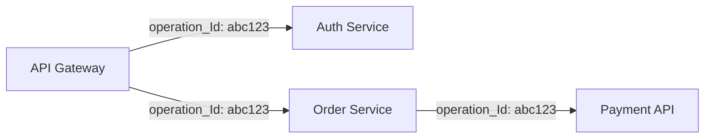

# Application Insights: Instrumentación completa en 10 minutos

## Resumen

Application Insights te da observability completa de tu aplicación: traces, metrics, logs y dependencies. Voy al grano: aquí está el setup mínimo para .NET, Python y Node.js.

## ¿Qué es Application Insights?

Application Insights es el APM (Application Performance Monitoring) nativo de Azure. Captura automáticamente:

- **Requests**: HTTP requests con duración y status code
- **Dependencies**: Llamadas a DBs, APIs externas, Redis, etc.
- **Exceptions**: Stack traces completos
- **Custom events**: Lo que tú quieras trackear
- **User telemetry**: Sessions, page views, user flows

## Crear recurso

```bash
# Variables
RG="my-rg"
LOCATION="westeurope"
APPINSIGHTS_NAME="my-appinsights"

# Crear Log Analytics Workspace (requerido)
az monitor log-analytics workspace create \
  --resource-group $RG \
  --workspace-name my-workspace \
  --location $LOCATION

WORKSPACE_ID=$(az monitor log-analytics workspace show \
  --resource-group $RG \
  --workspace-name my-workspace \
  --query id -o tsv)

# Crear Application Insights
az monitor app-insights component create \
  --app $APPINSIGHTS_NAME \
  --location $LOCATION \
  --resource-group $RG \
  --workspace $WORKSPACE_ID
```

## Obtener connection string

```bash
# Connection string (nuevo método recomendado)
CONN_STRING=$(az monitor app-insights component show \
  --resource-group $RG \
  --app $APPINSIGHTS_NAME \
  --query connectionString -o tsv)

echo $CONN_STRING
# InstrumentationKey=abc-123;IngestionEndpoint=https://westeurope-5.in.applicationinsights.azure.com/
```

## Instrumentación por lenguaje

### .NET 6+

```bash
# Instalar paquete NuGet
dotnet add package Microsoft.ApplicationInsights.AspNetCore
```

`Program.cs`:

```csharp
var builder = WebApplication.CreateBuilder(args);

// Añadir Application Insights
builder.Services.AddApplicationInsightsTelemetry(options =>
{
    options.ConnectionString = builder.Configuration["ApplicationInsights:ConnectionString"];
});

var app = builder.Build();
```

`appsettings.json`:

```json
{
  "ApplicationInsights": {
    "ConnectionString": "InstrumentationKey=abc-123;..."
  }
}
```

### Python (Flask/FastAPI)

```bash
# Instalar SDK
pip install opencensus-ext-azure
pip install opencensus-ext-flask  # O opencensus-ext-fastapi
```

```python
from flask import Flask
from opencensus.ext.azure.log_exporter import AzureLogHandler
from opencensus.ext.flask.flask_middleware import FlaskMiddleware
import logging

app = Flask(__name__)

# Middleware para auto-instrumentación
middleware = FlaskMiddleware(
    app,
    exporter=AzureLogHandler(
        connection_string='InstrumentationKey=abc-123;...'
    )
)

# Logger
logger = logging.getLogger(__name__)
logger.addHandler(AzureLogHandler(
    connection_string='InstrumentationKey=abc-123;...'
))

@app.route('/')
def hello():
    logger.info('Home page accessed')
    return 'Hello World'
```

### Node.js

```bash
# Instalar SDK
npm install applicationinsights
```

```javascript
const appInsights = require('applicationinsights');

appInsights.setup('InstrumentationKey=abc-123;...')
    .setAutoDependencyCorrelation(true)
    .setAutoCollectRequests(true)
    .setAutoCollectPerformance(true)
    .setAutoCollectExceptions(true)
    .setAutoCollectDependencies(true)
    .setAutoCollectConsole(true)
    .start();

// Tu código Express
const express = require('express');
const app = express();

app.get('/', (req, res) => {
    appInsights.defaultClient.trackEvent({name: 'HomePage'});
    res.send('Hello World');
});
```

## Custom telemetry

### Tracking personalizado

```csharp
// .NET
using Microsoft.ApplicationInsights;

private readonly TelemetryClient _telemetry;

public MyService(TelemetryClient telemetry)
{
    _telemetry = telemetry;
}

public void ProcessOrder(Order order)
{
    // Track evento
    _telemetry.TrackEvent("OrderProcessed", new Dictionary<string, string>
    {
        {"OrderId", order.Id},
        {"Amount", order.Total.ToString()}
    });
    
    // Track métrica
    _telemetry.TrackMetric("OrderValue", order.Total);
    
    // Track trace (log)
    _telemetry.TrackTrace($"Processing order {order.Id}", SeverityLevel.Information);
}
```

```python
# Python
from opencensus.trace import tracer as tracer_module
from opencensus.ext.azure.trace_exporter import AzureExporter

tracer = tracer_module.Tracer(
    exporter=AzureExporter(connection_string='...'),
)

with tracer.span(name='ProcessOrder'):
    # Tu lógica
    tracer.add_attribute_to_current_span('orderId', order_id)
    tracer.add_attribute_to_current_span('amount', amount)
```

## Queries útiles en Log Analytics

```kusto
// Requests más lentos (P95)
requests
| where timestamp > ago(1h)
| summarize percentile(duration, 95) by name
| order by percentile_duration_95 desc

// Excepciones por tipo
exceptions
| where timestamp > ago(24h)
| summarize count() by type, outerMessage
| order by count_ desc

// Dependency calls fallando
dependencies
| where success == false
| where timestamp > ago(1h)
| summarize count() by name, resultCode

// User journey (funnels)
customEvents
| where timestamp > ago(7d)
| where name in ('PageView', 'AddToCart', 'Checkout', 'Purchase')
| summarize count() by name
```

## Alertas automatizadas

```bash
# Alert para tasa de errores > 5%
az monitor metrics alert create \
  --name high-error-rate \
  --resource-group $RG \
  --scopes /subscriptions/{sub-id}/resourceGroups/$RG/providers/Microsoft.Insights/components/$APPINSIGHTS_NAME \
  --condition "avg requests/failed > 5" \
  --window-size 5m \
  --evaluation-frequency 1m \
  --action /subscriptions/{sub-id}/resourceGroups/$RG/providers/Microsoft.Insights/actionGroups/ops-team
```

## Live Metrics Stream

Para debugging en tiempo real:

1. Portal Azure → Application Insights → Live Metrics
2. Ver requests, dependencies, exceptions en vivo
3. Aplicar filtros por server, cloud role, etc.

## Sampling para reducir costos

```csharp
// .NET - adaptive sampling (recomendado)
builder.Services.AddApplicationInsightsTelemetry(options =>
{
    options.EnableAdaptiveSampling = true;
    options.ConnectionString = connectionString;
});

// Fixed sampling (5% de telemetría)
builder.Services.AddApplicationInsightsTelemetryProcessor<AdaptiveSamplingTelemetryProcessor>(p =>
{
    p.SamplingPercentage = 5;
});
```

!!! warning "Costos"
    Application Insights cobra por GB ingestado:
    - Primeros 5 GB/mes: gratis
    - >5 GB: ~€2/GB
    
    Con sampling al 10%, una app con 1M requests/día → ~15GB/mes → €20/mes

## Distributed tracing

Para microservicios, Application Insights correlaciona automáticamente:



Query cross-service:

```kusto
// Trace completo de una operación
union requests, dependencies
| where operation_Id == 'abc123'
| project timestamp, itemType, name, duration, success
| order by timestamp asc
```

## Buenas prácticas

- **No loguees PII**: Filtra datos sensibles antes de enviar
- **Usa sampling en producción**: 10-20% es suficiente
- **Custom dimensions**: Añade tenant_id, user_role para segmentar
- **Dependency tracking**: Verifica que captura SQL, Redis, HTTP
- **Availability tests**: Configura pings cada 5 minutos desde múltiples regiones

## Referencias

- [What is Application Insights?](https://learn.microsoft.com/en-us/azure/azure-monitor/app/app-insights-overview)
- [Application Insights SDKs](https://learn.microsoft.com/en-us/azure/azure-monitor/app/platforms)
