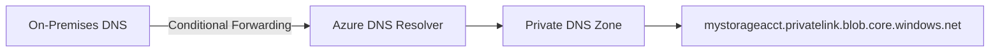

# Azure Private DNS Zones: Resolución de nombres en VNets

## Resumen

Private DNS Zones te permite usar nombres DNS personalizados dentro de tus VNets sin exponer nada a Internet. Esencial para arquitecturas privadas y hybrid cloud.

## ¿Qué es Private DNS Zone?

Es un servicio DNS que solo resuelve dentro de VNets enlazadas. Casos de uso:

- Nombres personalizados para VMs privadas (`db01.internal.company.com`)
- Private Endpoints de servicios PaaS (`mystorageacct.privatelink.blob.core.windows.net`)
- Integración con on-premises DNS (conditional forwarding)
- Split-horizon DNS (nombre público vs privado)

## Crear Private DNS Zone

```bash
# Variables
RG="my-rg"
ZONE_NAME="internal.company.com"
VNET_NAME="my-vnet"

# Crear Private DNS Zone
az network private-dns zone create \
  --resource-group $RG \
  --name $ZONE_NAME

# Enlazar a VNet (Virtual Network Link)
az network private-dns link vnet create \
  --resource-group $RG \
  --zone-name $ZONE_NAME \
  --name ${VNET_NAME}-link \
  --virtual-network $VNET_NAME \
  --registration-enabled false
```

!!! note "Auto-registration"
    Si `--registration-enabled true`, Azure crea automáticamente records A/AAAA cuando despliegas VMs en la VNet.

## Añadir registros DNS

```bash
# Record A (IPv4)
az network private-dns record-set a add-record \
  --resource-group $RG \
  --zone-name $ZONE_NAME \
  --record-set-name db01 \
  --ipv4-address 10.0.1.10

# Record CNAME
az network private-dns record-set cname set-record \
  --resource-group $RG \
  --zone-name $ZONE_NAME \
  --record-set-name www \
  --cname db01.internal.company.com

# Record TXT (verificación de dominio)
az network private-dns record-set txt add-record \
  --resource-group $RG \
  --zone-name $ZONE_NAME \
  --record-set-name _verification \
  --value "verification-token-12345"
```

## Auto-registration de VMs

```bash
# Crear zona con auto-registration
az network private-dns zone create \
  --resource-group $RG \
  --name auto.internal.com

# Link con auto-registration habilitado
az network private-dns link vnet create \
  --resource-group $RG \
  --zone-name auto.internal.com \
  --name auto-vnet-link \
  --virtual-network $VNET_NAME \
  --registration-enabled true

# Crear VM - se auto-registra
az vm create \
  --resource-group $RG \
  --name myvm01 \
  --vnet-name $VNET_NAME \
  --subnet default \
  --image Ubuntu2204 \
  --admin-username azureuser
```

La VM se registra automáticamente como `myvm01.auto.internal.com` apuntando a su IP privada.

## Private Endpoints con DNS

Cuando creas un Private Endpoint para Azure Storage, SQL, etc., necesitas Private DNS Zone para resolución:

```bash
# Crear Storage Account
STORAGE_ACCOUNT="mystorageacct$(date +%s)"
az storage account create \
  --name $STORAGE_ACCOUNT \
  --resource-group $RG \
  --sku Standard_LRS \
  --public-network-access Disabled

# Crear Private DNS Zone para Blob
az network private-dns zone create \
  --resource-group $RG \
  --name privatelink.blob.core.windows.net

# Link a VNet
az network private-dns link vnet create \
  --resource-group $RG \
  --zone-name privatelink.blob.core.windows.net \
  --name blob-dns-link \
  --virtual-network $VNET_NAME \
  --registration-enabled false

# Crear Private Endpoint
az network private-endpoint create \
  --resource-group $RG \
  --name ${STORAGE_ACCOUNT}-pe \
  --vnet-name $VNET_NAME \
  --subnet default \
  --private-connection-resource-id $(az storage account show --name $STORAGE_ACCOUNT --resource-group $RG --query id -o tsv) \
  --group-id blob \
  --connection-name blob-connection

# Crear DNS record automáticamente
az network private-endpoint dns-zone-group create \
  --resource-group $RG \
  --endpoint-name ${STORAGE_ACCOUNT}-pe \
  --name blob-dns-group \
  --private-dns-zone privatelink.blob.core.windows.net \
  --zone-name blob
```

Ahora desde la VNet:
```bash
nslookup mystorageacct.blob.core.windows.net
# Resuelve a IP privada 10.0.1.5
```

## DNS Forwarding para hybrid cloud

Para que on-premises resuelva nombres de Private DNS Zone:



**Paso 1: Crear DNS Private Resolver**

```bash
# Crear subnet para resolver
az network vnet subnet create \
  --resource-group $RG \
  --vnet-name $VNET_NAME \
  --name dns-resolver-inbound \
  --address-prefixes 10.0.255.0/28

# Crear DNS Private Resolver
az dns-resolver create \
  --resource-group $RG \
  --name my-dns-resolver \
  --location westeurope \
  --id /subscriptions/{sub-id}/resourceGroups/$RG/providers/Microsoft.Network/virtualNetworks/$VNET_NAME

# Crear inbound endpoint
az dns-resolver inbound-endpoint create \
  --resource-group $RG \
  --dns-resolver-name my-dns-resolver \
  --name inbound-endpoint \
  --location westeurope \
  --ip-configurations '[{"subnet":{"id":"/subscriptions/{sub-id}/resourceGroups/'$RG'/providers/Microsoft.Network/virtualNetworks/'$VNET_NAME'/subnets/dns-resolver-inbound"},"privateIpAllocationMethod":"Dynamic"}]'
```

**Paso 2: Configurar on-premises DNS**

En tu DNS on-premises (BIND, Windows DNS, etc.):

```
# Conditional Forwarder
Zone: privatelink.blob.core.windows.net
Forwarder: 10.0.255.4  # IP del inbound endpoint
```

## Listar registros

```bash
# Ver todos los record sets
az network private-dns record-set list \
  --resource-group $RG \
  --zone-name $ZONE_NAME \
  --output table

# Ver record específico
az network private-dns record-set a show \
  --resource-group $RG \
  --zone-name $ZONE_NAME \
  --name db01
```

## Troubleshooting DNS

```bash
# Desde una VM en la VNet
nslookup db01.internal.company.com

# Ver configuración DNS de la NIC
az network nic show \
  --resource-group $RG \
  --name myvm-nic \
  --query "dnsSettings"

# Probar desde VM con dig
dig db01.internal.company.com

# Flush DNS cache en Linux VM
sudo systemd-resolve --flush-caches
```

## Buenas prácticas

- **Naming convention**: Usa `.internal`, `.private` o `.local` para zonas privadas
- **Un zone por VNet**: Evita múltiples zonas con el mismo nombre
- **RBAC**: Separa permisos de DNS de permisos de red
- **Monitoring**: Habilita diagnostic logs para audit
- **Terraform**: Gestiona DNS zones como código
- **Private Endpoint DNS**: Usa DNS Zone Groups para auto-configuración

!!! warning "Limitaciones"
    - Máximo 25,000 records por zone
    - Máximo 1,000 VNet links por zone
    - No soporta DNSSEC
    - No soporta zone transfers (AXFR/IXFR)

## Costos

- **Hosted zone**: €0.45/zone/mes
- **Queries**: Primeros 1B gratis, luego €0.36/millón
- **VNet links**: €0.09/link/mes

En práctica: 1 zone + 5 VNet links = ~€0.90/mes

## Referencias

- [What is Azure Private DNS?](https://learn.microsoft.com/en-us/azure/dns/private-dns-overview)
- [Azure Private Endpoint DNS configuration](https://learn.microsoft.com/en-us/azure/private-link/private-endpoint-dns)
- [Azure DNS Private Resolver](https://learn.microsoft.com/en-us/azure/dns/dns-private-resolver-overview)
