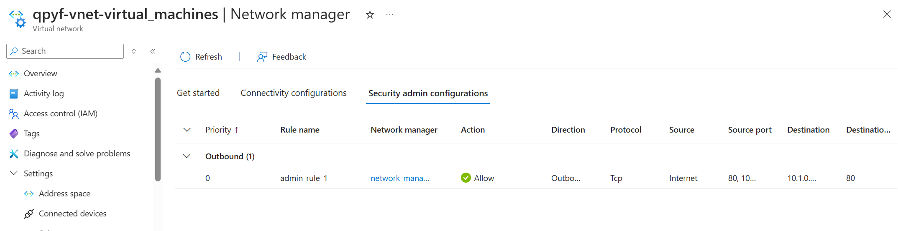
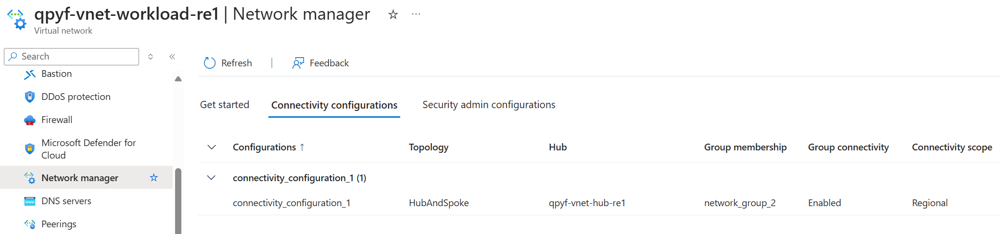

# Azure Virtual Network Manager: A Comprehensive Guide

Azure Virtual Network Manager is a powerful management service that allows you to group, configure, deploy, and manage virtual networks across subscriptions on a global scale. It provides the ability to define network groups for logical segmentation of your virtual networks. You can then establish connectivity and security configurations and apply them across all selected virtual networks in network groups simultaneously.

## How Does Azure Virtual Network Manager Work?

The functionality of Azure Virtual Network Manager revolves around a well-defined process:

1. **Scope Definition:** During the creation process, you determine the scope of what your Azure Virtual Network Manager will manage. The Network Manager only has delegated access to apply configurations within this defined scope boundary. Although you can directly define a scope on a list of subscriptions, it's recommended to use management groups for scope definition as they provide hierarchical organization to your subscriptions.

2. **Deployment of Configuration Types:** After defining the scope, you deploy configuration types including Connectivity and SecurityAdmin rules for your Virtual Network Manager.

3. **Creation of Network Group:** Post-deployment, you create a network group which acts as a logical container of networking resources for applying configurations at scale. You can manually select individual virtual networks to be added to your network group (static membership) or use Azure Policy to define conditions for dynamic group membership.

4. **Connectivity and Security Configurations:** Next, you create connectivity and/or security configurations to be applied to those network groups based on your topology and security requirements. A connectivity configuration enables you to create a mesh or a hub-and-spoke network topology, while a security configuration lets you define a collection of rules that can be applied globally to one or more network groups.

5. **Deployment of Configurations:** Once you've created your desired network groups and configurations, you can deploy the configurations to any region of your choosing.

Azure Virtual Network Manager can be deployed and managed through various platforms such as the Azure portal, Azure CLI, Azure PowerShell, or Terraform.

## Key Benefits of Azure Virtual Network Manager

- Centralized management of connectivity and security policies globally across regions and subscriptions.
- Direct connectivity between spokes in a hub-and-spoke configuration without the complexity of managing a mesh network.
- Highly scalable and highly available service with redundancy and replication across the globe.
- Ability to create network security rules that override network security group rules.
- Low latency and high bandwidth between resources in different virtual networks using virtual network peering.
- Roll out network changes through a specific region sequence and frequency of your choosing.

## Use Cases for Azure Virtual Network Manager

Azure Virtual Network Manager is a versatile tool that can be used in a variety of scenarios:

1. **Hub-and-Spoke Network Topology:** Azure Virtual Network Manager is ideal for managing hub-and-spoke network topologies where you have a central hub virtual network that connects to multiple spoke virtual networks. You can easily create and manage these configurations at scale using Azure Virtual Network Manager.

2. **Global Connectivity and Security Policies:** If you have a global presence with virtual networks deployed across multiple regions, Azure Virtual Network Manager allows you to define and apply connectivity and security policies globally, ensuring consistent network configurations across all regions.

3. **Network Segmentation and Isolation:** Azure Virtual Network Manager enables you to segment and isolate your virtual networks based on your organizational requirements. You can create network groups and apply security configurations to enforce network isolation and access control.

4. **Centralized Network Management:** For organizations with multiple subscriptions and virtual networks, Azure Virtual Network Manager provides a centralized management solution to manage network configurations, connectivity, and security policies across all subscriptions.

5. **Automated Network Configuration Deployment:** By leveraging Azure Policy and Azure Virtual Network Manager, you can automate the deployment of network configurations based on predefined conditions, ensuring consistent network configurations and compliance across your Azure environment.

## Example connectivity and security configurations forcing a Network Security Rule

In Azure Virtual Network Manager:

In Azure Virtual Network:

### Example Connectivity Configuration forcing a Hub-and-Spoke Network Topology

In Azure Virtual Network Manager:

In Azure Virtual Network:

## Preview Features

At the time of writing, Azure Virtual Network Manager has some features in preview and may not be available in all regions. Some of the preview features include:

- IP address management: allows you to manage IP addresses by creating and assigning IP address pools to your virtual networks.
- Virtual Network verifier: Enables you to check if your network policies allow or disallow traffic between your Azure network resources.

- Configurations, creation of a routing is in preview, very interesting to manage the traffic between the different networks.

## Conclusion

Azure Virtual Network Manager is a powerful service that simplifies the management of virtual networks in Azure. By providing a centralized platform to define and apply connectivity and security configurations at scale, Azure Virtual Network Manager streamlines network management tasks and ensures consistent network configurations across your Azure environment.

For up-to-date information on the regions where Azure Virtual Network Manager is available, refer to [Products available by region](https://azure.microsoft.com/en-us/explore/global-infrastructure/products-by-region/table).

