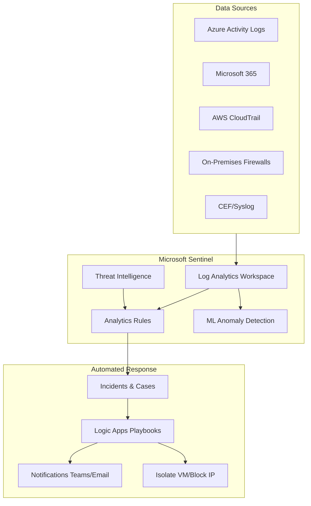

# Microsoft Sentinel: SIEM cloud-native para tu SOC

## Resumen

**Microsoft Sentinel** es el SIEM (Security Information and Event Management) cloud-native de Azure que centraliza logs, detecta amenazas y automatiza respuestas. En este post verás cómo desplegar Sentinel, conectar data sources, crear reglas de detección y automatizar playbooks con Logic Apps.

<!-- more -->

## ¿Qué es Microsoft Sentinel?

**Definición operativa:**

Microsoft Sentinel es una solución SIEM/SOAR que combina:

- **Ingesta de logs**: Desde Azure, AWS, Google Cloud, on-premises, M365, aplicaciones SaaS
- **Análisis con KQL**: Queries Kusto para correlación de eventos
- **Machine Learning**: Detección de anomalías (impossible travel, brute force, data exfiltration)
- **Threat Intelligence**: Feeds de Microsoft e integraciones de terceros
- **Automatización**: Playbooks con Azure Logic Apps para respuesta automática

**Casos de uso principales:**

- Centralizar logs de múltiples clouds y on-premises
- Detectar amenazas avanzadas (lateral movement, privilege escalation)
- Cumplir compliance (GDPR, ISO 27001, PCI-DSS) con audit trails
- Reducir MTTR (Mean Time To Respond) con playbooks automáticos

---

## Arquitectura de Sentinel



**Componentes clave:**

1. **Log Analytics Workspace**: Backend de almacenamiento (usa tablas como SecurityEvent, Syslog, AzureActivity)
2. **Data Connectors**: Integración con 100+ fuentes (Azure AD, Office 365, AWS, Palo Alto, etc.)
3. **Analytics Rules**: Queries KQL programadas para detectar patrones (scheduled/near real-time)
4. **Workbooks**: Dashboards interactivos para visualización
5. **Playbooks**: Automation con Logic Apps (respuesta a incidentes)
6. **Hunting**: Queries interactivas para investigación proactiva

---

## Despliegue paso a paso

### Paso 1: Crear Log Analytics Workspace

```bash
# Variables
RESOURCE_GROUP="rg-security"
LOCATION="westeurope"
WORKSPACE_NAME="law-sentinel-prod"

# Crear resource group
az group create \
  --name $RESOURCE_GROUP \
  --location $LOCATION

# Crear workspace (retention 90 días por defecto)
az monitor log-analytics workspace create \
  --resource-group $RESOURCE_GROUP \
  --workspace-name $WORKSPACE_NAME \
  --location $LOCATION \
  --retention-time 90 \
  --sku PerGB2018
```

**Pricing tiers:**

| Tier | Commitment | Precio/GB | Mejor para |
|------|-----------|-----------|------------|
| Pay-as-you-go | N/A | $2.76/GB | Pruebas, < 100 GB/day |
| 100 GB/day | 100 GB | $1.86/GB | Pequeñas empresas |
| 500 GB/day | 500 GB | $1.38/GB | Enterprise SOC |

### Paso 2: Habilitar Sentinel

```bash
# Desde Azure CLI (requiere extensión securityinsight)
az extension add --name securityinsight

# Habilitar Sentinel en el workspace
az sentinel onboard \
  --workspace-name $WORKSPACE_NAME \
  --resource-group $RESOURCE_GROUP
```

**Desde Portal:**

1. Portal → **Microsoft Sentinel**
2. **Add** → Seleccionar workspace creado
3. Confirmar pricing (~$2/GB ingested + $0.13/GB Log Analytics)

### Paso 3: Configurar data connectors

#### Connector: Azure Activity Logs

```bash
# Conectar subscription activity logs
SUBSCRIPTION_ID=$(az account show --query id -o tsv)
WORKSPACE_ID=$(az monitor log-analytics workspace show \
  --resource-group $RESOURCE_GROUP \
  --workspace-name $WORKSPACE_NAME \
  --query id -o tsv)

az monitor diagnostic-settings create \
  --name sentinel-activity-logs \
  --resource "/subscriptions/$SUBSCRIPTION_ID" \
  --workspace $WORKSPACE_ID \
  --logs '[{"category":"Administrative","enabled":true},{"category":"Security","enabled":true},{"category":"Alert","enabled":true}]'
```

#### Connector: Microsoft 365 (Azure AD, Exchange, SharePoint)

**Desde Portal** (requiere permisos Global Admin):

1. Sentinel → **Data connectors** → **Office 365**
2. **Open connector page**
3. Marcar: **Exchange**, **SharePoint**, **Teams**
4. **Apply Changes**

**Logs disponibles:**

- `OfficeActivity`: File access, email send/receive, Teams meetings
- `SigninLogs`: Azure AD authentication events
- `AuditLogs`: User/group changes, role assignments

#### Connector: AWS CloudTrail

```bash
# Crear S3 bucket en AWS para CloudTrail
aws s3api create-bucket \
  --bucket sentinel-cloudtrail-logs \
  --region eu-west-1

# Configurar CloudTrail
aws cloudtrail create-trail \
  --name sentinel-trail \
  --s3-bucket-name sentinel-cloudtrail-logs

# En Azure: Sentinel → Data connectors → Amazon Web Services
# Configurar SQS queue + IAM role para polling
```

#### Connector: Syslog/CEF (firewalls, proxies)

```bash
# Deploy log forwarder VM (Linux con rsyslog)
az vm create \
  --resource-group $RESOURCE_GROUP \
  --name vm-log-forwarder \
  --image UbuntuLTS \
  --size Standard_B2s \
  --admin-username azureuser \
  --generate-ssh-keys

# Instalar agente OMS
wget https://raw.githubusercontent.com/Microsoft/OMS-Agent-for-Linux/master/installer/scripts/onboard_agent.sh
sudo sh onboard_agent.sh -w <WORKSPACE_ID> -s <WORKSPACE_KEY>

# Configurar rsyslog para reenviar a Sentinel
sudo bash -c 'cat > /etc/rsyslog.d/sentinel.conf <<EOF
# Forward syslog to OMS agent
*.* @127.0.0.1:25224
EOF'

sudo systemctl restart rsyslog
```

**En firewall Palo Alto:**

```
set deviceconfig system server <AZURE_VM_IP> port 514 protocol UDP
commit
```

---

## Analytics Rules: detección de amenazas

### Ejemplo 1: Brute force en Azure AD

```kusto
// Query KQL para detectar múltiples fallos de login
SigninLogs
| where TimeGenerated > ago(1h)
| where ResultType != "0"  // 0 = success
| summarize FailedAttempts = count() by UserPrincipalName, IPAddress, bin(TimeGenerated, 5m)
| where FailedAttempts > 10
| project TimeGenerated, UserPrincipalName, IPAddress, FailedAttempts
```

**Configurar como regla programada:**

1. Sentinel → **Analytics** → **Create** → **Scheduled query rule**
2. Name: `Brute Force Attack - Azure AD`
3. Tactics: `Credential Access`
4. Severity: `Medium`
5. Query: (pegar query anterior)
6. Query scheduling: Run every **5 minutes**, lookup data from last **1 hour**
7. Alert threshold: Generate alert when results > **0**
8. Entity mapping:
   - Account: `UserPrincipalName`
   - IP: `IPAddress`

### Ejemplo 2: Impossible travel

```kusto
// Detectar logins desde ubicaciones geográficas imposibles en < 1 hora
let timeFrame = 1h;
let threshold = 500; // km
SigninLogs
| where TimeGenerated > ago(timeFrame)
| where ResultType == "0"
| project TimeGenerated, UserPrincipalName, Location, IPAddress
| extend prevLocation = prev(Location, 1), prevTime = prev(TimeGenerated, 1)
| extend distance = geo_distance_2points(
    extract("lat:([-0-9.]+)", 1, Location), 
    extract("lon:([-0-9.]+)", 1, Location),
    extract("lat:([-0-9.]+)", 1, prevLocation),
    extract("lon:([-0-9.]+)", 1, prevLocation)
  ) / 1000  // Convert to km
| extend timeGap = datetime_diff('minute', TimeGenerated, prevTime)
| where distance > threshold and timeGap < 60
| project TimeGenerated, UserPrincipalName, Location, prevLocation, distance, timeGap
```

**Configurar alerta:**

- Severity: **High**
- Tactics: `Initial Access`
- Frequency: Every **10 minutes**
- Lookup: Last **2 hours**

### Ejemplo 3: Privilegios elevados en VM

```kusto
// Detectar cuando un usuario eleva a root/admin en VM Linux
Syslog
| where TimeGenerated > ago(30m)
| where Facility == "authpriv"
| where SyslogMessage contains "sudo" or SyslogMessage contains "su root"
| where SyslogMessage contains "session opened"
| project TimeGenerated, Computer, SyslogMessage
| extend User = extract("USER=(\\w+)", 1, SyslogMessage)
| extend Command = extract("COMMAND=(.+)", 1, SyslogMessage)
| where User == "root"
```

---

## Playbooks: automatización con Logic Apps

### Playbook 1: Notificar a Teams cuando hay incidente crítico

```json
{
  "definition": {
    "$schema": "https://schema.management.azure.com/providers/Microsoft.Logic/schemas/2016-06-01/workflowdefinition.json#",
    "triggers": {
      "Microsoft_Sentinel_incident": {
        "type": "ApiConnectionWebhook",
        "inputs": {
          "host": {
            "connection": {
              "name": "@parameters('$connections')['azuresentinel']['connectionId']"
            }
          },
          "body": {
            "callback_url": "@{listCallbackUrl()}"
          },
          "path": "/incident-creation"
        }
      }
    },
    "actions": {
      "Condition_severity_high": {
        "type": "If",
        "expression": {
          "equals": [
            "@triggerBody()?['object']?['properties']?['severity']",
            "High"
          ]
        },
        "actions": {
          "Post_message_Teams": {
            "type": "ApiConnection",
            "inputs": {
              "host": {
                "connection": {
                  "name": "@parameters('$connections')['teams']['connectionId']"
                }
              },
              "method": "post",
              "body": {
                "message": "<h2>🚨 Critical Incident</h2><p><strong>Title:</strong> @{triggerBody()?['object']?['properties']?['title']}</p><p><strong>Description:</strong> @{triggerBody()?['object']?['properties']?['description']}</p><p><a href='@{triggerBody()?['object']?['properties']?['incidentUrl']}'>View in Sentinel</a></p>"
              },
              "path": "/v1.0/teams/@{encodeURIComponent('team-id')}/channels/@{encodeURIComponent('channel-id')}/messages"
            }
          }
        }
      }
    }
  }
}
```

**Deploy desde CLI:**

```bash
az logic workflow create \
  --resource-group $RESOURCE_GROUP \
  --name playbook-teams-notification \
  --definition @playbook.json
```

### Playbook 2: Aislar VM comprometida

```python
# Python script en Azure Function (trigger HTTP desde Sentinel)
import os
import azure.mgmt.network as network
from azure.identity import DefaultAzureCredential

def main(req: func.HttpRequest) -> func.HttpResponse:
    # Obtener VM ID del incidente
    vm_id = req.params.get('vmId')
    
    # Conectar a Azure
    credential = DefaultAzureCredential()
    network_client = network.NetworkManagementClient(credential, subscription_id)
    
    # Obtener NIC de la VM
    vm_name = vm_id.split('/')[-1]
    rg_name = vm_id.split('/')[4]
    
    # Aplicar NSG para bloquear todo tráfico
    nsg_params = {
        "location": "westeurope",
        "security_rules": [
            {
                "name": "DenyAllInbound",
                "protocol": "*",
                "source_address_prefix": "*",
                "destination_address_prefix": "*",
                "access": "Deny",
                "direction": "Inbound",
                "priority": 100
            },
            {
                "name": "DenyAllOutbound",
                "protocol": "*",
                "source_address_prefix": "*",
                "destination_address_prefix": "*",
                "access": "Deny",
                "direction": "Outbound",
                "priority": 100
            }
        ]
    }
    
    network_client.network_security_groups.begin_create_or_update(
        rg_name,
        f"nsg-isolated-{vm_name}",
        nsg_params
    ).result()
    
    return func.HttpResponse(f"VM {vm_name} isolated successfully")
```

---

## Threat Hunting con KQL

### Búsqueda proactiva de C2 beaconing

```kusto
// Detectar comunicación periódica sospechosa (beaconing a C&C)
let timeWindow = 24h;
let beaconThreshold = 10;
CommonSecurityLog
| where TimeGenerated > ago(timeWindow)
| where DeviceVendor == "Palo Alto Networks"
| where DeviceAction != "deny"
| summarize ConnectionCount = count() by SourceIP, DestinationIP, DestinationPort, bin(TimeGenerated, 1h)
| where ConnectionCount > beaconThreshold
| summarize TotalConnections = sum(ConnectionCount), HourlyPattern = make_list(ConnectionCount) by SourceIP, DestinationIP
| where array_length(HourlyPattern) > 12  // Conexiones en >12 horas = sospechoso
| project SourceIP, DestinationIP, TotalConnections, HourlyPattern
```

### Búsqueda de PowerShell malicioso

```kusto
SecurityEvent
| where TimeGenerated > ago(7d)
| where EventID == 4688  // Process creation
| where CommandLine contains "powershell"
| where CommandLine has_any ("-enc", "-EncodedCommand", "downloadstring", "IEX", "Invoke-Expression", "bypass")
| project TimeGenerated, Computer, Account, CommandLine
| extend DecodedCommand = base64_decode_tostring(extract("-enc ([A-Za-z0-9+/=]+)", 1, CommandLine))
```

---

## Workbooks: dashboards operativos

### Crear workbook de incidentes

1. Sentinel → **Workbooks** → **Add workbook**
2. Editar → Agregar query:

```kusto
SecurityIncident
| where TimeGenerated > ago(30d)
| summarize Count = count() by Severity, bin(TimeGenerated, 1d)
| render columnchart
```

3. Agregar gráfico de tiempo de respuesta:

```kusto
SecurityIncident
| where TimeGenerated > ago(30d)
| where Status == "Closed"
| extend MTTR = datetime_diff('minute', ClosedTime, CreatedTime)
| summarize AvgMTTR = avg(MTTR) by bin(TimeGenerated, 1d)
| render timechart
```

**Template oficial:**

Sentinel incluye workbook "Security Operations Efficiency" con métricas SOC:

- Incidents by severity/status
- MTTD (Mean Time To Detect)
- MTTR (Mean Time To Respond)
- Top users/IPs in incidents

---

## Buenas prácticas

### 1. Optimizar costes de ingesta

**Técnicas:**

- **Basic Logs**: Logs de diagnóstico de bajo valor → $0.65/GB (vs $2.76 regular)
- **Data Collection Rules**: Filtrar logs antes de ingesta
- **Archiving**: Mover logs > 90 días a Storage ($0.02/GB/month)

```bash
# Configurar Basic Logs para container logs
az monitor log-analytics workspace table update \
  --resource-group $RESOURCE_GROUP \
  --workspace-name $WORKSPACE_NAME \
  --name ContainerLog \
  --plan Basic
```

### 2. Usar MITRE ATT&CK framework

**Mapear reglas a tactics:**

- Initial Access
- Execution
- Persistence
- Privilege Escalation
- Defense Evasion
- Credential Access
- Discovery
- Lateral Movement
- Collection
- Exfiltration
- Impact

**Cobertura visual:**

Sentinel → **MITRE ATT&CK** → Ver qué técnicas están cubiertas por tus reglas

### 3. Incident response playbook

**SOP (Standard Operating Procedure):**

1. **Triage** (< 15 min): Validar si es falso positivo
2. **Investigation** (< 1 hora): Scope del impacto (cuántos usuarios/sistemas)
3. **Containment** (< 2 horas): Aislar sistemas comprometidos
4. **Eradication** (< 24 horas): Eliminar malware/backdoors
5. **Recovery**: Restaurar servicios
6. **Lessons learned**: Post-mortem y mejoras

### 4. Retention policy

**Recomendaciones por compliance:**

| Regulation | Retention | Tipo de log |
|------------|-----------|-------------|
| GDPR | 30-90 días | Personal data access |
| PCI-DSS | 1 año | Payment transactions |
| HIPAA | 6 años | Healthcare records access |
| ISO 27001 | 90 días | Security events |

```bash
# Configurar retention 1 año
az monitor log-analytics workspace update \
  --resource-group $RESOURCE_GROUP \
  --workspace-name $WORKSPACE_NAME \
  --retention-time 365
```

### 5. Integración con Azure Defender

**Automatic onboarding:**

Microsoft Defender for Cloud → **Settings** → **Integrations** → **Microsoft Sentinel** → Enable

**Beneficios:**

- Alerts de Defender aparecen automáticamente como incidentes en Sentinel
- Correlation entre vulnerabilities (Defender) y exploitation attempts (Sentinel)
- Unified SOC dashboard

---

## Checklist de implementación

- [ ] Crear Log Analytics Workspace con retention adecuado
- [ ] Habilitar Microsoft Sentinel
- [ ] Conectar data sources críticos (Azure AD, M365, Azure Activity)
- [ ] Configurar al menos 5 analytics rules (brute force, impossible travel, privilege escalation, data exfiltration, malware)
- [ ] Crear playbook para notificaciones (Teams/Email)
- [ ] Crear playbook para automatic response (isolation, block IP)
- [ ] Configurar workbook de métricas SOC
- [ ] Definir incident response SOP
- [ ] Entrenar equipo en KQL hunting queries
- [ ] Configurar archiving para logs > 90 días

---

## Alternativas y comparación

| Característica | Microsoft Sentinel | Splunk Cloud | Datadog Security |
|----------------|-------------------|--------------|------------------|
| **Pricing** | $2/GB + LAW storage | $150-200/GB | $0.20/GB analyzed |
| **ML Anomalies** | ✅ Built-in | ✅ Premium add-on | ✅ APM integration |
| **Multi-cloud** | Azure, AWS, GCP | ✅ Todos | ✅ Todos |
| **Playbooks** | Logic Apps | SOAR Premium | Workflows |
| **Query Language** | KQL | SPL | Proprietary |
| **On-prem support** | Syslog/CEF agents | Universal Forwarder | Datadog Agent |

**Cuándo elegir Sentinel:**

- Ya usas Azure como cloud principal
- Necesitas integración nativa con M365/Azure AD
- Prefieres pricing predictible (pay-per-GB vs licenses)
- Equipo SOC ya conoce KQL (usado en Azure Monitor, Defender)

---

## Recursos de aprendizaje

### Microsoft Learn paths

- [Become a Microsoft Sentinel Ninja](https://techcommunity.microsoft.com/t5/microsoft-sentinel-blog/become-a-microsoft-sentinel-ninja-the-complete-level-400/ba-p/1246310) - Nivel 400 training gratuito
- [SC-200: Microsoft Security Operations Analyst](https://learn.microsoft.com/certifications/exams/sc-200) - Certificación oficial

### KQL resources

- [KQL Quick Reference](https://learn.microsoft.com/azure/data-explorer/kql-quick-reference)
- [Must Learn KQL](https://github.com/rod-trent/MustLearnKQL) - eBook gratuito por Rod Trent

### Threat Hunting

- [Sentinel Hunting Queries GitHub](https://github.com/Azure/Azure-Sentinel/tree/master/Hunting%20Queries)
- [MITRE ATT&CK Navigator](https://mitre-attack.github.io/attack-navigator/)

---

## Referencias

- [Microsoft Sentinel Documentation](https://learn.microsoft.com/azure/sentinel/)
- [Sentinel Pricing Calculator](https://azure.microsoft.com/pricing/details/microsoft-sentinel/)
- [Azure Sentinel GitHub](https://github.com/Azure/Azure-Sentinel)
- [Sentinel Community](https://techcommunity.microsoft.com/t5/microsoft-sentinel/bd-p/MicrosoftSentinel)
