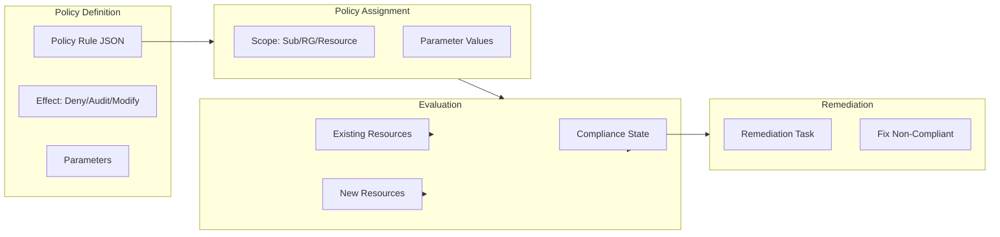

# Azure Policy: governance as code con ejemplos prácticos

## Resumen

**Azure Policy** te permite definir reglas de compliance y aplicarlas automáticamente en todas tus subscriptions. En este post verás cómo crear políticas custom, usar iniciativas (policy sets), remediar recursos no conformes y automatizar todo con Bicep/Terraform.

<!-- more -->

## ¿Qué es Azure Policy?

**Definición operativa:**

Azure Policy es un motor de evaluación que:

- **Evalúa** recursos contra reglas definidas (ej: "todas las VMs deben tener backup")
- **Enforcea** compliance (deny, audit, append, modify, deployIfNotExists)
- **Remedia** automáticamente recursos no conform es (con remediation tasks)
- **Reporta** compliance dashboards para auditorías

**Casos de uso típicos:**

- Forzar tagging obligatorio (CostCenter, Environment, Owner)
- Bloquear recursos en regiones no aprobadas
- Requerir encryption en storage accounts
- Aplicar Network Security Groups automáticamente
- Enforcar SKUs específicos (ej: solo VMs >= Standard_B2s)

---

## Arquitectura de Policy



**Conceptos clave:**

1. **Policy Definition**: La regla (JSON con condition + effect)
2. **Policy Assignment**: Aplicar policy a un scope (subscription, resource group, resource)
3. **Policy Initiative**: Conjunto de policies agrupadas (ej: "PCI-DSS Compliance")
4. **Compliance Scan**: Evaluación periódica (cada 24h) o bajo demanda
5. **Remediation Task**: Corregir recursos no conformes automáticamente

---

## Crear tu primera policy custom

### Ejemplo 1: Forzar tag "Environment"

```json
{
  "mode": "Indexed",
  "policyRule": {
    "if": {
      "field": "tags['Environment']",
      "exists": "false"
    },
    "then": {
      "effect": "deny"
    }
  },
  "parameters": {}
}
```

**Deploy con Azure CLI:**

```bash
# Crear policy definition
az policy definition create \
  --name require-environment-tag \
  --display-name "Require Environment tag on all resources" \
  --description "Denies resource creation if Environment tag is missing" \
  --rules '{
    "if": {
      "field": "tags['\''Environment'\'']",
      "exists": "false"
    },
    "then": {
      "effect": "deny"
    }
  }' \
  --mode Indexed

# Asignar a subscription
POLICY_ID=$(az policy definition show --name require-environment-tag --query id -o tsv)
az policy assignment create \
  --name require-env-tag-assignment \
  --display-name "Require Environment Tag" \
  --policy $POLICY_ID \
  --scope "/subscriptions/$(az account show --query id -o tsv)"
```

**Probar policy:**

```bash
# Intentar crear VM sin tag (debería fallar)
az vm create \
  --resource-group rg-test \
  --name vm-without-tag \
  --image UbuntuLTS \
  --size Standard_B2s

# Error esperado:
# Resource 'vm-without-tag' was disallowed by policy 'require-environment-tag'

# Crear VM con tag (debería funcionar)
az vm create \
  --resource-group rg-test \
  --name vm-with-tag \
  --image UbuntuLTS \
  --size Standard_B2s \
  --tags Environment=Production
```

### Ejemplo 2: Append tags automáticamente

```json
{
  "mode": "Indexed",
  "policyRule": {
    "if": {
      "field": "tags['CreatedDate']",
      "exists": "false"
    },
    "then": {
      "effect": "append",
      "details": [
        {
          "field": "tags['CreatedDate']",
          "value": "[utcNow()]"
        },
        {
          "field": "tags['CreatedBy']",
          "value": "[request().userPrincipalName]"
        }
      ]
    }
  }
}
```

**Uso práctico:**

Esta policy agrega automáticamente tags `CreatedDate` y `CreatedBy` a todos los recursos nuevos sin necesidad de que el usuario los especifique. Útil para auditoría.

### Ejemplo 3: DeployIfNotExists - Backup automático

```json
{
  "mode": "Indexed",
  "policyRule": {
    "if": {
      "allOf": [
        {
          "field": "type",
          "equals": "Microsoft.Compute/virtualMachines"
        },
        {
          "field": "tags['BackupRequired']",
          "equals": "true"
        }
      ]
    },
    "then": {
      "effect": "deployIfNotExists",
      "details": {
        "type": "Microsoft.RecoveryServices/backupProtectedItems",
        "roleDefinitionIds": [
          "/providers/Microsoft.Authorization/roleDefinitions/9980e02c-c2be-4d73-94e8-173b1dc7cf3c"
        ],
        "deployment": {
          "properties": {
            "mode": "incremental",
            "template": {
              "$schema": "https://schema.management.azure.com/schemas/2019-04-01/deploymentTemplate.json#",
              "contentVersion": "1.0.0.0",
              "parameters": {
                "vmName": {
                  "type": "string"
                },
                "vaultName": {
                  "type": "string"
                }
              },
              "resources": [
                {
                  "type": "Microsoft.RecoveryServices/vaults/backupFabrics/protectionContainers/protectedItems",
                  "apiVersion": "2021-07-01",
                  "name": "[concat(parameters('vaultName'), '/Azure/iaasvmcontainer;iaasvmcontainerv2;', resourceGroup().name, ';', parameters('vmName'), '/vm;iaasvmcontainerv2;', resourceGroup().name, ';', parameters('vmName'))]",
                  "properties": {
                    "protectedItemType": "Microsoft.Compute/virtualMachines",
                    "sourceResourceId": "[resourceId('Microsoft.Compute/virtualMachines', parameters('vmName'))]",
                    "policyId": "[concat('/subscriptions/', subscription().subscriptionId, '/resourceGroups/rg-backup/providers/Microsoft.RecoveryServices/vaults/', parameters('vaultName'), '/backupPolicies/DefaultPolicy')]"
                  }
                }
              ]
            },
            "parameters": {
              "vmName": {
                "value": "[field('name')]"
              },
              "vaultName": {
                "value": "vault-prod-backup"
              }
            }
          }
        }
      }
    }
  }
}
```

---

## Policy Initiatives (Policy Sets)

### Crear initiative para compliance PCI-DSS

```bash
# Definir initiative con múltiples policies
az policy set-definition create \
  --name pci-dss-compliance \
  --display-name "PCI-DSS 3.2.1 Compliance" \
  --definitions '[
    {
      "policyDefinitionId": "/providers/Microsoft.Authorization/policyDefinitions/a451c1ef-c6ca-483d-87d-f49761e3ffb5",
      "parameters": {}
    },
    {
      "policyDefinitionId": "/providers/Microsoft.Authorization/policyDefinitions/7796937f-307b-4598-941c-67d3a05ebfe7",
      "parameters": {}
    },
    {
      "policyDefinitionId": "/providers/Microsoft.Authorization/policyDefinitions/404c3081-a854-4457-ae30-26a93ef643f9",
      "parameters": {}
    }
  ]' \
  --description "Initiative containing PCI-DSS required policies"

# Asignar initiative
INITIATIVE_ID=$(az policy set-definition show --name pci-dss-compliance --query id -o tsv)
az policy assignment create \
  --name pci-compliance-assignment \
  --policy-set-definition $INITIATIVE_ID \
  --scope "/subscriptions/$(az account show --query id -o tsv)"
```

**Initiatives built-in populares:**

- **CIS Microsoft Azure Foundations Benchmark**: 100+ policies alineadas con CIS
- **NIST SP 800-53 Rev. 5**: Controles de seguridad US Government
- **ISO 27001:2013**: Estándar internacional de seguridad información
- **Azure Security Benchmark**: Baseline de seguridad recomendado por Microsoft

---

## Remediation: corregir recursos existentes

### Remediation Task manual

```bash
# Ver compliance actual
az policy state summarize \
  --policy-assignment require-env-tag-assignment

# Crear remediation task (para policies con effect=modify o deployIfNotExists)
az policy remediation create \
  --name remediate-missing-tags \
  --policy-assignment require-env-tag-assignment \
  --resource-group rg-prod

# Monitorizar progreso
az policy remediation show \
  --name remediate-missing-tags \
  --resource-group rg-prod \
  --query "{Status:provisioningState, Deployments:deploymentSummary}"
```

### Remediation automática con Azure Functions

```python
import azure.mgmt.policyinsights as policyinsights
from azure.identity import DefaultAzureCredential
import os

def remediate_non_compliant_resources():
    credential = DefaultAzureCredential()
    client = policyinsights.PolicyInsightsClient(credential)
    
    # Obtener recursos non-compliant
    non_compliant = client.policy_states.list_query_results_for_subscription(
        policy_states_resource="latest",
        subscription_id=os.environ["SUBSCRIPTION_ID"],
        filter="complianceState eq 'NonCompliant'"
    )
    
    for resource in non_compliant.value:
        print(f"Non-compliant: {resource.resource_id}")
        
        # Triggerar remediation
        client.remediations.create_or_update_at_resource(
            resource_id=resource.resource_id,
            remediation_name=f"auto-remediation-{resource.policy_assignment_id.split('/')[-1]}",
            parameters={
                "policyAssignmentId": resource.policy_assignment_id
            }
        )
```

---

## Automation con Bicep

### Template completo: Policy + Assignment + Remediation

```bicep
targetScope = 'subscription'

param policyName string = 'require-tls-storage'
param assignmentName string = 'enforce-tls-storage'

// Policy Definition
resource policyDefinition 'Microsoft.Authorization/policyDefinitions@2021-06-01' = {
  name: policyName
  properties: {
    displayName: 'Storage accounts should use TLS 1.2 minimum'
    policyType: 'Custom'
    mode: 'Indexed'
    description: 'Enforces TLS 1.2 as minimum version for storage accounts'
    parameters: {}
    policyRule: {
      if: {
        allOf: [
          {
            field: 'type'
            equals: 'Microsoft.Storage/storageAccounts'
          }
          {
            anyOf: [
              {
                field: 'Microsoft.Storage/storageAccounts/minimumTlsVersion'
                notEquals: 'TLS1_2'
              }
              {
                field: 'Microsoft.Storage/storageAccounts/minimumTlsVersion'
                exists: false
              }
            ]
          }
        ]
      }
      then: {
        effect: 'deny'
      }
    }
  }
}

// Policy Assignment
resource policyAssignment 'Microsoft.Authorization/policyAssignments@2022-06-01' = {
  name: assignmentName
  properties: {
    displayName: 'Enforce TLS 1.2 on Storage Accounts'
    policyDefinitionId: policyDefinition.id
    parameters: {}
    enforcementMode: 'Default'
  }
}

output policyId string = policyDefinition.id
output assignmentId string = policyAssignment.id
```

**Deploy:**

```bash
az deployment sub create \
  --location westeurope \
  --template-file policy.bicep \
  --parameters policyName=require-tls-storage
```

---

## Advanced: Policy as Code con GitHub Actions

### Workflow CI/CD

```yaml
name: Deploy Azure Policies

on:
  push:
    branches: [main]
    paths:
      - 'policies/**'

jobs:
  deploy-policies:
    runs-on: ubuntu-latest
    steps:
      - uses: actions/checkout@v3
      
      - name: Azure Login
        uses: azure/login@v1
        with:
          creds: ${{ secrets.AZURE_CREDENTIALS }}
      
      - name: Deploy Policy Definitions
        run: |
          for file in policies/definitions/*.json; do
            az policy definition create \
              --name $(basename $file .json) \
              --rules $file \
              --mode Indexed
          done
      
      - name: Deploy Policy Assignments
        run: |
          for file in policies/assignments/*.json; do
            POLICY_NAME=$(jq -r '.policyName' $file)
            POLICY_ID=$(az policy definition show --name $POLICY_NAME --query id -o tsv)
            
            az policy assignment create \
              --name $(basename $file .json) \
              --policy $POLICY_ID \
              --scope "/subscriptions/${{ secrets.SUBSCRIPTION_ID }}"
          done
      
      - name: Test Compliance
        run: |
          az policy state trigger-scan --no-wait
          sleep 60
          az policy state summarize --query "results[?policyAssignmentId=='']"
```

---

## Buenas prácticas

### 1. Usar parámetros en policies

```json
{
  "parameters": {
    "allowedLocations": {
      "type": "Array",
      "metadata": {
        "displayName": "Allowed locations",
        "description": "The list of locations where resources can be deployed"
      },
      "defaultValue": ["westeurope", "northeurope"]
    }
  },
  "policyRule": {
    "if": {
      "not": {
        "field": "location",
        "in": "[parameters('allowedLocations')]"
      }
    },
    "then": {
      "effect": "deny"
    }
  }
}
```

**Ventaja**: Reutilizar misma policy con diferentes valores por environment.

### 2. Test policies en modo Audit primero

```bash
# Deploy en audit mode (no bloquea, solo reporta)
az policy assignment create \
  --name test-new-policy \
  --policy $POLICY_ID \
  --enforcement-mode DoNotEnforce

# Después de validar compliance, cambiar a enforcement
az policy assignment update \
  --name test-new-policy \
  --enforcement-mode Default
```

### 3. Exclusiones (exemptions) para casos especiales

```bash
# Crear exemption para RG específico
az policy exemption create \
  --name dev-environment-exemption \
  --policy-assignment require-env-tag-assignment \
  --exemption-category Waiver \
  --expires-on 2025-12-31T23:59:59Z \
  --scope "/subscriptions/$SUB_ID/resourceGroups/rg-dev" \
  --description "Dev environment exempt from tagging policy during migration"
```

### 4. Monitorizar compliance con Azure Monitor

```kusto
// Query en Log Analytics para ver policy violations
PolicyEvent
| where TimeGenerated > ago(7d)
| where ComplianceState == "NonCompliant"
| summarize Count = count() by PolicyDefinitionName, ResourceType
| order by Count desc
```

---

## Troubleshooting común

### Policy no se aplica

**Causas:**

1. **Scope incorrecto**: Verificar que assignment está en subscription/RG correcto
2. **RBAC insuficiente**: Policy con effect=modify requiere managed identity con permisos
3. **Exclusions activas**: Verificar exemptions con `az policy exemption list`

```bash
# Debug: Ver evaluación de policy
az policy state list \
  --resource "/subscriptions/$SUB_ID/resourceGroups/rg-prod/providers/Microsoft.Compute/virtualMachines/vm-prod-01" \
  --filter "policyDefinitionName eq 'require-environment-tag'"
```

### Remediation falla

```bash
# Ver detalles del error
az policy remediation show \
  --name remediate-missing-tags \
  --resource-group rg-prod \
  --query "deploymentSummary.failedDeployments[]"
```

**Errores típicos:**

- Managed Identity sin permisos suficientes (agregar role assignment)
- Template ARM inválido en deployIfNotExists
- Timeout en deployment (incrementar timeout en policy)

---

## Recursos y learning path

### Microsoft Learn

- [Implement Azure Policy](https://learn.microsoft.com/training/modules/intro-to-azure-policy/)
- [Govern multiple Azure subscriptions by using Azure Policy](https://learn.microsoft.com/training/modules/build-cloud-governance-strategy-azure/)

### GitHub repos

- [Azure Policy Samples](https://github.com/Azure/azure-policy) - 400+ policies community-contributed
- [Enterprise Policy as Code](https://aka.ms/epac) - Framework para gestionar policies a escala

### Tools

- [Azure Policy Extension for VS Code](https://marketplace.visualstudio.com/items?itemName=AzurePolicy.azurepolicyextension)
- [PSRule for Azure](https://azure.github.io/PSRule.Rules.Azure/) - Testing policies pre-deployment

---

## Referencias

- [Azure Policy Documentation](https://learn.microsoft.com/azure/governance/policy/)
- [Policy Definition Structure](https://learn.microsoft.com/azure/governance/policy/concepts/definition-structure)
- [Policy Effects](https://learn.microsoft.com/azure/governance/policy/concepts/effects)
- [Built-in Policy Definitions](https://learn.microsoft.com/azure/governance/policy/samples/built-in-policies)
