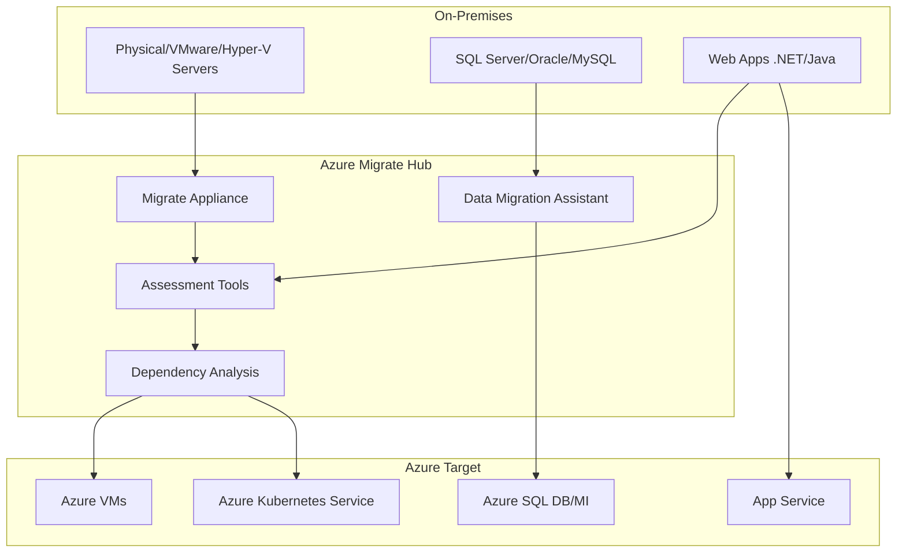

# Azure Migrate: herramientas para migrar cargas on-premises

## Resumen

**Azure Migrate** es el hub centralizado para evaluar, planificar y migrar servidores, bases de datos y aplicaciones desde on-premises, AWS o Google Cloud hacia Azure. En este post verás cómo usar Azure Migrate para discovery, dependency analysis, cost estimation y migración automatizada.

<!-- more -->

## ¿Qué es Azure Migrate?

**Definición operativa:**

Azure Migrate proporciona:

- **Discovery**: Escaneo automatizado de VMs on-prem (VMware, Hyper-V, Physical servers)
- **Assessment**: Análisis de sizing, costes proyectados y readiness
- **Dependency Analysis**: Mapeo de dependencias entre aplicaciones (agentless o agent-based)
- **Migration Tools**: Azure Migrate Server Migration, Database Migration Service, App Service Migration Assistant
- **Modernization**: Recomendaciones para containerize/refactor aplicaciones

**Casos de uso:**

- Migrar datacenter completo a Azure (lift-and-shift)
- Modernizar legacy apps a Container Apps/AKS
- Consolidar múltiples DCs regionales en Azure regions
- Salir de AWS/GCP hacia Azure

---

## Arquitectura típica de migración



**Componentes principales:**

1. **Azure Migrate Appliance**: VM on-prem que hace discovery (agentless para VMware)
2. **Assessment tools**: Analizan sizing, licensing, costes
3. **Migration tools**: Azure Site Recovery, Database Migration Service, App Service Migration
4. **Partner tools**: Carbonite, Cloudamize, Turbonomic, etc.

---

## Setup: Desplegar Migrate Appliance

### Paso 1: Crear proyecto Migrate

```bash
# Variables
RESOURCE_GROUP="rg-migrate"
PROJECT_NAME="migrate-prod-to-azure"
LOCATION="westeurope"

# Crear resource group
az group create --name $RESOURCE_GROUP --location $LOCATION

# Crear proyecto (desde portal es más fácil)
# Azure Portal → Azure Migrate → Create project
# Name: migrate-prod-to-azure
# Subscription: [tu subscription]
# Resource Group: rg-migrate
# Geography: Europe (para compliance GDPR)
```

### Paso 2: Deploy Migrate Appliance (VMware)

**Download y configuración:**

1. **Portal** → Azure Migrate → **Discover** → **Are your servers virtualized?** → **Yes, with VMware vSphere**
2. **Download OVA template** (8 GB aprox)
3. Deploy OVA en vCenter:
   - CPU: 8 vCPUs
   - RAM: 32 GB
   - Disk: 80 GB
4. Power On VM y abrir browser: `https://<appliance-ip>:44368`
5. **Register appliance:**
   - Copiar clave del portal
   - Pegar en appliance web UI
   - Login con Azure credentials

**Configurar vCenter credentials:**

```powershell
# En appliance, configurar discovery
Add-AzMigrateHyperVHost `
  -vCenterServer vcenter.company.local `
  -Credential (Get-Credential) `
  -FriendlyName "Production vCenter"
```

**Iniciar discovery:**

- Frequency: Cada 30 minutos
- Scope: Seleccionar datacenters/folders específicos o todo el vCenter

---

## Assessment: Evaluar cargas de trabajo

### Crear assessment de VMs

```bash
# Desde portal: Azure Migrate → Assessment tools → Create assessment
# O via CLI después de completar discovery:

az migrate assessment create \
  --project-name $PROJECT_NAME \
  --resource-group $RESOURCE_GROUP \
  --name assessment-prod-vms \
  --discovery-source Appliance \
  --assessment-type MachineAssessment \
  --currency EUR \
  --target-location westeurope \
  --reserved-instance RI3Year \
  --sizing-criterion PerformanceBased \
  --performance-history 1Month
```

**Parámetros clave:**

| Parámetro | Valores | Impacto |
|-----------|---------|---------|
| **Sizing criterion** | AsOnPremises / PerformanceBased | PerformanceBased ajusta por uso real CPU/RAM |
| **Comfort factor** | 1.0-2.0 | 1.3 = agregar 30% headroom |
| **Reserved Instance** | None / RI1Year / RI3Year | RI3Year reduce costes ~60% |
| **Azure Hybrid Benefit** | Yes / No | Reutiliza licencias Windows/SQL on-prem |

### Ejemplo output de assessment

**Assessment result (ejemplo):**

```
Total VMs discovered: 45
Azure ready: 38
Conditionally ready: 5 (requieren modificaciones menores)
Not ready: 2 (OS no soportado, reemplazar o modernizar)

Estimated monthly cost: €8,450
  - Compute: €6,200
  - Storage: €1,850
  - Network: €400

Recommended VM SKUs:
  - 12x Standard_D4s_v5 (workloads CPU-intensive)
  - 18x Standard_B4ms (workloads steady-state)
  - 8x Standard_E8s_v5 (memory-intensive SQL Servers)

Savings with RI3Year: €3,600/month (43%)
Savings with Azure Hybrid Benefit: €1,200/month (15%)
```

---

## Dependency Analysis

### Agentless dependency (VMware solamente)

Habilitado por defecto en appliance. Analiza network traffic sin instalar agentes.

**Ver dependencias:**

1. Portal → Azure Migrate → **Servers** → Discovered servers
2. Clic en VM → **Dependencies**
3. Visualizar mapa interactivo:
   - Verde: Conexiones activas
   - Gris: Conexiones pasadas
   - Rojo: Puertos críticos (SQL 1433, HTTP 80/443)

**Exportar para planificación:**

```bash
# Desde Azure CLI (requiere API preview)
az rest --method GET \
  --url "https://management.azure.com/subscriptions/$SUBSCRIPTION_ID/resourceGroups/$RESOURCE_GROUP/providers/Microsoft.Migrate/assessmentProjects/$PROJECT_NAME/machines?api-version=2019-10-01" \
  --query "value[].{Name:name, Dependencies:networkAdapters[].ipAddresses}" \
  --output table
```

### Agent-based dependency (Hyper-V, Physical, Multi-cloud)

**Instalar Service Map agent:**

```powershell
# En cada VM on-prem (Windows)
$WorkspaceId = "<LOG_ANALYTICS_WORKSPACE_ID>"
$WorkspaceKey = "<LOG_ANALYTICS_KEY>"

# Download e instalar MMA (Microsoft Monitoring Agent)
Invoke-WebRequest -Uri "https://go.microsoft.com/fwlink/?LinkId=828603" -OutFile "$env:TEMP\MMASetup-AMD64.exe"
Start-Process "$env:TEMP\MMASetup-AMD64.exe" -ArgumentList "/C /T:$env:TEMP\MMA" -Wait

# Instalar Dependency Agent
Invoke-WebRequest -Uri "https://aka.ms/dependencyagentwindows" -OutFile "$env:TEMP\InstallDependencyAgent-Windows.exe"
Start-Process "$env:TEMP\InstallDependencyAgent-Windows.exe" -ArgumentList "/S" -Wait
```

**Para Linux:**

```bash
wget --content-disposition https://aka.ms/dependencyagentlinux -O InstallDependencyAgent-Linux64.bin
sudo sh InstallDependencyAgent-Linux64.bin -s
```

---

## Migración: Server Migration

### Opción 1: Agentless migration (VMware)

```bash
# Replicar VM específica
az migrate machine replicate \
  --project-name $PROJECT_NAME \
  --resource-group $RESOURCE_GROUP \
  --machine-name vm-prod-web01 \
  --target-resource-group rg-prod-migrated \
  --target-vm-name vm-prod-web01-azure \
  --target-vm-size Standard_D4s_v5 \
  --target-network vnet-prod \
  --target-subnet subnet-web \
  --os-disk-type Premium_LRS
```

**Flujo de replicación:**

1. **Initial replication**: Copia completa del disco (puede tomar horas/días según tamaño)
2. **Delta sync**: Cambios incrementales cada 5 minutos
3. **Test migration**: Crear VM temporal en Azure para validar (no afecta producción)
4. **Cutover**: Apagar VM on-prem, última sync, crear VM Azure definitiva

### Opción 2: Agent-based migration (Hyper-V, Physical)

**Instalar Mobility Service:**

```powershell
# En VM on-prem
$ConfigServerIP = "10.0.0.100"  # IP del Configuration Server en Azure

# Download Mobility Service
Invoke-WebRequest `
  -Uri "https://$ConfigServerIP/MobilityService/Microsoft-ASR_UA_<version>_Windows_GA.exe" `
  -OutFile "$env:TEMP\MobilityService.exe"

# Instalar
Start-Process "$env:TEMP\MobilityService.exe" `
  -ArgumentList "/q /x:$env:TEMP\MobilityService" `
  -Wait

# Registrar con Configuration Server
cd "$env:TEMP\MobilityService"
.\UnifiedAgent.exe /Role "MS" /CSEndPoint $ConfigServerIP /PassphraseFilePath "C:\passphrase.txt"
```

---

## Migración de Bases de Datos

### SQL Server → Azure SQL Database

**Usar Data Migration Assistant (DMA):**

```powershell
# Download DMA
Invoke-WebRequest -Uri "https://aka.ms/dma-download" -OutFile "$env:TEMP\DMASetup.exe"
Start-Process "$env:TEMP\DMASetup.exe" -Wait

# Ejecutar assessment
dma.exe `
  -AssessmentName "SQL2019_to_AzureSQL" `
  -AssessmentDatabases "AdventureWorks,SalesDB" `
  -AssessmentTargetPlatform "AzureSqlDatabase" `
  -AssessmentEvaluateCompatibilityIssues `
  -AssessmentOverwriteResult `
  -AssessmentResultJson "C:\Temp\assessment.json"
```

**Migración con Database Migration Service:**

```bash
# Crear DMS instance
az dms project create \
  --resource-group $RESOURCE_GROUP \
  --service-name dms-prod-migration \
  --name sqlmigration-prod \
  --location westeurope \
  --source-platform SQL \
  --target-platform AzureSqlDatabase

# Iniciar migración
az dms project task create \
  --resource-group $RESOURCE_GROUP \
  --service-name dms-prod-migration \
  --project-name sqlmigration-prod \
  --task-name migrate-adventureworks \
  --source-connection-json @source-connection.json \
  --target-connection-json @target-connection.json \
  --database-options-json @database-options.json
```

**source-connection.json:**

```json
{
  "userName": "sa",
  "password": "<password>",
  "dataSource": "sql-onprem.company.local",
  "authentication": "SqlAuthentication",
  "encryptConnection": true,
  "trustServerCertificate": false
}
```

---

## Modernization: Containerizar aplicaciones

### App Service Migration Assistant

```powershell
# Download tool
Invoke-WebRequest `
  -Uri "https://appmigration.microsoft.com/api/download/windows/AppServiceMigrationAssistant.msi" `
  -OutFile "$env:TEMP\AppServiceMigrationAssistant.msi"

# Instalar
msiexec /i "$env:TEMP\AppServiceMigrationAssistant.msi" /quiet

# Ejecutar assessment de IIS site
AppServiceMigrationAssistant.exe `
  -SiteName "Default Web Site" `
  -OutputPath "C:\Temp\assessment.json"
```

**Resultado típico:**

```json
{
  "readiness": "Ready",
  "targetSku": "P1v3",
  "blockers": [],
  "warnings": [
    "Application uses .NET Framework 4.7.2 (supported but consider upgrading to 4.8)"
  ],
  "estimatedMonthlyCost": "€67"
}
```

### Containerizar con Draft/Buildpacks

**Para .NET app:**

```bash
# Analizar app y generar Dockerfile
cd /path/to/dotnet/app
az acr pack build \
  --registry myregistry \
  --image myapp:v1 \
  --builder paketobuildpacks/builder:base \
  .

# Deploy a Container Apps
az containerapp create \
  --name myapp \
  --resource-group rg-prod \
  --environment containerapp-env \
  --image myregistry.azurecr.io/myapp:v1 \
  --target-port 80 \
  --ingress external
```

---

## Post-Migration: Optimización

### 1. Right-sizing con Azure Advisor

```bash
az advisor recommendation list \
  --category Cost \
  --query "[?contains(resourceMetadata.resourceId, 'migrated')].{VM:impactedValue, Recommendation:shortDescription.problem, Savings:extendedProperties.savingsAmount}" \
  --output table
```

### 2. Configurar backup

```bash
# Crear Recovery Services Vault
az backup vault create \
  --resource-group rg-backup \
  --name vault-prod-backup \
  --location westeurope

# Enable backup para VMs migradas
az backup protection enable-for-vm \
  --resource-group rg-prod-migrated \
  --vault-name vault-prod-backup \
  --vm vm-prod-web01-azure \
  --policy-name DefaultPolicy
```

### 3. Monitoring con Azure Monitor

```bash
# Habilitar VM Insights
az vm extension set \
  --resource-group rg-prod-migrated \
  --vm-name vm-prod-web01-azure \
  --name DependencyAgentLinux \
  --publisher Microsoft.Azure.Monitoring.DependencyAgent
```

---

## Buenas prácticas

1. **Migrar en waves**: Empezar con dev/test, luego apps no críticas, finalmente producción crítica
2. **Mantener on-prem running** durante 30 días post-cutover (rollback plan)
3. **Test migrations**: Siempre hacer test migration antes de cutover definitivo
4. **Dependency mapping**: Migrar apps relacionadas juntas (ej: web + DB + cache)
5. **Network planning**: Configurar ExpressRoute/VPN antes de migrar para mantener conectividad
6. **Licensing**: Auditar licencias Windows/SQL para maximizar Azure Hybrid Benefit
7. **Post-migration optimization**: Revisar sizing después de 30 días con datos reales de uso

---

## Herramientas alternativas

| Tool | Use Case | Pricing |
|------|----------|---------|
| **CloudEndure** | Agent-based, multi-cloud | ~$4/server/month |
| **Carbonite Migrate** | Physical to Azure | ~$300/server one-time |
| **Zerto** | DR + Migration VMware | ~$10/VM/month |
| **Turbonomic** | Assessment + cost optimization | ~$10/VM/month |

---

## Checklist migración completa

- [ ] Discovery completo de VMs/DBs/Apps
- [ ] Assessment con sizing y cost estimation
- [ ] Dependency analysis de aplicaciones críticas
- [ ] Test migration de aplicación no crítica
- [ ] Network setup (VPN/ExpressRoute, NSGs, Azure Firewall)
- [ ] Replicación de VMs producción
- [ ] Test migration con validación funcional
- [ ] Comunicación de maintenance window
- [ ] Cutover VMs producción (apagar on-prem, última sync, start Azure)
- [ ] Validación post-migration (funcional, performance, logs)
- [ ] Configurar backup y monitoring
- [ ] Optimización sizing después de 30 días
- [ ] Decomission on-prem después de 90 días

---

## Referencias

- [Azure Migrate Documentation](https://learn.microsoft.com/azure/migrate/)
- [Server Migration Guide](https://learn.microsoft.com/azure/migrate/tutorial-migrate-vmware)
- [Database Migration Guide](https://learn.microsoft.com/azure/dms/)
- [Cloud Adoption Framework - Migrate](https://learn.microsoft.com/azure/cloud-adoption-framework/migrate/)
