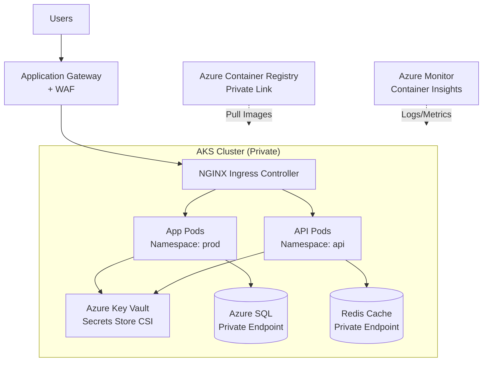

# Azure Kubernetes Service (AKS): mejores prácticas para producción

## Resumen

**AKS** simplifica Kubernetes en Azure, pero en producción necesitas configurar networking, security, scaling, monitoring y backup correctamente. En este post verás las best practices críticas para clusters AKS en producción: network policies, RBAC, private clusters, pod identities, y GitOps.

<!-- more -->

## ¿Por qué AKS en producción requiere configuración especial?

**Errores comunes en AKS:**

- **Networking público:** Pods expuestos directamente a internet
- **RBAC débil:** Usuarios con cluster-admin por defecto
- **Sin network policies:** Pods pueden comunicarse libremente (lateral movement)
- **Secrets en plain text:** API keys en ConfigMaps sin encriptar
- **Nodes sin updates:** Vulnerabilidades sin patchear
- **Sin backup:** Pérdida de datos en disaster

**Arquitectura producción:**



---

## Network security

### Private cluster

```bash
# Variables
RESOURCE_GROUP="rg-aks-prod"
CLUSTER_NAME="aks-prod"
LOCATION="westeurope"
VNET_NAME="vnet-aks"
SUBNET_AKS="subnet-aks-nodes"
SUBNET_APPGW="subnet-appgateway"

# Crear VNet
az network vnet create \
  --resource-group $RESOURCE_GROUP \
  --name $VNET_NAME \
  --address-prefix 10.0.0.0/16 \
  --subnet-name $SUBNET_AKS \
  --subnet-prefix 10.0.1.0/24

# Subnet para Application Gateway
az network vnet subnet create \
  --resource-group $RESOURCE_GROUP \
  --vnet-name $VNET_NAME \
  --name $SUBNET_APPGW \
  --address-prefix 10.0.2.0/24

# Crear AKS private cluster
az aks create \
  --resource-group $RESOURCE_GROUP \
  --name $CLUSTER_NAME \
  --location $LOCATION \
  --network-plugin azure \  # CNI para IPs nativas Azure
  --vnet-subnet-id /subscriptions/$SUB_ID/resourceGroups/$RESOURCE_GROUP/providers/Microsoft.Network/virtualNetworks/$VNET_NAME/subnets/$SUBNET_AKS \
  --enable-private-cluster \  # API server solo accesible desde VNet
  --private-dns-zone system \  # Azure gestiona DNS privado
  --docker-bridge-address 172.17.0.1/16 \
  --service-cidr 10.1.0.0/16 \
  --dns-service-ip 10.1.0.10 \
  --node-count 3 \
  --node-vm-size Standard_D4s_v3 \
  --enable-managed-identity \
  --enable-addons monitoring \  # Container Insights
  --workspace-resource-id $LOG_ANALYTICS_ID \
  --enable-cluster-autoscaler \
  --min-count 3 \
  --max-count 10
```

### Network policies (Calico)

```bash
# Habilitar network policies
az aks update \
  --resource-group $RESOURCE_GROUP \
  --name $CLUSTER_NAME \
  --network-policy calico

# Get credentials
az aks get-credentials \
  --resource-group $RESOURCE_GROUP \
  --name $CLUSTER_NAME \
  --overwrite-existing
```

**NetworkPolicy: deny all por defecto**

```yaml
# deny-all-ingress.yaml
apiVersion: networking.k8s.io/v1
kind: NetworkPolicy
metadata:
  name: deny-all-ingress
  namespace: prod
spec:
  podSelector: {}  # Aplica a todos los pods
  policyTypes:
  - Ingress
  # Sin "ingress:" = deny all
```

**NetworkPolicy: permitir solo frontend → backend**

```yaml
# allow-frontend-to-backend.yaml
apiVersion: networking.k8s.io/v1
kind: NetworkPolicy
metadata:
  name: allow-frontend-to-backend
  namespace: prod
spec:
  podSelector:
    matchLabels:
      app: backend  # Aplica a pods backend
  policyTypes:
  - Ingress
  ingress:
  - from:
    - podSelector:
        matchLabels:
          app: frontend  # Solo frontend puede conectar
    ports:
    - protocol: TCP
      port: 8080
```

```bash
kubectl apply -f deny-all-ingress.yaml
kubectl apply -f allow-frontend-to-backend.yaml
```

### Azure CNI vs Kubenet

**Azure CNI (recomendado producción):**
- ✅ Pods obtienen IPs nativas de VNet
- ✅ Mejor integración con Azure networking (NSGs, UDRs)
- ✅ Sin NAT → mejor performance
- ❌ Consume más IPs (planifica CIDR grande)

**Kubenet:**
- ✅ Ahorra IPs (pods usan IPs internas)
- ❌ Requiere UDRs manuales
- ❌ No soporta Virtual Nodes, Windows nodes

---

## Security: RBAC y Pod Identity

### Azure AD integration (Entra ID)

```bash
# Habilitar Azure AD RBAC
az aks update \
  --resource-group $RESOURCE_GROUP \
  --name $CLUSTER_NAME \
  --enable-aad \
  --aad-admin-group-object-ids $ADMIN_GROUP_ID  # Grupo Entra ID con admin
```

**Asignar roles:**

```bash
# Usuario solo puede ver (Reader)
az role assignment create \
  --assignee user@example.com \
  --role "Azure Kubernetes Service Cluster User Role" \
  --scope /subscriptions/$SUB_ID/resourceGroups/$RESOURCE_GROUP/providers/Microsoft.ContainerService/managedClusters/$CLUSTER_NAME

# Usuario con permisos admin
az role assignment create \
  --assignee admin@example.com \
  --role "Azure Kubernetes Service RBAC Cluster Admin" \
  --scope /subscriptions/$SUB_ID/resourceGroups/$RESOURCE_GROUP/providers/Microsoft.ContainerService/managedClusters/$CLUSTER_NAME
```

### Workload Identity (reemplaza Pod Identity)

```bash
# Habilitar OIDC issuer y Workload Identity
az aks update \
  --resource-group $RESOURCE_GROUP \
  --name $CLUSTER_NAME \
  --enable-oidc-issuer \
  --enable-workload-identity

# Obtener OIDC issuer URL
OIDC_ISSUER=$(az aks show --resource-group $RESOURCE_GROUP --name $CLUSTER_NAME --query "oidcIssuerProfile.issuerUrl" -o tsv)

# Crear Managed Identity
az identity create \
  --resource-group $RESOURCE_GROUP \
  --name mi-workload-storage

IDENTITY_CLIENT_ID=$(az identity show --resource-group $RESOURCE_GROUP --name mi-workload-storage --query clientId -o tsv)

# Federated credential
az identity federated-credential create \
  --name fc-aks-workload \
  --identity-name mi-workload-storage \
  --resource-group $RESOURCE_GROUP \
  --issuer $OIDC_ISSUER \
  --subject system:serviceaccount:prod:sa-storage-app \
  --audience api://AzureADTokenExchange

# Asignar permisos a storage
az role assignment create \
  --assignee $IDENTITY_CLIENT_ID \
  --role "Storage Blob Data Contributor" \
  --scope /subscriptions/$SUB_ID/resourceGroups/$RESOURCE_GROUP/providers/Microsoft.Storage/storageAccounts/stproddata
```

**ServiceAccount y Deployment:**

```yaml
# serviceaccount.yaml
apiVersion: v1
kind: ServiceAccount
metadata:
  name: sa-storage-app
  namespace: prod
  annotations:
    azure.workload.identity/client-id: "<IDENTITY_CLIENT_ID>"
---
# deployment.yaml
apiVersion: apps/v1
kind: Deployment
metadata:
  name: storage-app
  namespace: prod
spec:
  replicas: 3
  selector:
    matchLabels:
      app: storage-app
  template:
    metadata:
      labels:
        app: storage-app
        azure.workload.identity/use: "true"  # Habilita Workload Identity
    spec:
      serviceAccountName: sa-storage-app
      containers:
      - name: app
        image: acr.azurecr.io/storage-app:v1.0
        env:
        - name: AZURE_CLIENT_ID
          value: "<IDENTITY_CLIENT_ID>"
```

---

## Secrets management: Key Vault CSI driver

### Instalar Secrets Store CSI driver

```bash
# Habilitar addon
az aks enable-addons \
  --resource-group $RESOURCE_GROUP \
  --name $CLUSTER_NAME \
  --addons azure-keyvault-secrets-provider

# Verificar instalación
kubectl get pods -n kube-system -l app=secrets-store-csi-driver
kubectl get pods -n kube-system -l app=secrets-store-provider-azure
```

### Configurar SecretProviderClass

```yaml
# secretproviderclass.yaml
apiVersion: secrets-store.csi.x-k8s.io/v1
kind: SecretProviderClass
metadata:
  name: azure-kv-secrets
  namespace: prod
spec:
  provider: azure
  parameters:
    usePodIdentity: "false"
    useVMManagedIdentity: "false"
    clientID: "<WORKLOAD_IDENTITY_CLIENT_ID>"  # Workload Identity
    keyvaultName: "kv-prod-app"
    tenantId: "<TENANT_ID>"
    objects: |
      array:
        - |
          objectName: db-password
          objectType: secret
          objectVersion: ""
        - |
          objectName: api-key
          objectType: secret
          objectVersion: ""
  secretObjects:  # Opcional: crear K8s Secret desde KV
  - secretName: app-secrets
    type: Opaque
    data:
    - objectName: db-password
      key: DB_PASSWORD
    - objectName: api-key
      key: API_KEY
```

**Montar secrets en Pod:**

```yaml
# deployment-with-secrets.yaml
apiVersion: apps/v1
kind: Deployment
metadata:
  name: api-app
  namespace: prod
spec:
  replicas: 3
  selector:
    matchLabels:
      app: api-app
  template:
    metadata:
      labels:
        app: api-app
        azure.workload.identity/use: "true"
    spec:
      serviceAccountName: sa-storage-app
      containers:
      - name: api
        image: acr.azurecr.io/api-app:v1.0
        volumeMounts:
        - name: secrets-store
          mountPath: "/mnt/secrets-store"
          readOnly: true
        env:
        - name: DB_PASSWORD
          valueFrom:
            secretKeyRef:
              name: app-secrets  # K8s secret creado por CSI
              key: DB_PASSWORD
      volumes:
      - name: secrets-store
        csi:
          driver: secrets-store.csi.k8s.io
          readOnly: true
          volumeAttributes:
            secretProviderClass: "azure-kv-secrets"
```

---

## GitOps con Flux

### Instalar Flux extension

```bash
# Habilitar Flux addon
az k8s-extension create \
  --resource-group $RESOURCE_GROUP \
  --cluster-name $CLUSTER_NAME \
  --cluster-type managedClusters \
  --extension-type microsoft.flux \
  --name flux

# Crear GitRepository source
az k8s-configuration flux create \
  --resource-group $RESOURCE_GROUP \
  --cluster-name $CLUSTER_NAME \
  --cluster-type managedClusters \
  --name cluster-config \
  --namespace flux-system \
  --scope cluster \
  --url https://github.com/myorg/aks-gitops \
  --branch main \
  --kustomization name=infra path=./infrastructure prune=true \
  --kustomization name=apps path=./apps prune=true depends_on=["infra"]
```

**Estructura repo GitOps:**

```
aks-gitops/
├── infrastructure/
│   ├── namespaces.yaml
│   ├── network-policies.yaml
│   └── kustomization.yaml
└── apps/
    ├── frontend/
    │   ├── deployment.yaml
    │   ├── service.yaml
    │   └── kustomization.yaml
    └── backend/
        ├── deployment.yaml
        ├── service.yaml
        └── kustomization.yaml
```

---

## Monitoring y logging

### Container Insights queries

```kusto
// Top 10 pods con mayor CPU
ContainerInventory
| where TimeGenerated > ago(1h)
| summarize AvgCPU = avg(CpuPercent) by ContainerName, Namespace
| top 10 by AvgCPU desc

// Pods con OOMKilled (Out of Memory)
KubePodInventory
| where TimeGenerated > ago(24h)
| where ContainerStatus == "terminated"
| where ContainerStatusReason == "OOMKilled"
| project TimeGenerated, Namespace, Name, Node

// Errores en logs
ContainerLog
| where TimeGenerated > ago(1h)
| where LogEntry contains "error" or LogEntry contains "exception"
| project TimeGenerated, Namespace, Name, LogEntry
| order by TimeGenerated desc
```

### Alertas críticas

```bash
# Alerta: Pod restart loop
az monitor metrics alert create \
  --name alert-pod-restart-loop \
  --resource-group $RESOURCE_GROUP \
  --scopes $AKS_ID \
  --condition "total restartingContainerCount > 5" \
  --window-size 5m \
  --evaluation-frequency 1m \
  --action $ACTION_GROUP_ID \
  --severity 1

# Alerta: Node not ready
az monitor metrics alert create \
  --name alert-node-not-ready \
  --resource-group $RESOURCE_GROUP \
  --scopes $AKS_ID \
  --condition "avg nodesCount - avg nodeReadyCount > 0" \
  --window-size 5m \
  --action $ACTION_GROUP_ID \
  --severity 0  # Critical
```

---

## Backup y disaster recovery

### Velero backup

```bash
# Instalar Velero CLI
wget https://github.com/vmware-tanzu/velero/releases/download/v1.12.0/velero-v1.12.0-linux-amd64.tar.gz
tar -xvf velero-v1.12.0-linux-amd64.tar.gz
sudo mv velero-v1.12.0-linux-amd64/velero /usr/local/bin/

# Crear storage account para backups
STORAGE_ACCOUNT="staksbackup$RANDOM"
az storage account create \
  --resource-group $RESOURCE_GROUP \
  --name $STORAGE_ACCOUNT \
  --sku Standard_LRS

BLOB_CONTAINER="velero"
az storage container create \
  --account-name $STORAGE_ACCOUNT \
  --name $BLOB_CONTAINER

# Crear Service Principal para Velero
VELERO_SP=$(az ad sp create-for-rbac --name velero-sp --role Contributor --scopes /subscriptions/$SUB_ID/resourceGroups/$RESOURCE_GROUP)
CLIENT_ID=$(echo $VELERO_SP | jq -r .appId)
CLIENT_SECRET=$(echo $VELERO_SP | jq -r .password)

# Instalar Velero en AKS
velero install \
  --provider azure \
  --plugins velero/velero-plugin-for-microsoft-azure:v1.8.0 \
  --bucket $BLOB_CONTAINER \
  --secret-file ./credentials-velero \
  --backup-location-config resourceGroup=$RESOURCE_GROUP,storageAccount=$STORAGE_ACCOUNT \
  --snapshot-location-config apiTimeout=5m,resourceGroup=$RESOURCE_GROUP

# Backup completo
velero backup create daily-backup --include-namespaces prod,api

# Schedule diario
velero schedule create daily-backup --schedule="0 2 * * *" --include-namespaces prod,api --ttl 720h
```

---

## Node pools y scaling

### Múltiples node pools

```bash
# Node pool para workloads normales (spot instances)
az aks nodepool add \
  --resource-group $RESOURCE_GROUP \
  --cluster-name $CLUSTER_NAME \
  --name spotpool \
  --node-count 3 \
  --node-vm-size Standard_D4s_v3 \
  --priority Spot \
  --eviction-policy Delete \
  --spot-max-price -1 \  # Precio máximo = on-demand
  --enable-cluster-autoscaler \
  --min-count 2 \
  --max-count 10 \
  --labels workload=batch environment=prod \
  --node-taints spot=true:NoSchedule  # Requiere toleration

# Node pool para cargas GPU
az aks nodepool add \
  --resource-group $RESOURCE_GROUP \
  --cluster-name $CLUSTER_NAME \
  --name gpupool \
  --node-count 1 \
  --node-vm-size Standard_NC6s_v3 \
  --enable-cluster-autoscaler \
  --min-count 0 \  # Scale to zero cuando no hay workloads GPU
  --max-count 5 \
  --labels workload=ml accelerator=gpu
```

**Deployment con toleration para spot:**

```yaml
apiVersion: apps/v1
kind: Deployment
metadata:
  name: batch-processor
  namespace: prod
spec:
  replicas: 5
  selector:
    matchLabels:
      app: batch-processor
  template:
    metadata:
      labels:
        app: batch-processor
    spec:
      tolerations:
      - key: spot
        operator: Equal
        value: "true"
        effect: NoSchedule
      nodeSelector:
        workload: batch
      containers:
      - name: processor
        image: acr.azurecr.io/batch-processor:v1.0
        resources:
          requests:
            memory: "2Gi"
            cpu: "1000m"
          limits:
            memory: "4Gi"
            cpu: "2000m"
```

---

## Upgrade strategy

### Node image upgrade

```bash
# Ver versiones disponibles
az aks get-upgrades \
  --resource-group $RESOURCE_GROUP \
  --name $CLUSTER_NAME

# Upgrade control plane primero
az aks upgrade \
  --resource-group $RESOURCE_GROUP \
  --name $CLUSTER_NAME \
  --kubernetes-version 1.28.5 \
  --control-plane-only

# Upgrade node pools uno por uno
az aks nodepool upgrade \
  --resource-group $RESOURCE_GROUP \
  --cluster-name $CLUSTER_NAME \
  --name defaultpool \
  --kubernetes-version 1.28.5 \
  --max-surge 50%  # Crear 50% nodes nuevos primero (blue-green)
```

### Auto-upgrade channel

```bash
# Auto-upgrade en patch version (ej: 1.28.5 → 1.28.6)
az aks update \
  --resource-group $RESOURCE_GROUP \
  --name $CLUSTER_NAME \
  --auto-upgrade-channel patch

# Maintenance window (solo upgrades en horario definido)
az aks maintenanceconfiguration add \
  --resource-group $RESOURCE_GROUP \
  --cluster-name $CLUSTER_NAME \
  --name default \
  --weekday Saturday \
  --start-hour 2  # 2 AM UTC
  --duration 4  # 4 horas
```

---

## Buenas prácticas resumen

**Networking:**
- ✅ Private cluster para API server
- ✅ Azure CNI en producción
- ✅ Network policies (deny all por defecto)
- ✅ Application Gateway + WAF delante de ingress

**Security:**
- ✅ Azure AD integration para RBAC
- ✅ Workload Identity (no service principals)
- ✅ Key Vault CSI driver para secrets
- ✅ Pod Security Standards (restricted profile)
- ✅ Image scanning en ACR

**Resiliency:**
- ✅ Múltiples availability zones
- ✅ Cluster autoscaler (min 3 nodes)
- ✅ PodDisruptionBudgets para apps críticas
- ✅ Velero backups diarios

**Monitoring:**
- ✅ Container Insights habilitado
- ✅ Alertas en pod restarts, OOMKilled, node health
- ✅ Logs centralizados en Log Analytics

**Operations:**
- ✅ GitOps con Flux para deployments
- ✅ Auto-upgrade en patch channel
- ✅ Maintenance windows definidos
- ✅ Node pools spot para workloads batch

---

## Troubleshooting común

### Problema: Pods pending (no resources)

```bash
# Ver eventos
kubectl describe pod <pod-name> -n prod

# Ver recursos disponibles
kubectl top nodes
kubectl describe nodes

# Fix: aumentar node pool
az aks nodepool scale \
  --resource-group $RESOURCE_GROUP \
  --cluster-name $CLUSTER_NAME \
  --name defaultpool \
  --node-count 5
```

### Problema: CrashLoopBackOff

```bash
# Ver logs
kubectl logs <pod-name> -n prod --previous  # Logs del container anterior

# Ver recursos limits
kubectl describe pod <pod-name> -n prod | grep -A 5 Limits
```

**Fix típico:** OOMKilled → aumentar `memory limits`

---

## Costes

**Estimación cluster producción:**

```
Control plane: Gratis (Azure gestiona)
Nodes: 3x Standard_D4s_v3 (4 vCPU, 16GB) = ~$450/mes
Load Balancer Standard: ~$25/mes
Public IP: ~$4/mes
Container Insights: ~$50/mes (depende logs)
Azure Monitor alerts: ~$10/mes

Total base: ~$540/mes

Con autoscaler (3-10 nodes):
- Min (3 nodes): $540/mes
- Max (10 nodes): $1,800/mes
- Promedio con spot instances (30% discount): ~$900/mes
```

---

## Referencias

- [AKS Best Practices](https://learn.microsoft.com/azure/aks/best-practices)
- [AKS Network Concepts](https://learn.microsoft.com/azure/aks/concepts-network)
- [Workload Identity](https://learn.microsoft.com/azure/aks/workload-identity-overview)
- [Key Vault CSI Driver](https://learn.microsoft.com/azure/aks/csi-secrets-store-driver)
- [GitOps with Flux](https://learn.microsoft.com/azure/azure-arc/kubernetes/tutorial-use-gitops-flux2)
