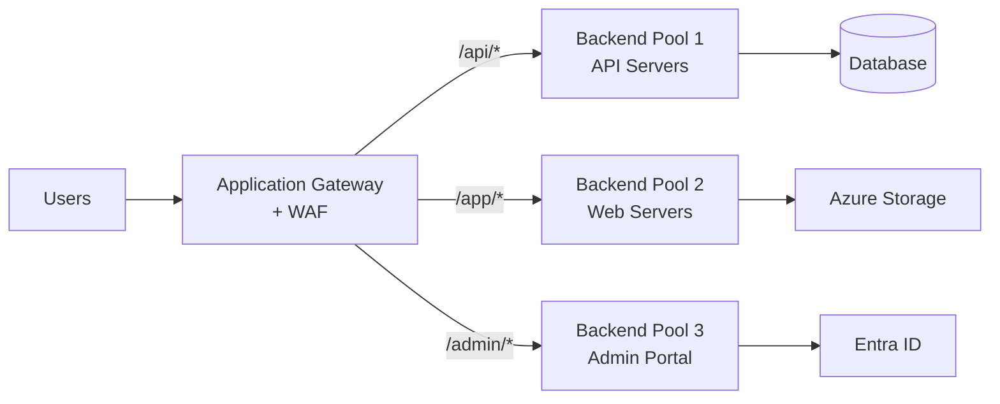

# Azure Application Gateway: WAF y SSL termination para aplicaciones web

## Resumen

**Application Gateway** es un load balancer L7 con WAF integrado, SSL offloading, y routing basado en URLs. Perfecto para proteger aplicaciones web con reglas OWASP, certificados SSL centralizados, y multi-site hosting. En este post verás configuración de WAF, custom rules, SSL policies, y integration con AKS.

<!-- more -->

## ¿Qué es Application Gateway?

**Layer 7 load balancer:**



**Características clave:**
- **WAF:** OWASP Top 10 protection, bot mitigation, custom rules
- **SSL offloading:** Certificados centralizados, políticas TLS
- **URL-based routing:** Diferentes backends por path
- **Multi-site hosting:** 100+ sites en mismo gateway
- **Autoscaling:** Scale de 0 a 125 instancias
- **Private Link:** Conectar a backends privados

---

## Setup básico Application Gateway

### Variables y recursos previos

```bash
# Variables
RESOURCE_GROUP="rg-appgw-prod"
LOCATION="westeurope"
VNET_NAME="vnet-prod"
SUBNET_APPGW="subnet-appgw"
APPGW_NAME="appgw-prod"
PUBLIC_IP_NAME="pip-appgw"

# Crear VNet
az network vnet create \
  --resource-group $RESOURCE_GROUP \
  --name $VNET_NAME \
  --address-prefix 10.0.0.0/16 \
  --subnet-name $SUBNET_APPGW \
  --subnet-prefix 10.0.1.0/24

# Public IP (Standard SKU requerido)
az network public-ip create \
  --resource-group $RESOURCE_GROUP \
  --name $PUBLIC_IP_NAME \
  --sku Standard \
  --allocation-method Static
```

### Crear Application Gateway con WAF

```bash
# Application Gateway v2 con WAF
az network application-gateway create \
  --resource-group $RESOURCE_GROUP \
  --name $APPGW_NAME \
  --location $LOCATION \
  --sku WAF_v2 \
  --capacity 2 \  # Instancias mínimas
  --vnet-name $VNET_NAME \
  --subnet $SUBNET_APPGW \
  --public-ip-address $PUBLIC_IP_NAME \
  --http-settings-cookie-based-affinity Disabled \
  --frontend-port 80 \
  --http-settings-port 80 \
  --http-settings-protocol Http \
  --priority 100 \
  --servers webapp1.azurewebsites.net webapp2.azurewebsites.net  # Backend pool

# Habilitar autoscaling
az network application-gateway update \
  --resource-group $RESOURCE_GROUP \
  --name $APPGW_NAME \
  --set autoscaleConfiguration.minCapacity=2 \
  --set autoscaleConfiguration.maxCapacity=10
```

---

## WAF configuration

### WAF policy con OWASP 3.2

```bash
# Crear WAF policy
az network application-gateway waf-policy create \
  --resource-group $RESOURCE_GROUP \
  --name waf-policy-prod \
  --location $LOCATION

# Configurar managed rules (OWASP 3.2)
az network application-gateway waf-policy managed-rule rule-set add \
  --policy-name waf-policy-prod \
  --resource-group $RESOURCE_GROUP \
  --type OWASP \
  --version 3.2

# Bot protection rules
az network application-gateway waf-policy managed-rule rule-set add \
  --policy-name waf-policy-prod \
  --resource-group $RESOURCE_GROUP \
  --type Microsoft_BotManagerRuleSet \
  --version 1.0

# Asociar policy a Application Gateway
az network application-gateway waf-policy update \
  --resource-group $RESOURCE_GROUP \
  --name waf-policy-prod \
  --set policySettings.mode=Prevention \  # Detection solo monitorea
  --set policySettings.state=Enabled \
  --set policySettings.maxRequestBodySizeInKb=128 \
  --set policySettings.fileUploadLimitInMb=100

az network application-gateway update \
  --resource-group $RESOURCE_GROUP \
  --name $APPGW_NAME \
  --set firewallPolicy.id=/subscriptions/$SUB_ID/resourceGroups/$RESOURCE_GROUP/providers/Microsoft.Network/ApplicationGatewayWebApplicationFirewallPolicies/waf-policy-prod
```

### Custom WAF rules

**Rule 1: Rate limiting (max 100 requests/min por IP)**

```bash
az network application-gateway waf-policy custom-rule create \
  --policy-name waf-policy-prod \
  --resource-group $RESOURCE_GROUP \
  --name RateLimitRule \
  --priority 100 \
  --rule-type RateLimitRule \
  --action Block \
  --rate-limit-threshold 100 \
  --rate-limit-duration 1 \
  --match-conditions \
    MatchVariable=RequestUri \
    Operator=Contains \
    MatchValue="/api/"
```

**Rule 2: Geo-blocking (bloquear países específicos)**

```bash
az network application-gateway waf-policy custom-rule create \
  --policy-name waf-policy-prod \
  --resource-group $RESOURCE_GROUP \
  --name GeoBlockRule \
  --priority 200 \
  --rule-type MatchRule \
  --action Block \
  --match-conditions \
    MatchVariable=RemoteAddr \
    Operator=GeoMatch \
    MatchValue="CN,RU,KP"  # China, Rusia, Corea del Norte
```

**Rule 3: Whitelist IPs corporativas**

```bash
az network application-gateway waf-policy custom-rule create \
  --policy-name waf-policy-prod \
  --resource-group $RESOURCE_GROUP \
  --name AllowCorporateIPs \
  --priority 50 \  # Mayor priority = se evalúa primero
  --rule-type MatchRule \
  --action Allow \
  --match-conditions \
    MatchVariable=RemoteAddr \
    Operator=IPMatch \
    MatchValue="203.0.113.0/24,198.51.100.0/24"  # IPs oficina
```

**Rule 4: Bloquear User-Agents sospechosos**

```bash
az network application-gateway waf-policy custom-rule create \
  --policy-name waf-policy-prod \
  --resource-group $RESOURCE_GROUP \
  --name BlockBadUserAgents \
  --priority 300 \
  --rule-type MatchRule \
  --action Block \
  --match-conditions \
    MatchVariable=RequestHeaders \
    Selector=User-Agent \
    Operator=Contains \
    MatchValue="sqlmap,nikto,nmap,metasploit"
```

### Exclusions (false positives)

```bash
# Excluir campo específico de WAF rules
az network application-gateway waf-policy managed-rule exclusion add \
  --policy-name waf-policy-prod \
  --resource-group $RESOURCE_GROUP \
  --match-variable RequestHeaderNames \
  --selector-match-operator Equals \
  --selector "X-Custom-Header" \
  --rule-set-type OWASP \
  --rule-set-version 3.2
```

---

## SSL/TLS configuration

### Upload SSL certificate

```bash
# Crear certificado self-signed (testing)
openssl req -x509 -newkey rsa:4096 -keyout appgw-key.pem -out appgw-cert.pem -days 365 -nodes -subj "/CN=www.example.com"

# Convertir a PFX
openssl pkcs12 -export -out appgw-cert.pfx -inkey appgw-key.pem -in appgw-cert.pem -passout pass:P@ssw0rd123

# Upload certificado a Application Gateway
az network application-gateway ssl-cert create \
  --resource-group $RESOURCE_GROUP \
  --gateway-name $APPGW_NAME \
  --name ssl-cert-example \
  --cert-file appgw-cert.pfx \
  --cert-password "P@ssw0rd123"
```

**Producción: usar Key Vault**

```bash
# Importar cert a Key Vault
az keyvault certificate import \
  --vault-name kv-prod \
  --name appgw-cert \
  --file appgw-cert.pfx \
  --password "P@ssw0rd123"

# Asignar Managed Identity a Application Gateway
az network application-gateway identity assign \
  --resource-group $RESOURCE_GROUP \
  --gateway-name $APPGW_NAME \
  --identity /subscriptions/$SUB_ID/resourceGroups/$RESOURCE_GROUP/providers/Microsoft.ManagedIdentity/userAssignedIdentities/mi-appgw

# Dar permisos a Key Vault
az keyvault set-policy \
  --name kv-prod \
  --object-id $(az identity show --resource-group $RESOURCE_GROUP --name mi-appgw --query principalId -o tsv) \
  --secret-permissions get list \
  --certificate-permissions get list

# Referenciar cert desde Key Vault
az network application-gateway ssl-cert create \
  --resource-group $RESOURCE_GROUP \
  --gateway-name $APPGW_NAME \
  --name ssl-cert-kv \
  --key-vault-secret-id https://kv-prod.vault.azure.net/secrets/appgw-cert
```

### HTTPS listener

```bash
# Frontend port 443
az network application-gateway frontend-port create \
  --resource-group $RESOURCE_GROUP \
  --gateway-name $APPGW_NAME \
  --name port443 \
  --port 443

# HTTPS listener
az network application-gateway http-listener create \
  --resource-group $RESOURCE_GROUP \
  --gateway-name $APPGW_NAME \
  --name listener-https \
  --frontend-port port443 \
  --ssl-cert ssl-cert-example \
  --host-name www.example.com  # SNI
```

### SSL policy (TLS 1.2+ only)

```bash
# Predefined policy (Modern)
az network application-gateway ssl-policy set \
  --resource-group $RESOURCE_GROUP \
  --gateway-name $APPGW_NAME \
  --policy-type Predefined \
  --policy-name AppGwSslPolicy20220101  # Solo TLS 1.2+

# Custom policy
az network application-gateway ssl-policy set \
  --resource-group $RESOURCE_GROUP \
  --gateway-name $APPGW_NAME \
  --policy-type Custom \
  --min-protocol-version TLSv1_2 \
  --cipher-suites \
    TLS_ECDHE_RSA_WITH_AES_256_GCM_SHA384 \
    TLS_ECDHE_RSA_WITH_AES_128_GCM_SHA256 \
    TLS_DHE_RSA_WITH_AES_256_GCM_SHA384
```

### HTTP → HTTPS redirect

```bash
# Redirect configuration
az network application-gateway redirect-config create \
  --resource-group $RESOURCE_GROUP \
  --gateway-name $APPGW_NAME \
  --name redirect-http-to-https \
  --type Permanent \
  --target-listener listener-https \
  --include-path true \
  --include-query-string true

# Routing rule HTTP → redirect
az network application-gateway rule create \
  --resource-group $RESOURCE_GROUP \
  --gateway-name $APPGW_NAME \
  --name rule-http-redirect \
  --http-listener listener-http \
  --rule-type Basic \
  --redirect-config redirect-http-to-https \
  --priority 200
```

---

## URL-based routing

### Backend pools

```bash
# Backend pool: API servers
az network application-gateway address-pool create \
  --resource-group $RESOURCE_GROUP \
  --gateway-name $APPGW_NAME \
  --name pool-api \
  --servers api1.example.com api2.example.com

# Backend pool: Web servers
az network application-gateway address-pool create \
  --resource-group $RESOURCE_GROUP \
  --gateway-name $APPGW_NAME \
  --name pool-web \
  --servers web1.example.com web2.example.com

# Backend pool: Admin portal
az network application-gateway address-pool create \
  --resource-group $RESOURCE_GROUP \
  --gateway-name $APPGW_NAME \
  --name pool-admin \
  --servers admin.example.com
```

### HTTP settings

```bash
# HTTP settings para API (timeout 60s)
az network application-gateway http-settings create \
  --resource-group $RESOURCE_GROUP \
  --gateway-name $APPGW_NAME \
  --name http-settings-api \
  --port 443 \
  --protocol Https \
  --cookie-based-affinity Disabled \
  --timeout 60 \
  --probe probe-api

# HTTP settings para Web (timeout 30s, session affinity)
az network application-gateway http-settings create \
  --resource-group $RESOURCE_GROUP \
  --gateway-name $APPGW_NAME \
  --name http-settings-web \
  --port 443 \
  --protocol Https \
  --cookie-based-affinity Enabled \
  --timeout 30
```

### URL path map

```bash
# Path-based rule
az network application-gateway url-path-map create \
  --resource-group $RESOURCE_GROUP \
  --gateway-name $APPGW_NAME \
  --name url-path-map \
  --paths /api/* \
  --address-pool pool-api \
  --http-settings http-settings-api \
  --default-address-pool pool-web \
  --default-http-settings http-settings-web

# Agregar otro path
az network application-gateway url-path-map rule create \
  --resource-group $RESOURCE_GROUP \
  --gateway-name $APPGW_NAME \
  --path-map-name url-path-map \
  --name rule-admin \
  --paths /admin/* \
  --address-pool pool-admin \
  --http-settings http-settings-web

# Routing rule con path-based
az network application-gateway rule create \
  --resource-group $RESOURCE_GROUP \
  --gateway-name $APPGW_NAME \
  --name rule-path-based \
  --http-listener listener-https \
  --rule-type PathBasedRouting \
  --url-path-map url-path-map \
  --priority 100
```

---

## Health probes

### Custom health probe

```bash
# Probe para API
az network application-gateway probe create \
  --resource-group $RESOURCE_GROUP \
  --gateway-name $APPGW_NAME \
  --name probe-api \
  --protocol Https \
  --host api.example.com \
  --path /health \
  --interval 30 \
  --timeout 30 \
  --threshold 3 \  # 3 fallos consecutivos = unhealthy
  --match-status-codes 200-399

# Probe con body match
az network application-gateway probe update \
  --resource-group $RESOURCE_GROUP \
  --gateway-name $APPGW_NAME \
  --name probe-api \
  --match-body "healthy"  # Response debe contener "healthy"
```

**Health endpoint en backend:**

```csharp
// ASP.NET Core
app.MapGet("/health", () => 
{
    var dbHealthy = CheckDatabase();
    var cacheHealthy = CheckRedis();
    
    if (!dbHealthy || !cacheHealthy)
        return Results.StatusCode(503);
    
    return Results.Ok(new { status = "healthy", timestamp = DateTime.UtcNow });
});
```

---

## Integration con AKS (AGIC)

### Application Gateway Ingress Controller

```bash
# Habilitar AGIC addon en AKS
az aks enable-addons \
  --resource-group $RESOURCE_GROUP \
  --name aks-prod \
  --addon ingress-appgw \
  --appgw-id /subscriptions/$SUB_ID/resourceGroups/$RESOURCE_GROUP/providers/Microsoft.Network/applicationGateways/$APPGW_NAME

# Verificar instalación
kubectl get pods -n kube-system -l app=ingress-appgw
```

**Ingress resource con AGIC:**

```yaml
# ingress-api.yaml
apiVersion: networking.k8s.io/v1
kind: Ingress
metadata:
  name: api-ingress
  namespace: prod
  annotations:
    kubernetes.io/ingress.class: azure/application-gateway
    appgw.ingress.kubernetes.io/ssl-redirect: "true"
    appgw.ingress.kubernetes.io/backend-protocol: "https"
    appgw.ingress.kubernetes.io/health-probe-path: "/health"
    appgw.ingress.kubernetes.io/request-timeout: "60"
spec:
  tls:
  - hosts:
    - api.example.com
    secretName: tls-secret  # K8s secret con certificado
  rules:
  - host: api.example.com
    http:
      paths:
      - path: /api/*
        pathType: Prefix
        backend:
          service:
            name: api-service
            port:
              number: 443
```

**Annotations útiles:**

```yaml
annotations:
  # WAF
  appgw.ingress.kubernetes.io/waf-policy-for-path: "/subscriptions/.../waf-policy-prod"
  
  # Connection draining
  appgw.ingress.kubernetes.io/connection-draining: "true"
  appgw.ingress.kubernetes.io/connection-draining-timeout: "30"
  
  # Cookie affinity
  appgw.ingress.kubernetes.io/cookie-based-affinity: "true"
  
  # Custom health probe
  appgw.ingress.kubernetes.io/health-probe-status-codes: "200-399"
  appgw.ingress.kubernetes.io/health-probe-interval: "30"
  
  # Private IP (internal load balancer)
  appgw.ingress.kubernetes.io/use-private-ip: "true"
```

---

## Monitoring y logs

### Diagnostic settings

```bash
# Habilitar logs
az monitor diagnostic-settings create \
  --name appgw-diagnostics \
  --resource /subscriptions/$SUB_ID/resourceGroups/$RESOURCE_GROUP/providers/Microsoft.Network/applicationGateways/$APPGW_NAME \
  --logs '[
    {"category":"ApplicationGatewayAccessLog","enabled":true},
    {"category":"ApplicationGatewayPerformanceLog","enabled":true},
    {"category":"ApplicationGatewayFirewallLog","enabled":true}
  ]' \
  --metrics '[{"category":"AllMetrics","enabled":true}]' \
  --workspace /subscriptions/$SUB_ID/resourceGroups/$RESOURCE_GROUP/providers/Microsoft.OperationalInsights/workspaces/law-prod
```

### KQL queries útiles

```kusto
// Top 10 URLs más lentas
AzureDiagnostics
| where ResourceType == "APPLICATIONGATEWAYS"
| where Category == "ApplicationGatewayAccessLog"
| summarize AvgResponseTime = avg(timeTaken_d) by requestUri_s
| top 10 by AvgResponseTime desc

// WAF blocked requests
AzureDiagnostics
| where ResourceType == "APPLICATIONGATEWAYS"
| where Category == "ApplicationGatewayFirewallLog"
| where action_s == "Blocked"
| summarize Count = count() by ruleId_s, clientIp_s, requestUri_s
| order by Count desc

// HTTP 5xx errors
AzureDiagnostics
| where Category == "ApplicationGatewayAccessLog"
| where httpStatus_d >= 500
| project TimeGenerated, httpStatus_d, requestUri_s, backendSettingName_s, clientIp_s
| order by TimeGenerated desc
```

### Alertas

```bash
# Alerta: unhealthy backend
az monitor metrics alert create \
  --name alert-appgw-unhealthy-backend \
  --resource-group $RESOURCE_GROUP \
  --scopes /subscriptions/$SUB_ID/resourceGroups/$RESOURCE_GROUP/providers/Microsoft.Network/applicationGateways/$APPGW_NAME \
  --condition "avg UnhealthyHostCount > 0" \
  --window-size 5m \
  --evaluation-frequency 1m \
  --action $ACTION_GROUP_ID \
  --severity 1

# Alerta: WAF blocking spike
az monitor metrics alert create \
  --name alert-appgw-waf-blocks \
  --resource-group $RESOURCE_GROUP \
  --scopes /subscriptions/$SUB_ID/resourceGroups/$RESOURCE_GROUP/providers/Microsoft.Network/applicationGateways/$APPGW_NAME \
  --condition "total BlockedCount > 100" \
  --window-size 5m \
  --action $ACTION_GROUP_ID
```

---

## Buenas prácticas

**Security:**
- ✅ WAF en Prevention mode (no solo Detection)
- ✅ Rate limiting custom rules (proteger APIs)
- ✅ Geo-blocking si app es regional
- ✅ SSL certificates en Key Vault (auto-renewal)
- ✅ TLS 1.2+ only (disable TLS 1.0/1.1)

**Performance:**
- ✅ Autoscaling habilitado (min 2, max 10+)
- ✅ Connection draining (evitar 502 en deployments)
- ✅ Custom health probes (no default)
- ✅ HTTP/2 enabled

**Resiliency:**
- ✅ Multiple backend pools (redundancia)
- ✅ Health probes con threshold 3
- ✅ Timeout adecuado por backend (API: 60s, Web: 30s)

**Cost optimization:**
- ✅ WAF_v2 vs Standard_v2 (solo si necesitas WAF)
- ✅ Autoscaling scale-to-zero en dev/test
- ✅ Reservations para producción (30-40% descuento)

---

## Troubleshooting

### Problema: 502 Bad Gateway

**Causas comunes:**
1. Backend unhealthy (health probe failing)
2. NSG bloqueando tráfico
3. Backend timeout

```bash
# Verificar backend health
az network application-gateway show-backend-health \
  --resource-group $RESOURCE_GROUP \
  --name $APPGW_NAME

# Ver logs
az monitor activity-log list \
  --resource-group $RESOURCE_GROUP \
  --resource-id /subscriptions/$SUB_ID/resourceGroups/$RESOURCE_GROUP/providers/Microsoft.Network/applicationGateways/$APPGW_NAME \
  --start-time 2025-05-15T00:00:00Z
```

### Problema: WAF bloqueando tráfico legítimo

```kusto
// Identificar regla problemática
AzureDiagnostics
| where Category == "ApplicationGatewayFirewallLog"
| where action_s == "Blocked"
| where clientIp_s == "<IP-legitima>"
| summarize Count = count() by ruleId_s, message_s
```

**Fix:** Agregar exclusion o deshabilitar regla específica

---

## Costes

**Pricing Application Gateway:**

```
WAF_v2:
- Gateway: $0.443/hora (~$320/mes)
- Capacity Unit (CU): $0.008/hora por CU
- Data processed: $0.008/GB

Ejemplo producción:
- Gateway base: $320/mes
- 5 CUs promedio: $288/mes (5 × 0.008 × 720h)
- 1 TB data: $8/mes
Total: ~$616/mes

Con autoscaling (2-10 instances):
- Min (2 CUs): ~$435/mes
- Max (20 CUs): ~$1,476/mes
- Promedio: ~$750/mes
```

---

## Referencias

- [Application Gateway Documentation](https://learn.microsoft.com/azure/application-gateway/)
- [WAF on Application Gateway](https://learn.microsoft.com/azure/web-application-firewall/ag/ag-overview)
- [AGIC Documentation](https://learn.microsoft.com/azure/application-gateway/ingress-controller-overview)
- [SSL Policy](https://learn.microsoft.com/azure/application-gateway/application-gateway-ssl-policy-overview)
