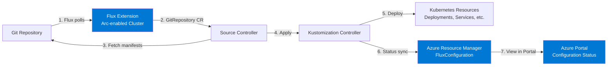

# Azure Arc GitOps con Flux v2 para Kubernetes

## Resumen

Azure Arc-enabled Kubernetes con GitOps (Flux v2) permite gestionar configuraciones de clusters Kubernetes (on-premises, multicloud, edge) desde repositorios Git de forma declarativa. Flux v2 reconcilia automáticamente el estado deseado definido en Git con el estado real del cluster, proporcionando drift reconciliation, auditoría completa y despliegues automatizados.

<!-- more -->

## ¿Qué es GitOps con Azure Arc?

**GitOps** es una práctica cloud-native que usa Git como fuente única de verdad para declarar la configuración de infraestructura y aplicaciones Kubernetes. En Azure Arc:

- **Azure Arc-enabled Kubernetes**: Proyecta clusters Kubernetes (AKS, GKE, EKS, on-premises) en Azure Resource Manager
- **Flux v2**: Operador open-source que ejecuta en el cluster, monitorea repositorios Git/Helm/OCI y aplica cambios automáticamente
- **Extension microsoft.flux**: Implementación de Flux como cluster extension en Arc, gestionada desde Azure

**Funciones principales**:

- **Drift reconciliation**: Corrige desviaciones del estado deseado (alguien modifica recursos manualmente)
- **Multi-tenancy**: Configuraciones namespace-scoped vs cluster-scoped
- **At-scale deployment**: Azure Policy aplica configuraciones GitOps a cientos de clusters automáticamente
- **Audit trail**: Historial completo en Git (quién, cuándo, qué, por qué)
- **Rollback**: `git revert` deshace cambios en minutos

## Arquitectura Flux v2 en Azure Arc



**Componentes clave**:

1. **fluxconfig-agent**: Poll de Azure para nuevas `FluxConfiguration` resources
2. **fluxconfig-controller**: Crea `GitRepository`, `Kustomization`, autenticación SSH/token
3. **source-controller**: Descarga manifests desde Git/Helm/OCI
4. **kustomize-controller**: Aplica Kustomize overlays
5. **helm-controller**: Despliega Helm charts
6. **notification-controller**: Envía alertas (Slack, Teams, email)

## Instalación de Flux Extension

### Conectar cluster a Azure Arc

```bash
# Variables
RESOURCE_GROUP="my-arc-rg"
LOCATION="westeurope"
CLUSTER_NAME="my-on-prem-k8s"

# Conectar cluster on-premises a Arc
az connectedk8s connect \
  --name $CLUSTER_NAME \
  --resource-group $RESOURCE_GROUP \
  --location $LOCATION

# Verificar conexión
az connectedk8s list --resource-group $RESOURCE_GROUP --output table
```

### Instalar microsoft.flux extension

```bash
# Instalar Flux extension (automático, sin manual helm install)
az k8s-extension create \
  --cluster-name $CLUSTER_NAME \
  --resource-group $RESOURCE_GROUP \
  --cluster-type connectedClusters \
  --extension-type microsoft.flux \
  --name flux

# Verificar instalación
kubectl get pods -n flux-system
# SALIDA:
# NAME                                  READY   STATUS    AGE
# fluxconfig-agent-xyz                  1/1     Running   2m
# fluxconfig-controller-abc             1/1     Running   2m
# source-controller-def                 1/1     Running   2m
# kustomize-controller-ghi              1/1     Running   2m
# helm-controller-jkl                   1/1     Running   2m
```

## Crear FluxConfiguration desde Git

### Estructura recomendada de repositorio

```
my-gitops-repo/
├── apps/
│   ├── dev/
│   │   └── kustomization.yaml
│   └── prod/
│       └── kustomization.yaml
├── infrastructure/
│   ├── namespaces/
│   │   └── namespaces.yaml
│   ├── rbac/
│   │   └── rolebindings.yaml
│   └── ingress/
│       └── nginx-controller.yaml
└── base/
    └── common-resources.yaml
```

### Configuración GitOps para aplicaciones (namespace-scoped)

```bash
# Variables Git
GIT_REPO="https://github.com/mi-org/my-gitops-repo"
GIT_BRANCH="main"
GIT_PATH="apps/dev"
CONFIG_NAME="app-config-dev"

# Crear FluxConfiguration con SSH key
az k8s-configuration flux create \
  --name $CONFIG_NAME \
  --cluster-name $CLUSTER_NAME \
  --cluster-type connectedClusters \
  --resource-group $RESOURCE_GROUP \
  --scope namespace \
  --namespace dev \
  --url $GIT_REPO \
  --branch $GIT_BRANCH \
  --kustomization name=apps path=$GIT_PATH prune=true \
  --ssh-private-key-file ~/.ssh/id_rsa

# Ver estado de compliance
az k8s-configuration flux show \
  --name $CONFIG_NAME \
  --cluster-name $CLUSTER_NAME \
  --cluster-type connectedClusters \
  --resource-group $RESOURCE_GROUP \
  --output table
```

### Configuración cluster-wide (infrastructure)

```bash
# Infrastructure config (namespaces, RBAC, Ingress)
az k8s-configuration flux create \
  --name infra-config \
  --cluster-name $CLUSTER_NAME \
  --cluster-type connectedClusters \
  --resource-group $RESOURCE_GROUP \
  --scope cluster \
  --url $GIT_REPO \
  --branch $GIT_BRANCH \
  --kustomization name=namespaces path=infrastructure/namespaces prune=true \
  --kustomization name=rbac path=infrastructure/rbac prune=true dependsOn=["namespaces"] \
  --kustomization name=ingress path=infrastructure/ingress prune=true dependsOn=["namespaces"]
```

**Dependencias**: `dependsOn` asegura orden (primero namespaces, luego RBAC, luego Ingress).

## Autenticación avanzada

### GitHub con Personal Access Token (PAT)

```bash
# Crear secret con PAT
kubectl create secret generic git-pat \
  --from-literal=username=my-github-user \
  --from-literal=password=ghp_xyz123... \
  --namespace flux-system

# FluxConfiguration con HTTPS + PAT
az k8s-configuration flux create \
  --name app-config-pat \
  --cluster-name $CLUSTER_NAME \
  --cluster-type connectedClusters \
  --resource-group $RESOURCE_GROUP \
  --url https://github.com/mi-org/private-repo \
  --branch main \
  --kustomization name=apps path=apps/prod \
  --https-user my-github-user \
  --https-key ghp_xyz123...
```

### Azure DevOps con SSH

```bash
# Generar SSH key sin passphrase
ssh-keygen -t ed25519 -C "flux-azdo" -f ~/.ssh/flux_azdo -N ""

# Agregar public key a Azure DevOps (User Settings > SSH Public Keys)
cat ~/.ssh/flux_azdo.pub

# FluxConfiguration con SSH
az k8s-configuration flux create \
  --name app-config-azdo \
  --cluster-name $CLUSTER_NAME \
  --cluster-type connectedClusters \
  --resource-group $RESOURCE_GROUP \
  --url git@ssh.dev.azure.com:v3/mi-org/mi-proyecto/mi-gitops-repo \
  --branch main \
  --kustomization name=apps path=apps/prod \
  --ssh-private-key-file ~/.ssh/flux_azdo \
  --known-hosts-file ~/.ssh/known_hosts
```

## Despliegue at-scale con Azure Policy

### Policy: Aplicar GitOps config a todos los clusters Arc

```json
{
  "mode": "Indexed",
  "policyRule": {
    "if": {
      "field": "type",
      "equals": "Microsoft.Kubernetes/connectedClusters"
    },
    "then": {
      "effect": "deployIfNotExists",
      "details": {
        "type": "Microsoft.KubernetesConfiguration/fluxConfigurations",
        "roleDefinitionIds": [
          "/providers/Microsoft.Authorization/roleDefinitions/b24988ac-6180-42a0-ab88-20f7382dd24c"
        ],
        "deployment": {
          "properties": {
            "mode": "incremental",
            "template": {
              "$schema": "https://schema.management.azure.com/schemas/2019-04-01/deploymentTemplate.json#",
              "contentVersion": "1.0.0.0",
              "parameters": {
                "clusterName": {"type": "string"},
                "fluxConfigName": {"type": "string", "defaultValue": "corporate-baseline"}
              },
              "resources": [
                {
                  "type": "Microsoft.KubernetesConfiguration/fluxConfigurations",
                  "apiVersion": "2023-05-01",
                  "name": "[parameters('fluxConfigName')]",
                  "scope": "[concat('Microsoft.Kubernetes/connectedClusters/', parameters('clusterName'))]",
                  "properties": {
                    "scope": "cluster",
                    "sourceKind": "GitRepository",
                    "gitRepository": {
                      "url": "https://github.com/mi-org/corporate-baseline",
                      "repositoryRef": {"branch": "main"},
                      "sshKnownHosts": ""
                    },
                    "kustomizations": {
                      "baseline": {
                        "path": "infrastructure/baseline",
                        "prune": true
                      }
                    }
                  }
                }
              ]
            }
          }
        }
      }
    }
  }
}
```

### Aplicar policy a subscription

```bash
# Crear policy definition
az policy definition create \
  --name "enforce-gitops-baseline" \
  --display-name "Enforce GitOps Corporate Baseline on Arc Clusters" \
  --description "Automatically applies corporate security baseline via GitOps to all Arc-enabled Kubernetes clusters" \
  --rules policy.json \
  --mode Indexed

# Assign policy a subscription
az policy assignment create \
  --name "gitops-baseline-assignment" \
  --policy "enforce-gitops-baseline" \
  --scope "/subscriptions/abc123..."
```

**Resultado**: Cualquier cluster Arc nuevo o existente recibe automáticamente la configuración GitOps baseline (network policies, pod security policies, RBAC).

## CI/CD: Actualizar imagen con Azure Pipelines

### Pipeline YAML (azure-pipelines.yml)

```yaml
trigger:
  branches:
    include:
      - main
  paths:
    include:
      - src/**

pool:
  vmImage: 'ubuntu-latest'

variables:
  imageName: 'myapp'
  imageTag: '$(Build.BuildId)'
  acrName: 'myacr.azurecr.io'
  gitOpsRepo: 'https://github.com/mi-org/my-gitops-repo'

stages:
- stage: Build
  jobs:
  - job: BuildAndPush
    steps:
    - task: Docker@2
      inputs:
        command: buildAndPush
        repository: $(acrName)/$(imageName)
        tags: $(imageTag)

- stage: UpdateGitOps
  dependsOn: Build
  jobs:
  - job: UpdateManifest
    steps:
    - checkout: git://mi-proyecto/my-gitops-repo@main
    - script: |
        # Actualizar imagen en Kustomization
        cd apps/dev
        kustomize edit set image $(acrName)/$(imageName):$(imageTag)
        git config user.name "Azure Pipeline"
        git config user.email "pipeline@example.com"
        git add kustomization.yaml
        git commit -m "Update image to $(imageTag)"
        git push origin main
      displayName: 'Update GitOps Repo'
```

**Flujo**: Build → Push image → Update Git → Flux detecta cambio → Deploy automático.

## Monitoreo y notificaciones

### Flux notifications a Microsoft Teams

```yaml
# flux-system/notification-provider.yaml
apiVersion: notification.toolkit.fluxcd.io/v1beta2
kind: Provider
metadata:
  name: teams
  namespace: flux-system
spec:
  type: msteams
  channel: https://outlook.office.com/webhook/abc123.../IncomingWebhook/xyz789...

---
# flux-system/notification-alert.yaml
apiVersion: notification.toolkit.fluxcd.io/v1beta2
kind: Alert
metadata:
  name: gitops-alerts
  namespace: flux-system
spec:
  providerRef:
    name: teams
  eventSeverity: info
  eventSources:
    - kind: GitRepository
      name: '*'
    - kind: Kustomization
      name: '*'
```

### Queries KQL para monitoreo

```kql
// Compliance status de FluxConfigurations
KubernetesConfigurationResources
| where type == "microsoft.kubernetesconfiguration/fluxconfigurations"
| extend complianceState = properties.complianceState
| summarize count() by complianceState, tostring(properties.scope)
| order by count_ desc

// Clusters sin GitOps configurado
Resources
| where type == "microsoft.kubernetes/connectedclusters"
| where id !in (
    KubernetesConfigurationResources
    | where type == "microsoft.kubernetesconfiguration/fluxconfigurations"
    | distinct tostring(properties.scope)
)
| project name, resourceGroup, location

// Failed reconciliations últimas 24h
KubernetesConfigurationResources
| where type == "microsoft.kubernetesconfiguration/fluxconfigurations"
| where properties.complianceState == "Failed"
| where properties.lastUpdatedAt >= ago(24h)
| project clusterName=split(id, '/')[8], configName=name, errorMessage=properties.statusMessage
```

## Seguridad y mejores prácticas

### 1. Repositorio privado con SSH

- **Nunca** usar HTTPS con PAT en URL (expuesto en logs)
- Generar SSH key dedicada por cluster/environment
- Rotar keys cada 90 días
- Almacenar keys en Azure Key Vault + Managed Identity

```bash
# Crear managed identity para cluster
az identity create --name flux-identity --resource-group $RESOURCE_GROUP

# Asignar identity a cluster Arc
az connectedk8s enable-features \
  --name $CLUSTER_NAME \
  --resource-group $RESOURCE_GROUP \
  --features cluster-connect \
  --custom-locations-oid $(az identity show --name flux-identity --resource-group $RESOURCE_GROUP --query principalId -o tsv)
```

### 2. Scope namespace vs cluster

- **namespace-scoped**: Apps (cada equipo su namespace)
- **cluster-scoped**: Infra (Ingress, monitoring, security policies)

### 3. Prune con cuidado

```bash
# prune=true elimina recursos no en Git (útil pero peligroso)
--kustomization name=apps path=apps/dev prune=true

# Excluir recursos críticos de prune
--kustomization name=infra path=infrastructure prune=true prune-exclude=kube-system/default-token-*
```

### 4. Validación pre-commit

```yaml
# .pre-commit-config.yaml
repos:
- repo: https://github.com/antonbabenko/pre-commit-terraform
  hooks:
  - id: terraform_fmt
- repo: local
  hooks:
  - id: kustomize-build
    name: Validate Kustomize
    entry: bash -c 'kustomize build apps/dev > /dev/null'
    language: system
    pass_filenames: false
```

## Troubleshooting

### Problema: FluxConfiguration stuck en "Pending"

**Síntoma**: `az k8s-configuration flux show` muestra `complianceState: Pending` por >10min.

**Causas comunes**:

1. **SSH key incorrecta**:

```bash
# Verificar logs fluxconfig-agent
kubectl logs -n flux-system deployment/fluxconfig-agent

# ERROR típico: "Permission denied (publickey)"
# Solución: Agregar SSH public key a GitHub/Azure DevOps
```

2. **Git branch no existe**:

```bash
# Verificar branch
git ls-remote --heads $GIT_REPO

# Solución: Cambiar --branch o crear branch en Git
```

3. **Proxy/Firewall bloqueando Git**:

```bash
# Test conectividad desde cluster
kubectl run test-git --image=alpine/git --rm -it -- sh
git ls-remote $GIT_REPO
```

### Problema: Drift no se corrige (cambios manuales persisten)

**Síntoma**: `kubectl edit deployment my-app` cambia réplicas, pero Flux no revierte.

**Causa**: Kustomization `interval` muy largo o `prune=false`.

**Solución**:

```bash
# Forzar reconciliation inmediata
kubectl annotate gitrepository -n flux-system my-repo fluxcd.io/reconcile=true

# Reducir interval (default 10m)
az k8s-configuration flux update \
  --name app-config-dev \
  --cluster-name $CLUSTER_NAME \
  --cluster-type connectedClusters \
  --resource-group $RESOURCE_GROUP \
  --kustomization name=apps interval=1m
```

### Problema: "Failed to apply Kustomization" en Portal

**Logs detallados**:

```bash
# Ver events Flux
kubectl get events -n flux-system --sort-by='.lastTimestamp'

# Logs kustomize-controller
kubectl logs -n flux-system deployment/kustomize-controller

# ERROR típico: "resource mapping not found for name..."
# Solución: CRD falta, instalar con Kustomization de infra primero
```

## Casos de uso empresarial

### 1. Disaster recovery multi-región

**Escenario**: 3 clusters Arc (West Europe, East US, Southeast Asia) con misma config.

```bash
# Policy aplica mismo GitOps config a 3 regiones
az policy assignment create \
  --name "dr-clusters-baseline" \
  --policy "enforce-gitops-baseline" \
  --scope "/subscriptions/abc123.../resourceGroups/dr-rg"

# En 15 minutos, 3 clusters idénticos listos
```

### 2. Cumplimiento regulatorio (HIPAA, PCI-DSS)

**Escenario**: Auditor pide historial de cambios en Ingress rules.

```bash
# Git log muestra quién, cuándo, por qué
git log --oneline --all -- infrastructure/ingress/

# a1b2c3d (2025-06-15) feat: Allow /health endpoint - Ticket #1234
# d4e5f6g (2025-06-10) fix: Block /admin paths - Security audit item 3
```

### 3. Multi-tenancy con namespace isolation

**Estructura**:

```
gitops-repo/
├── tenants/
│   ├── team-a/
│   │   └── namespace.yaml (quota: 10 CPU, 20Gi RAM)
│   ├── team-b/
│   │   └── namespace.yaml (quota: 5 CPU, 10Gi RAM)
```

```bash
# FluxConfiguration por tenant
az k8s-configuration flux create \
  --name team-a-config \
  --scope namespace --namespace team-a \
  --kustomization name=team-a path=tenants/team-a
```

## Costos

| Componente | Precio mensual estimado |
|------------|-------------------------|
| Azure Arc-enabled Kubernetes (hasta 6 vCPU) | **Gratis** |
| Azure Arc-enabled Kubernetes (>6 vCPU) | ~$2/vCPU/mes |
| Flux Extension | **Incluido** (sin cargo extra) |
| GitOps Configurations (hasta 10) | **Gratis** |
| GitOps Configurations (>10) | ~$5/config/mes |
| Git repository (GitHub private) | $0-$4/usuario/mes |
| Azure Policy evaluations | **Incluido** |

**Ejemplo**: 20 clusters on-premises (4 vCPU c/u) + 5 configs GitOps = **$0/mes** (bajo free tier).

## Limitaciones

- **Drift reconciliation interval**: Mínimo 1min, no real-time
- **Kustomization size**: <50MB manifests por path
- **Dependencies**: Max 10 `dependsOn` por Kustomization
- **Notificaciones**: Requiere internet egress (webhook a Teams/Slack)
- **Multi-source**: 1 GitRepository por FluxConfiguration (usar Kustomize remote bases para combinar repos)

## Referencias

- [GitOps on Arc-enabled Kubernetes (Oficial)](https://learn.microsoft.com/en-us/azure/azure-arc/kubernetes/conceptual-gitops-flux2)
- [Tutorial: Deploy applications using GitOps with Flux v2](https://learn.microsoft.com/en-us/azure/azure-arc/kubernetes/tutorial-use-gitops-flux2)
- [Azure Policy for GitOps at-scale](https://learn.microsoft.com/en-us/azure/cloud-adoption-framework/scenarios/hybrid/arc-enabled-kubernetes/eslz-arc-kubernetes-cicd-gitops-disciplines)
- [Flux v2 Documentation (Oficial)](https://fluxcd.io/flux/)
- [CI/CD and GitOps disciplines with Arc](https://learn.microsoft.com/en-us/azure/cloud-adoption-framework/scenarios/hybrid/arc-enabled-kubernetes/eslz-arc-kubernetes-cicd-gitops-disciplines)
