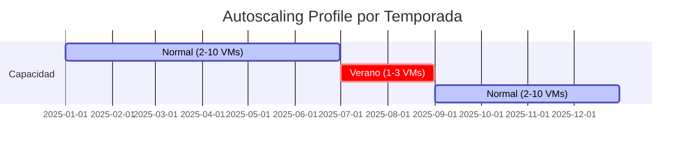

# Azure Autoscaling: optimiza recursos para verano

## Resumen

**julio-agosto** tienen tráfico reducido en muchas empresas (vacaciones, menos actividad B2B). Con Azure Autoscaling puedes reducir costes automáticamente cuando la demanda baja y escalar cuando sube. En este post verás cómo configurar autoscaling en VMs, AKS, Container Apps y App Services.

<!-- more -->

## ¿Por qué autoscaling en verano?

**Escenario típico:**

- **Enero-junio**: Tráfico normal, 100 requests/segundo
- **Julio-agosto**: Tráfico baja 40-60% (vacaciones)
- **Septiembre-diciembre**: Tráfico recupera + picos Black Friday

**Sin autoscaling:**

```
Coste mensual fijo: €5,000 x 12 meses = €60,000/año
```

**Con autoscaling:**

```
Ene-Jun: €5,000 x 6 = €30,000
Jul-Ago: €2,000 x 2 = €4,000   (scale down 60%)
Sep-Dic: €5,000 x 4 = €20,000
Total: €54,000/año
Ahorro: €6,000 (10%)
```

---

## Autoscaling en Virtual Machine Scale Sets (VMSS)

### Configurar autoscaling basado en CPU

```bash
# Crear VMSS
az vmss create \
  --resource-group rg-prod \
  --name vmss-web \
  --image Ubuntu2204 \
  --instance-count 2 \
  --vm-sku Standard_B2s \
  --load-balancer lb-web \
  --vnet-name vnet-prod \
  --subnet subnet-web \
  --upgrade-policy-mode Automatic

# Configurar autoscale profile
az monitor autoscale create \
  --resource-group rg-prod \
  --name autoscale-vmss-web \
  --resource /subscriptions/$SUB_ID/resourceGroups/rg-prod/providers/Microsoft.Compute/virtualMachineScaleSets/vmss-web \
  --min-count 1 \
  --max-count 10 \
  --count 2

# Regla: Scale out cuando CPU > 70%
az monitor autoscale rule create \
  --resource-group rg-prod \
  --autoscale-name autoscale-vmss-web \
  --condition "Percentage CPU > 70 avg 5m" \
  --scale out 2

# Regla: Scale in cuando CPU < 30%
az monitor autoscale rule create \
  --resource-group rg-prod \
  --autoscale-name autoscale-vmss-web \
  --condition "Percentage CPU < 30 avg 10m" \
  --scale in 1
```

### Schedule-based autoscaling (horario verano)

```bash
# Profile para verano: 1-3 instancias (Jul-Ago)
az monitor autoscale profile create \
  --resource-group rg-prod \
  --autoscale-name autoscale-vmss-web \
  --name summer-profile \
  --min-count 1 \
  --max-count 3 \
  --count 1 \
  --start 2025-07-01T00:00:00Z \
  --end 2025-08-31T23:59:59Z \
  --timezone "W. Europe Standard Time"

# Profile para resto del año: 2-10 instancias
az monitor autoscale profile create \
  --resource-group rg-prod \
  --autoscale-name autoscale-vmss-web \
  --name normal-profile \
  --min-count 2 \
  --max-count 10 \
  --count 2 \
  --start 2025-09-01T00:00:00Z \
  --end 2026-06-30T23:59:59Z \
  --timezone "W. Europe Standard Time"
```

**Visualización:**



---

## Autoscaling en Azure Kubernetes Service (AKS)

### Cluster Autoscaler (node-level)

```bash
# Habilitar cluster autoscaler
az aks nodepool update \
  --resource-group rg-aks \
  --cluster-name aks-prod \
  --name nodepool1 \
  --enable-cluster-autoscaler \
  --min-count 1 \
  --max-count 5

# Configurar scale-down durante verano
az aks update \
  --resource-group rg-aks \
  --name aks-prod \
  --cluster-autoscaler-profile \
    scale-down-delay-after-add=10m \
    scale-down-unneeded-time=5m \
    scale-down-utilization-threshold=0.3  # Scale down cuando CPU < 30%
```

### Horizontal Pod Autoscaler (pod-level)

```yaml
# hpa-deployment.yaml
apiVersion: apps/v1
kind: Deployment
metadata:
  name: web-app
spec:
  replicas: 2
  selector:
    matchLabels:
      app: web
  template:
    metadata:
      labels:
        app: web
    spec:
      containers:
      - name: web
        image: myapp:v1
        resources:
          requests:
            cpu: 100m
            memory: 128Mi
          limits:
            cpu: 500m
            memory: 512Mi
---
apiVersion: autoscaling/v2
kind: HorizontalPodAutoscaler
metadata:
  name: web-app-hpa
spec:
  scaleTargetRef:
    apiVersion: apps/v1
    kind: Deployment
    name: web-app
  minReplicas: 1   # Verano: bajar a 1
  maxReplicas: 10
  metrics:
  - type: Resource
    resource:
      name: cpu
      target:
        type: Utilization
        averageUtilization: 70
  - type: Resource
    resource:
      name: memory
      target:
        type: Utilization
        averageUtilization: 80
  behavior:
    scaleDown:
      stabilizationWindowSeconds: 300  # Esperar 5min antes de scale down
      policies:
      - type: Percent
        value: 50  # Reducir 50% cada vez
        periodSeconds: 60
    scaleUp:
      stabilizationWindowSeconds: 0
      policies:
      - type: Percent
        value: 100  # Duplicar pods cada vez
        periodSeconds: 15
```

**Apply:**

```bash
kubectl apply -f hpa-deployment.yaml

# Verificar autoscaling
kubectl get hpa web-app-hpa --watch
```

### KEDA: Event-driven autoscaling

```yaml
# keda-scaledobject.yaml - Scale basado en Azure Service Bus queue
apiVersion: keda.sh/v1alpha1
kind: ScaledObject
metadata:
  name: order-processor-scaler
spec:
  scaleTargetRef:
    name: order-processor
  minReplicaCount: 0  # Scale to zero en verano si no hay mensajes
  maxReplicaCount: 20
  triggers:
  - type: azure-servicebus
    metadata:
      queueName: orders
      namespace: sb-prod
      messageCount: "10"  # 1 pod por cada 10 mensajes
      connectionFromEnv: SERVICEBUS_CONNECTION
```

**Install KEDA:**

```bash
helm repo add kedacore https://kedacore.github.io/charts
helm install keda kedacore/keda --namespace keda --create-namespace

kubectl apply -f keda-scaledobject.yaml
```

---

## Autoscaling en Container Apps

```bash
# Crear Container App con autoscaling
az containerapp create \
  --name app-api \
  --resource-group rg-container-apps \
  --environment containerapp-env \
  --image myregistry.azurecr.io/api:v1 \
  --target-port 80 \
  --ingress external \
  --min-replicas 0 \
  --max-replicas 10 \
  --scale-rule-name http-scaling \
  --scale-rule-type http \
  --scale-rule-http-concurrency 50  # 1 replica por cada 50 requests concurrentes

# Regla custom: scale basado en CPU
az containerapp update \
  --name app-api \
  --resource-group rg-container-apps \
  --scale-rule-name cpu-scaling \
  --scale-rule-type cpu \
  --scale-rule-metadata "type=Utilization" "value=70"
```

**Ventaja Container Apps:** Scale to zero automático (sin coste cuando no hay tráfico)

---

## Autoscaling en App Service

### Configuración básica

```bash
# Crear App Service Plan con autoscaling
az appservice plan create \
  --name plan-webapp-s1 \
  --resource-group rg-webapp \
  --sku S1 \
  --is-linux

# Configurar autoscale
az monitor autoscale create \
  --resource-group rg-webapp \
  --name autoscale-webapp \
  --resource /subscriptions/$SUB_ID/resourceGroups/rg-webapp/providers/Microsoft.Web/serverfarms/plan-webapp-s1 \
  --min-count 1 \
  --max-count 5 \
  --count 1

# Scale out basado en HTTP queue length
az monitor autoscale rule create \
  --resource-group rg-webapp \
  --autoscale-name autoscale-webapp \
  --condition "HttpQueueLength > 100 avg 5m" \
  --scale out 2

# Scale in basado en CPU
az monitor autoscale rule create \
  --resource-group rg-webapp \
  --autoscale-name autoscale-webapp \
  --condition "CpuPercentage < 40 avg 10m" \
  --scale in 1
```

### Schedule: reducir capacidad noches/fines de semana

```bash
# Profile nocturno: 1 instancia (22:00-06:00)
az monitor autoscale profile create \
  --resource-group rg-webapp \
  --autoscale-name autoscale-webapp \
  --name night-profile \
  --min-count 1 \
  --max-count 1 \
  --count 1 \
  --recurrence week mon tue wed thu fri \
  --start "22:00" \
  --end "06:00" \
  --timezone "W. Europe Standard Time"

# Profile fin de semana: 1 instancia (Sab-Dom)
az monitor autoscale profile create \
  --resource-group rg-webapp \
  --autoscale-name autoscale-webapp \
  --name weekend-profile \
  --min-count 1 \
  --max-count 2 \
  --count 1 \
  --recurrence week sat sun \
  --timezone "W. Europe Standard Time"
```

---

## Autoscaling con Azure Load Testing

### Test pre-verano: validar autoscaling funciona

```yaml
# loadtest-config.yaml
testId: summer-autoscale-test
displayName: "Validate autoscaling before summer"
description: "Test autoscaling from 1 to 5 instances"
loadTestConfiguration:
  engineInstances: 1
  splitAllCSVs: false
testPlan: loadtest.jmx
env:
  - name: TARGET_URL
    value: https://myapp.azurewebsites.net
  - name: THREADS
    value: "100"
  - name: RAMP_UP
    value: "60"  # Aumentar carga en 60 segundos
  - name: DURATION
    value: "600"  # 10 minutos
```

```bash
# Crear load test
az load create \
  --name loadtest-autoscale \
  --resource-group rg-testing \
  --location westeurope

# Ejecutar test
az load test create \
  --load-test-resource loadtest-autoscale \
  --resource-group rg-testing \
  --test-id summer-test \
  --load-test-config-file loadtest-config.yaml

# Monitorizar durante test
az monitor metrics list \
  --resource /subscriptions/$SUB_ID/resourceGroups/rg-prod/providers/Microsoft.Compute/virtualMachineScaleSets/vmss-web \
  --metric "Percentage CPU" \
  --start-time 2025-07-01T10:00:00Z \
  --end-time 2025-07-01T10:15:00Z \
  --interval PT1M
```

**Esperado:**

1. Inicio: 1 instancia, CPU 80%
2. Minuto 3: Trigger scale out → 3 instancias
3. Minuto 5: CPU baja a 40%, estabiliza en 3 instancias
4. Fin test: Scale in a 1 instancia después de 10 min

---

## Monitoring y alertas

### Dashboard autoscaling

```kusto
// Query Azure Monitor
InsightsMetrics
| where TimeGenerated > ago(7d)
| where Name == "VMScaleSetInstanceCount"
| summarize InstanceCount = avg(Val) by bin(TimeGenerated, 1h), ResourceId
| render timechart
```

### Alertas de autoscaling events

```bash
# Alerta cuando autoscaling falla
az monitor activity-log alert create \
  --resource-group rg-monitoring \
  --name alert-autoscale-failed \
  --description "Autoscale operation failed" \
  --condition category=Autoscale and operationName=Microsoft.Insights/AutoscaleSettings/ScaleAction and status=Failed \
  --action-group ag-ops-team

# Alerta cuando alcanza max capacity
az monitor metrics alert create \
  --name alert-max-capacity \
  --resource-group rg-prod \
  --scopes /subscriptions/$SUB_ID/resourceGroups/rg-prod/providers/Microsoft.Compute/virtualMachineScaleSets/vmss-web \
  --condition "count instances >= 10" \
  --description "VMSS reached maximum capacity" \
  --window-size 5m \
  --evaluation-frequency 1m \
  --action ag-ops-team
```

---

## Buenas prácticas

### 1. Cooldown periods

**Problema:** Scale flapping (subir-bajar-subir constantemente)

**Solución:**

```bash
# Cooldown de 10 minutos después de scale out
az monitor autoscale rule update \
  --resource-group rg-prod \
  --autoscale-name autoscale-vmss-web \
  --rule-name scale-out-cpu \
  --cooldown 10
```

### 2. Aggressive scale up, conservative scale down

```yaml
# HPA con behavior asimétrico
behavior:
  scaleUp:
    stabilizationWindowSeconds: 0  # Inmediato
    policies:
    - type: Percent
      value: 100  # Duplicar
      periodSeconds: 15
  scaleDown:
    stabilizationWindowSeconds: 300  # Esperar 5 min
    policies:
    - type: Pods
      value: 1  # Solo 1 pod cada vez
      periodSeconds: 60
```

### 3. Predictive autoscaling (ML-based)

```bash
# Habilitar predictive autoscaling (preview)
az monitor autoscale update \
  --resource-group rg-prod \
  --name autoscale-vmss-web \
  --predictive-autoscale-mode ForecastOnly  # o Enabled para autoscale automático
```

**Ventaja:** Azure ML predice tráfico basado en histórico → pre-scale antes de que llegue la carga

### 4. Multi-metric autoscaling

```bash
# Combinar CPU + Memory + Custom metric
az monitor autoscale rule create \
  --resource-group rg-prod \
  --autoscale-name autoscale-vmss-web \
  --condition "Percentage CPU > 70 avg 5m" \
  --scale out 2

az monitor autoscale rule create \
  --resource-group rg-prod \
  --autoscale-name autoscale-vmss-web \
  --condition "Available Memory Bytes < 536870912 avg 5m" \  # 512 MB
  --scale out 2

az monitor autoscale rule create \
  --resource-group rg-prod \
  --autoscale-name autoscale-vmss-web \
  --condition "Requests Per Second > 1000 avg 3m" \
  --scale out 3
```

---

## Cost optimization checklist verano

- [ ] Identificar workloads con tráfico reducido en verano
- [ ] Configurar schedule-based autoscaling Jul-Ago (min replicas reducidas)
- [ ] Test autoscaling con Azure Load Testing
- [ ] Configurar alertas de max capacity reached
- [ ] Documentar baseline de performance (P95 latency, error rate)
- [ ] Monitoring diario primeros 7 días después de activar autoscaling
- [ ] Revisar costes semanalmente (esperar 30-50% reducción)
- [ ] Volver a configuración normal Sept 1
- [ ] Post-mortem: calcular ahorro real vs proyectado

---

## Alternativas a autoscaling

| Estrategia | Ahorro | Complejidad | Mejor para |
|------------|--------|-------------|------------|
| **Autoscaling** | 30-50% | Media | Tráfico variable |
| **Shutdown nocturno** | 60% | Baja | Dev/Test environments |
| **Reserved Instances** | 40% | Baja | Workloads 24/7 estables |
| **Spot VMs** | 70-90% | Alta | Batch processing tolerante a interrupciones |
| **Serverless (Functions)** | 80% | Media | Event-driven workloads |

---

## Troubleshooting

### Autoscaling no funciona

**Debug checklist:**

```bash
# 1. Verificar metrics se están recolectando
az monitor metrics list \
  --resource $RESOURCE_ID \
  --metric "Percentage CPU" \
  --start-time "2025-07-01T10:00:00Z" \
  --end-time "2025-07-01T10:30:00Z"

# 2. Ver autoscale history
az monitor autoscale history list \
  --resource-group rg-prod \
  --autoscale-name autoscale-vmss-web \
  --start-time "2025-07-01T00:00:00Z"

# 3. Verificar service limits
az vm list-usage --location westeurope --query "[?name.value=='cores'].{Name:name.localizedValue, Current:currentValue, Limit:limit}"
```

**Errores comunes:**

- Quota insuficiente (solicitar aumento)
- RBAC permissions faltantes (agregar Monitoring Contributor)
- Metric delay (esperar 5-10 minutos para que métricas aparezcan)

---

## Referencias

- [Autoscale Best Practices](https://learn.microsoft.com/azure/azure-monitor/autoscale/autoscale-best-practices)
- [AKS Cluster Autoscaler](https://learn.microsoft.com/azure/aks/cluster-autoscaler)
- [KEDA Documentation](https://keda.sh/)
- [Azure Load Testing](https://learn.microsoft.com/azure/load-testing/)
