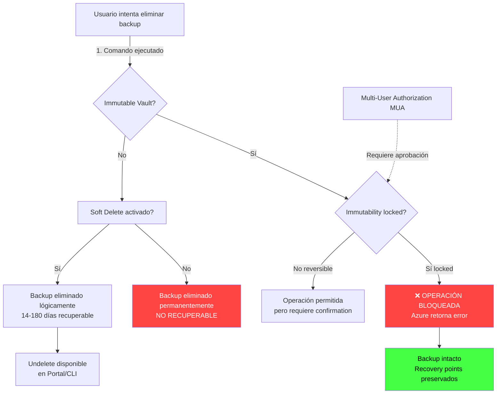
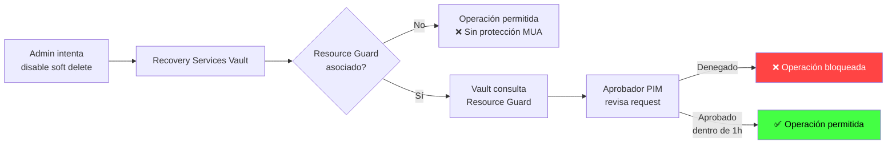

# Azure Backup Immutable Vaults: Protección contra ransomware

## Resumen

Los **Immutable Vaults** en Azure Backup bloquean operaciones que podrían eliminar recovery points (stop backup, delete backup data, disable soft delete), protegiendo contra ransomware y actores maliciosos. Al habilitar immutability con **lock irreversible**, se garantiza que los backups son intocables durante el periodo de retención, cumpliendo requisitos regulatorios (HIPAA, SOC 2, GDPR) y asegurando recuperación ante ataques.

<!-- more -->

## ¿Qué son los Immutable Vaults?

Un **Immutable Vault** es un Recovery Services Vault o Backup Vault con configuración de inmutabilidad habilitada que:

- **Bloquea eliminación de recovery points**: No se puede ejecutar "Stop backup and delete data"
- **Protege soft delete**: No se puede deshabilitar soft delete (permanece always-on)
- **Previene reducción de retención**: No se pueden cambiar policies para reducir días de retención
- **Irreversible con lock**: Una vez locked, no se puede desactivar immutability (ni Owner ni Microsoft)

**Escenarios de protección**:

- **Ransomware attack**: Atacante con credenciales de Contributor no puede eliminar backups
- **Rogue admin**: Administrador malicioso o comprometido no puede destruir datos
- **Cumplimiento normativo**: HIPAA, SOC 2, GDPR requieren backups inalterables por X días
- **Retention enforcement**: Evita que alguien reduzca retention de 365 días a 7 días

**Diferencia con soft delete**:

- **Soft delete**: Retiene backups eliminados 14-180 días (recuperable, pero deshabitable)
- **Immutable vault**: Bloquea operación de eliminación (no llega a soft delete state)

## Niveles de seguridad en Azure Backup

| Nivel | Configuración | Protección |
|-------|---------------|------------|
| **Poor** (None) | Sin soft delete, sin MUA, sin immutability | Solo contra eliminación accidental básica |
| **Fair** (Minimum) | MUA enabled | Aprobación adicional para operaciones críticas |
| **Good** (Adequate) | Soft delete enabled o Immutability reversible | Recuperación de eliminaciones + protección básica |
| **Excellent** (Maximum) | Immutability locked + Soft delete always-on + MUA | Máxima protección: backups intocables |

**Recomendación**: **Excellent** para producción crítica, **Good** para dev/test.

## Arquitectura de protección



## Habilitar Immutable Vault

### Crear Recovery Services Vault con immutability

```bash
# Variables
RESOURCE_GROUP="backup-prod-rg"
LOCATION="westeurope"
VAULT_NAME="immutable-vault-prod"

# Crear vault
az backup vault create \
  --name $VAULT_NAME \
  --resource-group $RESOURCE_GROUP \
  --location $LOCATION

# Habilitar immutability (reversible inicialmente)
az backup vault backup-properties set \
  --name $VAULT_NAME \
  --resource-group $RESOURCE_GROUP \
  --soft-delete-feature-state Enable \
  --immutability-state Unlocked

# Verificar configuración
az backup vault backup-properties show \
  --name $VAULT_NAME \
  --resource-group $RESOURCE_GROUP \
  --query '{immutabilityState:properties.immutabilitySettings.state, softDeleteState:properties.softDeleteFeatureState}'
```

### Habilitar immutability en vault existente (Portal)

1. Ir a **Recovery Services vault** → `$VAULT_NAME`
2. Seleccionar **Properties**
3. Click en **Security Settings** → **Update**
4. Activar **"Enable immutability"**
5. Revisar warning: **"Esta operación puede ser irreversible"**
6. Click **Update**

**Salida esperada**:

```json
{
  "immutabilityState": "Unlocked",
  "softDeleteState": "AlwaysOn"
}
```

### Aplicar lock irreversible

!!! warning "Operación PERMANENTE"
    Una vez locked, immutability **NO se puede desactivar** bajo ninguna circunstancia. Solo hazlo en producción tras validar en test.

```bash
# Lock immutability (IRREVERSIBLE)
az backup vault backup-properties set \
  --name $VAULT_NAME \
  --resource-group $RESOURCE_GROUP \
  --immutability-state Locked

# Intentar deshabilitar (FALLARÁ)
az backup vault backup-properties set \
  --name $VAULT_NAME \
  --resource-group $RESOURCE_GROUP \
  --immutability-state Disabled

# ERROR:
# (ImmutabilityCannotBeDisabled) Immutability cannot be disabled once locked.
# Code: ImmutabilityCannotBeDisabled
```

## Multi-User Authorization (MUA) con Resource Guard

### Arquitectura MUA + Immutable Vault

**Resource Guard** es un recurso Azure que actúa como aprobador externo para operaciones críticas:

1. Vault intenta operación crítica (disable soft delete, delete backup)
2. Vault verifica si Resource Guard asociado lo permite
3. Request enviado a aprobador (Azure PIM o manual)
4. Si aprobado → operación procede
5. Si denegado → operación bloqueada



### Crear Resource Guard

```bash
# Variables
GUARD_RG="security-guards-rg"
GUARD_NAME="backup-resource-guard"

# Crear resource guard (en RG separado, preferiblemente otra subscription)
az dataprotection resource-guard create \
  --resource-group $GUARD_RG \
  --resource-guard-name $GUARD_NAME \
  --location $LOCATION

# Obtener Resource Guard ID
GUARD_ID=$(az dataprotection resource-guard show \
  --resource-group $GUARD_RG \
  --resource-guard-name $GUARD_NAME \
  --query id -o tsv)

echo $GUARD_ID
# /subscriptions/abc123.../resourceGroups/security-guards-rg/providers/Microsoft.DataProtection/resourceGuards/backup-resource-guard
```

### Asociar Resource Guard con Vault

```bash
# Habilitar MUA en vault
az backup vault update \
  --name $VAULT_NAME \
  --resource-group $RESOURCE_GROUP \
  --resource-guard-operation-requests "DisableSoftDelete" "DisableImmutability" \
  --resource-guard-id $GUARD_ID

# Verificar MUA activo
az backup vault show \
  --name $VAULT_NAME \
  --resource-group $RESOURCE_GROUP \
  --query '{mua:properties.resourceGuardOperationRequests, guardId:properties.resourceGuardId}'
```

### Configurar Azure PIM para aprobación JIT

```bash
# Asignar rol Security Admin con PIM en Resource Guard
az role assignment create \
  --role "Security Admin" \
  --assignee user@example.com \
  --scope $GUARD_ID \
  --assignee-principal-type User

# Configurar PIM (Azure Portal):
# 1. Azure AD Privileged Identity Management
# 2. Azure resources → $GUARD_NAME
# 3. Settings → Roles → Security Admin
# 4. Activation: Require approval
# 5. Approver: security-team@example.com
# 6. Activation duration: 1 hour
```

**Flujo de aprobación**:

1. Admin solicita activar rol Security Admin en PIM (justificación obligatoria: "Disaster recovery test - Ticket #5678")
2. Aprobador recibe email/Teams notification
3. Aprobador revisa en PIM y aprueba/deniega
4. Si aprobado, admin tiene 1h para ejecutar operación

## Configuración de backups con immutability

### Azure VM Backup policy con retención inmutable

```json
{
  "policyName": "vm-immutable-policy-365d",
  "schedulePolicy": {
    "schedulePolicyType": "SimpleSchedulePolicy",
    "scheduleRunFrequency": "Daily",
    "scheduleRunTimes": ["2025-07-05T02:00:00Z"]
  },
  "retentionPolicy": {
    "retentionPolicyType": "LongTermRetentionPolicy",
    "dailySchedule": {
      "retentionDuration": {
        "count": 365,
        "durationType": "Days"
      }
    }
  }
}
```

```bash
# Crear policy
az backup policy create \
  --vault-name $VAULT_NAME \
  --resource-group $RESOURCE_GROUP \
  --name vm-immutable-policy-365d \
  --policy @policy.json \
  --backup-management-type AzureIaasVM

# Configurar backup de VM
VM_ID="/subscriptions/abc123.../resourceGroups/prod-rg/providers/Microsoft.Compute/virtualMachines/web-vm-01"

az backup protection enable-for-vm \
  --vault-name $VAULT_NAME \
  --resource-group $RESOURCE_GROUP \
  --vm $VM_ID \
  --policy-name vm-immutable-policy-365d
```

**Garantía**: Recovery points creados se retienen 365 días sin posibilidad de eliminación (immutable vault locked).

### Azure Files vaulted backup (10 años retención)

```bash
# Crear Backup Vault (soporta vaulted backups)
BACKUP_VAULT_NAME="files-backup-vault"

az dataprotection backup-vault create \
  --vault-name $BACKUP_VAULT_NAME \
  --resource-group $RESOURCE_GROUP \
  --location $LOCATION \
  --storage-settings datastore-type=VaultStore type=LocallyRedundant

# Habilitar immutability en Backup Vault
az dataprotection backup-vault update \
  --vault-name $BACKUP_VAULT_NAME \
  --resource-group $RESOURCE_GROUP \
  --immutability-state Locked \
  --soft-delete-state AlwaysOn \
  --soft-delete-retention-duration-in-days 30

# Policy con 10 años retención
az dataprotection backup-policy create \
  --vault-name $BACKUP_VAULT_NAME \
  --resource-group $RESOURCE_GROUP \
  --name files-10y-retention \
  --datasource-type AzureBlob \
  --retention-duration-in-days 3650
```

## Soft delete con retención extendida

### Configurar soft delete 180 días

```bash
# Habilitar soft delete con retención máxima (Recovery Services Vault)
az backup vault backup-properties set \
  --name $VAULT_NAME \
  --resource-group $RESOURCE_GROUP \
  --soft-delete-feature-state Enable \
  --soft-delete-retention-days 180

# Always-on soft delete (no deshabitable)
az backup vault backup-properties set \
  --name $VAULT_NAME \
  --resource-group $RESOURCE_GROUP \
  --soft-delete-feature-state AlwaysOn
```

### Recuperar backup eliminado (soft delete)

```bash
# Listar backups en soft delete state
az backup item list \
  --vault-name $VAULT_NAME \
  --resource-group $RESOURCE_GROUP \
  --backup-management-type AzureIaasVM \
  --workload-type VM \
  --query "[?properties.protectionState=='SoftDeleted']"

# Undelete backup item
CONTAINER_NAME="iaasvmcontainer;iaasvmcontainerv2;prod-rg;web-vm-01"
ITEM_NAME="vm;iaasvmcontainerv2;prod-rg;web-vm-01"

az backup protection undelete \
  --vault-name $VAULT_NAME \
  --resource-group $RESOURCE_GROUP \
  --container-name $CONTAINER_NAME \
  --item-name $ITEM_NAME \
  --workload-type VM \
  --backup-management-type AzureIaasVM

# Resume backups
az backup protection resume \
  --vault-name $VAULT_NAME \
  --resource-group $RESOURCE_GROUP \
  --container-name $CONTAINER_NAME \
  --item-name $ITEM_NAME \
  --policy-name vm-immutable-policy-365d
```

## Monitoreo y alertas de seguridad

### Azure Monitor alerts para operaciones críticas

```bash
# Alert cuando alguien intenta disable soft delete
az monitor activity-log alert create \
  --name "alert-disable-soft-delete" \
  --resource-group $RESOURCE_GROUP \
  --scope "/subscriptions/abc123..." \
  --condition category=Administrative \
    and operationName=Microsoft.RecoveryServices/vaults/backupconfig/write \
    and properties.message contains "softDelete" \
  --action-group security-alerts-ag \
  --description "Alerta cuando se intenta deshabilitar soft delete en vaults"

# Alert para failed undelete operations
az monitor activity-log alert create \
  --name "alert-failed-undelete" \
  --resource-group $RESOURCE_GROUP \
  --scope "/subscriptions/abc123..." \
  --condition category=Administrative \
    and operationName=Microsoft.RecoveryServices/vaults/backupFabrics/protectionContainers/protectedItems/recoveryPoints/restore/action \
    and status=Failed \
  --action-group security-alerts-ag
```

### KQL queries para auditoría

```kql
// Recovery Services Vaults sin immutability habilitado
Resources
| where type == "microsoft.recoveryservices/vaults"
| extend immutabilityState = properties.immutabilitySettings.state
| where immutabilityState != "Locked"
| project name, resourceGroup, location, immutabilityState, softDeleteState=properties.softDeleteFeatureState

// Intentos de eliminar backups (últimas 48h)
AzureActivity
| where TimeGenerated >= ago(48h)
| where OperationNameValue has "Microsoft.RecoveryServices/vaults/backupFabrics/protectionContainers/protectedItems/delete"
| where ActivityStatusValue != "Success"
| project TimeGenerated, Caller, OperationNameValue, ActivityStatusValue, Properties

// Backup items en soft delete state
AddonAzureBackupStorage
| where SoftDeleteState == "SoftDeleted"
| summarize count() by VaultName, WorkloadType
| order by count_ desc

// MUA approval requests (últimos 7 días)
AzureActivity
| where TimeGenerated >= ago(7d)
| where ResourceProvider == "Microsoft.DataProtection"
| where OperationNameValue has "resourceGuards"
| project TimeGenerated, Caller, OperationNameValue, Properties.requestBody
```

## Casos de uso empresarial

### 1. Protección contra ransomware en SQL Servers

**Escenario**: Ransomware compromete credenciales de admin, intenta eliminar backups de 50 SQL Servers.

**Configuración**:

```bash
# Policy SQL con 90 días retención inmutable
az backup policy create \
  --vault-name $VAULT_NAME \
  --resource-group $RESOURCE_GROUP \
  --name sql-immutable-90d \
  --policy @sql-policy-90d.json \
  --backup-management-type AzureWorkload \
  --workload-type MSSQL

# Immutable vault locked + MUA
az backup vault backup-properties set \
  --name $VAULT_NAME \
  --resource-group $RESOURCE_GROUP \
  --immutability-state Locked \
  --resource-guard-id $GUARD_ID
```

**Resultado**: Ransomware ejecuta `az backup protection disable --delete-backup-data`. Operación bloqueada. Backups intactos.

### 2. Cumplimiento HIPAA (retención 6 años)

**Requisito**: Patient records deben retenerse 6 años sin posibilidad de modificación.

```json
{
  "policyName": "hipaa-6y-retention",
  "retentionPolicy": {
    "yearlySchedule": {
      "retentionDuration": {
        "count": 6,
        "durationType": "Years"
      },
      "monthsOfYear": ["January"]
    }
  }
}
```

```bash
# Aplicar policy + immutability locked
az backup protection enable-for-vm \
  --vault-name $VAULT_NAME \
  --resource-group $RESOURCE_GROUP \
  --vm /subscriptions/.../patient-db-vm \
  --policy-name hipaa-6y-retention

# Audit compliance
az backup recoverypoint list \
  --vault-name $VAULT_NAME \
  --resource-group $RESOURCE_GROUP \
  --container-name iaasvmcontainer;... \
  --item-name vm;... \
  --query "sort_by([].{date:properties.recoveryPointTime, locked:properties.isImmutable}, &date)"
```

### 3. Disaster recovery cross-region con GRS

```bash
# Crear immutable vault con GRS
az backup vault create \
  --name immutable-vault-grs \
  --resource-group $RESOURCE_GROUP \
  --location westeurope \
  --storage-redundancy GeoRedundant

# Habilitar Cross-Region Restore
az backup vault backup-properties set \
  --name immutable-vault-grs \
  --resource-group $RESOURCE_GROUP \
  --cross-region-restore-flag true \
  --immutability-state Locked

# Test restore en región secundaria (North Europe)
az backup restore restore-disks \
  --vault-name immutable-vault-grs \
  --resource-group $RESOURCE_GROUP \
  --container-name iaasvmcontainer;... \
  --item-name vm;... \
  --rp-name "20250705_020000" \
  --restore-to-secondary-region \
  --target-resource-group dr-rg \
  --storage-account drstorageaccount
```

## Troubleshooting

### Problema: No se puede habilitar immutability (error Conflict)

**Síntoma**:

```
(Conflict) Immutability cannot be enabled while vault has active soft deleted items.
Code: Conflict
```

**Causa**: Vault tiene backup items en soft delete state.

**Solución**:

```bash
# Listar items soft deleted
az backup item list \
  --vault-name $VAULT_NAME \
  --resource-group $RESOURCE_GROUP \
  --query "[?properties.protectionState=='SoftDeleted']" \
  --output table

# Opción 1: Undelete todos
# (usa loop o script para cada item)

# Opción 2: Purge permanentemente (solo si no se necesitan)
az backup protection undelete \
  --vault-name $VAULT_NAME \
  --resource-group $RESOURCE_GROUP \
  --container-name $CONTAINER_NAME \
  --item-name $ITEM_NAME \
  --force-delete true
```

### Problema: Resource Guard approval timeout

**Síntoma**: Aprobación de PIM expira antes de ejecutar operación.

**Causa**: Activation duration PIM = 1h, admin tarda 2h.

**Solución**:

```bash
# Extender PIM activation duration (Azure Portal)
# PIM → Azure resources → $GUARD_NAME → Settings → Roles → Security Admin
# Activation: Maximum activation duration = 8 hours

# Re-solicitar activation con justificación
az pim role-assignment create \
  --role "Security Admin" \
  --scope $GUARD_ID \
  --principal-id user-object-id \
  --justification "Extended DR test - Ticket #5678"
```

### Problema: Vault eliminado accidentalmente (soft delete vault)

**Síntoma**: `az backup vault show` retorna `ResourceNotFound`.

**Recuperación**:

```bash
# Listar vaults eliminados (soft deleted)
az backup vault list-deleted \
  --resource-group $RESOURCE_GROUP \
  --output table

# Undelete vault
az backup vault recover \
  --name $VAULT_NAME \
  --resource-group $RESOURCE_GROUP \
  --location $LOCATION

# Verificar
az backup vault show \
  --name $VAULT_NAME \
  --resource-group $RESOURCE_GROUP \
  --query '{state:properties.provisioningState, immutability:properties.immutabilitySettings.state}'
```

## Costos

| Componente | Precio mensual estimado |
|------------|-------------------------|
| Recovery Services Vault (vacío) | **$0** |
| Soft delete (14-180 días retención) | **$0** (incluido) |
| Immutability setting | **$0** (incluido) |
| Resource Guard | **$0** (incluido) |
| Azure VM Backup (100 GB) | ~$10/VM/mes |
| Azure VM Backup (GRS vs LRS) | +$5/VM/mes (GRS) |
| Soft deleted data storage | ~$0.02/GB/mes (primeros 14 días gratis) |
| MUA PIM licencia | $0-$9/usuario/mes (Azure AD P2) |

**Ejemplo**: 50 VMs (100GB c/u) + immutable vault GRS + MUA = ~$750/mes ($10 x 50 + $5 x 50).

## Mejores prácticas

### 1. Lock solo después de validar en test

```bash
# Test environment: Unlocked immutability (reversible)
az backup vault backup-properties set \
  --name test-vault \
  --resource-group test-rg \
  --immutability-state Unlocked

# Validar 30 días:
# - Backups exitosos
# - Restores funcionan
# - Retención policies correctos

# Production: Lock (irreversible)
az backup vault backup-properties set \
  --name prod-vault \
  --resource-group prod-rg \
  --immutability-state Locked
```

### 2. Separar Resource Guard en otra subscription

```
Subscription A (Producción)
├── Recovery Services Vault (con backups)

Subscription B (Security Team)
└── Resource Guard (gestionado por CISO)
```

**Ventaja**: Rogue admin en Subscription A no puede modificar Resource Guard.

### 3. Monitorear compliance con Azure Policy

```json
{
  "displayName": "Audit vaults without immutability locked",
  "policyRule": {
    "if": {
      "allOf": [
        {
          "field": "type",
          "equals": "Microsoft.RecoveryServices/vaults"
        },
        {
          "field": "Microsoft.RecoveryServices/vaults/immutabilitySettings.state",
          "notEquals": "Locked"
        }
      ]
    },
    "then": {
      "effect": "audit"
    }
  }
}
```

### 4. Test de restore periódicos

```bash
# Script automatizado (ejecutar mensualmente)
# 1. Listar recovery points
# 2. Seleccionar random recovery point
# 3. Restore a RG temporal
# 4. Validar integridad
# 5. Eliminar RG temporal
# 6. Reportar resultado (éxito/fallo)

# Ejemplo restore test
az backup restore restore-disks \
  --vault-name $VAULT_NAME \
  --resource-group $RESOURCE_GROUP \
  --container-name $CONTAINER_NAME \
  --item-name $ITEM_NAME \
  --rp-name "20250705_020000" \
  --target-resource-group restore-test-rg \
  --storage-account restoreteststorage

# Validar VM restaurada funciona
az vm start --name restored-vm --resource-group restore-test-rg
```

## Limitaciones

- **Immutability lock irreversible**: No se puede desactivar (ni con Microsoft Support)
- **No aplicable a snapshots**: Immutability solo en vault, no en instant recovery snapshots (Standard tier VMs)
- **Resource Guard cross-tenant**: No soportado (debe estar en mismo tenant)
- **Soft delete retention**: Max 180 días (no configurable >180 días)
- **MUA + ARM templates**: Requiere configuración manual post-deployment

## Referencias

- [Azure Backup Immutable Vault (Oficial)](https://learn.microsoft.com/en-us/azure/backup/backup-azure-immutable-vault-concept)
- [Enhanced Soft Delete for Azure Backup](https://learn.microsoft.com/en-us/azure/backup/backup-azure-enhanced-soft-delete-about)
- [Multi-User Authorization with Resource Guard](https://learn.microsoft.com/en-us/azure/backup/multi-user-authorization-concept)
- [Protect Backups from Ransomware FAQ](https://learn.microsoft.com/en-us/azure/backup/protect-backups-from-ransomware-faq)
- [Security Overview - Azure Backup](https://learn.microsoft.com/en-us/azure/backup/security-overview)
