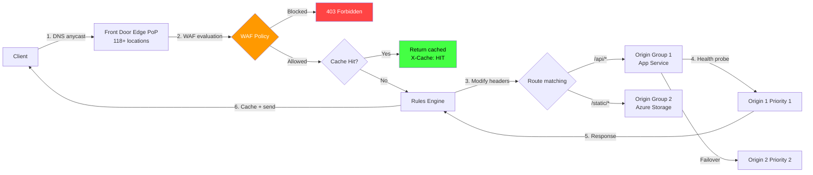

# Azure Front Door Standard/Premium: WAF, Caching y Rules Engine

## Resumen

Azure Front Door Standard/Premium es un CDN global con capacidades integradas de **WAF (Web Application Firewall)**, **caching avanzado**, **rules engine** para manipulación de requests/responses y **anycast routing** desde 118+ PoPs Microsoft. Proporciona aceleración de aplicaciones HTTP/HTTPS, balanceo global, failover automático y protección DDoS L7, reemplazando a Front Door Classic y CDN from Microsoft (classic).

<!-- more -->

## ¿Qué es Azure Front Door Standard/Premium?

**Azure Front Door** es un **Application Delivery Network (ADN)** que combina:

- **Global load balancer**: Distribuye tráfico HTTP/HTTPS entre backends multi-región
- **CDN**: Cache estático/dinámico en 118+ edge locations Microsoft
- **WAF**: Protección contra OWASP Top 10, rate limiting, geo-filtering
- **SSL offloading**: Terminación TLS en edge, managed certificates
- **Rules engine**: Modificar headers, redirects, URL rewrites, route overrides

**Diferencias Standard vs Premium**:

| Característica | Standard | Premium |
|----------------|----------|---------|
| **Precio** | ~$35/mes base + $0.06/GB | ~$330/mes base + $0.18/GB |
| **WAF** | ❌ Solo con policy adicional | ✅ Managed DRS 2.1 incluido |
| **Private Link origins** | ❌ No | ✅ Sí (Azure Storage, App Service, Load Balancer) |
| **Managed certificates** | ✅ Sí | ✅ Sí |
| **Rules engine rules** | Max 100 | Max 100 |
| **Origin grupos** | 50 | 50 |
| **Cache TTL** | Max 366 días | Max 366 días |

**Cuándo usar Premium**:

- Backends privados (sin public IP) via Private Link
- WAF con managed rules (DRS 2.1) incluido
- Compliance que requiere tráfico privado end-to-end

## Arquitectura Azure Front Door



**Flujo de request**:

1. **DNS resolution**: Client resuelve `www.contoso.com` → IP anycast Front Door más cercano
2. **TLS handshake**: Edge PoP termina TLS (managed cert o BYOC)
3. **WAF evaluation**: Custom rules → Managed rules (DRS 2.1) → Allow/Block/Log
4. **Cache check**: Si `X-Cache: HIT` → respuesta desde edge (latencia <50ms)
5. **Route matching**: `/api/*` → backend API, `/images/*` → Storage CDN
6. **Rules engine**: Modificar headers (CORS, Security), URL rewrite, redirects
7. **Origin selection**: Health probe + priority + weighted routing
8. **Response caching**: TTL según `Cache-Control` o rule override

## Crear Front Door Standard con CLI

### Front Door profile + endpoint

```bash
# Variables
RESOURCE_GROUP="frontdoor-rg"
LOCATION="global"  # Front Door es servicio global
FD_NAME="contoso-fd-standard"
ENDPOINT_NAME="contoso-endpoint"

# Crear Front Door profile (Standard tier)
az afd profile create \
  --profile-name $FD_NAME \
  --resource-group $RESOURCE_GROUP \
  --sku Standard_AzureFrontDoor

# Crear endpoint (dominio *.azurefd.net)
az afd endpoint create \
  --profile-name $FD_NAME \
  --resource-group $RESOURCE_GROUP \
  --endpoint-name $ENDPOINT_NAME \
  --enabled-state Enabled

# Obtener hostname Front Door
FD_HOSTNAME=$(az afd endpoint show \
  --profile-name $FD_NAME \
  --resource-group $RESOURCE_GROUP \
  --endpoint-name $ENDPOINT_NAME \
  --query hostName -o tsv)

echo $FD_HOSTNAME
# contoso-endpoint-abc123.z01.azurefd.net
```

### Origin group + origins

```bash
# Crear origin group (backends)
az afd origin-group create \
  --profile-name $FD_NAME \
  --resource-group $RESOURCE_GROUP \
  --origin-group-name api-backends \
  --probe-path "/health" \
  --probe-protocol Https \
  --probe-interval-in-seconds 30 \
  --probe-request-type GET \
  --sample-size 4 \
  --successful-samples-required 3 \
  --additional-latency-in-milliseconds 50

# Agregar origin 1 (App Service West Europe)
az afd origin create \
  --profile-name $FD_NAME \
  --resource-group $RESOURCE_GROUP \
  --origin-group-name api-backends \
  --origin-name api-westeurope \
  --host-name api-westeurope.azurewebsites.net \
  --origin-host-header api-westeurope.azurewebsites.net \
  --priority 1 \
  --weight 100 \
  --enabled-state Enabled \
  --http-port 80 \
  --https-port 443

# Agregar origin 2 (App Service East US - failover)
az afd origin create \
  --profile-name $FD_NAME \
  --resource-group $RESOURCE_GROUP \
  --origin-group-name api-backends \
  --origin-name api-eastus \
  --host-name api-eastus.azurewebsites.net \
  --origin-host-header api-eastus.azurewebsites.net \
  --priority 2 \
  --weight 100 \
  --enabled-state Enabled
```

**Health probes**: Si origin 1 falla 2 de 4 probes (successful-samples-required=3), tráfico redirige a origin 2 automáticamente.

### Route con caching

```bash
# Crear route (asocia endpoint → origin group)
az afd route create \
  --profile-name $FD_NAME \
  --resource-group $RESOURCE_GROUP \
  --endpoint-name $ENDPOINT_NAME \
  --route-name api-route \
  --origin-group api-backends \
  --patterns-to-match "/api/*" \
  --supported-protocols Https \
  --forwarding-protocol HttpsOnly \
  --https-redirect Enabled \
  --enable-caching true \
  --query-string-caching-behavior IgnoreQueryString

# Route para archivos estáticos (Storage)
az afd origin-group create \
  --profile-name $FD_NAME \
  --resource-group $RESOURCE_GROUP \
  --origin-group-name static-storage \
  --probe-path "/" \
  --probe-protocol Https

az afd origin create \
  --profile-name $FD_NAME \
  --resource-group $RESOURCE_GROUP \
  --origin-group-name static-storage \
  --origin-name storage-account \
  --host-name contosostorage.blob.core.windows.net \
  --origin-host-header contosostorage.blob.core.windows.net \
  --priority 1 \
  --weight 100

az afd route create \
  --profile-name $FD_NAME \
  --resource-group $RESOURCE_GROUP \
  --endpoint-name $ENDPOINT_NAME \
  --route-name static-route \
  --origin-group static-storage \
  --patterns-to-match "/images/*" "/css/*" "/js/*" \
  --supported-protocols Https \
  --enable-caching true \
  --query-string-caching-behavior UseQueryString
```

## Configuración de caching avanzado

### Query string behaviors

```bash
# Ignore query strings (mismo cache key para ?v=1 y ?v=2)
az afd route update \
  --profile-name $FD_NAME \
  --resource-group $RESOURCE_GROUP \
  --endpoint-name $ENDPOINT_NAME \
  --route-name api-route \
  --query-string-caching-behavior IgnoreQueryString

# Include specific query strings (cache key diferente para ?userId=123)
az afd route update \
  --profile-name $FD_NAME \
  --resource-group $RESOURCE_GROUP \
  --endpoint-name $ENDPOINT_NAME \
  --route-name api-route \
  --query-string-caching-behavior IncludeSpecifiedQueryStrings \
  --query-parameters "userId" "lang"

# Exclude specific query strings (ignora ?sessionId pero respeta ?version)
az afd route update \
  --profile-name $FD_NAME \
  --resource-group $RESOURCE_GROUP \
  --endpoint-name $ENDPOINT_NAME \
  --route-name api-route \
  --query-string-caching-behavior ExcludeSpecifiedQueryStrings \
  --query-parameters "sessionId" "tracking"
```

**Ejemplo**: `/api/products?version=2&sessionId=abc123`

- **IgnoreQueryString**: Cache key = `/api/products` (ignora ambos params)
- **IncludeSpecifiedQueryStrings** (`version`): Cache key = `/api/products?version=2`
- **ExcludeSpecifiedQueryStrings** (`sessionId`): Cache key = `/api/products?version=2`

### Override cache duration con Rules Engine

```json
{
  "name": "cache-static-1year",
  "order": 1,
  "conditions": [
    {
      "name": "UrlPath",
      "parameters": {
        "operator": "BeginsWith",
        "matchValues": ["/images/", "/css/", "/js/"],
        "transforms": ["Lowercase"]
      }
    }
  ],
  "actions": [
    {
      "name": "RouteConfigurationOverride",
      "parameters": {
        "cacheConfiguration": {
          "cacheBehavior": "OverrideAlways",
          "cacheDuration": "365.00:00:00",
          "isCompressionEnabled": "Enabled"
        }
      }
    }
  ]
}
```

```bash
# Crear rule set
az afd rule-set create \
  --profile-name $FD_NAME \
  --resource-group $RESOURCE_GROUP \
  --rule-set-name cache-rules

# Agregar rule
az afd rule create \
  --profile-name $FD_NAME \
  --resource-group $RESOURCE_GROUP \
  --rule-set-name cache-rules \
  --rule-name cache-static-1year \
  --order 1 \
  --match-variable UrlPath \
  --operator BeginsWith \
  --match-values "/images/" "/css/" "/js/" \
  --action-name RouteConfigurationOverride \
  --cache-behavior OverrideAlways \
  --cache-duration "365.00:00:00"

# Asociar rule set a route
az afd route update \
  --profile-name $FD_NAME \
  --resource-group $RESOURCE_GROUP \
  --endpoint-name $ENDPOINT_NAME \
  --route-name static-route \
  --rule-sets cache-rules
```

## Rules Engine casos de uso

### 1. Redirect HTTP → HTTPS

```bash
az afd rule create \
  --profile-name $FD_NAME \
  --resource-group $RESOURCE_GROUP \
  --rule-set-name redirects \
  --rule-name http-to-https \
  --order 1 \
  --match-variable RequestScheme \
  --operator Equal \
  --match-values "HTTP" \
  --action-name UrlRedirect \
  --redirect-type Moved \
  --redirect-protocol Https
```

### 2. Geo-blocking (allow solo EU)

```bash
az afd rule create \
  --profile-name $FD_NAME \
  --resource-group $RESOURCE_GROUP \
  --rule-set-name geo-filter \
  --rule-name allow-only-eu \
  --order 1 \
  --match-variable RemoteAddress \
  --operator GeoMatch \
  --match-values "FR" "DE" "ES" "IT" "NL" \
  --negate-condition true \
  --action-name UrlRedirect \
  --redirect-type Found \
  --destination-fragment "" \
  --custom-path "/blocked.html"
```

**Lógica**: Si `RemoteAddress` **no** está en (FR, DE, ES, IT, NL) → redirect `/blocked.html`.

### 3. A/B testing con headers

```bash
# Rule 1: Usuarios con header X-Beta-Tester → backend canary
az afd rule create \
  --profile-name $FD_NAME \
  --resource-group $RESOURCE_GROUP \
  --rule-set-name ab-testing \
  --rule-name route-to-canary \
  --order 1 \
  --match-variable RequestHeader \
  --operator Equal \
  --selector "X-Beta-Tester" \
  --match-values "true" \
  --action-name RouteConfigurationOverride \
  --origin-group-override canary-backends

# Rule 2: 10% tráfico random → canary
az afd rule create \
  --profile-name $FD_NAME \
  --resource-group $RESOURCE_GROUP \
  --rule-set-name ab-testing \
  --rule-name route-10pct-canary \
  --order 2 \
  --match-variable RequestUri \
  --operator Any \
  --action-name RouteConfigurationOverride \
  --origin-group-override canary-backends \
  --weight 10
```

### 4. Security headers

```bash
az afd rule create \
  --profile-name $FD_NAME \
  --resource-group $RESOURCE_GROUP \
  --rule-set-name security-headers \
  --rule-name add-security-headers \
  --order 1 \
  --match-variable RequestUri \
  --operator Any \
  --action-name ModifyResponseHeader \
  --header-action Append \
  --header-name "Strict-Transport-Security" \
  --header-value "max-age=31536000; includeSubDomains; preload"

# Agregar más headers (X-Content-Type-Options, X-Frame-Options, etc.)
az afd rule update \
  --profile-name $FD_NAME \
  --resource-group $RESOURCE_GROUP \
  --rule-set-name security-headers \
  --rule-name add-security-headers \
  --actions '[
    {
      "name": "ModifyResponseHeader",
      "parameters": {
        "headerAction": "Append",
        "headerName": "X-Content-Type-Options",
        "value": "nosniff"
      }
    },
    {
      "name": "ModifyResponseHeader",
      "parameters": {
        "headerAction": "Append",
        "headerName": "X-Frame-Options",
        "value": "DENY"
      }
    }
  ]'
```

## WAF Configuration (Premium)

### Crear WAF policy con managed rules (DRS 2.1)

```bash
# Crear WAF policy (Premium tier incluye managed rules)
az network front-door waf-policy create \
  --name contoso-waf-policy \
  --resource-group $RESOURCE_GROUP \
  --sku Premium_AzureFrontDoor \
  --mode Prevention

# Habilitar Default Rule Set 2.1 (OWASP Core Rule Set)
az network front-door waf-policy managed-rules add \
  --policy-name contoso-waf-policy \
  --resource-group $RESOURCE_GROUP \
  --type Microsoft_DefaultRuleSet \
  --version 2.1

# Habilitar Bot Manager (bloquea bad bots)
az network front-door waf-policy managed-rules add \
  --policy-name contoso-waf-policy \
  --resource-group $RESOURCE_GROUP \
  --type Microsoft_BotManagerRuleSet \
  --version 1.0

# Asociar WAF policy a Front Door domain
az afd security-policy create \
  --profile-name $FD_NAME \
  --resource-group $RESOURCE_GROUP \
  --security-policy-name default-security-policy \
  --domains "/subscriptions/.../providers/Microsoft.Cdn/profiles/$FD_NAME/afdEndpoints/$ENDPOINT_NAME" \
  --waf-policy "/subscriptions/.../resourceGroups/$RESOURCE_GROUP/providers/Microsoft.Network/frontdoorwebapplicationfirewallpolicies/contoso-waf-policy"
```

### Custom WAF rules

```bash
# Rule: Block requests con SQL injection patterns
az network front-door waf-policy rule create \
  --policy-name contoso-waf-policy \
  --resource-group $RESOURCE_GROUP \
  --name BlockSQLInjection \
  --priority 100 \
  --rule-type MatchRule \
  --action Block \
  --match-condition \
    MatchVariable=QueryString \
    Operator=Contains \
    MatchValue="union" \
    MatchValue="select" \
    MatchValue="drop" \
    Transform=Lowercase

# Rule: Rate limit 100 req/min por IP
az network front-door waf-policy rule create \
  --policy-name contoso-waf-policy \
  --resource-group $RESOURCE_GROUP \
  --name RateLimitPerIP \
  --priority 200 \
  --rule-type RateLimitRule \
  --action Block \
  --rate-limit-duration-in-minutes 1 \
  --rate-limit-threshold 100 \
  --match-condition \
    MatchVariable=SocketAddr \
    Operator=IPMatch \
    MatchValue="0.0.0.0/0"
```

### WAF exclusions (evitar false positives)

```bash
# Excluir query parameter "search" de SQL injection detection
az network front-door waf-policy managed-rule-override create \
  --policy-name contoso-waf-policy \
  --resource-group $RESOURCE_GROUP \
  --type Microsoft_DefaultRuleSet \
  --version 2.1 \
  --rule-group-name SQLI \
  --rule-id 942100 \
  --action Block \
  --exclusions \
    MatchVariable=QueryStringArgNames \
    Operator=Equals \
    Selector="search"
```

## Custom domain + managed certificate

### Agregar custom domain

```bash
# Crear custom domain en Front Door
CUSTOM_DOMAIN="www.contoso.com"

az afd custom-domain create \
  --profile-name $FD_NAME \
  --resource-group $RESOURCE_GROUP \
  --custom-domain-name contoso-custom \
  --host-name $CUSTOM_DOMAIN \
  --minimum-tls-version TLS12 \
  --certificate-type ManagedCertificate

# Obtener validation record (DNS TXT)
VALIDATION_TOKEN=$(az afd custom-domain show \
  --profile-name $FD_NAME \
  --resource-group $RESOURCE_GROUP \
  --custom-domain-name contoso-custom \
  --query validationProperties.validationToken -o tsv)

echo "Agregar DNS TXT record:"
echo "_dnsauth.$CUSTOM_DOMAIN TXT $VALIDATION_TOKEN"

# Esperar validación (manual: agregar TXT record en DNS provider)
# Puede tardar 10-30 min

# Asociar custom domain a endpoint
az afd route update \
  --profile-name $FD_NAME \
  --resource-group $RESOURCE_GROUP \
  --endpoint-name $ENDPOINT_NAME \
  --route-name api-route \
  --custom-domains "/subscriptions/.../providers/Microsoft.Cdn/profiles/$FD_NAME/customDomains/contoso-custom"

# Actualizar DNS CNAME (apunta a Front Door)
echo "Agregar DNS CNAME record:"
echo "$CUSTOM_DOMAIN CNAME $FD_HOSTNAME"
```

**Flujo validación**:

1. Crear custom domain → Azure genera `validationToken`
2. Agregar DNS TXT: `_dnsauth.www.contoso.com` → `xyz123...`
3. Azure verifica TXT (10-30 min)
4. Estado cambia a `Approved`
5. Managed certificate emitido automáticamente (30-60 min)
6. Agregar CNAME: `www.contoso.com` → `contoso-endpoint-abc123.z01.azurefd.net`

## Monitoreo y diagnóstico

### Habilitar diagnostics logs

```bash
# Crear Log Analytics workspace
WORKSPACE_NAME="frontdoor-logs"

az monitor log-analytics workspace create \
  --resource-group $RESOURCE_GROUP \
  --workspace-name $WORKSPACE_NAME \
  --location westeurope

WORKSPACE_ID=$(az monitor log-analytics workspace show \
  --resource-group $RESOURCE_GROUP \
  --workspace-name $WORKSPACE_NAME \
  --query id -o tsv)

# Habilitar diagnostic settings
az monitor diagnostic-settings create \
  --name frontdoor-diagnostics \
  --resource "/subscriptions/.../resourceGroups/$RESOURCE_GROUP/providers/Microsoft.Cdn/profiles/$FD_NAME" \
  --logs '[
    {
      "category": "FrontDoorAccessLog",
      "enabled": true
    },
    {
      "category": "FrontDoorHealthProbeLog",
      "enabled": true
    },
    {
      "category": "FrontDoorWebApplicationFirewallLog",
      "enabled": true
    }
  ]' \
  --workspace $WORKSPACE_ID
```

### KQL queries útiles

```kql
// Requests por status code (últimas 24h)
AzureDiagnostics
| where TimeGenerated >= ago(24h)
| where Category == "FrontDoorAccessLog"
| summarize count() by httpStatusCode_d
| render piechart

// Cache hit ratio
AzureDiagnostics
| where Category == "FrontDoorAccessLog"
| extend cacheStatus = column_ifexists("cacheStatus_s", "")
| summarize
    Hits = countif(cacheStatus contains "HIT"),
    Total = count()
| extend HitRatio = round(Hits * 100.0 / Total, 2)

// Top 10 IPs bloqueadas por WAF
AzureDiagnostics
| where Category == "FrontDoorWebApplicationFirewallLog"
| where action_s == "Block"
| summarize count() by clientIP_s
| top 10 by count_
| render barchart

// Latency p50, p95, p99 por origin
AzureDiagnostics
| where Category == "FrontDoorAccessLog"
| summarize
    p50 = percentile(originLatency_d, 50),
    p95 = percentile(originLatency_d, 95),
    p99 = percentile(originLatency_d, 99)
  by originName_s
| order by p99 desc

// Health probe failures
AzureDiagnostics
| where Category == "FrontDoorHealthProbeLog"
| where healthProbeStatus_s != "Healthy"
| project TimeGenerated, originName_s, healthProbeStatus_s, httpStatusCode_d
| order by TimeGenerated desc
```

## Troubleshooting

### Problema: Cache siempre MISS (X-Cache: MISS)

**Síntomas**:

```bash
curl -I https://www.contoso.com/images/logo.png
# X-Cache: MISS
```

**Causas comunes**:

1. **Origin retorna `Cache-Control: no-cache`**:

```bash
# Verificar headers origin
curl -I https://origin.azurewebsites.net/images/logo.png
# Cache-Control: no-cache, no-store

# Solución: Override con rules engine
az afd rule create \
  --profile-name $FD_NAME \
  --resource-group $RESOURCE_GROUP \
  --rule-set-name cache-override \
  --rule-name force-cache-images \
  --match-variable UrlFileExtension \
  --operator Equal \
  --match-values "jpg" "png" "gif" "svg" \
  --action-name RouteConfigurationOverride \
  --cache-behavior OverrideAlways \
  --cache-duration "7.00:00:00"
```

2. **Query strings únicos** (ej: `?timestamp=...`):

```bash
# Solución: Ignore query strings
az afd route update \
  --profile-name $FD_NAME \
  --resource-group $RESOURCE_GROUP \
  --endpoint-name $ENDPOINT_NAME \
  --route-name static-route \
  --query-string-caching-behavior IgnoreQueryString
```

3. **Request headers `Authorization` o `Cookie`**:

```kql
// Verificar si requests tienen headers que previenen caching
AzureDiagnostics
| where Category == "FrontDoorAccessLog"
| where cacheStatus_s == "MISS"
| extend hasAuth = column_ifexists("requestHeaders_Authorization_s", "") != ""
| where hasAuth
| summarize count() by url_s
```

### Problema: WAF bloquea requests legítimos (false positive)

**Logs**:

```kql
AzureDiagnostics
| where Category == "FrontDoorWebApplicationFirewallLog"
| where action_s == "Block"
| where clientIP_s == "203.0.113.45"  // IP legítimo
| project TimeGenerated, ruleName_s, ruleSetType_s, details_message_s
```

**Ejemplo output**: Rule `942100` (SQL Injection) bloqueó `/search?q=select+your+plan`.

**Solución**: Excluir query param `q` de rule 942100:

```bash
az network front-door waf-policy managed-rule-override create \
  --policy-name contoso-waf-policy \
  --resource-group $RESOURCE_GROUP \
  --type Microsoft_DefaultRuleSet \
  --version 2.1 \
  --rule-group-name SQLI \
  --rule-id 942100 \
  --action Block \
  --exclusions \
    MatchVariable=QueryStringArgNames \
    Operator=Equals \
    Selector="q"
```

### Problema: Origin health probe failures

**Logs**:

```kql
AzureDiagnostics
| where Category == "FrontDoorHealthProbeLog"
| where originName_s == "api-westeurope"
| where healthProbeStatus_s != "Healthy"
| summarize count() by httpStatusCode_d, healthProbeStatus_s
```

**Causas**:

1. **Probe path retorna 404**:

```bash
# Verificar probe path manualmente
curl -I https://api-westeurope.azurewebsites.net/health
# HTTP/1.1 404 Not Found

# Solución: Cambiar probe path
az afd origin-group update \
  --profile-name $FD_NAME \
  --resource-group $RESOURCE_GROUP \
  --origin-group-name api-backends \
  --probe-path "/api/health"
```

2. **Firewall origin bloquea Front Door IPs**:

```bash
# Obtener IPs Front Door (service tag AzureFrontDoor.Backend)
az network list-service-tags --location westeurope \
  --query "values[?name=='AzureFrontDoor.Backend'].properties.addressPrefixes" -o tsv

# Agregar a App Service allowed IPs
az webapp config access-restriction add \
  --resource-group prod-rg \
  --name api-westeurope \
  --rule-name allow-frontdoor \
  --action Allow \
  --priority 100 \
  --service-tag AzureFrontDoor.Backend
```

## Casos de uso empresarial

### 1. E-commerce global con failover multi-región

**Arquitectura**:

```
Front Door
├── Origin Group: web-tier (priority-based failover)
│   ├── App Service West Europe (priority 1, weight 70%)
│   ├── App Service East US (priority 1, weight 30%)
│   └── App Service Southeast Asia (priority 2, weight 100%)
└── Origin Group: static-assets
    └── Azure Storage (CDN)
```

**Configuración**:

```bash
# Web tier con weighted load balancing + geo failover
az afd origin create \
  --profile-name $FD_NAME \
  --resource-group $RESOURCE_GROUP \
  --origin-group-name web-tier \
  --origin-name web-westeurope \
  --host-name web-westeurope.azurewebsites.net \
  --priority 1 \
  --weight 70 \
  --enabled-state Enabled

az afd origin create \
  --profile-name $FD_NAME \
  --resource-group $RESOURCE_GROUP \
  --origin-group-name web-tier \
  --origin-name web-eastus \
  --host-name web-eastus.azurewebsites.net \
  --priority 1 \
  --weight 30 \
  --enabled-state Enabled

az afd origin create \
  --profile-name $FD_NAME \
  --resource-group $RESOURCE_GROUP \
  --origin-group-name web-tier \
  --origin-name web-asia \
  --host-name web-asia.azurewebsites.net \
  --priority 2 \
  --weight 100 \
  --enabled-state Enabled
```

**Comportamiento**:

- Normal: 70% tráfico → West Europe, 30% → East US (latency-based)
- Si West Europe + East US fallan (health probes) → 100% → Southeast Asia
- Failover automático en 30-60 segundos

### 2. API throttling granular por cliente

```bash
# Rate limit: 1000 req/min para /api/premium (clientes pagados)
az network front-door waf-policy rule create \
  --policy-name contoso-waf-policy \
  --resource-group $RESOURCE_GROUP \
  --name RateLimitPremium \
  --priority 300 \
  --rule-type RateLimitRule \
  --action Block \
  --rate-limit-duration-in-minutes 1 \
  --rate-limit-threshold 1000 \
  --match-condition \
    MatchVariable=RequestUri \
    Operator=BeginsWith \
    MatchValue="/api/premium"

# Rate limit: 100 req/min para /api/free (clientes freemium)
az network front-door waf-policy rule create \
  --policy-name contoso-waf-policy \
  --resource-group $RESOURCE_GROUP \
  --name RateLimitFree \
  --priority 301 \
  --rule-type RateLimitRule \
  --action Block \
  --rate-limit-duration-in-minutes 1 \
  --rate-limit-threshold 100 \
  --match-condition \
    MatchVariable=RequestUri \
    Operator=BeginsWith \
    MatchValue="/api/free"
```

### 3. Private Link origin (Premium)

**Escenario**: Backend en private VNET sin public IP.

```bash
# Crear Private Link Service en origin VNET
az network private-link-service create \
  --name origin-pls \
  --resource-group origin-rg \
  --vnet-name origin-vnet \
  --subnet backend-subnet \
  --lb-frontend-ip-configs /subscriptions/.../loadBalancers/origin-lb/frontendIPConfigurations/frontend \
  --enable-proxy-protocol false

PLS_ID=$(az network private-link-service show \
  --name origin-pls \
  --resource-group origin-rg \
  --query id -o tsv)

# Agregar origin con Private Link (Premium tier)
az afd origin create \
  --profile-name $FD_NAME \
  --resource-group $RESOURCE_GROUP \
  --origin-group-name private-backends \
  --origin-name private-origin \
  --private-link-resource $PLS_ID \
  --private-link-location westeurope \
  --private-link-request-message "Front Door connection request" \
  --host-name 10.0.1.4 \
  --origin-host-header api.internal.contoso.com \
  --enabled-state Enabled

# Aprobar private endpoint connection (manual en origin side)
az network private-endpoint-connection approve \
  --resource-name origin-pls \
  --resource-group origin-rg \
  --name frontdoor-private-endpoint
```

## Costos

| Componente | Standard | Premium |
|------------|----------|---------|
| **Base mensual** | ~$35/mes | ~$330/mes |
| **Data transfer out (primeros 10TB)** | $0.060/GB | $0.180/GB |
| **Data transfer out (10-50TB)** | $0.035/GB | $0.140/GB |
| **Requests HTTP/HTTPS** | $0.0075/10K | $0.0075/10K |
| **Rules Engine executions** | $0.60/1M | $0.60/1M |
| **WAF policy** | +$30/mes | Incluido |
| **Managed certificate** | Incluido | Incluido |

**Ejemplo costos**:

- **Standard** + 100TB transfer + 100M requests = $35 + $4,850 + $75 = **$4,960/mes**
- **Premium** + 100TB transfer + 100M requests = $330 + $15,800 + $75 = **$16,205/mes**

**Cuándo vale Premium**:

- Private Link origins (no alternativa en Standard)
- Managed DRS 2.1 (vs $30/mes policy en Standard)
- Compliance end-to-end encryption

## Mejores prácticas

1. **Cache agresivamente statics**: Max 365 días para `/images`, `/css`, `/js`
2. **Query string caching**: `IncludeSpecifiedQueryStrings` solo params relevantes
3. **Compression**: Habilitar en Rules Engine (reduce bandwidth 70%)
4. **Health probe path**: `/health` ligero (no DB query), retorna 200 en <1s
5. **WAF en Prevention mode**: Después de 7 días en Detection (tune false positives)
6. **Custom domain validation**: Automatizar con Azure DNS + API
7. **Monitoring**: Alertas si cache hit ratio <80% o error rate >1%

## Limitaciones

- **Max rules per rule set**: 100
- **Max rule sets per profile**: 100
- **Max cache duration**: 366 días (no configurable >366 días)
- **Max origin groups**: 50
- **Max origins per group**: 50
- **WebSocket**: Soportado, pero no cacheable
- **Private Link origins**: Solo Premium tier

## Referencias

- [Azure Front Door Documentation (Oficial)](https://learn.microsoft.com/en-us/azure/frontdoor/)
- [Caching with Front Door](https://learn.microsoft.com/en-us/azure/frontdoor/front-door-caching)
- [Rules Engine Actions](https://learn.microsoft.com/en-us/azure/frontdoor/front-door-rules-engine-actions)
- [WAF on Azure Front Door](https://learn.microsoft.com/en-us/azure/web-application-firewall/afds/afds-overview)
- [Front Door Routing Architecture](https://learn.microsoft.com/en-us/azure/frontdoor/front-door-routing-architecture)
