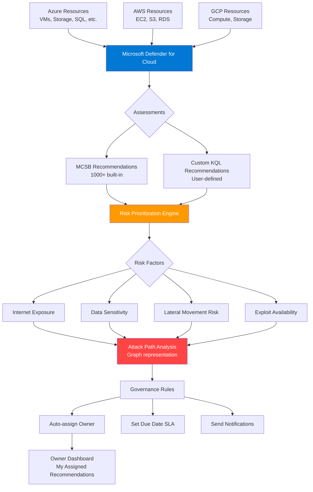

# Microsoft Defender for Cloud CSPM: Governance y Attack Paths

## Resumen

**Defender CSPM (Cloud Security Posture Management)** proporciona visibilidad avanzada de riesgos en entornos Azure, AWS y GCP mediante **governance rules** (asignación automática de owners y SLAs), **attack path analysis** (modelado de rutas de ataque explotables), **Cloud Security Explorer** (queries para detectar misconfiguraciones) y **risk prioritization** de recommendations. Plan Defender CSPM ~$12/recurso/mes.

<!-- more -->

## ¿Qué es Defender CSPM?

**Cloud Security Posture Management** es una disciplina de seguridad que:

- **Evalúa configuraciones**: Continuous assessment contra Microsoft Cloud Security Benchmark (MCSB) + regulatory standards
- **Prioriza por riesgo**: No solo severity (High/Medium/Low) sino **risk level** (Critical/High/Medium/Low) basado en exposure, attack paths, data sensitivity
- **Asigna responsabilidad**: Governance rules automatizan owner assignment + due dates + SLA tracking
- **Modela amenazas**: Attack path analysis identifica rutas explotables (Internet → VM → Storage con secretos)

**Foundational CSPM (Gratis) vs Defender CSPM (Pago)**:

| Característica | Foundational (Free) | Defender CSPM |
|----------------|---------------------|---------------|
| **Secure Score** | ✅ Sí | ✅ Sí |
| **Recommendations** | ✅ MCSB básico | ✅ MCSB + custom KQL |
| **Regulatory compliance** | ❌ No | ✅ CIS, PCI-DSS, HIPAA, ISO 27001 |
| **Governance rules** | ❌ No | ✅ Auto-assign owner + SLA |
| **Attack path analysis** | ❌ No | ✅ Graph-based risk modeling |
| **Cloud Security Explorer** | ❌ No | ✅ Advanced queries |
| **Agentless scanning** | ❌ No | ✅ Disk scanning sin agent |
| **Precio** | **Gratis** | ~$12/recurso/mes |

**Cuándo habilitar Defender CSPM**:

- Equipos >10 personas (necesitas governance + accountability)
- Multi-cloud (Azure + AWS + GCP en un dashboard)
- Compliance regulatorio (CIS, PCI-DSS, HIPAA, SOC 2)
- Recursos críticos expuestos a internet

## Arquitectura Defender CSPM



## Habilitar Defender CSPM

### Activar plan en subscription

```bash
# Variables
SUBSCRIPTION_ID="abc123-def456-..."
RESOURCE_GROUP="defender-cspm-rg"

# Habilitar Defender CSPM (subscription-level)
az security pricing create \
  --name CloudPosture \
  --tier Standard \
  --subscription $SUBSCRIPTION_ID

# Verificar plan activo
az security pricing show \
  --name CloudPosture \
  --subscription $SUBSCRIPTION_ID \
  --query '{tier:pricingTier, status:freeTrialRemainingTime}'
```

**Output esperado**:

```json
{
  "tier": "Standard",
  "status": "PT0S"  // Free trial expirado, cobrando
}
```

### Habilitar agentless scanning

```bash
# Agentless VM scanning (disk snapshots para detect secrets, vulnerabilities)
az security setting update \
  --name WDATP \
  --enabled true \
  --subscription $SUBSCRIPTION_ID

# Agentless container scanning (ACR images)
az security setting update \
  --name SentinelContainers \
  --enabled true \
  --subscription $SUBSCRIPTION_ID
```

## Governance Rules

### Crear regla por severity

**Escenario**: Auto-assign recommendations **High severity** → Security Team, due date 7 días.

```bash
# Crear governance rule (Portal o API)
# Portal: Defender for Cloud → Environment settings → Governance rules → Create rule

# Via API (JSON payload)
curl -X PUT "https://management.azure.com/subscriptions/$SUBSCRIPTION_ID/providers/Microsoft.Security/governanceRules/high-severity-auto-assign?api-version=2022-01-01-preview" \
  -H "Authorization: Bearer $TOKEN" \
  -H "Content-Type: application/json" \
  -d '{
    "properties": {
      "displayName": "Auto-assign High Severity Recommendations",
      "description": "Assign High severity recommendations to Security Team with 7-day SLA",
      "priority": 100,
      "isDisabled": false,
      "conditionSets": [
        {
          "conditions": [
            {
              "property": "$.AssessmentKey",
              "value": "*",
              "operator": "Contains"
            },
            {
              "property": "$.Severity",
              "value": "High",
              "operator": "Equals"
            }
          ]
        }
      ],
      "ownerSource": {
        "type": "Manually",
        "value": "security-team@contoso.com"
      },
      "governanceEmailNotification": {
        "disableOwnerEmailNotification": false,
        "disableManagerEmailNotification": false
      },
      "remediationTimeframe": "7.00:00:00",
      "isGracePeriod": false
    }
  }'
```

**Configuración visual (Portal)**:

1. **Priority**: 100 (rules con menor número ejecutan primero)
2. **Conditions**: Severity = High
3. **Owner**: Email estático `security-team@contoso.com`
4. **Remediation timeframe**: 7 días
5. **Notifications**: Email semanal a owner + manager con open/overdue tasks

### Governance rule por resource tag

**Escenario**: Resources con tag `Owner:john.doe@contoso.com` → auto-assign a ese owner.

```json
{
  "properties": {
    "displayName": "Auto-assign by Owner Tag",
    "priority": 200,
    "conditionSets": [
      {
        "conditions": [
          {
            "property": "$.ResourceTags.Owner",
            "operator": "Exists"
          }
        ]
      }
    ],
    "ownerSource": {
      "type": "ByResourceTag",
      "tagKey": "Owner"
    },
    "remediationTimeframe": "14.00:00:00"
  }
}
```

**Ventaja**: Escalable. 1000 recursos taggeados → 1000 owners automáticamente asignados.

### Governance rule por recommendation específica

**Escenario**: Recommendation "Storage accounts should restrict network access" → Networking Team, 30 días.

```json
{
  "properties": {
    "displayName": "Storage Network Restrictions to Network Team",
    "priority": 150,
    "conditionSets": [
      {
        "conditions": [
          {
            "property": "$.AssessmentKey",
            "value": "8b5c654c-fb5f-474b-93fb-a3b8e82c4b9c",
            "operator": "Equals"
          }
        ]
      }
    ],
    "ownerSource": {
      "type": "Manually",
      "value": "network-team@contoso.com"
    },
    "remediationTimeframe": "30.00:00:00"
  }
}
```

**Assessment Key**: Identificador único de recommendation (obtener desde Portal → Recommendation details).

## Ver assigned recommendations (Owner view)

### Portal

1. **Defender for Cloud** → **Recommendations**
2. **Add filter** → **Owner** → Select current user
3. Ver tabla:
   - **Recommendation**: Nombre
   - **Affected resources**: Cantidad
   - **Risk level**: Critical/High/Medium/Low
   - **Due date**: Fecha límite SLA
   - **Status**: On time / Overdue

### Azure CLI

```bash
# Listar recommendations asignadas a mí
MY_EMAIL="john.doe@contoso.com"

az graph query -q "
  securityresources
  | where type == 'microsoft.security/assessments'
  | where properties.metadata.owner == '$MY_EMAIL'
  | extend
      recommendation = properties.displayName,
      severity = properties.metadata.severity,
      status = properties.status.code,
      dueDate = properties.metadata.implementationEffort,
      resourceId = id
  | project recommendation, severity, status, dueDate, resourceId
" --subscription $SUBSCRIPTION_ID
```

### Modificar assignment (change owner o due date)

**Portal**:

1. Click recommendation
2. **Take action** → **Change owner & due date**
3. **Edit assignment**:
   - New owner: `jane.smith@contoso.com`
   - New remediation date: 2025-08-15
   - Justification: "Escalated to senior engineer - complex remediation"
4. **Save**

**API**:

```bash
curl -X PATCH "https://management.azure.com/subscriptions/$SUBSCRIPTION_ID/providers/Microsoft.Security/assessments/{assessmentId}/governanceAssignments/default?api-version=2022-01-01-preview" \
  -H "Authorization: Bearer $TOKEN" \
  -H "Content-Type: application/json" \
  -d '{
    "properties": {
      "owner": "jane.smith@contoso.com",
      "remediationDueDate": "2025-08-15T00:00:00Z",
      "remediationEta": {
        "eta": "2025-08-10T00:00:00Z",
        "justification": "Complex remediation requiring infrastructure changes"
      }
    }
  }'
```

## Attack Path Analysis

### ¿Qué es un attack path?

**Attack path** = Secuencia de recursos conectados que un atacante puede explotar para alcanzar un objetivo valioso (ej: data exfiltration).

**Ejemplo attack path**:

```
Internet → Public IP → NSG (port 22 open) → VM (SSH password auth) →
Managed Identity (Storage Blob Contributor) → Storage Account (no firewall) →
Sensitive data blobs
```

**Defender CSPM** modela estos paths automáticamente usando:

- **Internet exposure**: Public IPs, open ports
- **Identities**: Managed identities, service principals con permisos excesivos
- **Network paths**: NSG rules, peering, ExpressRoute
- **Data classification**: Sensitive data discovery (PII, credentials)

### Ver attack paths (Portal)

**Portal**:

1. **Defender for Cloud** → **Attack path analysis**
2. Dashboard muestra:
   - **Critical paths**: Internet → Crown jewel (ej: production SQL DB)
   - **High risk paths**: Lateral movement potential
   - **Medium risk paths**: Vulnerabilities explotables

**Example path detail**:

```
Path: Internet Exposed VM with Credentials Access to Storage

1. Entry point: VM "web-vm-prod" (40.112.34.56:80)
   Risk: Public HTTP server

2. Vulnerability: CVE-2024-1234 (Apache 2.4.49 Path Traversal)
   Exploit available: ✅ Yes (Metasploit module)

3. Credential access: Managed Identity attached
   Permissions: Storage Blob Data Contributor

4. Lateral movement: VM can access VNET 10.0.0.0/16

5. Target: Storage account "proddata" contains:
   - Customer PII (detected)
   - Credit card numbers (detected)
   - API keys (detected)

Remediation steps:
  1. Close port 80 or add WAF
  2. Patch Apache to 2.4.50+
  3. Remove Managed Identity Storage Blob Contributor (use Blob Data Reader)
  4. Enable Storage firewall (allow only specific subnets)
  5. Enable Storage soft delete + immutability
```

### Queries attack paths (Cloud Security Explorer)

**Ejemplo query**: "VMs expuestas a internet con identidades que pueden leer secrets de Key Vault".

```kql
// Cloud Security Explorer query
Resources
| where type == "microsoft.compute/virtualmachines"
| where properties.networkProfile.networkInterfaces[0].properties.ipConfigurations[0].properties.publicIPAddress != ""
| extend managedIdentityId = identity.principalId
| join kind=inner (
    PolicyResources
    | where type == "microsoft.authorization/roleassignments"
    | where properties.roleDefinitionId contains "Key Vault Secrets User"
  ) on $left.managedIdentityId == $right.properties.principalId
| project vmName=name, publicIP=properties.networkProfile.networkInterfaces[0].properties.ipConfigurations[0].properties.publicIPAddress.properties.ipAddress, keyVaultRole=properties.roleDefinitionId
```

**Salida**:

| vmName | publicIP | keyVaultRole |
|--------|----------|--------------|
| web-vm-01 | 20.50.10.5 | Key Vault Secrets User |
| api-vm-03 | 40.112.8.22 | Key Vault Secrets User |

**Acción**: Revisar si VMs realmente necesitan acceso a Key Vault. Si no, remover role assignment.

## Risk Prioritization de Recommendations

### Risk level vs Severity

**Severity** (tradicional):

- High/Medium/Low basado en **impacto teórico**
- Ejemplo: "SQL Server should have Azure Defender enabled" = High severity (siempre)

**Risk level** (Defender CSPM):

- Critical/High/Medium/Low basado en **exploitability real** en TU entorno
- Ejemplo: Mismo SQL Server:
  - Risk = **Critical** si: Exposed to internet + No firewall + Admin password weak
  - Risk = **Low** si: Private endpoint + Strong auth + No vulnerabilities

**Factores risk prioritization**:

1. **Internet exposure**: Public IP + open ports = higher risk
2. **Data sensitivity**: PII/secrets presente = higher risk
3. **Lateral movement**: Identities con permisos amplios = higher risk
4. **Exploit availability**: CVE con exploit público = higher risk
5. **Attack path**: Parte de attack path a crown jewel = higher risk

### Filtrar recommendations por risk level

```bash
# KQL query: Recommendations risk=Critical (últimas 24h)
az graph query -q "
  securityresources
  | where type == 'microsoft.security/assessments'
  | where properties.status.code == 'Unhealthy'
  | where properties.metadata.riskLevel == 'Critical'
  | where properties.timeGenerated >= ago(24h)
  | extend
      recommendation = properties.displayName,
      resource = tolower(id),
      riskFactors = properties.metadata.riskFactors
  | project recommendation, resource, riskFactors
" --subscription $SUBSCRIPTION_ID
```

**Example output**:

```json
[
  {
    "recommendation": "Virtual machines should encrypt temp disks, caches, and data flows",
    "resource": "/subscriptions/.../virtualmachines/web-vm-prod",
    "riskFactors": ["InternetExposure", "DataSensitivity", "AttackPath"]
  }
]
```

## Custom Recommendations con KQL

### Crear custom recommendation (Portal)

**Escenario**: Detectar Storage Accounts sin firewall habilitado.

1. **Defender for Cloud** → **Environment settings** → **Security policies**
2. **Custom recommendations** → **Create recommendation**
3. **Name**: "Storage accounts must have firewall enabled"
4. **Description**: "Public access should be restricted via network rules"
5. **Severity**: High
6. **Query** (KQL):

```kql
Resources
| where type == "microsoft.storage/storageaccounts"
| where properties.networkAcls.defaultAction == "Allow"
| project
    assessedResourceId = id,
    displayName = strcat("Storage account '", name, "' allows public access"),
    additionalData = bag_pack("publicNetworkAccess", "Enabled", "defaultAction", properties.networkAcls.defaultAction),
    remediationSteps = "1. Go to Storage account → Networking\n2. Set 'Public network access' to Disabled or Selected networks\n3. Add allowed VNET subnets or IP ranges"
```

7. **Remediation steps**:

```markdown
1. Portal: Storage account → **Networking**
2. **Public network access**: Select **Enabled from selected virtual networks and IP addresses**
3. Add **Virtual networks** (subnets permitidos)
4. Add **Firewall** IP ranges (corporate IPs)
5. **Save**

CLI:
```bash
az storage account update \
  --name mystorageaccount \
  --resource-group mygroup \
  --default-action Deny

az storage account network-rule add \
  --account-name mystorageaccount \
  --resource-group mygroup \
  --subnet /subscriptions/.../subnets/backend-subnet
```
```

8. **Assign to standard**: Microsoft Cloud Security Benchmark
9. **Create**

### Validar custom recommendation

```bash
# Esperar 4-6 horas para assessment run

# Listar recommendations custom
az graph query -q "
  securityresources
  | where type == 'microsoft.security/assessments'
  | where properties.metadata.category == 'Custom'
  | where properties.status.code == 'Unhealthy'
  | extend
      recommendation = properties.displayName,
      resource = tolower(id)
  | project recommendation, resource
" --subscription $SUBSCRIPTION_ID
```

## Monitoreo compliance dashboard

### Regulatory compliance

**Portal**: Defender for Cloud → **Regulatory compliance**

**Standards disponibles** (Defender CSPM):

- Microsoft Cloud Security Benchmark (MCSB) - incluido
- CIS Microsoft Azure Foundations Benchmark 1.4.0
- PCI-DSS 3.2.1
- ISO 27001:2013
- HIPAA/HITRUST
- SOC 2 Type 2
- NIST SP 800-53 Rev5

**Agregar standard**:

```bash
# Assign PCI-DSS standard
az security assessment-metadata list \
  --query "[?displayName=='PCI DSS 3.2.1'].name" -o tsv

# (Manual en Portal: Regulatory compliance → Add standards → PCI-DSS 3.2.1)
```

### Compliance score query

```kql
// Compliance % por standard
securityresources
| where type == "microsoft.security/regulatorycompliancestandards/regulatorycompliancecontrols/regulatorycomplianceassessments"
| extend
    standardName = split(id, '/')[10],
    controlName = split(id, '/')[12],
    complianceState = properties.state
| summarize
    Total = count(),
    Passed = countif(complianceState == 'Passed'),
    Failed = countif(complianceState == 'Failed')
  by standardName
| extend CompliancePercentage = round(Passed * 100.0 / Total, 2)
| project standardName, CompliancePercentage, Passed, Failed, Total
| order by CompliancePercentage asc
```

## Alertas y notificaciones

### Email notifications (governance)

**Portal**: Governance rule → **Settings** → **Email notifications**

- **Owner**: Weekly email con lista de on-time + overdue tasks
- **Manager**: Weekly email solo overdue tasks (si manager email encontrado en Azure AD)

**Deshabilitar notificaciones** (si owner no quiere emails):

```json
{
  "properties": {
    "governanceEmailNotification": {
      "disableOwnerEmailNotification": true,
      "disableManagerEmailNotification": false
    }
  }
}
```

### Azure Monitor alert (compliance dropped)

```bash
# Alert si Secure Score baja >5 puntos
az monitor metrics alert create \
  --name "alert-secure-score-drop" \
  --resource-group $RESOURCE_GROUP \
  --scopes "/subscriptions/$SUBSCRIPTION_ID/providers/Microsoft.Security/secureScores/default" \
  --condition "avg SecureScore < 85" \
  --window-size 1h \
  --evaluation-frequency 15m \
  --action email security-team@contoso.com \
  --description "Secure Score dropped below 85"
```

## Troubleshooting

### Problema: Governance rule no asigna owner

**Síntoma**: Rule creada, pero recommendations permanecen "Unassigned".

**Causa 1**: Priority conflict (otra rule con mayor priority asigna primero).

```kql
// Ver qué rule asignó cada recommendation
securityresources
| where type == "microsoft.security/assessments"
| extend ownerAssignedBy = properties.metadata.governanceRuleName
| summarize count() by ownerAssignedBy
```

**Solución**: Ajustar priority:

```bash
# Rule más específica (por recommendation ID) → priority baja (100)
# Rule genérica (por severity) → priority alta (500)
```

**Causa 2**: Resource tag `Owner` mal formateado.

```bash
# Tag debe ser email válido
az resource tag --tags Owner=john.doe@contoso.com --ids $RESOURCE_ID

# Verificar tag
az resource show --ids $RESOURCE_ID --query tags.Owner -o tsv
```

### Problema: Attack paths no aparecen

**Síntoma**: Portal "Attack path analysis" muestra vacío.

**Causa**: Agentless scanning deshabilitado o esperando primera escaneo (24-48h).

```bash
# Verificar agentless scanning enabled
az security setting show --name WDATP --subscription $SUBSCRIPTION_ID

# Forzar rescan (no existe comando, esperar ciclo automático 24h)
```

### Problema: Custom recommendation no ejecuta

**Causa**: Query KQL retorna 0 resultados o formato incorrecto.

**Validación**:

1. Portal → **Resource Graph Explorer**
2. Pegar query KQL
3. Ejecutar → Verificar columnas requeridas:
   - `assessedResourceId` (obligatorio)
   - `displayName` (obligatorio)
   - `additionalData` (opcional)
   - `remediationSteps` (opcional)

**Error común**: `project` falta `assessedResourceId`.

```kql
// ❌ INCORRECTO (falta assessedResourceId)
Resources
| where type == "microsoft.storage/storageaccounts"
| project name, properties.networkAcls.defaultAction

// ✅ CORRECTO
Resources
| where type == "microsoft.storage/storageaccounts"
| project
    assessedResourceId = id,
    displayName = strcat("Storage '", name, "' misconfigured")
```

## Casos de uso empresarial

### 1. Multi-team governance con SLA tracking

**Escenario**: 5 equipos (Networking, Security, Database, Apps, DevOps), cada uno con sus recommendations + SLAs.

**Governance rules**:

```json
[
  {
    "displayName": "Network Team - 30 días",
    "priority": 100,
    "conditions": [{"property": "$.ResourceType", "operator": "Contains", "value": "Network"}],
    "ownerSource": {"type": "Manually", "value": "network-team@contoso.com"},
    "remediationTimeframe": "30.00:00:00"
  },
  {
    "displayName": "Security Team - 7 días",
    "priority": 101,
    "conditions": [{"property": "$.Severity", "value": "High", "operator": "Equals"}],
    "ownerSource": {"type": "Manually", "value": "security-team@contoso.com"},
    "remediationTimeframe": "7.00:00:00"
  },
  {
    "displayName": "Database Team - 14 días",
    "priority": 102,
    "conditions": [{"property": "$.ResourceType", "operator": "Contains", "value": "Sql"}],
    "ownerSource": {"type": "Manually", "value": "dba-team@contoso.com"},
    "remediationTimeframe": "14.00:00:00"
  }
]
```

**Resultado**:

- **Networking Team**: 45 recommendations, 40 on-time, 5 overdue
- **Security Team**: 120 recommendations, 110 on-time, 10 overdue
- **Database Team**: 30 recommendations, 28 on-time, 2 overdue

**Governance report** (Portal): Gráfico barras muestra compliance % por equipo.

### 2. Cumplimiento PCI-DSS para e-commerce

**Requirement**: PCI-DSS 3.2.1 compliance para manejar credit cards.

```bash
# Assign PCI-DSS standard
# Portal: Regulatory compliance → Add standards → PCI-DSS 3.2.1

# Query: Failed controls PCI-DSS
az graph query -q "
  securityresources
  | where type == 'microsoft.security/regulatorycompliancestandards/regulatorycompliancecontrols/regulatorycomplianceassessments'
  | where split(id, '/')[10] == 'PCI-DSS-3.2.1'
  | where properties.state == 'Failed'
  | extend
      control = split(id, '/')[12],
      assessmentName = properties.description
  | project control, assessmentName
" --subscription $SUBSCRIPTION_ID
```

**Output**: 15 failed controls → Crear governance rule asignando cada control a Security Team con due date 30 días.

**Audit trail**: Git history de remediation steps + Azure Activity Log.

### 3. Attack path remediation automatizada

**Scenario**: Attack path detectado → Crear Azure DevOps work item → Auto-remediate con Terraform.

**Logic App workflow**:

```yaml
trigger:
  - Azure Defender alert "Critical attack path detected"

actions:
  1. Parse alert JSON (path details)
  2. Create Azure DevOps work item:
     - Title: "Remediate attack path: Internet → VM → Storage"
     - Assigned to: Security Team
     - Priority: Critical
  3. Run Azure Pipeline:
     - Terraform plan: Add NSG rule blocking public access
     - Terraform apply (after approval)
  4. Notify Teams channel
```

## Costos

| Componente | Precio mensual estimado |
|------------|-------------------------|
| Foundational CSPM | **Gratis** |
| Defender CSPM | ~$12/recurso/mes |
| Agentless scanning | Incluido en Defender CSPM |
| Custom recommendations (KQL) | Incluido |
| Governance rules | Incluido |
| Attack path analysis | Incluido |
| Regulatory compliance | Incluido |

**Ejemplo**:

- 100 VMs + 50 Storage Accounts + 20 SQL DBs = 170 recursos
- Defender CSPM = 170 x $12 = **$2,040/mes**

**Alternativa económica**:

- Defender CSPM solo en recursos críticos (prod, internet-facing)
- Foundational CSPM en dev/test (gratis)

## Mejores prácticas

1. **Governance rules por resource tag**: Escalable (auto-assign 1000+ owners)
2. **Priority order**: Específico (recommendation ID) < Genérico (severity)
3. **Grace period**: Activar para MCSB (no afecta Secure Score hasta overdue)
4. **Custom recommendations**: Validar KQL en Resource Graph Explorer primero
5. **Attack path remediation**: Priorizar paths a crown jewels (production DBs, storage con PII)
6. **Compliance dashboard**: Review semanal con stakeholders (trend up/down)
7. **Notifications**: Manager emails solo overdue (evitar noise)

## Limitaciones

- **Governance rules max**: 100 rules por subscription
- **Custom recommendations**: Query KQL max 10K resultados
- **Attack path refresh**: 24h (no real-time)
- **Risk prioritization**: Solo recursos con Defender plan enabled
- **Agentless scanning**: Solo Azure VMs (no on-premises)

## Referencias

- [Defender CSPM Overview (Oficial)](https://learn.microsoft.com/en-us/azure/defender-for-cloud/concept-cloud-security-posture-management)
- [Governance Rules Documentation](https://learn.microsoft.com/en-us/azure/defender-for-cloud/governance-rules)
- [Attack Path Analysis](https://learn.microsoft.com/en-us/azure/defender-for-cloud/concept-attack-path)
- [Cloud Security Explorer](https://learn.microsoft.com/en-us/azure/defender-for-cloud/how-to-manage-cloud-security-explorer)
- [Custom Recommendations with KQL](https://learn.microsoft.com/en-us/azure/defender-for-cloud/create-custom-recommendations)
