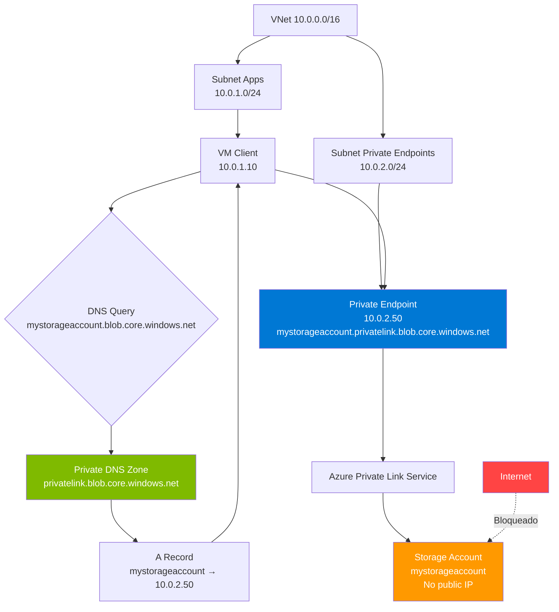

# Azure Private Link: Conectividad privada sin exposición pública

## Resumen

**Azure Private Link** permite acceder a servicios Azure (Storage, SQL Database, Key Vault) y servicios de terceros desde VNets privadas sin exponerlos a internet mediante **private endpoints** (IPs privadas en tu subnet). Integración DNS automática con **private DNS zones** (privatelink.*.core.windows.net) resuelve FQDNs a IPs privadas. Escenarios: VNet workloads, peered VNets, on-premises con DNS forwarder, hub-spoke topology.

<!-- more -->

## ¿Qué es Private Link?

**Private Link** es una tecnología de Azure que crea:

- **Private endpoints**: NICs virtuales con IP privada (ej: 10.1.2.50) en tu subnet
- **Mapeo a servicio Azure**: Private endpoint → Storage Account / SQL DB / Key Vault
- **Tráfico sin internet**: Comunicación directa por Microsoft backbone sin salir a internet
- **DNS integration**: FQDN servicio (ej: `mystorageaccount.blob.core.windows.net`) resuelve a IP privada en lugar de pública

**Sin Private Link** (acceso público):

```
Client (10.1.0.5) → Internet → Public IP (52.x.x.x) → Storage Account
                     ⚠️ Expuesto
```

**Con Private Link**:

```
Client (10.1.0.5) → Private Endpoint (10.1.2.50) → Storage Account
                     ✅ Nunca sale de VNet
```

**Servicios soportados** (100+):

- **Storage**: Blob, File, Queue, Table, Data Lake Gen2
- **Databases**: SQL Database, MySQL, PostgreSQL, Cosmos DB, Synapse Analytics
- **Compute**: Azure Functions, App Service, Container Registry
- **Security**: Key Vault, Backup, Managed HSM
- **AI**: Cognitive Services, OpenAI Service
- **Integration**: Service Bus, Event Hubs, Event Grid
- **Monitoring**: Monitor Private Link Scope (logs centralizados)

## Arquitectura Private Link



**Flujo conexión**:

1. VM **10.0.1.10** intenta conectar a `mystorageaccount.blob.core.windows.net`
2. **DNS query** → Resuelve a private DNS zone `privatelink.blob.core.windows.net`
3. **A record** retorna IP privada **10.0.2.50** (private endpoint)
4. VM conecta a **10.0.2.50** → tráfico dentro de VNet → Private Link Service → Storage Account
5. Storage Account firewall **bloqueado** para internet, solo permite tráfico desde private endpoint

## Crear Private Endpoint (Storage Account)

### Prerequisitos

```bash
# Variables
SUBSCRIPTION_ID="abc123-..."
RESOURCE_GROUP="privatelink-demo-rg"
LOCATION="westeurope"
VNET_NAME="demo-vnet"
SUBNET_APPS="subnet-apps"
SUBNET_PE="subnet-privateendpoints"
STORAGE_ACCOUNT="mystorageacct$(date +%s)"  # Nombre único

# Crear resource group
az group create --name $RESOURCE_GROUP --location $LOCATION

# Crear VNet con 2 subnets
az network vnet create \
  --name $VNET_NAME \
  --resource-group $RESOURCE_GROUP \
  --address-prefixes 10.0.0.0/16 \
  --subnet-name $SUBNET_APPS \
  --subnet-prefixes 10.0.1.0/24

az network vnet subnet create \
  --vnet-name $VNET_NAME \
  --resource-group $RESOURCE_GROUP \
  --name $SUBNET_PE \
  --address-prefixes 10.0.2.0/24
```

### Crear Storage Account (sin acceso público)

```bash
# Crear Storage Account
az storage account create \
  --name $STORAGE_ACCOUNT \
  --resource-group $RESOURCE_GROUP \
  --location $LOCATION \
  --sku Standard_LRS \
  --kind StorageV2 \
  --allow-blob-public-access false

# Bloquear acceso público (firewall deny all)
az storage account update \
  --name $STORAGE_ACCOUNT \
  --resource-group $RESOURCE_GROUP \
  --default-action Deny \
  --public-network-access Disabled
```

**Resultado**: Storage Account ahora **inaccesible desde internet**:

```bash
# Test conectividad pública (debe fallar)
curl https://$STORAGE_ACCOUNT.blob.core.windows.net/
# Error: "This request is not authorized to perform this operation."
```

### Crear Private Endpoint

```bash
# Obtener Storage Account resource ID
STORAGE_ID=$(az storage account show \
  --name $STORAGE_ACCOUNT \
  --resource-group $RESOURCE_GROUP \
  --query id -o tsv)

# Crear Private Endpoint para Blob service
az network private-endpoint create \
  --name "pe-${STORAGE_ACCOUNT}-blob" \
  --resource-group $RESOURCE_GROUP \
  --vnet-name $VNET_NAME \
  --subnet $SUBNET_PE \
  --private-connection-resource-id $STORAGE_ID \
  --group-ids blob \
  --connection-name "pe-connection-blob"

# Obtener IP privada asignada
PRIVATE_IP=$(az network private-endpoint show \
  --name "pe-${STORAGE_ACCOUNT}-blob" \
  --resource-group $RESOURCE_GROUP \
  --query 'customDnsConfigs[0].ipAddresses[0]' -o tsv)

echo "Private Endpoint IP: $PRIVATE_IP"
# Output: Private Endpoint IP: 10.0.2.4
```

### Configurar DNS (Private DNS Zone)

```bash
# Crear Private DNS Zone para Blob Storage
az network private-dns zone create \
  --resource-group $RESOURCE_GROUP \
  --name "privatelink.blob.core.windows.net"

# Vincular Private DNS Zone a VNet
az network private-dns link vnet create \
  --resource-group $RESOURCE_GROUP \
  --zone-name "privatelink.blob.core.windows.net" \
  --name "link-${VNET_NAME}" \
  --virtual-network $VNET_NAME \
  --registration-enabled false

# Crear DNS record (automático con private-dns-zone-group)
az network private-endpoint dns-zone-group create \
  --resource-group $RESOURCE_GROUP \
  --endpoint-name "pe-${STORAGE_ACCOUNT}-blob" \
  --name "default" \
  --private-dns-zone $(az network private-dns zone show \
      --resource-group $RESOURCE_GROUP \
      --name "privatelink.blob.core.windows.net" \
      --query id -o tsv) \
  --zone-name "privatelink.blob.core.windows.net"
```

**Resultado**: DNS record `mystorageacct.privatelink.blob.core.windows.net → 10.0.2.4` creado automáticamente.

### Validar conectividad desde VM

```bash
# Crear VM en subnet-apps
az vm create \
  --name vm-test \
  --resource-group $RESOURCE_GROUP \
  --image Ubuntu2204 \
  --vnet-name $VNET_NAME \
  --subnet $SUBNET_APPS \
  --admin-username azureuser \
  --generate-ssh-keys \
  --public-ip-address ""  # Sin IP pública

# SSH via Bastion o conectar con Azure CLI
az vm run-command invoke \
  --name vm-test \
  --resource-group $RESOURCE_GROUP \
  --command-id RunShellScript \
  --scripts "
    nslookup ${STORAGE_ACCOUNT}.blob.core.windows.net
    curl https://${STORAGE_ACCOUNT}.blob.core.windows.net/?comp=list
  "
```

**Output esperado**:

```
# nslookup
Server: 168.63.129.16
Address: 168.63.129.16#53

mystorageacct.blob.core.windows.net canonical name = mystorageacct.privatelink.blob.core.windows.net.
Name: mystorageacct.privatelink.blob.core.windows.net
Address: 10.0.2.4  ← ✅ Resuelve a IP privada

# curl
<?xml version="1.0" encoding="utf-8"?>
<EnumerationResults>...</EnumerationResults>  ← ✅ Conecta exitosamente
```

## DNS Integration Scenarios

### Escenario 1: VNet workloads (básico)

**Setup**: VMs en VNet con Private DNS Zone vinculada.

```
VM (10.0.1.10) → Azure DNS (168.63.129.16) → Private DNS Zone → A Record (10.0.2.4)
```

**Configuración**:

- ✅ Private DNS Zone creada
- ✅ VNet link a Private DNS Zone
- ✅ DNS record A creado (manual o automático con dns-zone-group)

**Ventaja**: Zero config en VM (usa Azure DNS por defecto).

### Escenario 2: Peered VNets

**Setup**: VNet A (apps) peered con VNet B (private endpoints).

```
VNet A (10.1.0.0/16)     VNet B (10.2.0.0/16)
  VM (10.1.1.10)           Private Endpoint (10.2.2.50)
        ↓                         ↓
      Peering ←──────────────→ Peering
        ↓
    Private DNS Zone (linked a VNet A y VNet B)
```

**Configuración**:

```bash
# VNet peering (bidireccional)
az network vnet peering create \
  --name "peer-vnetA-to-vnetB" \
  --resource-group $RESOURCE_GROUP \
  --vnet-name vnet-a \
  --remote-vnet $(az network vnet show --name vnet-b --resource-group $RESOURCE_GROUP --query id -o tsv) \
  --allow-vnet-access true \
  --allow-forwarded-traffic true

az network vnet peering create \
  --name "peer-vnetB-to-vnetA" \
  --resource-group $RESOURCE_GROUP \
  --vnet-name vnet-b \
  --remote-vnet $(az network vnet show --name vnet-a --resource-group $RESOURCE_GROUP --query id -o tsv) \
  --allow-vnet-access true \
  --allow-forwarded-traffic true

# Link Private DNS Zone a VNet A y VNet B
az network private-dns link vnet create \
  --resource-group $RESOURCE_GROUP \
  --zone-name "privatelink.blob.core.windows.net" \
  --name "link-vnetA" \
  --virtual-network vnet-a \
  --registration-enabled false

az network private-dns link vnet create \
  --resource-group $RESOURCE_GROUP \
  --zone-name "privatelink.blob.core.windows.net" \
  --name "link-vnetB" \
  --virtual-network vnet-b \
  --registration-enabled false
```

**Resultado**: VMs en VNet A pueden acceder a private endpoints en VNet B usando IP privada 10.2.2.50.

### Escenario 3: On-premises con DNS forwarder

**Setup**: On-premises datacenter conectado via ExpressRoute/VPN → Azure VNet.

```
On-premises                Azure VNet
  Client (192.168.1.50) → VPN/ExpressRoute → VM DNS Forwarder (10.0.3.10)
                                                      ↓
                                              Azure DNS (168.63.129.16)
                                                      ↓
                                              Private DNS Zone
                                                      ↓
                                              A Record (10.0.2.4)
```

**Problema**: On-premises DNS servers no pueden resolver Private DNS Zones directamente.

**Solución**: DNS forwarder en Azure.

#### Crear DNS forwarder VM

```bash
# Crear subnet para DNS forwarder
az network vnet subnet create \
  --vnet-name $VNET_NAME \
  --resource-group $RESOURCE_GROUP \
  --name subnet-dns-forwarder \
  --address-prefixes 10.0.3.0/24

# Crear VM Ubuntu con BIND9
az vm create \
  --name vm-dns-forwarder \
  --resource-group $RESOURCE_GROUP \
  --image Ubuntu2204 \
  --vnet-name $VNET_NAME \
  --subnet subnet-dns-forwarder \
  --admin-username azureuser \
  --generate-ssh-keys \
  --public-ip-address ""

# Instalar y configurar BIND9
az vm run-command invoke \
  --name vm-dns-forwarder \
  --resource-group $RESOURCE_GROUP \
  --command-id RunShellScript \
  --scripts '
    sudo apt-get update
    sudo apt-get install -y bind9

    # Configurar BIND como forwarder
    sudo tee /etc/bind/named.conf.options > /dev/null <<EOF
options {
    directory "/var/cache/bind";

    recursion yes;
    allow-query { any; };

    forwarders {
        168.63.129.16;  // Azure DNS
    };

    forward only;

    dnssec-validation auto;
    listen-on { any; };
};
EOF

    sudo systemctl restart bind9
  '

# Obtener IP privada del DNS forwarder
DNS_FORWARDER_IP=$(az vm show \
  --name vm-dns-forwarder \
  --resource-group $RESOURCE_GROUP \
  --show-details \
  --query 'privateIps' -o tsv)

echo "Configure on-premises DNS to forward *.blob.core.windows.net to $DNS_FORWARDER_IP"
```

#### Configurar on-premises DNS (Windows Server)

```powershell
# Crear conditional forwarder en on-premises DNS Server
Add-DnsServerConditionalForwarderZone `
  -Name "blob.core.windows.net" `
  -MasterServers "10.0.3.10" `  # IP del DNS forwarder en Azure
  -PassThru

# Verificar
Resolve-DnsName -Name "mystorageacct.blob.core.windows.net" -Server localhost
# Debe retornar 10.0.2.4 (IP privada)
```

### Escenario 4: Hub-Spoke con Private DNS Zones centralizados

**Setup**: Topología hub-spoke con Private DNS Zones en hub VNet compartidas por spokes.

```
                          Hub VNet (10.0.0.0/16)
                                  |
                          Private DNS Zones
                     (privatelink.blob.core.windows.net)
                     (privatelink.database.windows.net)
                                  |
                    Linked to: Hub, Spoke1, Spoke2, Spoke3
                                  |
        ┌─────────────────────────┼─────────────────────────┐
        |                         |                         |
    Spoke1 VNet             Spoke2 VNet               Spoke3 VNet
   (10.1.0.0/16)           (10.2.0.0/16)             (10.3.0.0/16)
  Private Endpoint        Private Endpoint         Private Endpoint
   (10.1.2.50)             (10.2.2.50)              (10.3.2.50)
```

**Configuración**:

```bash
# Crear hub VNet
az network vnet create \
  --name vnet-hub \
  --resource-group $RESOURCE_GROUP \
  --address-prefixes 10.0.0.0/16 \
  --subnet-name subnet-shared \
  --subnet-prefixes 10.0.1.0/24

# Crear 3 spoke VNets
for i in 1 2 3; do
  az network vnet create \
    --name "vnet-spoke${i}" \
    --resource-group $RESOURCE_GROUP \
    --address-prefixes "10.${i}.0.0/16" \
    --subnet-name "subnet-apps" \
    --subnet-prefixes "10.${i}.1.0/24"

  az network vnet subnet create \
    --vnet-name "vnet-spoke${i}" \
    --resource-group $RESOURCE_GROUP \
    --name "subnet-privateendpoints" \
    --address-prefixes "10.${i}.2.0/24"

  # Peering hub-spoke (bidireccional)
  az network vnet peering create \
    --name "peer-hub-to-spoke${i}" \
    --resource-group $RESOURCE_GROUP \
    --vnet-name vnet-hub \
    --remote-vnet "vnet-spoke${i}" \
    --allow-vnet-access true \
    --allow-forwarded-traffic true

  az network vnet peering create \
    --name "peer-spoke${i}-to-hub" \
    --resource-group $RESOURCE_GROUP \
    --vnet-name "vnet-spoke${i}" \
    --remote-vnet vnet-hub \
    --allow-vnet-access true \
    --allow-forwarded-traffic true
done

# Crear Private DNS Zone en hub (1 vez)
az network private-dns zone create \
  --resource-group $RESOURCE_GROUP \
  --name "privatelink.blob.core.windows.net"

# Link Private DNS Zone a hub + 3 spokes (1 link por VNet)
az network private-dns link vnet create \
  --resource-group $RESOURCE_GROUP \
  --zone-name "privatelink.blob.core.windows.net" \
  --name "link-vnet-hub" \
  --virtual-network vnet-hub \
  --registration-enabled false

for i in 1 2 3; do
  az network private-dns link vnet create \
    --resource-group $RESOURCE_GROUP \
    --zone-name "privatelink.blob.core.windows.net" \
    --name "link-vnet-spoke${i}" \
    --virtual-network "vnet-spoke${i}" \
    --registration-enabled false
done
```

**Ventaja**: 1 Private DNS Zone → 4 VNets. Agregar nuevo spoke = solo crear link (no nueva zone).

## Private Link para servicios comunes

### SQL Database

```bash
# Crear SQL Server
SQL_SERVER="sqlserver$(date +%s)"
SQL_ADMIN="sqladmin"
SQL_PASSWORD="P@ssw0rd$(date +%s)!"

az sql server create \
  --name $SQL_SERVER \
  --resource-group $RESOURCE_GROUP \
  --location $LOCATION \
  --admin-user $SQL_ADMIN \
  --admin-password "$SQL_PASSWORD" \
  --public-network-access Disabled

# Crear database
az sql db create \
  --server $SQL_SERVER \
  --resource-group $RESOURCE_GROUP \
  --name demodb \
  --service-objective S0

# Crear Private Endpoint para SQL
SQL_SERVER_ID=$(az sql server show \
  --name $SQL_SERVER \
  --resource-group $RESOURCE_GROUP \
  --query id -o tsv)

az network private-endpoint create \
  --name "pe-${SQL_SERVER}" \
  --resource-group $RESOURCE_GROUP \
  --vnet-name $VNET_NAME \
  --subnet $SUBNET_PE \
  --private-connection-resource-id $SQL_SERVER_ID \
  --group-ids sqlServer \
  --connection-name "pe-connection-sql"

# DNS Zone (privatelink.database.windows.net)
az network private-dns zone create \
  --resource-group $RESOURCE_GROUP \
  --name "privatelink.database.windows.net"

az network private-dns link vnet create \
  --resource-group $RESOURCE_GROUP \
  --zone-name "privatelink.database.windows.net" \
  --name "link-sql-${VNET_NAME}" \
  --virtual-network $VNET_NAME \
  --registration-enabled false

az network private-endpoint dns-zone-group create \
  --resource-group $RESOURCE_GROUP \
  --endpoint-name "pe-${SQL_SERVER}" \
  --name "default" \
  --private-dns-zone $(az network private-dns zone show \
      --resource-group $RESOURCE_GROUP \
      --name "privatelink.database.windows.net" \
      --query id -o tsv) \
  --zone-name "privatelink.database.windows.net"
```

**Connection string** desde VM:

```bash
sqlcmd -S ${SQL_SERVER}.database.windows.net -U $SQL_ADMIN -P "$SQL_PASSWORD" -d demodb -Q "SELECT @@VERSION"
# Conecta via IP privada (10.0.2.5)
```

### Key Vault

```bash
# Crear Key Vault
KEY_VAULT="kv$(date +%s)"

az keyvault create \
  --name $KEY_VAULT \
  --resource-group $RESOURCE_GROUP \
  --location $LOCATION \
  --public-network-access Disabled

# Crear Private Endpoint para Key Vault
KV_ID=$(az keyvault show \
  --name $KEY_VAULT \
  --resource-group $RESOURCE_GROUP \
  --query id -o tsv)

az network private-endpoint create \
  --name "pe-${KEY_VAULT}" \
  --resource-group $RESOURCE_GROUP \
  --vnet-name $VNET_NAME \
  --subnet $SUBNET_PE \
  --private-connection-resource-id $KV_ID \
  --group-ids vault \
  --connection-name "pe-connection-kv"

# DNS Zone (privatelink.vaultcore.azure.net)
az network private-dns zone create \
  --resource-group $RESOURCE_GROUP \
  --name "privatelink.vaultcore.azure.net"

az network private-dns link vnet create \
  --resource-group $RESOURCE_GROUP \
  --zone-name "privatelink.vaultcore.azure.net" \
  --name "link-kv-${VNET_NAME}" \
  --virtual-network $VNET_NAME \
  --registration-enabled false

az network private-endpoint dns-zone-group create \
  --resource-group $RESOURCE_GROUP \
  --endpoint-name "pe-${KEY_VAULT}" \
  --name "default" \
  --private-dns-zone $(az network private-dns zone show \
      --resource-group $RESOURCE_GROUP \
      --name "privatelink.vaultcore.azure.net" \
      --query id -o tsv) \
  --zone-name "privatelink.vaultcore.azure.net"
```

### Container Registry

```bash
# Crear ACR
ACR_NAME="acr$(date +%s)"

az acr create \
  --name $ACR_NAME \
  --resource-group $RESOURCE_GROUP \
  --sku Premium \
  --public-network-enabled false

# Crear Private Endpoint para ACR (2 endpoints: registry + registry data)
ACR_ID=$(az acr show \
  --name $ACR_NAME \
  --resource-group $RESOURCE_GROUP \
  --query id -o tsv)

az network private-endpoint create \
  --name "pe-${ACR_NAME}" \
  --resource-group $RESOURCE_GROUP \
  --vnet-name $VNET_NAME \
  --subnet $SUBNET_PE \
  --private-connection-resource-id $ACR_ID \
  --group-ids registry \
  --connection-name "pe-connection-acr"

# DNS Zones (privatelink.azurecr.io + privatelink.<region>.azcr.io)
az network private-dns zone create \
  --resource-group $RESOURCE_GROUP \
  --name "privatelink.azurecr.io"

az network private-dns zone create \
  --resource-group $RESOURCE_GROUP \
  --name "privatelink.${LOCATION}.azcr.io"

for zone in "privatelink.azurecr.io" "privatelink.${LOCATION}.azcr.io"; do
  az network private-dns link vnet create \
    --resource-group $RESOURCE_GROUP \
    --zone-name "$zone" \
    --name "link-acr-${VNET_NAME}" \
    --virtual-network $VNET_NAME \
    --registration-enabled false
done

az network private-endpoint dns-zone-group create \
  --resource-group $RESOURCE_GROUP \
  --endpoint-name "pe-${ACR_NAME}" \
  --name "default" \
  --private-dns-zone $(az network private-dns zone show \
      --resource-group $RESOURCE_GROUP \
      --name "privatelink.azurecr.io" \
      --query id -o tsv) \
  --zone-name "privatelink.azurecr.io"
```

## Monitoreo Private Link

### Ver Private Endpoints (KQL)

```kql
// Inventario de Private Endpoints por subscription
Resources
| where type == "microsoft.network/privateendpoints"
| extend
    subnet = properties.subnet.id,
    service = properties.privateLinkServiceConnections[0].properties.privateLinkServiceId,
    groupIds = properties.privateLinkServiceConnections[0].properties.groupIds[0],
    connectionState = properties.privateLinkServiceConnections[0].properties.privateLinkServiceConnectionState.status
| project name, resourceGroup, subnet, service, groupIds, connectionState
| order by resourceGroup asc
```

### Ver Private DNS Zones y links

```kql
// Private DNS Zones con count de VNet links
Resources
| where type == "microsoft.network/privatednszones"
| project zoneName=name, resourceGroup, location
| join kind=leftouter (
    Resources
    | where type == "microsoft.network/privatednszones/virtualnetworklinks"
    | extend zoneName = tostring(split(id, '/')[8])
    | summarize linkedVNets = count() by zoneName
  ) on zoneName
| project zoneName, resourceGroup, linkedVNets
```

### Métricas (Azure Monitor)

```bash
# Ver bytes ingress/egress Private Endpoint (últimas 24h)
az monitor metrics list \
  --resource $(az network private-endpoint show \
      --name "pe-${STORAGE_ACCOUNT}-blob" \
      --resource-group $RESOURCE_GROUP \
      --query id -o tsv) \
  --metric "BytesInPerSecond" "BytesOutPerSecond" \
  --start-time $(date -u -d '24 hours ago' '+%Y-%m-%dT%H:%M:%SZ') \
  --end-time $(date -u '+%Y-%m-%dT%H:%M:%SZ') \
  --interval PT1H \
  --aggregation Average
```

## Troubleshooting

### Problema: DNS no resuelve a IP privada

**Síntoma**: `nslookup mystorageaccount.blob.core.windows.net` retorna IP pública (52.x.x.x) en lugar de IP privada (10.x.x.x).

**Causa 1**: Private DNS Zone no vinculada a VNet.

```bash
# Verificar links
az network private-dns link vnet list \
  --resource-group $RESOURCE_GROUP \
  --zone-name "privatelink.blob.core.windows.net" \
  --query "[].{name:name, vnet:virtualNetwork.id}" -o table

# Si falta link, crear
az network private-dns link vnet create \
  --resource-group $RESOURCE_GROUP \
  --zone-name "privatelink.blob.core.windows.net" \
  --name "link-missing-vnet" \
  --virtual-network <VNET_ID> \
  --registration-enabled false
```

**Causa 2**: DNS record no existe.

```bash
# Listar A records en Private DNS Zone
az network private-dns record-set a list \
  --resource-group $RESOURCE_GROUP \
  --zone-name "privatelink.blob.core.windows.net" \
  --query "[].{name:name, ip:aRecords[0].ipv4Address}" -o table

# Si falta record, recrear Private Endpoint dns-zone-group
az network private-endpoint dns-zone-group delete \
  --resource-group $RESOURCE_GROUP \
  --endpoint-name "pe-${STORAGE_ACCOUNT}-blob" \
  --name "default"

az network private-endpoint dns-zone-group create \
  --resource-group $RESOURCE_GROUP \
  --endpoint-name "pe-${STORAGE_ACCOUNT}-blob" \
  --name "default" \
  --private-dns-zone <ZONE_ID> \
  --zone-name "privatelink.blob.core.windows.net"
```

### Problema: Conectividad falla desde on-premises

**Síntoma**: On-premises client no puede conectar a private endpoint.

**Causa 1**: Ruta no existe (ExpressRoute/VPN no configurado).

```bash
# Verificar effective routes en NIC del private endpoint
az network nic show-effective-route-table \
  --ids $(az network private-endpoint show \
      --name "pe-${STORAGE_ACCOUNT}-blob" \
      --resource-group $RESOURCE_GROUP \
      --query 'networkInterfaces[0].id' -o tsv) \
  --query "[?addressPrefix[0]=='192.168.0.0'].{prefix:addressPrefix[0], nextHop:nextHopType}" -o table

# Debe mostrar nextHop: VirtualNetworkGateway o VNetPeering
```

**Causa 2**: DNS forwarder no funciona.

```bash
# Test desde on-premises (Windows)
Resolve-DnsName -Name "mystorageaccount.blob.core.windows.net" -Server <DNS_FORWARDER_IP>
# Debe retornar 10.x.x.x (IP privada)

# Si falla, verificar BIND9 logs en DNS forwarder VM
az vm run-command invoke \
  --name vm-dns-forwarder \
  --resource-group $RESOURCE_GROUP \
  --command-id RunShellScript \
  --scripts "sudo journalctl -u bind9 -n 50"
```

### Problema: Private Endpoint en estado "Pending"

**Síntoma**: Private endpoint muestra `connectionState: Pending` en lugar de `Approved`.

**Causa**: Servicio requiere aprobación manual (ej: Private Link Service custom).

```bash
# Ver pending connections
az network private-endpoint-connection list \
  --name $STORAGE_ACCOUNT \
  --resource-group $RESOURCE_GROUP \
  --type Microsoft.Storage/storageAccounts \
  --query "[?properties.privateLinkServiceConnectionState.status=='Pending'].{name:name, status:properties.privateLinkServiceConnectionState.status}" -o table

# Aprobar conexión
az network private-endpoint-connection approve \
  --name <CONNECTION_NAME> \
  --resource-name $STORAGE_ACCOUNT \
  --resource-group $RESOURCE_GROUP \
  --type Microsoft.Storage/storageAccounts \
  --description "Approved by network admin"
```

## Casos de uso empresarial

### 1. Enterprise hub-spoke con 50 spokes

**Escenario**: 1 hub VNet + 50 spoke VNets, private endpoints centralizados en hub.

```bash
# Hub: Private DNS Zones (1 vez)
ZONES=(
  "privatelink.blob.core.windows.net"
  "privatelink.database.windows.net"
  "privatelink.vaultcore.azure.net"
  "privatelink.azurecr.io"
  "privatelink.servicebus.windows.net"
)

for zone in "${ZONES[@]}"; do
  az network private-dns zone create \
    --resource-group hub-rg \
    --name "$zone"

  # Link a hub VNet
  az network private-dns link vnet create \
    --resource-group hub-rg \
    --zone-name "$zone" \
    --name "link-hub" \
    --virtual-network vnet-hub \
    --registration-enabled false
done

# Spokes: Link cada spoke a todas las zones (automatizable con loop)
for spoke in {1..50}; do
  for zone in "${ZONES[@]}"; do
    az network private-dns link vnet create \
      --resource-group hub-rg \
      --zone-name "$zone" \
      --name "link-spoke-${spoke}" \
      --virtual-network "vnet-spoke-${spoke}" \
      --registration-enabled false
  done
done
```

**Resultado**:

- **1 Private DNS Zone** (ej: privatelink.blob.core.windows.net) → **51 links** (hub + 50 spokes)
- **Costo DNS Zone**: $0.50/zone/mes + $0.10/million queries
- **Total**: 5 zones x $0.50 = **$2.50/mes** (queries incluidas 1 billion)

### 2. Multi-region DR con Private Link

**Escenario**: Primary region (West Europe) + DR region (North Europe), private endpoints en ambas.

```bash
# Primary region
PRIMARY_RG="primary-we-rg"
PRIMARY_LOCATION="westeurope"
PRIMARY_VNET="vnet-primary-we"

# DR region
DR_RG="dr-ne-rg"
DR_LOCATION="northeurope"
DR_VNET="vnet-dr-ne"

# Storage Account con GRS (replica automática a DR region)
STORAGE_ACCOUNT="stmultiregion$(date +%s)"

az storage account create \
  --name $STORAGE_ACCOUNT \
  --resource-group $PRIMARY_RG \
  --location $PRIMARY_LOCATION \
  --sku Standard_GRS \
  --public-network-access Disabled

# Private Endpoint en primary region
az network private-endpoint create \
  --name "pe-${STORAGE_ACCOUNT}-primary" \
  --resource-group $PRIMARY_RG \
  --vnet-name $PRIMARY_VNET \
  --subnet subnet-privateendpoints \
  --private-connection-resource-id $(az storage account show --name $STORAGE_ACCOUNT --resource-group $PRIMARY_RG --query id -o tsv) \
  --group-ids blob \
  --connection-name "pe-connection-primary"

# Private Endpoint en DR region (mismo Storage Account, 2do endpoint)
az network private-endpoint create \
  --name "pe-${STORAGE_ACCOUNT}-dr" \
  --resource-group $DR_RG \
  --vnet-name $DR_VNET \
  --subnet subnet-privateendpoints \
  --private-connection-resource-id $(az storage account show --name $STORAGE_ACCOUNT --resource-group $PRIMARY_RG --query id -o tsv) \
  --group-ids blob \
  --connection-name "pe-connection-dr"

# Private DNS Zone (compartida entre regiones via Global VNet Peering)
az network private-dns zone create \
  --resource-group $PRIMARY_RG \
  --name "privatelink.blob.core.windows.net"

az network private-dns link vnet create \
  --resource-group $PRIMARY_RG \
  --zone-name "privatelink.blob.core.windows.net" \
  --name "link-primary" \
  --virtual-network $PRIMARY_VNET \
  --registration-enabled false

az network private-dns link vnet create \
  --resource-group $PRIMARY_RG \
  --zone-name "privatelink.blob.core.windows.net" \
  --name "link-dr" \
  --virtual-network $(az network vnet show --name $DR_VNET --resource-group $DR_RG --query id -o tsv) \
  --registration-enabled false
```

**Resultado**: Failover automático (GRS replica datos, ambas VNets pueden acceder via IP privada).

### 3. On-premises híbrido con ExpressRoute

**Escenario**: On-premises datacenter (192.168.0.0/16) + Azure VNet (10.0.0.0/16) via ExpressRoute.

```bash
# Crear ExpressRoute Gateway en Azure VNet
az network vnet-gateway create \
  --name "gateway-expressroute" \
  --resource-group $RESOURCE_GROUP \
  --vnet $VNET_NAME \
  --gateway-type ExpressRoute \
  --sku Standard \
  --location $LOCATION

# Conectar ExpressRoute circuit (asumiendo circuit ya provisionado)
CIRCUIT_ID="/subscriptions/.../Microsoft.Network/expressRouteCircuits/my-circuit"

az network vpn-connection create \
  --name "connection-expressroute" \
  --resource-group $RESOURCE_GROUP \
  --vnet-gateway1 gateway-expressroute \
  --express-route-circuit2 $CIRCUIT_ID

# Configurar DNS forwarder (VM en Azure subnet 10.0.3.0/24)
# On-premises DNS forwarders apuntan a 10.0.3.10 (Azure DNS forwarder)

# Test conectividad desde on-premises
# Cliente 192.168.1.50 → DNS query mystorageacct.blob.core.windows.net →
# Forwarder on-prem → Forwarder Azure (10.0.3.10) → Azure DNS (168.63.129.16) →
# Private DNS Zone → 10.0.2.4 (Private Endpoint) → Storage Account
```

## Costos

| Componente | Precio mensual |
|------------|----------------|
| Private Endpoint | $0.01/hora = ~$7.30/mes |
| Private Link Service (custom) | $0.01/hora = ~$7.30/mes |
| Data processed (inbound) | $0.01/GB |
| Data processed (outbound) | $0.01/GB |
| Private DNS Zone | $0.50/zone/mes |
| Private DNS Zone queries | $0.40/million queries (1st billion free) |
| VNet Peering | $0.01/GB (inbound + outbound) |

**Ejemplo**:

- 10 Private Endpoints x $7.30 = **$73/mes**
- 5 Private DNS Zones x $0.50 = **$2.50/mes**
- 100GB data processed x $0.02/GB = **$2/mes**
- **Total**: **$77.50/mes**

**Ahorro**:

- **Eliminación de Public IPs**: $3-5/mes por IP eliminada
- **Reducción de data egress**: Tráfico dentro de Azure = $0 (vs $0.05-0.087/GB internet egress)

## Mejores prácticas

1. **Hub-spoke topology**: Centralizar Private DNS Zones en hub VNet (1 zone → N spokes)
2. **DNS forwarder para on-premises**: BIND9 VM o Azure Firewall DNS proxy
3. **Disable public network access**: Forzar Private Link con Azure Policy
4. **Private Endpoint subnet dedicada**: Separar PEs de app subnets (segmentación)
5. **Automación DNS**: Usar `private-endpoint dns-zone-group` para crear A records automáticamente
6. **Monitoreo**: Azure Monitor metrics + KQL queries para inventario
7. **Naming convention**: `pe-<service>-<region>-<env>` (ej: `pe-storage-we-prod`)

## Limitaciones

- **Max 1000 Private Endpoints por subscription** (soft limit, solicitar aumento)
- **Private DNS Zones**: Max 100 VNet links por zone
- **DNS forwarder latency**: +5-10ms vs Azure DNS directo
- **No IPv6**: Private Endpoints solo soportan IPv4
- **Algunos servicios no soportados**: Azure Files SMB (solo NFS con Private Endpoint)

## Referencias

- [Private Link Overview (Oficial)](https://learn.microsoft.com/en-us/azure/private-link/private-link-overview)
- [Private Endpoint DNS Integration](https://learn.microsoft.com/en-us/azure/private-link/private-endpoint-dns)
- [Hub-Spoke Network Topology](https://learn.microsoft.com/en-us/azure/architecture/reference-architectures/hybrid-networking/hub-spoke)
- [DNS Forwarder for Hybrid](https://learn.microsoft.com/en-us/azure/architecture/example-scenario/networking/azure-dns-private-resolver)
- [Private Link Service](https://learn.microsoft.com/en-us/azure/private-link/private-link-service-overview)
