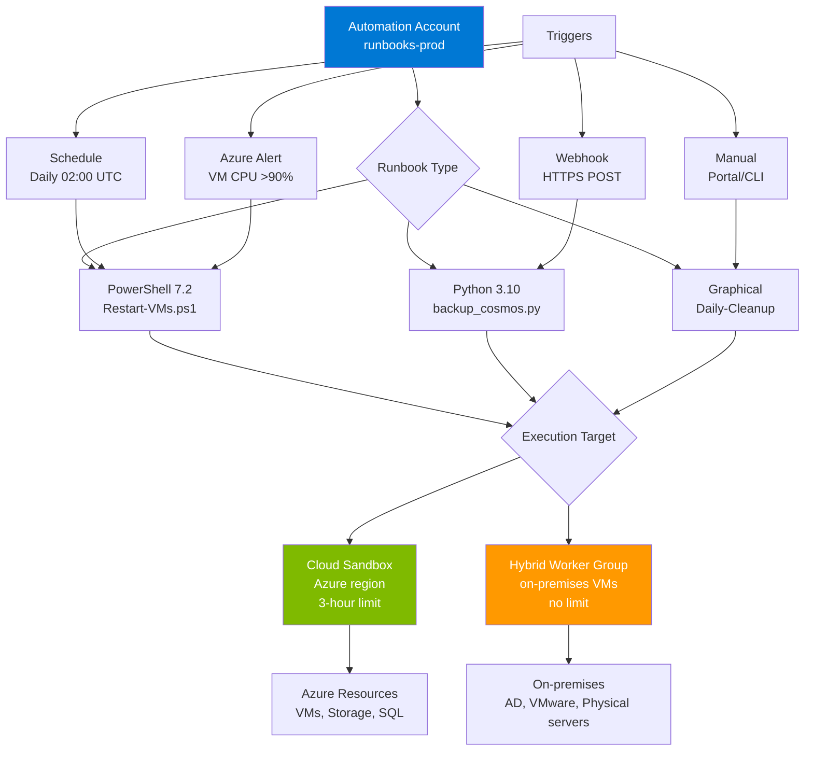

# Azure Automation Runbooks: PowerShell y Python para automatización IT

## Resumen

**Azure Automation** proporciona Process Automation mediante **runbooks** (scripts PowerShell 7.2, Python 3.10, Graphical) ejecutables en cloud (3-hour fair share limit) o **Hybrid Runbook Workers** (sin límite, on-premises/multicloud). Webhooks permiten triggers desde Logic Apps, Functions, ITSM, monitoring alerts. Ideal para: VM lifecycle management, scheduled maintenance, incident response, configuration drift remediation.

<!-- more -->

## ¿Qué es Azure Automation?

**Azure Automation** es un servicio cloud para automatizar tareas repetitivas en 3 áreas:

1. **Process Automation**: Runbooks (PowerShell/Python/Graphical) para desplegar/gestionar recursos
2. **Configuration Management**: State Configuration (DSC) + Update Management
3. **Response Automation**: Webhooks desde alertas/ITSM para incident response

**Runbook** = Script ejecutable con:

- **Lenguajes**: PowerShell 7.2 (GA), Python 3.8/3.10 (preview), Graphical (drag-drop)
- **Execution**: Cloud sandboxes (Azure region) o Hybrid Workers (on-premises/AWS/GCP)
- **Triggers**: Manual, schedule, webhook, Azure Alert, Event Grid
- **Módulos**: Az PowerShell, azure-mgmt-* Python packages, custom modules

**Cloud execution** vs **Hybrid Runbook Worker**:

| Característica | Cloud Sandbox | Hybrid Worker |
|----------------|---------------|---------------|
| **Ubicación** | Azure datacenter | VM on-premises/Azure/multicloud |
| **Time limit** | 3 horas (fair share) | Sin límite |
| **Concurrencia** | 1 runbook/sandbox | Múltiples (configurable) |
| **Network** | Solo salida internet | Acceso a VNets privadas/on-premises |
| **Módulos custom** | Subir a Automation Account | Instalar localmente en Worker VM |
| **Costo** | $0.002/minuto | VM compute + $0.002/minuto |

## Arquitectura Automation



## Crear Automation Account

```bash
# Variables
SUBSCRIPTION_ID="abc123-..."
RESOURCE_GROUP="automation-demo-rg"
LOCATION="westeurope"
AUTOMATION_ACCOUNT="automation-prod"

# Crear resource group
az group create --name $RESOURCE_GROUP --location $LOCATION

# Crear Automation Account
az automation account create \
  --name $AUTOMATION_ACCOUNT \
  --resource-group $RESOURCE_GROUP \
  --location $LOCATION \
  --sku Basic

# Habilitar system-assigned managed identity
az automation account update \
  --name $AUTOMATION_ACCOUNT \
  --resource-group $RESOURCE_GROUP \
  --assign-identity '[system]'

# Obtener managed identity principal ID
MANAGED_IDENTITY=$(az automation account show \
  --name $AUTOMATION_ACCOUNT \
  --resource-group $RESOURCE_GROUP \
  --query 'identity.principalId' -o tsv)

echo "Managed Identity: $MANAGED_IDENTITY"
```

### Asignar RBAC a Managed Identity

```bash
# Contributor en subscription (para manage VMs, Storage, etc.)
az role assignment create \
  --assignee $MANAGED_IDENTITY \
  --role Contributor \
  --scope "/subscriptions/$SUBSCRIPTION_ID"

# Específico por resource group (menos permisos)
az role assignment create \
  --assignee $MANAGED_IDENTITY \
  --role "Virtual Machine Contributor" \
  --scope "/subscriptions/$SUBSCRIPTION_ID/resourceGroups/vms-prod-rg"
```

## Runbook PowerShell 7.2

### Ejemplo: Restart VMs por tag

```powershell
<#
.SYNOPSIS
    Restart Azure VMs con tag "AutoRestart=true"

.DESCRIPTION
    Busca VMs con tag AutoRestart=true y las reinicia.
    Logs a Log Analytics workspace.

.PARAMETER ResourceGroupName
    Resource group a escanear (opcional, default: todos)
#>

param(
    [string]$ResourceGroupName = ""
)

# Autenticación con Managed Identity
Connect-AzAccount -Identity

# Obtener VMs con tag
$vms = if ($ResourceGroupName) {
    Get-AzVM -ResourceGroupName $ResourceGroupName -Status
} else {
    Get-AzVM -Status
}

$targetVMs = $vms | Where-Object {
    $_.Tags['AutoRestart'] -eq 'true' -and $_.PowerState -eq 'VM running'
}

Write-Output "Found $($targetVMs.Count) VMs to restart"

foreach ($vm in $targetVMs) {
    Write-Output "Restarting VM: $($vm.Name) in RG: $($vm.ResourceGroupName)"

    try {
        Restart-AzVM -ResourceGroupName $vm.ResourceGroupName -Name $vm.Name -NoWait
        Write-Output "✅ Restart command sent successfully"
    }
    catch {
        Write-Error "❌ Failed to restart VM: $_"
    }
}

Write-Output "Runbook completed. Total VMs restarted: $($targetVMs.Count)"
```

### Crear runbook en Automation Account

```bash
# Subir runbook PowerShell
az automation runbook create \
  --automation-account-name $AUTOMATION_ACCOUNT \
  --resource-group $RESOURCE_GROUP \
  --name "Restart-TaggedVMs" \
  --type PowerShell72 \
  --description "Restart VMs with AutoRestart=true tag"

# Importar script desde archivo local
az automation runbook replace-content \
  --automation-account-name $AUTOMATION_ACCOUNT \
  --resource-group $RESOURCE_GROUP \
  --name "Restart-TaggedVMs" \
  --content @./restart-tagged-vms.ps1

# Publicar runbook (draft → published)
az automation runbook publish \
  --automation-account-name $AUTOMATION_ACCOUNT \
  --resource-group $RESOURCE_GROUP \
  --name "Restart-TaggedVMs"
```

### Ejecutar runbook (test)

```bash
# Start job manualmente
az automation runbook start \
  --automation-account-name $AUTOMATION_ACCOUNT \
  --resource-group $RESOURCE_GROUP \
  --name "Restart-TaggedVMs" \
  --parameters '{"ResourceGroupName":"vms-prod-rg"}'

# Ver job status
JOB_NAME=$(az automation job list \
  --automation-account-name $AUTOMATION_ACCOUNT \
  --resource-group $RESOURCE_GROUP \
  --query '[0].name' -o tsv)

az automation job show \
  --automation-account-name $AUTOMATION_ACCOUNT \
  --resource-group $RESOURCE_GROUP \
  --name $JOB_NAME \
  --query '{status:status, startTime:startTime, endTime:endTime}'

# Ver job output
az automation job get-output \
  --automation-account-name $AUTOMATION_ACCOUNT \
  --resource-group $RESOURCE_GROUP \
  --name $JOB_NAME
```

**Output esperado**:

```
Found 3 VMs to restart
Restarting VM: web-vm-01 in RG: vms-prod-rg
✅ Restart command sent successfully
Restarting VM: api-vm-02 in RG: vms-prod-rg
✅ Restart command sent successfully
Restarting VM: worker-vm-03 in RG: vms-prod-rg
✅ Restart command sent successfully
Runbook completed. Total VMs restarted: 3
```

## Runbook Python 3.10

### Ejemplo: Backup Cosmos DB accounts

```python
"""
Backup Cosmos DB accounts to Storage Account.
Trigger: Daily schedule 02:00 UTC
"""

import os
import sys
from datetime import datetime
from azure.identity import DefaultAzureCredential
from azure.mgmt.cosmosdb import CosmosDBManagementClient
from azure.storage.blob import BlobServiceClient

# Automation variables (Portal: Automation Account → Variables)
SUBSCRIPTION_ID = os.environ.get('AZURE_SUBSCRIPTION_ID')
STORAGE_ACCOUNT_NAME = os.environ.get('BACKUP_STORAGE_ACCOUNT')
CONTAINER_NAME = 'cosmosdb-backups'

def get_cosmos_accounts():
    """Get all Cosmos DB accounts in subscription."""
    credential = DefaultAzureCredential()
    client = CosmosDBManagementClient(credential, SUBSCRIPTION_ID)

    accounts = []
    for account in client.database_accounts.list():
        accounts.append({
            'name': account.name,
            'resource_group': account.id.split('/')[4],
            'location': account.location,
            'type': account.kind
        })

    print(f"Found {len(accounts)} Cosmos DB accounts")
    return accounts

def backup_cosmos_account(account):
    """
    Trigger online backup for Cosmos DB account.
    Note: Online backup requires continuous backup mode enabled.
    """
    print(f"Backing up Cosmos DB: {account['name']} in RG: {account['resource_group']}")

    credential = DefaultAzureCredential()
    client = CosmosDBManagementClient(credential, SUBSCRIPTION_ID)

    try:
        # Trigger online backup (REST API call via SDK)
        # In production: use client.database_accounts.begin_create_or_update() with backup policy

        # Log backup metadata to Storage Account
        blob_service = BlobServiceClient(
            account_url=f"https://{STORAGE_ACCOUNT_NAME}.blob.core.windows.net",
            credential=credential
        )

        container_client = blob_service.get_container_client(CONTAINER_NAME)

        # Create container if not exists
        try:
            container_client.create_container()
        except Exception:
            pass  # Container already exists

        # Upload backup metadata
        backup_metadata = {
            'account_name': account['name'],
            'resource_group': account['resource_group'],
            'backup_time': datetime.utcnow().isoformat(),
            'status': 'completed'
        }

        blob_name = f"{account['name']}/{datetime.utcnow().strftime('%Y%m%d_%H%M%S')}.json"
        blob_client = container_client.get_blob_client(blob_name)
        blob_client.upload_blob(str(backup_metadata), overwrite=True)

        print(f"✅ Backup completed for {account['name']}")
        return True

    except Exception as e:
        print(f"❌ Backup failed for {account['name']}: {str(e)}", file=sys.stderr)
        return False

def main():
    """Main execution."""
    print("Starting Cosmos DB backup runbook")
    print(f"Subscription: {SUBSCRIPTION_ID}")
    print(f"Backup storage: {STORAGE_ACCOUNT_NAME}")

    accounts = get_cosmos_accounts()

    success_count = 0
    failed_count = 0

    for account in accounts:
        if backup_cosmos_account(account):
            success_count += 1
        else:
            failed_count += 1

    print(f"\nBackup summary:")
    print(f"  ✅ Successful: {success_count}")
    print(f"  ❌ Failed: {failed_count}")
    print(f"  Total: {len(accounts)}")

if __name__ == '__main__':
    main()
```

### Crear runbook Python

```bash
# Crear runbook Python 3.10
az automation runbook create \
  --automation-account-name $AUTOMATION_ACCOUNT \
  --resource-group $RESOURCE_GROUP \
  --name "Backup-CosmosDB" \
  --type Python3 \
  --description "Daily backup of Cosmos DB accounts"

# Importar script Python
az automation runbook replace-content \
  --automation-account-name $AUTOMATION_ACCOUNT \
  --resource-group $RESOURCE_GROUP \
  --name "Backup-CosmosDB" \
  --content @./backup_cosmos.py

# Publicar
az automation runbook publish \
  --automation-account-name $AUTOMATION_ACCOUNT \
  --resource-group $RESOURCE_GROUP \
  --name "Backup-CosmosDB"
```

### Instalar Python packages

```bash
# Portal: Automation Account → Python packages → Add package

# Via CLI (requiere package .whl file)
# Ejemplo: azure-mgmt-cosmosdb
wget https://files.pythonhosted.org/packages/.../azure_mgmt_cosmosdb-9.3.0-py3-none-any.whl

az automation python3-package create \
  --automation-account-name $AUTOMATION_ACCOUNT \
  --resource-group $RESOURCE_GROUP \
  --name azure-mgmt-cosmosdb \
  --content-link "https://files.pythonhosted.org/packages/.../azure_mgmt_cosmosdb-9.3.0-py3-none-any.whl"
```

## Schedules

### Crear schedule diario

```bash
# Crear schedule (daily 02:00 UTC)
az automation schedule create \
  --automation-account-name $AUTOMATION_ACCOUNT \
  --resource-group $RESOURCE_GROUP \
  --name "Schedule-Daily-02AM" \
  --start-time "2025-07-26T02:00:00+00:00" \
  --expiry-time "2026-12-31T23:59:59+00:00" \
  --interval 1 \
  --frequency Day \
  --description "Daily execution at 02:00 UTC"

# Link schedule a runbook
az automation job-schedule create \
  --automation-account-name $AUTOMATION_ACCOUNT \
  --resource-group $RESOURCE_GROUP \
  --runbook-name "Backup-CosmosDB" \
  --schedule-name "Schedule-Daily-02AM" \
  --parameters '{}'
```

### Schedule con recurrencia semanal

```bash
# Lunes y Viernes a las 18:00 UTC
az automation schedule create \
  --automation-account-name $AUTOMATION_ACCOUNT \
  --resource-group $RESOURCE_GROUP \
  --name "Schedule-Weekly-MonFri" \
  --start-time "2025-07-28T18:00:00+00:00" \
  --interval 1 \
  --frequency Week \
  --week-days Monday Friday \
  --description "Weekly on Mondays and Fridays at 18:00 UTC"
```

## Webhooks

### Crear webhook para runbook

```bash
# Crear webhook (expira en 1 año)
WEBHOOK_OUTPUT=$(az automation webhook create \
  --automation-account-name $AUTOMATION_ACCOUNT \
  --resource-group $RESOURCE_GROUP \
  --name "webhook-restart-vms" \
  --runbook-name "Restart-TaggedVMs" \
  --is-enabled true \
  --expiry-time "2026-07-25T00:00:00+00:00" \
  --parameters '{"ResourceGroupName":"vms-prod-rg"}' \
  --query '{uri:uri}' -o json)

WEBHOOK_URI=$(echo $WEBHOOK_OUTPUT | jq -r '.uri')

echo "Webhook URI (SAVE THIS - only shown once):"
echo $WEBHOOK_URI
```

**⚠️ Importante**: Webhook URI se muestra **solo una vez**. Guardar en Key Vault:

```bash
# Guardar webhook URI en Key Vault
az keyvault secret set \
  --vault-name "kv-automation-prod" \
  --name "webhook-restart-vms-uri" \
  --value "$WEBHOOK_URI"
```

### Trigger webhook desde Logic App

```json
{
  "definition": {
    "$schema": "https://schema.management.azure.com/providers/Microsoft.Logic/schemas/2016-06-01/workflowdefinition.json#",
    "triggers": {
      "Recurrence": {
        "type": "Recurrence",
        "recurrence": {
          "frequency": "Hour",
          "interval": 6
        }
      }
    },
    "actions": {
      "HTTP_Webhook": {
        "type": "Http",
        "inputs": {
          "method": "POST",
          "uri": "@parameters('WebhookURI')",
          "headers": {
            "Content-Type": "application/json"
          },
          "body": {
            "ResourceGroupName": "vms-prod-rg"
          }
        }
      }
    }
  }
}
```

### Trigger webhook desde Azure Alert

```bash
# Crear Action Group con webhook
az monitor action-group create \
  --name "ag-restart-vms" \
  --resource-group $RESOURCE_GROUP \
  --short-name "RestartVMs" \
  --webhook-receiver "runbook-webhook" "$WEBHOOK_URI"

# Crear alert rule (VM CPU >90% → trigger webhook)
az monitor metrics alert create \
  --name "alert-vm-high-cpu" \
  --resource-group $RESOURCE_GROUP \
  --scopes $(az vm show --name web-vm-01 --resource-group vms-prod-rg --query id -o tsv) \
  --condition "avg Percentage CPU > 90" \
  --window-size 5m \
  --evaluation-frequency 1m \
  --action "ag-restart-vms" \
  --description "Restart VM when CPU >90% for 5 minutes"
```

## Hybrid Runbook Worker

### ¿Cuándo usar Hybrid Worker?

**Casos de uso**:

1. **Runbooks >3 horas**: ETL jobs, large backups
2. **Acceso a on-premises**: Active Directory, VMware vCenter, physical servers
3. **VNet private resources**: SQL Managed Instance sin public endpoint
4. **Custom software**: Apps no disponibles en cloud sandbox

### Crear Hybrid Worker Group (Azure VM)

```bash
# Crear VM para Hybrid Worker (Windows Server 2022)
az vm create \
  --name vm-hybrid-worker \
  --resource-group $RESOURCE_GROUP \
  --image Win2022Datacenter \
  --size Standard_D2s_v3 \
  --vnet-name vnet-automation \
  --subnet subnet-workers \
  --admin-username azureuser \
  --admin-password 'P@ssw0rd123!' \
  --public-ip-address ""

# Obtener VM resource ID
VM_ID=$(az vm show \
  --name vm-hybrid-worker \
  --resource-group $RESOURCE_GROUP \
  --query id -o tsv)

# Crear Hybrid Worker Group
az automation hrwg create \
  --automation-account-name $AUTOMATION_ACCOUNT \
  --resource-group $RESOURCE_GROUP \
  --name "hybrid-workers-prod" \
  --credential username=azureuser password=P@ssw0rd123!

# Instalar Hybrid Worker extension (Azure VM extension)
az vm extension set \
  --name HybridWorkerExtension \
  --publisher Microsoft.Azure.Automation.HybridWorker \
  --version 1.1 \
  --vm-name vm-hybrid-worker \
  --resource-group $RESOURCE_GROUP \
  --settings "{
    \"AutomationAccountURL\": \"https://${AUTOMATION_ACCOUNT}.azure-automation.net\",
    \"WorkerGroupName\": \"hybrid-workers-prod\"
  }" \
  --protected-settings "{
    \"AutomationAccountKey\": \"$(az automation account show-linked-workspace --name $AUTOMATION_ACCOUNT --resource-group $RESOURCE_GROUP --query primarySharedKey -o tsv)\"
  }"
```

**Validación**:

```bash
# Verificar Hybrid Worker registrado
az automation hrwg hrw list \
  --automation-account-name $AUTOMATION_ACCOUNT \
  --resource-group $RESOURCE_GROUP \
  --hybrid-runbook-worker-group-name "hybrid-workers-prod" \
  --query '[].{name:name, vmId:vmResourceId}' -o table
```

### Ejecutar runbook en Hybrid Worker

```bash
# Modificar runbook para especificar Hybrid Worker
az automation runbook update \
  --automation-account-name $AUTOMATION_ACCOUNT \
  --resource-group $RESOURCE_GROUP \
  --name "Restart-TaggedVMs" \
  --description "Restart VMs (Hybrid Worker execution)"

# Start job en Hybrid Worker Group
az automation runbook start \
  --automation-account-name $AUTOMATION_ACCOUNT \
  --resource-group $RESOURCE_GROUP \
  --name "Restart-TaggedVMs" \
  --run-on "hybrid-workers-prod" \
  --parameters '{}'
```

## Variables y credentials

### Automation variables

```bash
# Crear variable encriptada (password)
az automation variable create \
  --automation-account-name $AUTOMATION_ACCOUNT \
  --resource-group $RESOURCE_GROUP \
  --name "SQL_ADMIN_PASSWORD" \
  --value "P@ssw0rd123!" \
  --encrypted true

# Crear variable no encriptada (subscription ID)
az automation variable create \
  --automation-account-name $AUTOMATION_ACCOUNT \
  --resource-group $RESOURCE_GROUP \
  --name "AZURE_SUBSCRIPTION_ID" \
  --value "$SUBSCRIPTION_ID" \
  --encrypted false
```

**Usar variables en runbook PowerShell**:

```powershell
# Leer variable
$subscriptionId = Get-AutomationVariable -Name "AZURE_SUBSCRIPTION_ID"
$sqlPassword = Get-AutomationVariable -Name "SQL_ADMIN_PASSWORD"

Write-Output "Using subscription: $subscriptionId"
```

**Usar variables en runbook Python**:

```python
import os

# Automation variables como environment variables
subscription_id = os.environ.get('AZURE_SUBSCRIPTION_ID')
sql_password = os.environ.get('SQL_ADMIN_PASSWORD')

print(f"Using subscription: {subscription_id}")
```

### Automation credentials (username/password)

```bash
# Crear credential
az automation credential create \
  --automation-account-name $AUTOMATION_ACCOUNT \
  --resource-group $RESOURCE_GROUP \
  --name "VMAdminCredential" \
  --username "azureuser" \
  --password "P@ssw0rd123!" \
  --description "VM local admin credentials"
```

**Usar credential en runbook**:

```powershell
# Obtener credential
$credential = Get-AutomationPSCredential -Name "VMAdminCredential"

# Usar en cmdlet
Invoke-Command -ComputerName "vm-01.contoso.local" -Credential $credential -ScriptBlock {
    Get-Service | Where-Object {$_.Status -eq 'Running'}
}
```

## Child Runbooks

### Parent runbook con child paralelo

```powershell
<#
.SYNOPSIS
    Parent runbook que ejecuta child runbooks en paralelo
#>

# Child runbooks a ejecutar
$childRunbooks = @(
    @{Name="Backup-SQL"; Parameters=@{DatabaseName="proddb"}},
    @{Name="Backup-Storage"; Parameters=@{AccountName="prodstorage"}},
    @{Name="Backup-CosmosDB"; Parameters=@{AccountName="prodcosmos"}}
)

# Start child runbooks en paralelo
$jobs = @()
foreach ($child in $childRunbooks) {
    Write-Output "Starting child runbook: $($child.Name)"

    $job = Start-AzAutomationRunbook `
        -AutomationAccountName "automation-prod" `
        -Name $child.Name `
        -ResourceGroupName "automation-demo-rg" `
        -Parameters $child.Parameters

    $jobs += $job
}

# Esperar a que todos completen
Write-Output "Waiting for $($jobs.Count) child runbooks to complete..."

$allCompleted = $false
while (-not $allCompleted) {
    Start-Sleep -Seconds 10

    $completedCount = 0
    foreach ($job in $jobs) {
        $status = Get-AzAutomationJob `
            -Id $job.JobId `
            -ResourceGroupName "automation-demo-rg" `
            -AutomationAccountName "automation-prod"

        if ($status.Status -in @('Completed', 'Failed', 'Stopped')) {
            $completedCount++
        }
    }

    Write-Output "Progress: $completedCount / $($jobs.Count) completed"
    $allCompleted = ($completedCount -eq $jobs.Count)
}

# Resumen de resultados
foreach ($job in $jobs) {
    $status = Get-AzAutomationJob `
        -Id $job.JobId `
        -ResourceGroupName "automation-demo-rg" `
        -AutomationAccountName "automation-prod"

    Write-Output "$($status.RunbookName): $($status.Status)"
}
```

**Ventaja**: 3 backups paralelos tardan 10 minutos (vs 30 minutos secuencial).

## Monitoreo y logging

### Ver jobs history (KQL)

```kql
// Jobs ejecutados últimas 24h por runbook
AzureDiagnostics
| where ResourceProvider == "MICROSOFT.AUTOMATION"
| where Category == "JobLogs"
| where TimeGenerated >= ago(24h)
| extend
    runbookName = tostring(split(RunbookName_s, '/')[1]),
    status = ResultType
| summarize
    Total = count(),
    Completed = countif(status == "Completed"),
    Failed = countif(status == "Failed")
  by runbookName
| extend SuccessRate = round(Completed * 100.0 / Total, 2)
| project runbookName, Total, Completed, Failed, SuccessRate
| order by Failed desc
```

### Job duration tracking

```kql
// Duración promedio de jobs por runbook
AzureDiagnostics
| where ResourceProvider == "MICROSOFT.AUTOMATION"
| where Category == "JobLogs"
| where TimeGenerated >= ago(7d)
| extend runbookName = tostring(split(RunbookName_s, '/')[1])
| summarize
    AvgDuration = avg(DurationMs) / 1000,  // Segundos
    P95Duration = percentile(DurationMs, 95) / 1000,
    MaxDuration = max(DurationMs) / 1000
  by runbookName
| project runbookName, AvgDuration, P95Duration, MaxDuration
| order by AvgDuration desc
```

### Alert si job falla

```bash
# Alert si runbook falla 3 veces en 1 hora
az monitor scheduled-query create \
  --name "alert-runbook-failures" \
  --resource-group $RESOURCE_GROUP \
  --scopes $(az monitor log-analytics workspace show --resource-group $RESOURCE_GROUP --workspace-name workspace-automation --query id -o tsv) \
  --condition "count > 3" \
  --condition-query "
    AzureDiagnostics
    | where ResourceProvider == 'MICROSOFT.AUTOMATION'
    | where Category == 'JobLogs'
    | where ResultType == 'Failed'
    | summarize FailureCount = count() by RunbookName_s
    | where FailureCount > 3
  " \
  --window-size 1h \
  --evaluation-frequency 15m \
  --action email automation-team@contoso.com \
  --description "Runbook failed 3+ times in 1 hour"
```

## Troubleshooting

### Problema: Runbook timeout 3 horas

**Síntoma**: Job status "Failed" con error "The job was stopped because it used its 3 hour fair share."

**Causa**: Cloud sandbox tiene 3-hour limit.

**Solución 1**: Usar Hybrid Worker (no limit).

```bash
# Deploy Hybrid Worker y ejecutar ahí
az automation runbook start \
  --automation-account-name $AUTOMATION_ACCOUNT \
  --resource-group $RESOURCE_GROUP \
  --name "Long-Running-Backup" \
  --run-on "hybrid-workers-prod"
```

**Solución 2**: Child runbooks paralelos.

```powershell
# Split trabajo en 6 child runbooks de 30min cada uno (paralelo = 30min total)
$databases = @('db1', 'db2', 'db3', 'db4', 'db5', 'db6')

foreach ($db in $databases) {
    Start-AzAutomationRunbook `
        -AutomationAccountName "automation-prod" `
        -Name "Backup-SingleDatabase" `
        -Parameters @{DatabaseName=$db}
}
```

### Problema: Managed Identity permisos insuficientes

**Síntoma**: Error "The client '<GUID>' does not have authorization to perform action 'Microsoft.Compute/virtualMachines/restart'"

**Causa**: Managed Identity sin RBAC correcto.

```bash
# Ver current role assignments
az role assignment list \
  --assignee $MANAGED_IDENTITY \
  --query '[].{role:roleDefinitionName, scope:scope}' -o table

# Agregar role faltante
az role assignment create \
  --assignee $MANAGED_IDENTITY \
  --role "Virtual Machine Contributor" \
  --scope "/subscriptions/$SUBSCRIPTION_ID"
```

### Problema: Python package no encontrado

**Síntoma**: `ImportError: No module named 'azure.mgmt.cosmosdb'`

**Causa**: Package no instalado en Automation Account.

```bash
# Verificar packages instalados
az automation python3-package list \
  --automation-account-name $AUTOMATION_ACCOUNT \
  --resource-group $RESOURCE_GROUP \
  --query '[].{name:name, version:properties.version}' -o table

# Instalar package faltante
az automation python3-package create \
  --automation-account-name $AUTOMATION_ACCOUNT \
  --resource-group $RESOURCE_GROUP \
  --name azure-mgmt-cosmosdb \
  --content-link "https://files.pythonhosted.org/packages/.../azure_mgmt_cosmosdb-9.3.0-py3-none-any.whl"
```

## Casos de uso empresarial

### 1. VM lifecycle management (start/stop schedule)

**Escenario**: Dev/test VMs apagadas fuera de horario laboral (18:00-08:00) para ahorrar costos.

```powershell
<#
.SYNOPSIS
    Stop VMs con tag "AutoShutdown=true" a las 18:00
#>

param()

Connect-AzAccount -Identity

$vms = Get-AzVM -Status | Where-Object {
    $_.Tags['AutoShutdown'] -eq 'true' -and $_.PowerState -eq 'VM running'
}

Write-Output "Stopping $($vms.Count) VMs"

foreach ($vm in $vms) {
    Stop-AzVM -ResourceGroupName $vm.ResourceGroupName -Name $vm.Name -Force -NoWait
    Write-Output "✅ Stopped: $($vm.Name)"
}
```

**Schedule**:

- **Stop**: Daily 18:00 UTC
- **Start**: Daily 08:00 UTC (runbook separado con `Start-AzVM`)

**Ahorro**: 50 VMs x 14 horas/día x 30 días = **21,000 VM-hours/mes gratis**.

### 2. Incident response automatizado (VM comprometida)

**Escenario**: Azure Sentinel detecta malware → Trigger webhook → Runbook aisla VM.

```powershell
<#
.SYNOPSIS
    Aisla VM comprometida (remove NSG rules, disable public IP)
#>

param(
    [Parameter(Mandatory=$true)]
    [string]$VMResourceId
)

Connect-AzAccount -Identity

# Parse VM details
$vmIdParts = $VMResourceId -split '/'
$resourceGroup = $vmIdParts[4]
$vmName = $vmIdParts[8]

Write-Output "🔒 Isolating VM: $vmName in RG: $resourceGroup"

# 1. Remove NSG rules (block all traffic)
$vm = Get-AzVM -ResourceGroupName $resourceGroup -Name $vmName
$nic = Get-AzNetworkInterface -ResourceId $vm.NetworkProfile.NetworkInterfaces[0].Id
$nsg = Get-AzNetworkSecurityGroup -ResourceId $nic.NetworkSecurityGroup.Id

# Backup NSG rules
$backupFile = "nsg-backup-$vmName-$(Get-Date -Format 'yyyyMMdd-HHmmss').json"
$nsg | ConvertTo-Json -Depth 10 | Out-File $backupFile
Write-Output "✅ NSG rules backed up to: $backupFile"

# Remove all rules
$nsg.SecurityRules.Clear()
$nsg | Set-AzNetworkSecurityGroup
Write-Output "✅ NSG rules removed (isolated)"

# 2. Disable public IP
if ($nic.IpConfigurations[0].PublicIpAddress) {
    $pipId = $nic.IpConfigurations[0].PublicIpAddress.Id
    $nic.IpConfigurations[0].PublicIpAddress = $null
    $nic | Set-AzNetworkInterface
    Write-Output "✅ Public IP disabled"
}

# 3. Create Azure Support ticket (opcional)
Write-Output "📧 Alert sent to security team"

# 4. Log a Log Analytics
Write-Output "✅ VM isolated successfully. Investigate malware on VM before restoring network access."
```

**Trigger**: Sentinel playbook → Webhook POST con `VMResourceId` parameter.

### 3. Compliance drift remediation (daily scan + fix)

**Escenario**: Escaneo diario de Storage Accounts → Habilitar firewall si deshabilitado.

```python
"""
Daily scan: Enable Storage Account firewall if disabled.
"""

from azure.identity import DefaultAzureCredential
from azure.mgmt.storage import StorageManagementClient
import os

SUBSCRIPTION_ID = os.environ.get('AZURE_SUBSCRIPTION_ID')

def remediate_storage_accounts():
    credential = DefaultAzureCredential()
    client = StorageManagementClient(credential, SUBSCRIPTION_ID)

    fixed_count = 0

    for account in client.storage_accounts.list():
        # Check if firewall disabled (defaultAction == "Allow")
        if account.network_rule_set.default_action == "Allow":
            print(f"⚠️ Storage account {account.name} has public access enabled")

            # Fix: Enable firewall (defaultAction = "Deny")
            account.network_rule_set.default_action = "Deny"

            # Add corporate IP range (example)
            account.network_rule_set.ip_rules.append({
                "value": "203.0.113.0/24",
                "action": "Allow"
            })

            # Update account
            client.storage_accounts.update(
                account.id.split('/')[4],  # resource_group
                account.name,
                {
                    "network_rule_set": account.network_rule_set
                }
            )

            print(f"✅ Fixed: {account.name} - Firewall enabled with corporate IP allow")
            fixed_count += 1

    print(f"\nRemediation complete. Fixed: {fixed_count} accounts")

if __name__ == '__main__':
    remediate_storage_accounts()
```

**Schedule**: Daily 03:00 UTC.

**Resultado**: Compliance drift autocorrected en 24h.

## Costos

| Componente | Precio |
|------------|--------|
| Job runtime (cloud) | $0.002/minuto |
| Job runtime (Hybrid Worker) | $0.002/minuto + VM compute |
| Watchers (no usado) | $0.002/minuto |
| VM Hybrid Worker (D2s_v3) | ~$70/mes |
| Storage (logs, scripts) | ~$1/mes (100GB) |

**Ejemplo**:

- 50 runbooks x 10 min/día x 30 días = **15,000 minutos**
- Cloud execution: 15,000 x $0.002 = **$30/mes**
- Hybrid Worker: $30 + $70 VM = **$100/mes**

**Alternativa económica**:

- Azure Functions ($0.20/million executions) para workloads <10 min
- Logic Apps ($0.025/action) para workflows simples sin código

## Mejores prácticas

1. **Managed Identity**: Evitar credentials hardcoded, usar system-assigned identity
2. **Child runbooks paralelos**: Split long-running jobs (>3h) en child runbooks
3. **Error handling**: `try/catch` con logging a Log Analytics
4. **Idempotencia**: Runbooks deben ser re-ejecutables sin efectos duplicados
5. **Webhooks en Key Vault**: URIs solo mostradas 1 vez, guardar en Key Vault
6. **Hybrid Workers para on-premises**: VM en on-premises datacenter para acceso local
7. **Variables encriptadas**: Passwords/secrets en variables encrypted
8. **Testing**: Siempre publicar runbook después de test en draft mode

## Limitaciones

- **Cloud sandbox timeout**: 3 horas (usar Hybrid Worker para jobs largos)
- **Concurrencia cloud**: 1 job/sandbox (usar child runbooks paralelos)
- **Python stderr**: `sys.stderr` no capturado en job logs (usar `print()` o logging)
- **Webhook expiration**: Max 5 años, renovar antes de expirar
- **Python packages**: Solo .whl soportado (no `pip install` directo)

## Referencias

- [Automation Overview (Oficial)](https://learn.microsoft.com/en-us/azure/automation/overview)
- [Runbook Types](https://learn.microsoft.com/en-us/azure/automation/automation-runbook-types)
- [Hybrid Runbook Worker](https://learn.microsoft.com/en-us/azure/automation/automation-hybrid-runbook-worker)
- [Webhooks](https://learn.microsoft.com/en-us/azure/automation/automation-webhooks)
- [Child Runbooks](https://learn.microsoft.com/en-us/azure/automation/automation-child-runbooks)
