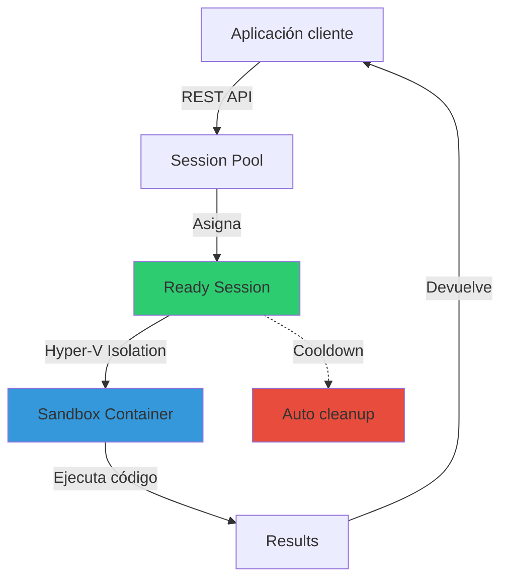

# Azure Container Apps Dynamic Sessions

## Resumen

Azure Container Apps Dynamic Sessions proporciona acceso rápido a entornos sandbox seguros y aislados, ideales para ejecutar código generado por IA o aplicaciones que requieren aislamiento. Con inicio en milisegundos, gestión automática del ciclo de vida y escalado masivo, es la solución perfecta para escenarios de code interpreter, ejecución de agentes de IA o sandboxing de código no confiable.

## ¿Qué son las Dynamic Sessions?

Las Dynamic Sessions son entornos sandboxed que se ejecutan dentro de un **session pool** y proporcionan:

**Características clave:**

- **Aislamiento Hyper-V**: Cada sesión aislada en sandbox independiente
- **Inicio ultra rápido**: Nuevas sesiones en milisegundos (warm pool)
- **Acceso REST API**: Gestión simple vía HTTP endpoints
- **Gestión automática**: Limpieza automática tras inactividad
- **Alta escalabilidad**: Cientos/miles de sesiones concurrentes
- **Network isolation opcional**: Seguridad adicional para workloads críticos

## Tipos de sesiones

### 1. Code Interpreter Sessions (Built-in)

Sesiones pre-configuradas para ejecutar código Python/Node.js sin gestionar infraestructura:

```bash
# Crear session pool con code interpreter
az containerapp sessionpool create \
    --name my-code-interpreter-pool \
    --resource-group my-rg \
    --location eastasia \
    --max-sessions 100 \
    --container-type PythonLTS \
    --cooldown-period 300
```

**Casos de uso:**
- Código generado por LLMs (ChatGPT, Claude, etc.)
- Evaluación de código de usuarios en SaaS apps
- Jupyter notebooks serverless
- Herramientas de IA (LangChain, LlamaIndex, Semantic Kernel)

### 2. Custom Container Sessions

Sesiones con contenedores personalizados para entornos especializados:

```json
{
  "type": "Microsoft.App/sessionPools",
  "apiVersion": "2024-08-02-preview",
  "name": "custom-session-pool",
  "location": "eastus",
  "properties": {
    "environmentId": "/subscriptions/<SUB_ID>/resourceGroups/<RG>/providers/Microsoft.ContainerApps/environments/<ENV>",
    "poolManagementType": "Dynamic",
    "containerType": "CustomContainer",
    "scaleConfiguration": {
      "maxConcurrentSessions": 50,
      "readySessionInstances": 10
    },
    "customContainerTemplate": {
      "containers": [{
        "image": "myregistry.azurecr.io/custom-sandbox:1.0",
        "name": "sandbox",
        "resources": {
          "cpu": 0.5,
          "memory": "1Gi"
        }
      }],
      "ingress": {
        "targetPort": 8080
      }
    },
    "dynamicPoolConfiguration": {
      "executionType": "Timed",
      "cooldownPeriodInSeconds": 600
    }
  }
}
```

## Arquitectura y flujo



**Flujo de ejecución:**

1. Cliente solicita sesión vía `identifier`
2. Si no existe → pool asigna sesión ready del warm pool
3. Código se ejecuta en sandbox Hyper-V aislado
4. Resultados se devuelven al cliente
5. Tras cooldown sin actividad → limpieza automática

## Configuración práctica

### Paso 1: Crear Azure Container Apps environment

```bash
# Variables
RESOURCE_GROUP="aca-sessions-rg"
LOCATION="eastasia"
ENVIRONMENT_NAME="aca-sessions-env"

# Crear resource group y environment
az group create --name $RESOURCE_GROUP --location $LOCATION

az containerapp env create \
    --name $ENVIRONMENT_NAME \
    --resource-group $RESOURCE_GROUP \
    --location $LOCATION
```

### Paso 2: Crear session pool

```bash
SESSION_POOL_NAME="ai-code-interpreter"

az containerapp sessionpool create \
    --name $SESSION_POOL_NAME \
    --resource-group $RESOURCE_GROUP \
    --location $LOCATION \
    --max-sessions 100 \
    --container-type PythonLTS \
    --cooldown-period 300
```

### Paso 3: Obtener management endpoint

```bash
# Obtener endpoint del pool
SESSION_POOL_ENDPOINT=$(az containerapp sessionpool show \
    -n $SESSION_POOL_NAME \
    -g $RESOURCE_GROUP \
    --query "properties.poolManagementEndpoint" \
    -o tsv)

echo "Pool Management Endpoint: $SESSION_POOL_ENDPOINT"
```

### Paso 4: Ejecutar código en sesión

```http
POST https://<REGION>.dynamicsessions.io/subscriptions/<SUB_ID>/resourceGroups/<RG>/sessionPools/<POOL_NAME>/identifier/<SESSION_ID>/code/execute?api-version=2024-02-02-preview
Content-Type: application/json
Authorization: Bearer <TOKEN>

{
    "properties": {
        "codeInputType": "inline",
        "executionType": "synchronous",
        "code": "import pandas as pd\ndf = pd.DataFrame({'A': [1, 2, 3], 'B': [4, 5, 6]})\nprint(df.describe())"
    }
}
```

**Respuesta:**
```json
{
    "status": "Success",
    "result": {
        "stdout": "       A    B\ncount  3.0  3.0\nmean   2.0  5.0\nstd    1.0  1.0\nmin    1.0  4.0\n25%    1.5  4.5\n50%    2.0  5.0\n75%    2.5  5.5\nmax    3.0  6.0",
        "stderr": "",
        "executionTimeMs": 120
    }
}
```

## Integración con frameworks de IA

### LangChain

```python
from langchain.agents import Tool
from langchain_azure_dynamic_sessions import SessionsPythonREPLTool

# Configurar tool con session pool
sessions_tool = SessionsPythonREPLTool(
    pool_management_endpoint=SESSION_POOL_ENDPOINT
)

# Crear agente con herramienta
tools = [
    Tool(
        name="Python REPL",
        func=sessions_tool.run,
        description="Ejecuta código Python en sandbox seguro"
    )
]
```

### LlamaIndex

```python
from llama_index.tools.azure_code_interpreter import AzureCodeInterpreterToolSpec
from llama_index.agent.react import ReActAgent

# Configurar tool
tool_spec = AzureCodeInterpreterToolSpec(
    pool_management_endpoint=SESSION_POOL_ENDPOINT
)

# Crear agente
agent = ReActAgent.from_tools(
    tool_spec.to_tool_list(),
    llm=llm,
    verbose=True
)

# Ejecutar query
response = agent.chat("Analiza este dataset CSV y crea un gráfico de tendencias")
```

## Seguridad y network isolation

### Habilitar network isolation

```bash
# Actualizar session pool con network isolation
az containerapp sessionpool update \
    --name $SESSION_POOL_NAME \
    --resource-group $RESOURCE_GROUP \
    --session-network-status EgressEnabled
```

**Beneficios:**
- Bloquea acceso saliente no autorizado
- Previene exfiltración de datos
- Compatible con VNet integration
- Logs de conexiones en Azure Monitor

### Autenticación con Managed Identity

```json
{
  "identity": {
    "type": "UserAssigned",
    "userAssignedIdentities": {
      "<IDENTITY_RESOURCE_ID>": {}
    }
  },
  "properties": {
    "managedIdentitySettings": [{
      "identity": "<IDENTITY_RESOURCE_ID>",
      "lifecycle": "None"
    }]
  }
}
```

## Casos de uso reales

### 1. Agente de análisis de datos con GPT-4

```python
# Prompt del usuario
user_query = "Analiza ventas_2024.csv y muestra top 5 productos"

# Agent genera y ejecuta código
code_generated = """
import pandas as pd
df = pd.read_csv('/data/ventas_2024.csv')
top_products = df.groupby('producto')['ventas'].sum().nlargest(5)
print(top_products.to_string())
"""

# Ejecutar en dynamic session
response = execute_in_session(
    session_id="analysis-001",
    code=code_generated
)
```

### 2. Sandbox para código de usuarios (SaaS app)

```python
# Usuario envía código no confiable
user_code = request.json.get('code')

# Ejecutar en sesión aislada con timeout
result = execute_code_safely(
    code=user_code,
    session_id=f"user-{user_id}",
    timeout=30,
    max_memory="512Mi"
)

if result['status'] == 'Success':
    return jsonify(result['output'])
else:
    return jsonify({'error': result['error']}), 400
```

### 3. Jupyter notebooks serverless

```python
# Crear sesión interactiva para notebook
notebook_session = create_session(
    pool_name="jupyter-pool",
    session_id=f"notebook-{session_token}",
    idle_timeout=3600  # 1 hora
)

# Ejecutar celdas secuencialmente
for cell in notebook_cells:
    result = execute_cell(
        session_id=notebook_session,
        code=cell['code']
    )
    cell['output'] = result
```

## Limitaciones y consideraciones

**Limitaciones actuales:**

- Max 100 sesiones concurrentes (configurable hasta 1000)
- Cooldown mínimo: 60 segundos
- Timeouts: 30 min por ejecución (synchronous), sin límite (asynchronous)
- Network isolation no soporta inbound connections
- Storage efímero (no persistente entre sesiones)

**Pricing:**
- Pago por uso: tiempo de sesión activa + vCPU/memory
- Warm pool incluido sin coste adicional
- Estimado: ~$0.03/hora por sesión estándar (0.25 vCPU, 0.5 Gi)

## Monitorización

```bash
# Logs de sesiones en Log Analytics
az monitor log-analytics query \
    --workspace $WORKSPACE_ID \
    --analytics-query "ContainerAppSystemLogs_CL
    | where ContainerAppName_s == '$SESSION_POOL_NAME'
    | where TimeGenerated > ago(1h)
    | project TimeGenerated, Log_s
    | order by TimeGenerated desc"
```

## Buenas prácticas

1. **Dimensionamiento del pool**:
   - `readySessionInstances`: 10-20% del `maxConcurrentSessions`
   - Ajustar `cooldownPeriod` según patrón de uso (300-600s típico)

2. **Gestión de sesiones**:
   - Usar session IDs únicos y descriptivos
   - Implementar cleanup explícito tras finalizar
   - Monitorizar métricas de pool saturation

3. **Seguridad**:
   - Habilitar network isolation para código no confiable
   - Validar inputs antes de ejecutar código
   - Limitar recursos (CPU/memory) por sesión
   - Revisar logs de ejecución regularmente

4. **Cost optimization**:
   - Escalar `readySessionInstances` dinámicamente según demanda
   - Implementar timeout agresivo para sesiones idle
   - Evaluar custom containers vs built-in (PythonLTS más económico)

## Referencias

- [Azure Container Apps dynamic sessions](https://learn.microsoft.com/en-us/azure/container-apps/sessions)
- [Code interpreter sessions](https://learn.microsoft.com/en-us/azure/container-apps/sessions-code-interpreter)
- [Custom container sessions](https://learn.microsoft.com/en-us/azure/container-apps/sessions-custom-container)
- [Session pool management](https://learn.microsoft.com/en-us/azure/container-apps/session-pool)
- [AI integration with Container Apps](https://learn.microsoft.com/en-us/azure/container-apps/ai-integration)
