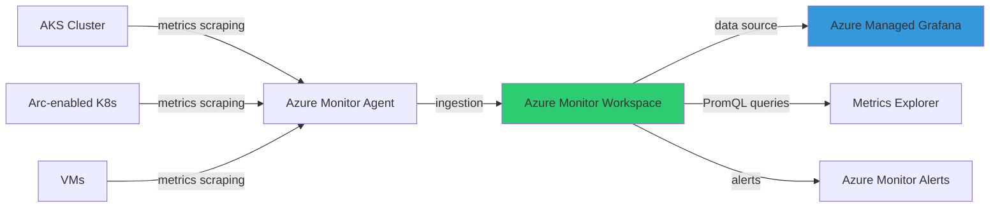

# Azure Monitor Managed Prometheus y Grafana

## Resumen

Azure Monitor Managed Prometheus es un servicio totalmente gestionado que simplifica la recopilación, almacenamiento y consulta de métricas Prometheus sin mantener tu propia infraestructura. Integrado nativamente con Azure Managed Grafana, proporciona observabilidad completa para clústeres Kubernetes (AKS, Arc), máquinas virtuales y aplicaciones cloud-native, con retención de 18 meses, escalado automático y SLA empresarial.

## ¿Por qué Managed Prometheus?

**Problemas del Prometheus self-hosted:**

- Gestión manual de servidor Prometheus
- Escalado complejo para alta carga
- Backup y retention limitados
- Alta disponibilidad requiere configuración custom
- Costes de almacenamiento no optimizados

**Ventajas del servicio gestionado:**

- **Fully managed**: Actualizaciones automáticas, sin gestión de infraestructura
- **Retención 18 meses**: Sin coste adicional de almacenamiento
- **Escalado automático**: Soporta millones de series temporales
- **SLA 99.9%**: Alta disponibilidad garantizada
- **Integración nativa**: AKS, Arc, Grafana, Container Insights
- **PromQL completo**: 100% compatible con queries Prometheus

## Arquitectura



**Componentes clave:**

- **Azure Monitor Workspace**: Almacén de métricas Prometheus
- **Azure Monitor Agent**: Scraper de métricas (pods ama-metrics)
- **Azure Managed Grafana**: Visualización con dashboards preconstruidos
- **Data Collection Rules**: Configuración de qué métricas recopilar

## Configuración paso a paso

### Paso 1: Crear Azure Monitor Workspace

```bash
# Variables
RESOURCE_GROUP="monitoring-rg"
LOCATION="westeurope"
PROMETHEUS_WORKSPACE="aks-prometheus-ws"

# Crear workspace
az monitor account create \
    --resource-group $RESOURCE_GROUP \
    --name $PROMETHEUS_WORKSPACE \
    --location $LOCATION
```

### Paso 2: Crear Azure Managed Grafana

```bash
GRAFANA_NAME="aks-grafana"

# Crear Grafana workspace
az grafana create \
    --resource-group $RESOURCE_GROUP \
    --name $GRAFANA_NAME \
    --location $LOCATION \
    --zone-redundancy Enabled
```

### Paso 3: Habilitar Prometheus en AKS

```bash
AKS_CLUSTER_NAME="my-aks-cluster"

# Opción A: Habilitar con workspace y Grafana existentes
az aks update \
    --name $AKS_CLUSTER_NAME \
    --resource-group $RESOURCE_GROUP \
    --enable-azure-monitor-metrics \
    --azure-monitor-workspace-resource-id $(az monitor account show \
        --resource-group $RESOURCE_GROUP \
        --name $PROMETHEUS_WORKSPACE \
        --query id -o tsv) \
    --grafana-resource-id $(az grafana show \
        --resource-group $RESOURCE_GROUP \
        --name $GRAFANA_NAME \
        --query id -o tsv)

# Opción B: Crear workspace automáticamente
az aks update \
    --name $AKS_CLUSTER_NAME \
    --resource-group $RESOURCE_GROUP \
    --enable-azure-monitor-metrics
```

### Paso 4 (opcional): Configurar métricas custom

```bash
# Filtrar labels específicos de kube-state-metrics
az aks update \
    --name $AKS_CLUSTER_NAME \
    --resource-group $RESOURCE_GROUP \
    --enable-azure-monitor-metrics \
    --ksm-metric-labels-allow-list "namespaces=[app,environment,team]" \
    --ksm-metric-annotations-allow-list "pods=[prometheus.io/scrape,prometheus.io/port]"
```

## Configuración para Arc-enabled Kubernetes

```bash
# Habilitar en cluster Arc
az k8s-extension create \
    --name azuremonitor-metrics \
    --cluster-name $CLUSTER_NAME \
    --resource-group $RESOURCE_GROUP \
    --cluster-type connectedClusters \
    --extension-type Microsoft.AzureMonitor.Containers.Metrics \
    --configuration-settings \
        azure-monitor-workspace-resource-id=$(az monitor account show \
            --resource-group $RESOURCE_GROUP \
            --name $PROMETHEUS_WORKSPACE \
            --query id -o tsv) \
        grafana-resource-id=$(az grafana show \
            --resource-group $RESOURCE_GROUP \
            --name $GRAFANA_NAME \
            --query id -o tsv)
```

## Scraping de métricas custom

### Service Monitor (scrape custom apps)

```yaml
apiVersion: azmonitoring.coreos.com/v1
kind: ServiceMonitor
metadata:
  name: my-app-metrics
  namespace: monitoring
spec:
  selector:
    matchLabels:
      app: my-app
  endpoints:
  - port: metrics
    interval: 30s
    path: /metrics
    scheme: http
```

Aplicar configuración:

```bash
kubectl apply -f service-monitor.yaml
```

### Pod Monitor

```yaml
apiVersion: azmonitoring.coreos.com/v1
kind: PodMonitor
metadata:
  name: pod-metrics
  namespace: monitoring
spec:
  selector:
    matchLabels:
      role: backend
  podMetricsEndpoints:
  - port: metrics
    path: /actuator/prometheus
```

## Consultas PromQL típicas

### Dashboard de nodos AKS

```promql
# CPU usage por nodo
sum(rate(node_cpu_seconds_total{mode!="idle"}[5m])) by (instance) * 100

# Memoria disponible
node_memory_MemAvailable_bytes / node_memory_MemTotal_bytes * 100

# Disk I/O
rate(node_disk_read_bytes_total[5m]) + rate(node_disk_written_bytes_total[5m])
```

### Métricas de pods

```promql
# CPU usage por pod
sum(rate(container_cpu_usage_seconds_total{namespace="production"}[5m])) by (pod)

# Memory working set
container_memory_working_set_bytes{namespace="production"} / 1024 / 1024

# Restart count
kube_pod_container_status_restarts_total{namespace="production"}
```

### Métricas de aplicación (custom)

```promql
# Request rate
sum(rate(http_requests_total{job="my-app"}[5m])) by (status_code)

# 95th percentile latency
histogram_quantile(0.95, sum(rate(http_request_duration_seconds_bucket[5m])) by (le))

# Error rate
sum(rate(http_requests_total{status_code=~"5.."}[5m])) / sum(rate(http_requests_total[5m]))
```

## Integración con Grafana

### Configurar data source automáticamente

Al crear Grafana con `--grafana-resource-id` durante el update de AKS, el data source se configura automáticamente.

Verificar:

```bash
# Listar data sources
az grafana data-source list \
    --name $GRAFANA_NAME \
    --resource-group $RESOURCE_GROUP
```

### Importar dashboards preconstruidos

Azure proporciona dashboards oficiales:

1. **Kubernetes / Compute Resources / Cluster**
2. **Kubernetes / Compute Resources / Namespace (Pods)**
3. **Kubernetes / Compute Resources / Node (Pods)**
4. **Kubernetes / Networking / Cluster**

**Importar desde UI:**

1. Abrir Grafana workspace en Azure Portal
2. Click en "Endpoint" → Abre Grafana UI
3. Dashboards → Import → ID del dashboard community
4. Seleccionar data source: Azure Monitor Workspace

**Dashboard IDs populares:**

- `15760`: Kubernetes Cluster Monitoring
- `15761`: Kubernetes API Server
- `15762`: Node Exporter Full

## Remote write desde Prometheus self-hosted

### Configuración con Managed Identity

```yaml
# prometheus.yml
global:
  external_labels:
    cluster: on-prem-k8s

remote_write:
  - url: https://<INGESTION_ENDPOINT>/dataCollectionRules/<DCR_ID>/streams/Microsoft-PrometheusMetrics/api/v1/write?api-version=2023-04-24
    azuread:
      cloud: AzurePublic
      managed_identity:
        client_id: <MANAGED_IDENTITY_CLIENT_ID>
```

### Configuración con Service Principal

```yaml
remote_write:
  - url: https://<INGESTION_ENDPOINT>/dataCollectionRules/<DCR_ID>/streams/Microsoft-PrometheusMetrics/api/v1/write?api-version=2023-04-24
    azuread:
      cloud: AzurePublic
      client_id: <APP_CLIENT_ID>
      tenant_id: <TENANT_ID>
      client_secret: <CLIENT_SECRET>
```

## Alertas basadas en métricas

### Crear alerta de uso de CPU

```bash
# Crear action group (email/SMS)
az monitor action-group create \
    --name critical-alerts \
    --resource-group $RESOURCE_GROUP \
    --short-name critical \
    --email-receiver email=ops@company.com

# Crear alerta PromQL
az monitor metrics alert create \
    --name high-cpu-alert \
    --resource-group $RESOURCE_GROUP \
    --scopes $(az monitor account show -n $PROMETHEUS_WORKSPACE -g $RESOURCE_GROUP --query id -o tsv) \
    --condition "avg(rate(node_cpu_seconds_total{mode!='idle'}[5m])) > 0.8" \
    --window-size 5m \
    --evaluation-frequency 1m \
    --action critical-alerts \
    --severity 2 \
    --description "CPU usage > 80%"
```

## Cost optimization

**Pricing:**
- Ingestion: ~$0.40 per million samples
- Query: $0.16 per million samples returned
- Storage: incluido sin coste adicional (18 meses)

**Optimización:**

```bash
# Reducir frecuencia de scraping
az aks update \
    --name $AKS_CLUSTER_NAME \
    --resource-group $RESOURCE_GROUP \
    --enable-azure-monitor-metrics \
    --scrape-interval 60s  # Default: 30s

# Filtrar namespaces irrelevantes
# Crear ConfigMap para excluir namespaces
kubectl apply -f - <<EOF
apiVersion: v1
kind: ConfigMap
metadata:
  name: ama-metrics-prometheus-config
  namespace: kube-system
data:
  prometheus-config: |
    scrape_configs:
    - job_name: 'kubernetes-pods'
      kubernetes_sd_configs:
      - role: pod
      relabel_configs:
      - source_labels: [__meta_kubernetes_namespace]
        regex: kube-system|azure-system
        action: drop
EOF
```

**Estimación de costes:**

- Cluster AKS 3 nodos: ~150K samples/min → ~$260/mes
- Cluster AKS 10 nodos: ~500K samples/min → ~$860/mes
- Queries Grafana dashboards: ~$50/mes adicionales

## Monitorización avanzada

### Multi-workspace para multi-cluster

```json
{
  "properties": {
    "grafanaIntegrations": {
      "azureMonitorWorkspaceIntegrations": [
        {
          "azureMonitorWorkspaceResourceId": "/subscriptions/<SUB>/resourceGroups/<RG1>/providers/Microsoft.Monitor/accounts/ws-prod"
        },
        {
          "azureMonitorWorkspaceResourceId": "/subscriptions/<SUB>/resourceGroups/<RG2>/providers/Microsoft.Monitor/accounts/ws-dev"
        }
      ]
    }
  }
}
```

### Recording rules (pre-agregación)

Configurar via Grafana UI → Alerting → Recording rules:

```promql
# Rule name: cluster:cpu_usage:rate5m
sum(rate(node_cpu_seconds_total{mode!="idle"}[5m])) by (cluster)

# Rule name: namespace:pod_cpu:sum
sum(rate(container_cpu_usage_seconds_total[5m])) by (namespace, pod)
```

## Troubleshooting

**Problema: Métricas no aparecen**

```bash
# Verificar pods ama-metrics
kubectl get pods -n kube-system -l rsName=ama-metrics

# Revisar logs
kubectl logs -n kube-system -l rsName=ama-metrics -c ama-metrics

# Validar ConfigMap
kubectl get configmap ama-metrics-prometheus-config -n kube-system -o yaml
```

**Problema: Grafana no muestra data source**

```bash
# Verificar link entre Grafana y workspace
az grafana show \
    --name $GRAFANA_NAME \
    --resource-group $RESOURCE_GROUP \
    --query "properties.grafanaIntegrations"
```

## Buenas prácticas

1. **Retention**: Usa 18 meses incluidos, luego exporta históricos a Azure Data Explorer para análisis largo plazo
2. **Labels**: Limita cardinalidad de labels (evita user IDs, timestamps como labels)
3. **Scraping**: Ajusta intervalos según criticidad (30s crítico, 60s+ no crítico)
4. **Alertas**: Usa alertas multi-window para reducir false positives
5. **Dashboards**: Importa dashboards community antes de crear custom
6. **Multi-tenant**: Usa workspaces separados por entorno (prod/dev) o equipo

## Referencias

- [Azure Monitor managed Prometheus](https://learn.microsoft.com/en-us/azure/azure-monitor/metrics/prometheus-metrics-overview)
- [Enable Prometheus on AKS](https://learn.microsoft.com/en-us/azure/azure-monitor/containers/kubernetes-monitoring-enable)
- [Azure Managed Grafana](https://learn.microsoft.com/en-us/azure/managed-grafana/overview)
- [PromQL queries in Azure](https://learn.microsoft.com/en-us/azure/azure-monitor/metrics/prometheus-api-promql)
- [Remote write configuration](https://learn.microsoft.com/en-us/azure/azure-monitor/containers/prometheus-remote-write)
