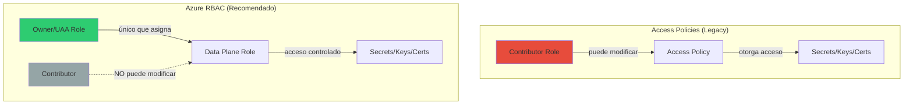

# Azure Key Vault: RBAC vs Access Policies

## Resumen

Azure Key Vault soporta dos modelos de autorización: **Azure RBAC** (recomendado) y **Access Policies** (legacy). RBAC proporciona control granular, separación de responsabilidades y soporte para Privileged Identity Management (PIM), mientras que Access Policies permite que roles con permisos de escritura (Contributor) se otorguen a sí mismos acceso al plano de datos, representando un riesgo de seguridad. Este post explica las diferencias, cómo migrar de Access Policies a RBAC, y las buenas prácticas de seguridad.

## ¿Por qué migrar a RBAC?

### Problema con Access Policies

**Riesgo de elevación de privilegios:**

- Usuarios con rol `Contributor` o `Key Vault Contributor` pueden modificar Access Policies
- Pueden otorgarse acceso completo a secrets/keys/certificates sin aprobación
- No hay separación entre gestión del vault y acceso a datos sensibles
- No soporta PIM para acceso just-in-time

**Ejemplo del problema:**

```bash
# Usuario con rol Contributor puede hacer esto:
az keyvault set-policy \
    --name my-vault \
    --upn malicious-user@company.com \
    --secret-permissions get list \
    --key-permissions get list \
    --certificate-permissions get list

# Ahora tiene acceso a todos los secrets sin auditoría
```

### Ventajas de Azure RBAC

**Seguridad mejorada:**

- Solo roles `Owner` y `User Access Administrator` pueden asignar permisos de datos
- Separación clara entre management plane y data plane
- Soporte completo para PIM (acceso temporal con aprobación)
- Auditoría centralizada en Activity Log

**Control granular:**

- Scope a nivel de vault, secret individual, key o certificate
- Roles predefinidos específicos (Key Vault Secrets User, Key Vault Crypto User)
- Integración con Conditional Access policies
- Managed identities nativo

## Arquitectura de permisos



## Roles RBAC predefinidos

### Management Plane (Control Plane)

| Rol | Descripción | Uso |
|-----|-------------|-----|
| **Owner** | Control completo del vault + asignación de roles | Administradores principales |
| **Contributor** | Gestión del vault SIN asignación de roles data plane | DevOps, operadores |
| **Reader** | Solo lectura de propiedades del vault | Auditoría, monitorización |

### Data Plane (Acceso a datos)

| Rol | Permisos | Uso típico |
|-----|----------|------------|
| **Key Vault Administrator** | Acceso completo a secrets/keys/certs | Break-glass, emergencias |
| **Key Vault Secrets User** | Get secrets | Aplicaciones, managed identities |
| **Key Vault Secrets Officer** | CRUD secrets | Administradores de secrets |
| **Key Vault Crypto User** | Operaciones criptográficas (sign, verify, encrypt) | Apps con cifrado |
| **Key Vault Crypto Officer** | Crear/eliminar keys | Gestión de claves |
| **Key Vault Certificates Officer** | CRUD certificados | Gestión de TLS/SSL |
| **Key Vault Reader** | Listar secrets/keys/certs (no leer valores) | Inventario, discovery |

## Migración de Access Policies a RBAC

### Paso 1: Auditar permisos actuales

```bash
# Listar access policies existentes
az keyvault show \
    --name my-vault \
    --resource-group my-rg \
    --query "properties.accessPolicies" \
    -o table
```

Ejemplo output:

```text
ObjectId                              Permissions
------------------------------------  -----------------
12345678-1234-1234-1234-123456789012  Secrets: get, list
87654321-4321-4321-4321-210987654321  Keys: all, Secrets: all
```

### Paso 2: Mapear Access Policies a roles RBAC

**Mapeo típico:**

| Access Policy | Rol RBAC equivalente |
|---------------|---------------------|
| Secrets: get, list | Key Vault Secrets User |
| Secrets: all | Key Vault Secrets Officer |
| Keys: encrypt, decrypt, sign, verify | Key Vault Crypto User |
| Keys: all | Key Vault Crypto Officer |
| Certificates: get, list | Key Vault Certificates User (custom) |
| All permissions | Key Vault Administrator |

### Paso 3: Habilitar RBAC en el vault

```bash
# Cambiar permission model a RBAC
az keyvault update \
    --name my-vault \
    --resource-group my-rg \
    --enable-rbac-authorization true
```

⚠️ **Importante**: Tras habilitar RBAC, las Access Policies dejan de funcionar inmediatamente.

### Paso 4: Asignar roles RBAC

```bash
# Obtener object ID del principal (usuario, grupo, managed identity)
PRINCIPAL_ID=$(az ad user show --id user@company.com --query id -o tsv)

# Asignar rol a nivel de vault
az role assignment create \
    --role "Key Vault Secrets User" \
    --assignee $PRINCIPAL_ID \
    --scope $(az keyvault show --name my-vault --resource-group my-rg --query id -o tsv)

# Asignar rol a un secret específico
SECRET_ID=$(az keyvault secret show \
    --vault-name my-vault \
    --name db-password \
    --query id -o tsv)

az role assignment create \
    --role "Key Vault Secrets User" \
    --assignee $PRINCIPAL_ID \
    --scope $SECRET_ID
```

### Paso 5: Configurar PIM (opcional pero recomendado)

```bash
# Crear eligible assignment (requiere activación)
az role assignment create \
    --role "Key Vault Administrator" \
    --assignee $ADMIN_PRINCIPAL_ID \
    --scope $(az keyvault show --name my-vault -g my-rg --query id -o tsv) \
    --assignee-object-type User \
    --assignee-principal-type User \
    # Nota: Configuración de PIM requiere Azure Portal o API de PIM
```

**Configurar en Portal:**

1. Key Vault → Access control (IAM) → Privileged roles
2. Add assignment → Select role → Key Vault Administrator
3. Assignment type: **Eligible**
4. Settings:
   - Max activation duration: 8 hours
   - Require justification: Yes
   - Require approval: Yes (añadir approvers)
   - Require MFA: Yes

## Configuración con Managed Identity

### System-assigned MI

```bash
# Crear VM con system-assigned identity
az vm create \
    --name app-vm \
    --resource-group my-rg \
    --image Ubuntu2204 \
    --assign-identity \
    --role "Key Vault Secrets User" \
    --scope $(az keyvault show --name my-vault -g my-rg --query id -o tsv)

# Obtener identity para verificar
az vm identity show --name app-vm --resource-group my-rg
```

### User-assigned MI

```bash
# Crear user-assigned identity
az identity create \
    --name app-identity \
    --resource-group my-rg

IDENTITY_ID=$(az identity show -n app-identity -g my-rg --query id -o tsv)
PRINCIPAL_ID=$(az identity show -n app-identity -g my-rg --query principalId -o tsv)

# Asignar role
az role assignment create \
    --role "Key Vault Secrets User" \
    --assignee $PRINCIPAL_ID \
    --scope $(az keyvault show --name my-vault -g my-rg --query id -o tsv)

# Asignar identity a App Service
az webapp identity assign \
    --name my-app \
    --resource-group my-rg \
    --identities $IDENTITY_ID
```

## Código de aplicación con RBAC

### .NET (C#)

```csharp
using Azure.Identity;
using Azure.Security.KeyVault.Secrets;

// Usar DefaultAzureCredential (soporta Managed Identity automáticamente)
var client = new SecretClient(
    new Uri("https://my-vault.vault.azure.net/"),
    new DefaultAzureCredential()
);

// Obtener secret
KeyVaultSecret secret = await client.GetSecretAsync("db-password");
string connectionString = secret.Value;
```

### Python

```python
from azure.identity import DefaultAzureCredential
from azure.keyvault.secrets import SecretClient

credential = DefaultAzureCredential()
client = SecretClient(
    vault_url="https://my-vault.vault.azure.net/",
    credential=credential
)

# Obtener secret
secret = client.get_secret("db-password")
connection_string = secret.value
```

### Azure CLI en scripts

```bash
# Autenticación con managed identity en Azure VM/App Service
export AZURE_CLIENT_ID=<user-assigned-mi-client-id>  # Solo si es user-assigned

# Obtener secret
az keyvault secret show \
    --vault-name my-vault \
    --name db-password \
    --query value \
    -o tsv
```

## Casos de uso avanzados

### 1. Acceso granular por entorno

```bash
# Production: solo lectura para apps
az role assignment create \
    --role "Key Vault Secrets User" \
    --assignee $PROD_APP_IDENTITY \
    --scope $(az keyvault show --name prod-vault -g prod-rg --query id -o tsv)

# Development: lectura y escritura para devs
az role assignment create \
    --role "Key Vault Secrets Officer" \
    --assignee $DEV_GROUP_ID \
    --scope $(az keyvault show --name dev-vault -g dev-rg --query id -o tsv)
```

### 2. Rotation de secrets con Function App

```bash
# Function App con system MI y permiso de escritura
FUNCTION_IDENTITY=$(az functionapp identity show \
    --name secret-rotator \
    --resource-group my-rg \
    --query principalId -o tsv)

az role assignment create \
    --role "Key Vault Secrets Officer" \
    --assignee $FUNCTION_IDENTITY \
    --scope $(az keyvault secret show \
        --vault-name my-vault \
        --name api-key \
        --query id -o tsv)
```

### 3. Break-glass access con PIM

```bash
# Rol permanente: Key Vault Reader (solo lista)
az role assignment create \
    --role "Key Vault Reader" \
    --assignee $ADMIN_ID \
    --scope $(az keyvault show --name my-vault -g my-rg --query id -o tsv)

# Rol eligible (activable): Key Vault Administrator
# Configurar via Portal → IAM → Privileged access
# Activación requiere:
# - Justificación de negocio
# - Aprobación de 2 owners
# - MFA
# - Duración máxima: 4 horas
```

## Seguridad adicional

### Firewall y Private Endpoint

```bash
# Deshabilitar acceso público
az keyvault update \
    --name my-vault \
    --resource-group my-rg \
    --public-network-access Disabled

# Crear private endpoint
az network private-endpoint create \
    --name my-vault-pe \
    --resource-group my-rg \
    --vnet-name my-vnet \
    --subnet private-endpoints \
    --private-connection-resource-id $(az keyvault show --name my-vault -g my-rg --query id -o tsv) \
    --group-id vault \
    --connection-name my-vault-connection
```

### Conditional Access

**Configurar en Azure AD:**

1. Azure AD → Security → Conditional Access
2. New policy:
   - Users: Grupo de admins Key Vault
   - Cloud apps: Azure Key Vault (API: cfa8b339-82a2-471a-a3c9-0fc0be7a4093)
   - Conditions: Location = Fuera de oficina
   - Grant: Require MFA + Compliant device

### Auditoría y alertas

```bash
# Habilitar diagnostic settings
az monitor diagnostic-settings create \
    --name key-vault-audit \
    --resource $(az keyvault show --name my-vault -g my-rg --query id -o tsv) \
    --logs '[{"category": "AuditEvent", "enabled": true}]' \
    --workspace $(az monitor log-analytics workspace show -n my-la-ws -g my-rg --query id -o tsv)

# Crear alerta de acceso no autorizado
az monitor metrics alert create \
    --name unauthorized-access \
    --resource-group my-rg \
    --scopes $(az keyvault show --name my-vault -g my-rg --query id -o tsv) \
    --condition "count ActivityType_s == 'SecretGet' and ResultType == 'Unauthorized' > 5" \
    --window-size 5m \
    --evaluation-frequency 1m \
    --action action-group-id
```

## Troubleshooting

**Error: "Forbidden" tras habilitar RBAC**

```bash
# Verificar roles asignados
az role assignment list \
    --scope $(az keyvault show --name my-vault -g my-rg --query id -o tsv) \
    --output table

# Si no tienes acceso, pedir a Owner/UAA que asigne rol
```

**Error: "Network restricted"**

```bash
# Añadir tu IP al firewall temporalmente
MY_IP=$(curl -s ifconfig.me)
az keyvault network-rule add \
    --name my-vault \
    --resource-group my-rg \
    --ip-address $MY_IP
```

## Buenas prácticas

1. **Usar RBAC siempre**: Migrar todos los vaults a RBAC authorization
2. **Principle of least privilege**: Asignar solo permisos mínimos necesarios
3. **Scope granular**: Preferir scope a secrets individuales sobre vault completo
4. **PIM para admins**: Acceso eligible con aprobación y MFA para roles privilegiados
5. **Managed Identities**: Nunca usar service principals con secrets en código
6. **Private Endpoints**: Deshabilitar acceso público en production
7. **Auditoría**: Habilitar diagnostic logs y revisar periódicamente
8. **Rotación**: Implementar rotación automática de secrets con Azure Functions/Logic Apps
9. **Conditional Access**: Requerir MFA y compliant device para admins
10. **Separación de vaults**: Vaults separados por entorno (prod/dev/test)

## Referencias

- [Azure RBAC vs Access Policies](https://learn.microsoft.com/en-us/azure/key-vault/general/rbac-access-policy)
- [Key Vault RBAC guide](https://learn.microsoft.com/en-us/azure/key-vault/general/rbac-guide)
- [Built-in roles for Key Vault](https://learn.microsoft.com/en-us/azure/role-based-access-control/built-in-roles#key-vault-secrets-user)
- [Managed identities with Key Vault](https://learn.microsoft.com/en-us/azure/key-vault/general/authentication)
- [Secure Key Vault best practices](https://learn.microsoft.com/en-us/azure/key-vault/general/secure-key-vault)
