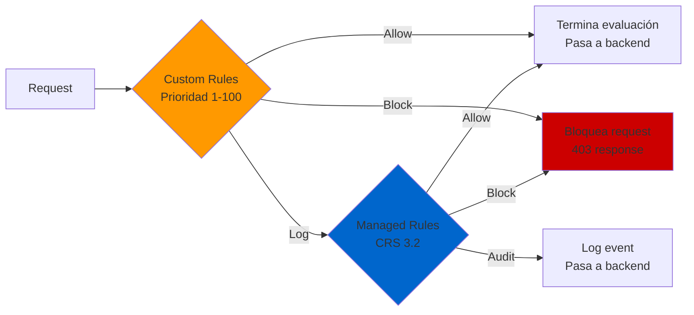

# Azure Application Gateway: Reglas personalizadas de WAF v2

## Resumen

El Web Application Firewall (WAF) v2 de Azure Application Gateway incluye el Core Rule Set (CRS) de OWASP para protección automática contra amenazas comunes. Sin embargo, cuando necesitas lógica de seguridad específica para tu aplicación (bloquear IPs concretas, filtrar User-Agents maliciosos, implementar rate limiting por geografía), las **reglas personalizadas (custom rules)** son la solución. En este post veremos cómo crear y gestionar custom rules que se evalúan antes que las managed rules, con ejemplos prácticos de bloqueo de bots, geofiltrado y rate limiting.

<!-- more -->

## ¿Qué son las reglas personalizadas de WAF?

Las custom rules son reglas definidas por el usuario que se evalúan **antes** de las managed rules (CRS). Permiten:

- **Bloquear/permitir tráfico** basado en condiciones específicas
- **Registrar** eventos sin bloquear (modo audit)
- **Priorizar** con valores numéricos (menor número = mayor prioridad)
- **Componer lógica compleja** combinando múltiples condiciones con AND/OR

### Características principales

| Característica | Descripción |
|----------------|-------------|
| **Prioridad** | 1-100, se evalúan antes de CRS |
| **Operadores** | IPMatch, GeoMatch, Contains, Regex, Equal, etc. |
| **Acciones** | Allow, Block, Log |
| **Límite** | 100 custom rules por WAF policy |
| **Match variables** | RemoteAddr, RequestHeaders, QueryString, RequestUri, etc. |

## Arquitectura de evaluación de reglas



**Flujo de evaluación:**

1. Custom rules se ejecutan primero por orden de prioridad
2. Si una custom rule hace `Allow` o `Block`, se detiene la evaluación
3. Si todas las custom rules pasan (o son `Log`), se evalúan las managed rules (CRS)

## Escenarios de uso prácticos

### 1. Bloquear bot malicioso por User-Agent

**Caso:** Un bot con User-Agent `evilbot` está haciendo scraping agresivo.

**PowerShell:**

```powershell
# Variables
$rgname = "rg-waf-prod"
$policyName = "waf-policy-prod"

# Crear match variable (RequestHeaders - User-Agent)
$variable = New-AzApplicationGatewayFirewallMatchVariable `
   -VariableName RequestHeaders `
   -Selector User-Agent

# Crear condición de match (contiene "evilbot", case-insensitive)
$condition = New-AzApplicationGatewayFirewallCondition `
   -MatchVariable $variable `
   -Operator Contains `
   -MatchValue "evilbot" `
   -Transform Lowercase `
   -NegationCondition $False

# Crear custom rule
$rule = New-AzApplicationGatewayFirewallCustomRule `
   -Name blockEvilBot `
   -Priority 2 `
   -RuleType MatchRule `
   -MatchCondition $condition `
   -Action Block `
   -State Enabled

# Obtener policy y agregar regla
$policy = Get-AzApplicationGatewayFirewallPolicy -Name $policyName -ResourceGroupName $rgname
$policy.CustomRules.Add($rule)
Set-AzApplicationGatewayFirewallPolicy -InputObject $policy
```

**Resultado:** Cualquier request con `User-Agent: evilbot` (o `EvilBot`, gracias a `Lowercase`) es bloqueado inmediatamente.

### 2. Geofiltrado: Permitir solo tráfico de USA

**Caso:** Tu aplicación solo debe ser accesible desde USA por regulaciones de compliance.

**JSON (equivalente ARM template):**

```json
{
  "customRules": [
    {
      "name": "allowOnlyUS",
      "priority": 5,
      "ruleType": "MatchRule",
      "action": "Allow",
      "state": "Enabled",
      "matchConditions": [
        {
          "matchVariables": [
            {
              "variableName": "RemoteAddr"
            }
          ],
          "operator": "GeoMatch",
          "negationCondition": false,
          "matchValues": [
            "US"
          ]
        }
      ]
    },
    {
      "name": "blockAllOthers",
      "priority": 10,
      "ruleType": "MatchRule",
      "action": "Block",
      "matchConditions": [
        {
          "matchVariables": [
            {
              "variableName": "RemoteAddr"
            }
          ],
          "operator": "GeoMatch",
          "negationCondition": true,
          "matchValues": [
            "US"
          ]
        }
      ]
    }
  ]
}
```

**Lógica:**

1. Regla priority 5: Si origen = USA → `Allow` (se detiene evaluación, pasa a backend)
2. Regla priority 10: Si origen ≠ USA → `Block`

### 3. Bloquear rango de IPs específico

**Caso:** Un rango de IPs `192.168.5.0/24` está generando ataques.

**Azure CLI:**

```bash
# Variables
RESOURCE_GROUP="rg-waf-prod"
POLICY_NAME="waf-policy-prod"
RULE_NAME="blockMaliciousIPs"

# Crear custom rule con IPMatch
az network application-gateway waf-policy custom-rule create \
  --policy-name $POLICY_NAME \
  --resource-group $RESOURCE_GROUP \
  --name $RULE_NAME \
  --priority 1 \
  --rule-type MatchRule \
  --action Block \
  --state Enabled

# Agregar condición IPMatch
az network application-gateway waf-policy custom-rule match-condition add \
  --match-variables RemoteAddr \
  --operator IPMatch \
  --values "192.168.5.0/24" \
  --policy-name $POLICY_NAME \
  --resource-group $RESOURCE_GROUP \
  --name $RULE_NAME
```

### 4. Rate Limiting por IP + Geolocalización

**Caso:** Limitar tráfico a 100 req/min por IP, excluyendo IPs internas.

**PowerShell:**

```powershell
# Crear condición que excluye IPs internas (negación)
$variable = New-AzApplicationGatewayFirewallMatchVariable -VariableName RemoteAddr
$condition = New-AzApplicationGatewayFirewallCondition `
  -MatchVariable $variable `
  -Operator IPMatch `
  -MatchValue "10.0.0.0/8" `
  -NegationCondition $True  # IPs que NO sean 10.0.0.0/8

# Crear GroupBy para agrupar por ClientAddr
$groupByVariable = New-AzApplicationGatewayFirewallCustomRuleGroupByVariable -VariableName ClientAddr
$groupByUserSession = New-AzApplicationGatewayFirewallCustomRuleGroupByUserSession -GroupByVariable $groupByVariable

# Crear rate limit rule
$rateLimitRule = New-AzApplicationGatewayFirewallCustomRule `
  -Name ClientIPRateLimitRule `
  -Priority 90 `
  -RateLimitDuration OneMin `
  -RateLimitThreshold 100 `
  -RuleType RateLimitRule `
  -MatchCondition $condition `
  -GroupByUserSession $groupByUserSession `
  -Action Block `
  -State Enabled

# Agregar a policy
$policy = Get-AzApplicationGatewayFirewallPolicy -Name $policyName -ResourceGroupName $rgname
$policy.CustomRules.Add($rateLimitRule)
Set-AzApplicationGatewayFirewallPolicy -InputObject $policy
```

**Resultado:** Cada IP (excepto 10.0.0.0/8) puede hacer máximo 100 requests/min. Si excede el umbral → bloqueada 1 minuto.

## Operadores disponibles y sus usos

| Operador | Uso típico | Ejemplo |
|----------|-----------|---------|
| **IPMatch** | Bloquear/permitir rangos CIDR | `192.168.1.0/24` |
| **GeoMatch** | Filtrado por país | `US`, `MX`, `CA` |
| **Contains** | Buscar string en headers/URI | User-Agent contiene `bot` |
| **Equal** | Match exacto | Cookie exactamente `session=abc123` |
| **Regex** | Patrones complejos | `^evil.*bot$` |
| **BeginsWith** | Prefijo de URI/header | URI empieza con `/admin` |
| **EndsWith** | Sufijo | Filename termina en `.exe` |
| **GreaterThan** | Numérico (content-length) | Body > 10MB |

## Transformaciones de datos

Antes de evaluar, puedes transformar el valor:

```powershell
$condition = New-AzApplicationGatewayFirewallCondition `
  -MatchVariable $variable `
  -Operator Contains `
  -MatchValue "admin" `
  -Transform Lowercase, UrlDecode, Trim
```

**Transformaciones disponibles:**

- `Lowercase` / `Uppercase`
- `UrlDecode` / `UrlEncode`
- `Trim` (quita espacios)
- `RemoveNulls`
- `HtmlEntityDecode`

## Lógica de combinación AND/OR

**Dentro de una regla (AND):**

```powershell
# Bloquear si IP = 192.168.5.0/24 AND User-Agent contiene "evilbot"
$rule = New-AzApplicationGatewayFirewallCustomRule `
  -Name compoundRule `
  -Priority 10 `
  -MatchCondition $condition1, $condition2 `  # AND implícito
  -Action Block
```

**Entre reglas (OR):**

```powershell
# Bloquear si IP = 192.168.5.0/24 OR User-Agent contiene "evilbot"
$rule1 = New-AzApplicationGatewayFirewallCustomRule -Name blockIP ...
$rule2 = New-AzApplicationGatewayFirewallCustomRule -Name blockBot ...
# Dos reglas separadas = OR lógico
```

## Gestión del ciclo de vida

### Actualizar regla existente

```bash
# Obtener policy actual
az network application-gateway waf-policy show \
  --name waf-policy-prod \
  --resource-group rg-waf-prod \
  --query "customRules[?name=='blockEvilBot']"

# Modificar y reemplazar
# (Editar JSON exportado y reaplicar con az network application-gateway waf-policy update)
```

**Alternativa PowerShell:**

```powershell
$policy = Get-AzApplicationGatewayFirewallPolicy -Name $policyName -ResourceGroupName $rgname
$policy.CustomRules[0].Action = "Allow"  # Cambiar acción de primera regla
Set-AzApplicationGatewayFirewallPolicy -InputObject $policy
```

### Deshabilitar regla temporalmente

```powershell
$policy.CustomRules[0].State = "Disabled"
Set-AzApplicationGatewayFirewallPolicy -InputObject $policy
```

### Eliminar regla

```powershell
$policy.CustomRules.RemoveAt(0)  # Elimina primera regla
Set-AzApplicationGatewayFirewallPolicy -InputObject $policy
```

## Casos de uso avanzados

### Bloquear acceso a `/admin` excepto desde IP corporativa

**Terraform:**

```hcl
resource "azurerm_web_application_firewall_policy" "example" {
  name                = "waf-policy-prod"
  resource_group_name = azurerm_resource_group.example.name
  location            = azurerm_resource_group.example.location

  custom_rules {
    name      = "AllowAdminFromCorp"
    priority  = 1
    rule_type = "MatchRule"
    action    = "Allow"

    match_conditions {
      match_variables {
        variable_name = "RequestUri"
      }
      operator     = "BeginsWith"
      match_values = ["/admin"]
    }

    match_conditions {
      match_variables {
        variable_name = "RemoteAddr"
      }
      operator     = "IPMatch"
      match_values = ["203.0.113.0/24"]  # IP corporativa
    }
  }

  custom_rules {
    name      = "BlockAdminOthers"
    priority  = 2
    rule_type = "MatchRule"
    action    = "Block"

    match_conditions {
      match_variables {
        variable_name = "RequestUri"
      }
      operator     = "BeginsWith"
      match_values = ["/admin"]
    }
  }
}
```

### Regex para bloquear patrones SQL injection personalizados

```powershell
$variable = New-AzApplicationGatewayFirewallMatchVariable -VariableName QueryString
$condition = New-AzApplicationGatewayFirewallCondition `
  -MatchVariable $variable `
  -Operator Regex `
  -MatchValue "(union|select|insert|drop).*from" `
  -Transform Lowercase `
  -NegationCondition $False

$rule = New-AzApplicationGatewayFirewallCustomRule `
  -Name blockSQLiRegex `
  -Priority 3 `
  -MatchCondition $condition `
  -Action Block
```

## Troubleshooting y monitorización

### Logs de custom rules

Las custom rules generan eventos en **Application Gateway WAF logs** (categoría `ApplicationGatewayFirewallLog`).

**Consulta Log Analytics (KQL):**

```kusto
AzureDiagnostics
| where Category == "ApplicationGatewayFirewallLog"
| where ruleId_s startswith "custom-"  // Custom rules tienen prefix
| project TimeGenerated, clientIp_s, requestUri_s, action_s, Message
| order by TimeGenerated desc
```

### Verificar orden de evaluación

```bash
az network application-gateway waf-policy custom-rule list \
  --policy-name waf-policy-prod \
  --resource-group rg-waf-prod \
  --query "sort_by([].{Priority:priority, Name:name, Action:action}, &Priority)"
```

**Output:**

```json
[
  {"Priority": 1, "Name": "blockMaliciousIPs", "Action": "Block"},
  {"Priority": 2, "Name": "blockEvilBot", "Action": "Block"},
  {"Priority": 5, "Name": "allowOnlyUS", "Action": "Allow"}
]
```

### Errores comunes

| Error | Causa | Solución |
|-------|-------|----------|
| **Priority conflict** | Dos reglas con misma priority | Asignar valores únicos |
| **Max rules exceeded** | >100 custom rules | Consolidar reglas con lógica OR |
| **Regex too complex** | Regex consume CPU | Simplificar patrón o usar Contains |
| **GeoMatch not working** | IP privada/localhost | GeoMatch solo funciona para IPs públicas |

## Mejores prácticas

1. **Prioriza reglas Allow antes que Block**: Usa priorities 1-50 para Allow, 51-100 para Block.

2. **Evita regex innecesarias**: `Contains` es más eficiente que regex simple.

3. **Usa transformaciones consistentes**: Aplica `Lowercase` en reglas de User-Agent/cookies para evitar bypass.

4. **Monitoriza con Log mode primero**:

   ```powershell
   $rule.Action = "Log"  # Testea sin bloquear
   ```

   Después de validar → cambia a `Block`.

5. **Documenta reglas en nombres descriptivos**:

   ```powershell
   -Name "block-tor-exit-nodes-JIRA-1234"
   ```

6. **Rate limiting con cuidado**: No uses thresholds demasiado bajos en APIs públicas (mínimo 50-100 req/min).

7. **Geofiltrado + allowlist corporativa**: Combina GeoMatch con IPMatch para oficinas internacionales:

   ```powershell
   # Allow: USA OR IP corporativa México
   $rule1 = GeoMatch US → Allow (priority 1)
   $rule2 = IPMatch 198.51.100.0/24 → Allow (priority 2)
   $rule3 = Default → Block (priority 100)
   ```

## Integración con SIEM

**Enviar logs a Azure Sentinel:**

```bash
# Habilitar diagnósticos a Log Analytics
az monitor diagnostic-settings create \
  --resource /subscriptions/{sub-id}/resourceGroups/rg-waf-prod/providers/Microsoft.Network/applicationGateways/appgw-prod \
  --name "send-to-sentinel" \
  --logs '[{"category":"ApplicationGatewayFirewallLog","enabled":true}]' \
  --workspace /subscriptions/{sub-id}/resourceGroups/rg-siem/providers/Microsoft.OperationalInsights/workspaces/sentinel-workspace
```

**Alertas proactivas:**

```kusto
// Alerta: >100 blocks en 5 minutos desde misma IP
AzureDiagnostics
| where Category == "ApplicationGatewayFirewallLog"
| where action_s == "Blocked"
| summarize BlockCount = count() by clientIp_s, bin(TimeGenerated, 5m)
| where BlockCount > 100
```

## Comparación: Custom Rules vs Managed Rules (CRS)

| Aspecto | Custom Rules | Managed Rules (CRS) |
|---------|--------------|---------------------|
| **Orden evaluación** | Primero (priority 1-100) | Después de custom rules |
| **Actualización** | Manual | Automática por Microsoft |
| **Cobertura** | Casos específicos de negocio | OWASP Top 10, amenazas conocidas |
| **Complejidad** | Bajo (match conditions simples) | Alto (firmas de ataque complejas) |
| **Performance** | Rápido (pocas reglas) | Moderado (cientos de reglas) |
| **Uso recomendado** | Geofiltrado, rate limiting, whitelists | Protección base contra ataques web |

**Recomendación:** Usa custom rules para requisitos de negocio (geolocalización, listas negras) y deja las managed rules habilitadas para protección contra ataques conocidos.

## Costos y limitaciones

- **Costo:** Las custom rules no tienen costo adicional (incluidas en WAF v2 SKU).
- **Límite máximo:** 100 custom rules por policy.
- **Límite de match conditions:** 10 match conditions por regla.
- **Match values:** 600 caracteres total por match condition.

**Optimización:**

- Si necesitas bloquear 200 IPs, no crees 200 reglas → usa 1 regla con 200 valores en `matchValues`:

  ```json
  "matchValues": ["192.168.1.1", "192.168.1.2", ..., "192.168.1.200"]
  ```

## Referencias

- [Custom rules for WAF v2 on Application Gateway](https://learn.microsoft.com/azure/web-application-firewall/ag/custom-waf-rules-overview)
- [Create and use custom WAF rules](https://learn.microsoft.com/azure/web-application-firewall/ag/create-custom-waf-rules)
- [Configure WAF custom rules using PowerShell](https://learn.microsoft.com/azure/web-application-firewall/ag/configure-waf-custom-rules)
- [Rate limiting custom rules](https://learn.microsoft.com/azure/web-application-firewall/ag/rate-limiting-configure)
- [Geomatch custom rules](https://learn.microsoft.com/azure/web-application-firewall/ag/geomatch-custom-rules)
