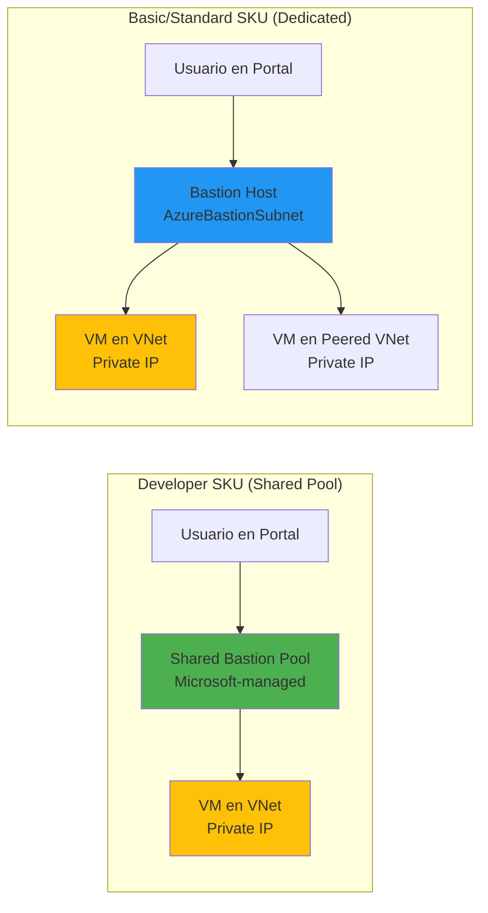

# Azure Bastion Developer SKU: Acceso seguro gratuito a VMs

## Resumen

Azure Bastion Developer es la opción **gratuita** del servicio Bastion que permite conectar de forma segura a una VM por vez directamente desde Azure Portal, sin necesidad de IPs públicas, agentes instalados ni configuración de VPN. Es ideal para escenarios Dev/Test donde no necesitas características avanzadas como scale units, file upload/download o shareable links. En este post veremos cómo funciona, cuándo usarlo, cómo desplegarlo, y las diferencias críticas con los SKUs Basic/Standard/Premium.

<!-- more -->

## ¿Qué es Azure Bastion Developer?

Azure Bastion Developer es un **servicio compartido** (shared pool) que no requiere desplegar un host dedicado en tu VNet. A diferencia de otros SKUs que crean un recurso Bastion en `AzureBastionSubnet`, Developer utiliza infraestructura compartida de Microsoft para enrutar conexiones RDP/SSH.

### Características principales

| Característica | Developer SKU |
|----------------|---------------|
| **Costo** | Gratuito (no hay cargo hourly) |
| **Conexiones simultáneas** | 1 VM por vez |
| **Despliegue** | No requiere AzureBastionSubnet |
| **Acceso** | Solo desde Portal (botón Connect) |
| **SKUs upgrade** | Sí (a Basic/Standard/Premium) |
| **VNet peering** | Sí (puede conectar a VMs en VNets peered) |
| **Features avanzados** | No (sin file transfer, native client, host scaling) |

**Casos de uso ideales:**

- **Laboratorios de desarrollo** donde solo un usuario conecta por vez
- **VMs de prueba temporales** que no justifican un Bastion dedicado
- **PoCs y demostraciones** sin requisitos de producción
- **Usuarios explorando Bastion** antes de comprometerse con un SKU de pago

## Arquitectura de Developer vs SKUs tradicionales



**Diferencias clave:**

| Aspecto | Developer | Basic/Standard/Premium |
|---------|-----------|------------------------|
| **Infraestructura** | Compartida (Microsoft-managed pool) | Dedicada (tu VNet) |
| **Subnet requerida** | No | Sí (AzureBastionSubnet /26) |
| **Public IP** | No (usa pool de Microsoft) | Sí (tu IP pública) |
| **Escalabilidad** | Sin scale units | 2-50 scale units (Standard+) |
| **Acceso nativo** | No (solo Portal) | Sí (CLI, SSH, RDP nativos) |

## Despliegue de Bastion Developer

### Método 1: Desde VM (más rápido)

**Paso 1:** Ve a la VM en Azure Portal → **Connect** → **Bastion**.

**Paso 2:** Portal te preguntará si quieres usar Developer SKU:


**Paso 3:** Clic en **Use Azure Bastion Developer** → introduce credenciales → conecta.

**No hay paso 4:** Ya estás conectado, sin crear recursos ni subnets.

### Método 2: Azure CLI (programático)

**⚠️ Nota:** Developer SKU no se crea con `az network bastion create` porque no es un recurso dedicado. La conexión se inicia directamente:

```bash
# Variables
VM_NAME="myDevVM"
RESOURCE_GROUP="rg-dev-test"
USERNAME="azureuser"

# Conectar via SSH con Developer (usa shared pool automáticamente)
az network bastion ssh \
  --name "bastion-shared-pool" \  # Placeholder (no existe recurso real)
  --resource-group $RESOURCE_GROUP \
  --target-resource-id $(az vm show -g $RESOURCE_GROUP -n $VM_NAME --query id -o tsv) \
  --auth-type password \
  --username $USERNAME
```

**Limitación:** CLI requiere especificar un recurso Bastion existente. Para Developer sin recursos previos, usa **Portal** como método primario.

### Método 3: PowerShell (VM connect)

```powershell
# Variables
$vmName = "myDevVM"
$rg = "rg-dev-test"
$username = "azureuser"

# Obtener VM resource ID
$vm = Get-AzVM -ResourceGroupName $rg -Name $vmName
$vmId = $vm.Id

# Usar Portal API o Az CLI (PowerShell nativo para Developer no disponible aún)
Write-Host "Para Developer SKU, usa Azure Portal > VM > Connect > Bastion"
```

## Conectar a VM con Developer

### SSH (Linux VM)

1. **Portal:** VM → Connect → Bastion → Use Developer
2. **Credenciales:** Username + password (SSH key via Portal no soportado en Developer)
3. **Sesión:** Abre en nueva pestaña del navegador
4. **Timeout:** 20 minutos de inactividad (configurable en VM settings)

**Troubleshooting SSH:**

```bash
# Verificar que VM tiene SSH habilitado (puerto 22)
az vm show -g rg-dev-test -n myDevVM --query "osProfile.linuxConfiguration.ssh"

# Verificar NSG permite tráfico interno (no requiere regla de Internet)
az network nsg rule list --nsg-name myVM-nsg -g rg-dev-test --query "[?destinationPortRange=='22']"
```

### RDP (Windows VM)

1. **Portal:** VM → Connect → Bastion → Use Developer
2. **Credenciales:** Username + password (Azure AD login no soportado en Developer)
3. **Resolución:** Ajusta en Portal antes de conectar (default 1920x1080)
4. **Audio:** Habilitado por defecto (puede deshabilitarse en settings)

**Troubleshooting RDP:**

```powershell
# Verificar puerto 3389 abierto en Windows Firewall
Get-NetFirewallRule -DisplayName "*Remote Desktop*" | Where-Object {$_.Enabled -eq "True"}

# Resetear password si olvidaste (desde Azure CLI)
az vm user update \
  --resource-group rg-dev-test \
  --name myWinVM \
  --username azureuser \
  --password "NewSecureP@ssw0rd!"
```

## Limitaciones de Developer SKU

### Funcionalidades no disponibles

| Feature | Developer | Basic | Standard | Premium |
|---------|-----------|-------|----------|---------|
| Conexiones simultáneas | 1 | 25 | 25-125 (scale) | 25-125 (scale) |
| File upload/download | ❌ | ❌ | ✅ | ✅ |
| Native client (CLI/SSH) | ❌ | ❌ | ✅ | ✅ |
| Shareable link | ❌ | ❌ | ✅ | ✅ |
| IP-based connection | ❌ | ❌ | ✅ | ✅ |
| Custom ports | ❌ | ❌ | ✅ | ✅ |
| Session recording | ❌ | ❌ | ❌ | ✅ |
| Private-only deployment | ❌ | ❌ | ❌ | ✅ |
| Kerberos authentication | ✅ | ✅ | ✅ | ✅ |

### Restricciones técnicas

**1. Una conexión por vez:**

```bash
# Usuario A conecta a VM1 → OK
# Usuario A intenta conectar a VM2 → Error: "Maximum concurrent sessions reached"
# Solución: Desconectar de VM1 primero o usar Basic SKU (permite 25)
```

**2. No soporta Azure CLI tunneling:**

```bash
# Este comando NO funciona con Developer (requiere Standard+)
az network bastion tunnel \
  --name bastion-dev \
  --resource-group rg-dev \
  --target-resource-id $VM_ID \
  --resource-port 22 \
  --port 2222

# Error: "Feature not available in Developer SKU"
```

**3. No permite file transfer:**

Portal no muestra botones de upload/download en Developer. Para transferir archivos:

- Usa **Azure Storage** con SAS token
- Copia vía **clipboard** (texto pequeño)
- Upgrade a **Standard SKU** para feature nativo

**4. No funciona con IP address (solo resource ID):**

```bash
# Developer solo conecta a VMs por resource ID
az network bastion ssh \
  --target-ip-address 10.0.1.5  # ❌ Error en Developer

# Debe ser:
az network bastion ssh \
  --target-resource-id /subscriptions/.../virtualMachines/myVM  # ✅
```

## Upgrade de Developer a Basic/Standard

### Cuándo hacer upgrade

**Necesitas upgrade si:**

- Más de 1 usuario conecta simultáneamente
- Requieres file upload/download entre local y VM
- Quieres usar native SSH client (Windows Terminal, PuTTY)
- Necesitas shareable links para acceso temporal
- Usas custom ports (ej: RDP en 3390 en vez de 3389)

### Proceso de upgrade

**Azure Portal:**

1. VM → Connect → Bastion → **Upgrade to dedicated Bastion**
2. Portal solicita:
   - Subnet `/26` en la VNet (crea automáticamente `AzureBastionSubnet`)
   - Public IP Standard SKU
   - Tier selection (Basic, Standard, Premium)

3. Costo estimado:
   - **Basic:** ~$140/mes + $0.01/GB outbound
   - **Standard:** ~$140/mes + scale units (~$140/unit adicional)
   - **Premium:** ~$280/mes + features adicionales

**Azure CLI (crear Bastion dedicado):**

```bash
# Variables
VNET_NAME="myVNet"
RESOURCE_GROUP="rg-dev-test"
LOCATION="eastus"
BASTION_NAME="bastion-dedicated"

# Crear subnet para Bastion (DEBE llamarse AzureBastionSubnet)
az network vnet subnet create \
  --vnet-name $VNET_NAME \
  --resource-group $RESOURCE_GROUP \
  --name AzureBastionSubnet \
  --address-prefix 10.0.255.0/26  # Mínimo /26 (64 IPs)

# Crear Public IP Standard
az network public-ip create \
  --resource-group $RESOURCE_GROUP \
  --name ${BASTION_NAME}-pip \
  --sku Standard \
  --allocation-method Static

# Crear Bastion host (Basic SKU)
az network bastion create \
  --name $BASTION_NAME \
  --public-ip-address ${BASTION_NAME}-pip \
  --resource-group $RESOURCE_GROUP \
  --vnet-name $VNET_NAME \
  --location $LOCATION \
  --sku Basic
```

**⏱️ Tiempo de despliegue:** 10-15 minutos.

### Comparación de costos (región East US, Enero 2025)

| SKU | Hourly rate | Mensual (730h) | Data transfer (GB) |
|-----|-------------|----------------|--------------------|
| **Developer** | $0 | $0 | $0.01/GB |
| **Basic** | $0.19/hora | ~$140 | $0.01/GB |
| **Standard** | $0.19/hora + scale units | ~$140 + $140/scale unit | $0.01/GB |
| **Premium** | $0.38/hora | ~$280 | $0.01/GB |

**Cálculo ejemplo (100GB transfer/mes):**

- Developer: $0 + $1 (data) = **$1/mes**
- Basic: $140 + $1 (data) = **$141/mes**
- Standard (2 scale units): $140 + $140 + $1 = **$281/mes**

## Casos de uso por SKU

### Developer SKU

```bash
# Escenario: Dev tester conecta a VM de prueba 1 hora/día
# Uso: 1 conexión simultánea máx, solo navegador, sin file transfer
# Costo: $0/mes (gratis)
```

**Checklist para elegir Developer:**

- [ ] Solo 1 usuario conecta por vez
- [ ] Acceso desde Portal es suficiente (no CLI/native clients)
- [ ] No necesitas subir/bajar archivos grandes
- [ ] VMs son dev/test (no producción)
- [ ] Budget es crítico (gratis > $140/mes)

### Basic SKU

```bash
# Escenario: Equipo pequeño (3-5 personas) conecta a VMs dev/staging
# Uso: 25 conexiones simultáneas, acceso Portal, no file transfer
# Costo: ~$140/mes
```

**Upgrade a Basic si:**

- Múltiples usuarios necesitan conectar simultáneamente
- Quieres acceso desde Portal pero no necesitas CLI avanzado
- No requieres file transfer aún

### Standard/Premium SKU

```bash
# Escenario: Operaciones de producción con alto tráfico
# Uso: 50+ conexiones, file transfer, native SSH/RDP, session recording
# Costo: $280-$600/mes (según scale units)
```

**Upgrade a Standard/Premium si:**

- Necesitas file upload/download nativo
- Usas shareable links para acceso temporal
- Requieres session recording para compliance
- Soportas 50+ usuarios concurrentes

## Seguridad y compliance

### Consideraciones de seguridad

**Developer SKU (shared pool):**

- ✅ **Tráfico cifrado:** TLS 1.2 end-to-end
- ✅ **Sin IP pública en VM:** Bastion actúa como proxy
- ⚠️ **Shared infrastructure:** Pool compartido entre múltiples tenants
- ⚠️ **Logs limitados:** No hay logs detallados de conexión (solo Azure Activity Log)
- ❌ **No NSG en AzureBastionSubnet:** Developer no usa subnet dedicada

**Para compliance estricto (SOC 2, HIPAA, PCI-DSS) → usa Standard/Premium con:**

- Subnet dedicada `AzureBastionSubnet` con NSG
- Session recording (Premium SKU)
- Private-only deployment (sin internet access)
- Integración con Azure Monitor y Sentinel

### Auditoría de conexiones Developer

```kusto
// Log Analytics query (si habilitaste Activity Log)
AzureActivity
| where OperationNameValue == "Microsoft.Compute/virtualMachines/connect"
| where Properties contains "bastion"
| project TimeGenerated, Caller, ResourceId, ResultType
| order by TimeGenerated desc
```

**⚠️ Limitación:** Developer no genera logs detallados en `AzureDiagnostics` como SKUs dedicados.

## Troubleshooting común

### Error: "No se puede conectar a VM"

**Diagnóstico:**

```bash
# 1. Verificar VM está corriendo
az vm show -g rg-dev-test -n myVM --query "powerState"

# 2. Verificar NSG permite tráfico interno (RDP 3389 o SSH 22)
az network nsg show -g rg-dev-test -n myVM-nsg \
  --query "securityRules[?destinationPortRange=='22' || destinationPortRange=='3389']"

# 3. Verificar VM tiene private IP asignada
az vm show -g rg-dev-test -n myVM --query "networkProfile.networkInterfaces[0].id" -o tsv | \
  xargs az network nic show --ids | \
  jq -r '.ipConfigurations[0].privateIPAddress'
```

### Error: "Maximum concurrent sessions reached"

**Causa:** Ya hay una sesión activa (Developer = 1 conexión máx).

**Solución:**

1. Cerrar sesión existente en Portal
2. Esperar 2 minutos (timeout de sesión zombie)
3. Si persiste → Upgrade a Basic SKU (permite 25 sesiones)

### Performance: Latencia alta en Developer

**Diagnóstico:**

```bash
# Desde VM (Linux), verificar latencia a Azure backbone
ping -c 10 168.63.129.16  # Azure metadata service

# Si latency >50ms → puede ser región distante del shared pool
# Solución: Crear Bastion dedicado en región cercana a VMs
```

**Regiones con mejor performance Developer (Enero 2025):**

- East US, West Europe, Southeast Asia (pools más grandes)

## Comparativa final: ¿Cuándo usar cada opción?

| Escenario | Recomendación | Justificación |
|-----------|---------------|---------------|
| **Estudiante aprendiendo Azure** | Developer | Gratis, suficiente para labs |
| **Dev team 3-5 personas** | Basic | Soporta equipo pequeño, $140/mes |
| **Startup con 10 VMs dev** | Standard (2 scale units) | File transfer + 50 conexiones |
| **Enterprise producción** | Premium | Session recording, compliance, HA |
| **Lab temporal (1 semana)** | Developer | Gratis > $35 (1 semana Basic) |
| **CI/CD pipeline conectando a VMs** | Standard + native client | Permite `az network bastion tunnel` |

## Migración y coexistencia

**Escenario:** Tienes Developer activo, ¿puedes crear Basic en la misma VNet?

**Respuesta:** Sí, Developer y Bastion dedicado pueden coexistir:

```bash
# Developer (shared pool) → sin recursos en tu VNet
# Basic/Standard → crea AzureBastionSubnet

# Ambos funcionan simultáneamente:
# - Developer: desde Portal > VM > Connect > Use Developer
# - Basic: desde Portal > VM > Connect > Use Bastion (tu recurso)
```

**Costo:** Si creas Basic, te cobran $140/mes aunque uses Developer. **Desactiva Developer** (no hay recurso a eliminar, solo deja de usarlo).

## Referencias

- [Quickstart: Connect with Azure Bastion Developer](https://learn.microsoft.com/azure/bastion/quickstart-developer-sku)
- [What is Azure Bastion?](https://learn.microsoft.com/azure/bastion/bastion-overview)
- [Bastion configuration settings and SKUs](https://learn.microsoft.com/azure/bastion/configuration-settings)
- [Deploy Bastion using specified settings](https://learn.microsoft.com/azure/bastion/tutorial-create-host-portal)
- [Azure Bastion pricing](https://azure.microsoft.com/pricing/details/azure-bastion/)
