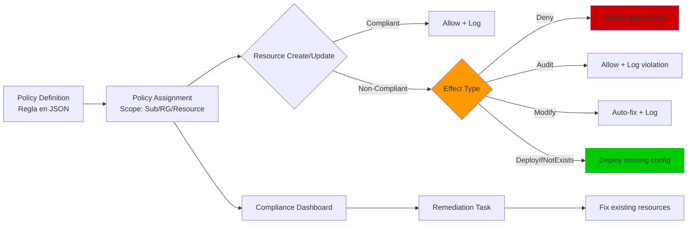

# Azure Policy: Governance automatizado y remediación de recursos

## Resumen

Azure Policy es el pilar de governance en Azure que permite definir estándares organizacionales (tags obligatorios, regiones permitidas, SKUs aprobados) y **evaluar compliance automáticamente** en todos los recursos. Cuando detecta recursos no conformes, puede auditar, denegar nuevos despliegues, o **remediar recursos existentes** con deployIfNotExists/modify effects. En este post veremos cómo crear policies, asignarlas con initiative sets, configurar remediation tasks para traer recursos a conformidad, y usar Azure Policy para implementar governance escalable en entornos multi-subscripción.

<!-- more -->

## ¿Qué es Azure Policy?

Azure Policy es un servicio de evaluación y enforcement de reglas que:

- **Evalúa recursos** contra definiciones de políticas (JSON)
- **Reporta compliance** en dashboard agregado
- **Previene despliegues** no conformes (effect: `deny`)
- **Remedia recursos existentes** con automated deployments (`deployIfNotExists`, `modify`)
- **Audita eventos** sin bloquear (effect: `audit`)

### Componentes principales



**Jerarquía de conceptos:**

1. **Policy Definition:** Regla individual (ej: "require tag Cost Center")
2. **Initiative (Policy Set):** Grupo de policies (ej: "CIS Microsoft Azure Foundations Benchmark")
3. **Assignment:** Aplicar policy/initiative a un scope (subscription, resource group)
4. **Remediation:** Tarea que corrige recursos no conformes

## Policy effects: Audit vs Deny vs Modify

| Effect | Comportamiento | Uso típico |
|--------|----------------|------------|
| **Audit** | Permite deployment, registra violación | Monitoreo sin bloqueo (fase discovery) |
| **AuditIfNotExists** | Audita si recurso relacionado no existe | Verificar que VMs tienen backup habilitado |
| **Deny** | Rechaza deployment no conforme | Bloquear regiones no aprobadas, SKUs caros |
| **Disabled** | Policy no se evalúa | Desactivar temporalmente sin eliminar |
| **Modify** | Corrige propiedades al crear/actualizar | Agregar tags faltantes, habilitar encryption |
| **DeployIfNotExists** | Despliega recurso si no existe | Crear Log Analytics agent en VMs, diagnostic settings |
| **Append** | Agrega propiedades al deployment | Forzar NSG en subnets |

**Ejemplo comparativo:**

```json
// Audit: Permite deployment, solo registra
{
  "effect": "audit",
  "details": {
    "message": "VM should have backup enabled"
  }
}

// Deny: Rechaza deployment
{
  "effect": "deny",
  "details": {
    "message": "VM size not allowed in this region"
  }
}

// Modify: Auto-corrige tag faltante
{
  "effect": "modify",
  "details": {
    "roleDefinitionIds": ["/providers/Microsoft.Authorization/roleDefinitions/b24988ac-6180-42a0-ab88-20f7382dd24c"],
    "operations": [
      {
        "operation": "addOrReplace",
        "field": "tags['Environment']",
        "value": "Production"
      }
    ]
  }
}
```

## Crear y asignar policy definition

### Ejemplo 1: Bloquear regiones no aprobadas

**Paso 1: Definir policy (JSON):**

```json
{
  "properties": {
    "displayName": "Allowed locations",
    "description": "This policy restricts the locations you can specify when deploying resources.",
    "mode": "Indexed",
    "parameters": {
      "allowedLocations": {
        "type": "Array",
        "metadata": {
          "displayName": "Allowed locations",
          "description": "The list of allowed locations for resources."
        }
      }
    },
    "policyRule": {
      "if": {
        "not": {
          "field": "location",
          "in": "[parameters('allowedLocations')]"
        }
      },
      "then": {
        "effect": "deny"
      }
    }
  }
}
```

**Paso 2: Crear policy con Azure CLI:**

```bash
# Variables
POLICY_NAME="allowed-locations-policy"
POLICY_FILE="allowed-locations.json"

# Crear definición
az policy definition create \
  --name $POLICY_NAME \
  --display-name "Allowed locations" \
  --description "Restrict resource deployment to approved regions" \
  --rules $POLICY_FILE \
  --params '{"allowedLocations": {"type": "Array"}}'

# Verificar creación
az policy definition show --name $POLICY_NAME
```

**Paso 3: Asignar policy a subscription:**

```bash
# Variables
SUBSCRIPTION_ID=$(az account show --query id -o tsv)
ASSIGNMENT_NAME="enforce-allowed-locations"
ALLOWED_REGIONS='["eastus", "westeurope"]'

# Crear assignment
az policy assignment create \
  --name $ASSIGNMENT_NAME \
  --display-name "Enforce allowed locations" \
  --policy $POLICY_NAME \
  --scope "/subscriptions/$SUBSCRIPTION_ID" \
  --params "{\"allowedLocations\": {\"value\": $ALLOWED_REGIONS}}"
```

**Resultado:** Cualquier intento de crear recursos en regiones diferentes a `eastus` o `westeurope` será denegado:

```bash
az vm create \
  --resource-group rg-test \
  --name myVM \
  --image Ubuntu2204 \
  --location southcentralus  # ❌ Bloqueado

# Error: "Resource 'myVM' was disallowed by policy 'enforce-allowed-locations'"
```

### Ejemplo 2: Require tags en recursos

**Policy JSON (require tags):**

```json
{
  "properties": {
    "displayName": "Require tag and its value",
    "mode": "Indexed",
    "parameters": {
      "tagName": {"type": "String"},
      "tagValue": {"type": "String"}
    },
    "policyRule": {
      "if": {
        "not": {
          "field": "[concat('tags[', parameters('tagName'), ']')]",
          "equals": "[parameters('tagValue')]"
        }
      },
      "then": {
        "effect": "deny"
      }
    }
  }
}
```

**Asignación:**

```bash
az policy assignment create \
  --name require-cost-center-tag \
  --policy require-tag-policy \
  --scope "/subscriptions/$SUBSCRIPTION_ID" \
  --params '{"tagName": {"value": "CostCenter"}, "tagValue": {"value": "12345"}}'
```

**Validación:**

```bash
# Crear storage sin tag → ❌ Bloqueado
az storage account create \
  --name mystorageacct \
  --resource-group rg-test \
  --sku Standard_LRS

# Error: "Resource must have tag 'CostCenter' with value '12345'"

# Crear con tag → ✅ OK
az storage account create \
  --name mystorageacct \
  --resource-group rg-test \
  --sku Standard_LRS \
  --tags CostCenter=12345
```

## Initiative (Policy Set Definition)

Un **initiative** agrupa múltiples policies para asignarlas juntas. Ejemplo: "CIS Azure Benchmark" incluye 100+ policies de seguridad.

### Crear custom initiative

**Paso 1: Definir initiative JSON:**

```json
{
  "properties": {
    "displayName": "Corporate Governance Baseline",
    "description": "Standard governance policies for all subscriptions",
    "policyDefinitions": [
      {
        "policyDefinitionId": "/providers/Microsoft.Authorization/policyDefinitions/allowed-locations-policy",
        "parameters": {
          "allowedLocations": {"value": ["eastus", "westeurope"]}
        }
      },
      {
        "policyDefinitionId": "/providers/Microsoft.Authorization/policyDefinitions/require-tag-policy",
        "parameters": {
          "tagName": {"value": "CostCenter"},
          "tagValue": {"value": "12345"}
        }
      },
      {
        "policyDefinitionId": "/providers/Microsoft.Authorization/policyDefinitions/audit-vm-managed-disks",
        "parameters": {}
      }
    ]
  }
}
```

**Paso 2: Crear y asignar:**

```bash
# Crear initiative
az policy set-definition create \
  --name corp-governance-baseline \
  --display-name "Corporate Governance Baseline" \
  --definitions initiative.json

# Asignar a resource group
az policy assignment create \
  --name assign-corp-baseline \
  --policy-set-definition corp-governance-baseline \
  --scope "/subscriptions/$SUBSCRIPTION_ID/resourceGroups/rg-prod"
```

## Remediation: Corregir recursos no conformes

### Cuándo usar remediation

**Escenario:** Acabas de asignar policy "Require diagnostic settings on Key Vaults" pero tienes 50 Key Vaults existentes sin diagnósticos.

**Sin remediation:** Los 50 vaults aparecen como no conformes, pero no se corrigen automáticamente.

**Con remediation task:** Azure despliega diagnostic settings en los 50 vaults existentes.

### Remediation con deployIfNotExists

**Policy example: Deploy diagnostic settings en Key Vault:**

```json
{
  "properties": {
    "mode": "Indexed",
    "policyRule": {
      "if": {
        "field": "type",
        "equals": "Microsoft.KeyVault/vaults"
      },
      "then": {
        "effect": "deployIfNotExists",
        "details": {
          "type": "Microsoft.Insights/diagnosticSettings",
          "roleDefinitionIds": [
            "/providers/Microsoft.Authorization/roleDefinitions/92aaf0da-9dab-42b6-94a3-d43ce8d16293"
          ],
          "deployment": {
            "properties": {
              "mode": "incremental",
              "template": {
                "$schema": "https://schema.management.azure.com/schemas/2019-04-01/deploymentTemplate.json#",
                "contentVersion": "1.0.0.0",
                "parameters": {
                  "vaultName": {"type": "string"},
                  "workspaceId": {"type": "string"}
                },
                "resources": [
                  {
                    "type": "Microsoft.KeyVault/vaults/providers/diagnosticSettings",
                    "apiVersion": "2021-05-01-preview",
                    "name": "[concat(parameters('vaultName'), '/Microsoft.Insights/default')]",
                    "properties": {
                      "workspaceId": "[parameters('workspaceId')]",
                      "logs": [{"category": "AuditEvent", "enabled": true}]
                    }
                  }
                ]
              }
            }
          }
        }
      }
    }
  }
}
```

**Paso 1: Asignar policy con managed identity:**

```bash
# Variables
POLICY_ASSIGNMENT="assign-keyvault-diagnostics"
POLICY_ID="/providers/Microsoft.Authorization/policyDefinitions/deploy-keyvault-diag"
RESOURCE_GROUP="rg-prod"
LOG_ANALYTICS_ID="/subscriptions/.../resourceGroups/rg-monitoring/providers/Microsoft.OperationalInsights/workspaces/law-prod"

# Crear assignment con system-assigned identity (necesaria para remediation)
az policy assignment create \
  --name $POLICY_ASSIGNMENT \
  --policy $POLICY_ID \
  --scope "/subscriptions/$SUBSCRIPTION_ID/resourceGroups/$RESOURCE_GROUP" \
  --assign-identity \
  --identity-scope "/subscriptions/$SUBSCRIPTION_ID" \
  --location eastus \
  --params "{\"workspaceId\": {\"value\": \"$LOG_ANALYTICS_ID\"}}"

# Asignar rol Contributor a la managed identity
ASSIGNMENT_IDENTITY=$(az policy assignment show --name $POLICY_ASSIGNMENT --scope "/subscriptions/$SUBSCRIPTION_ID/resourceGroups/$RESOURCE_GROUP" --query identity.principalId -o tsv)

az role assignment create \
  --assignee $ASSIGNMENT_IDENTITY \
  --role "Contributor" \
  --scope "/subscriptions/$SUBSCRIPTION_ID/resourceGroups/$RESOURCE_GROUP"
```

**Paso 2: Crear remediation task:**

```bash
# Crear remediation para recursos existentes
az policy remediation create \
  --name remediate-keyvaults \
  --policy-assignment $POLICY_ASSIGNMENT \
  --resource-group $RESOURCE_GROUP \
  --resource-discovery-mode ReEvaluateCompliance
```

**Paso 3: Monitorear progreso:**

```bash
# Ver estado de remediation
az policy remediation show \
  --name remediate-keyvaults \
  --resource-group $RESOURCE_GROUP

# Output:
# {
#   "provisioningState": "Succeeded",
#   "deploymentSummary": {
#     "totalDeployments": 50,
#     "successfulDeployments": 48,
#     "failedDeployments": 2
#   }
# }
```

### Remediation con modify effect

**Policy example: Agregar tag faltante en VMs:**

```json
{
  "properties": {
    "mode": "Indexed",
    "policyRule": {
      "if": {
        "allOf": [
          {"field": "type", "equals": "Microsoft.Compute/virtualMachines"},
          {"field": "tags['Environment']", "exists": "false"}
        ]
      },
      "then": {
        "effect": "modify",
        "details": {
          "roleDefinitionIds": [
            "/providers/Microsoft.Authorization/roleDefinitions/b24988ac-6180-42a0-ab88-20f7382dd24c"
          ],
          "operations": [
            {
              "operation": "add",
              "field": "tags['Environment']",
              "value": "Untagged"
            }
          ]
        }
      }
    }
  }
}
```

**Asignación + remediation (PowerShell):**

```powershell
# Variables
$policyName = "add-environment-tag"
$subscriptionId = (Get-AzContext).Subscription.Id

# Crear assignment con managed identity
New-AzPolicyAssignment `
  -Name "assign-environment-tag" `
  -PolicyDefinition (Get-AzPolicyDefinition -Name $policyName) `
  -Scope "/subscriptions/$subscriptionId" `
  -Location "eastus" `
  -AssignIdentity

# Asignar rol Tag Contributor
$assignment = Get-AzPolicyAssignment -Name "assign-environment-tag" -Scope "/subscriptions/$subscriptionId"
$identityPrincipalId = $assignment.Identity.PrincipalId

New-AzRoleAssignment `
  -ObjectId $identityPrincipalId `
  -RoleDefinitionName "Tag Contributor" `
  -Scope "/subscriptions/$subscriptionId"

# Crear remediation task
Start-AzPolicyRemediation `
  -Name "remediation-add-tags" `
  -PolicyAssignmentId $assignment.PolicyAssignmentId
```

## Compliance dashboard y reporting

### Ver compliance en Portal

**Paso 1:** Azure Portal → **Policy** → **Compliance**


**Métricas clave:**

- **Compliance %:** Recursos conformes / Total recursos
- **Non-compliant resources:** Desglose por policy
- **Exemptions:** Recursos excluidos manualmente

### Query compliance con Azure CLI

```bash
# Ver compliance de todos los assignments
az policy state list \
  --subscription $SUBSCRIPTION_ID \
  --query "[?complianceState=='NonCompliant'].{Resource:resourceId, Policy:policyDefinitionName}" \
  --output table

# Filtrar por resource group
az policy state list \
  --resource-group rg-prod \
  --query "[?complianceState=='NonCompliant']" \
  --output json
```

### Query compliance con Azure Resource Graph

```kusto
// Policy compliance por assignment
PolicyResources
| where type == "microsoft.policyinsights/policystates"
| extend complianceState = tostring(properties.complianceState),
         policyName = tostring(properties.policyDefinitionName),
         resourceId = tostring(properties.resourceId)
| summarize
    TotalResources = count(),
    CompliantResources = countif(complianceState == "Compliant"),
    NonCompliantResources = countif(complianceState == "NonCompliant")
    by policyName
| extend CompliancePercentage = round(100.0 * CompliantResources / TotalResources, 2)
| order by CompliancePercentage asc
```

**Ejecutar query:**

```powershell
# PowerShell
Search-AzGraph -Query @"
PolicyResources
| where type == 'microsoft.policyinsights/policystates'
| summarize count() by tostring(properties.complianceState)
"@
```

## Casos de uso empresariales

### 1. Tag governance para cost allocation

**Objetivo:** Todo recurso debe tener tags `CostCenter`, `Owner`, `Environment`.

**Implementation:**

```bash
# Policy initiative con 3 policies (1 por tag)
az policy set-definition create \
  --name tag-governance \
  --definitions '[
    {"policyDefinitionId": "/providers/Microsoft.Authorization/policyDefinitions/require-tag", "parameters": {"tagName": {"value": "CostCenter"}}},
    {"policyDefinitionId": "/providers/Microsoft.Authorization/policyDefinitions/require-tag", "parameters": {"tagName": {"value": "Owner"}}},
    {"policyDefinitionId": "/providers/Microsoft.Authorization/policyDefinitions/require-tag", "parameters": {"tagName": {"value": "Environment"}}}
  ]'

# Asignar con remediation (modify effect)
az policy assignment create \
  --name enforce-tags \
  --policy-set-definition tag-governance \
  --scope "/subscriptions/$SUBSCRIPTION_ID" \
  --assign-identity \
  --location eastus

# Remediar recursos existentes sin tags
az policy remediation create \
  --name remediate-tags \
  --policy-assignment enforce-tags \
  --definition-reference-id require-tag-costcenter  # Remediar cada policy del initiative
```

### 2. Security baseline: Habilitar encryption at rest

**Objective:** Todos los Storage Accounts deben tener encryption con customer-managed keys (CMK).

**Policy (deployIfNotExists):**

```json
{
  "if": {
    "field": "type",
    "equals": "Microsoft.Storage/storageAccounts"
  },
  "then": {
    "effect": "deployIfNotExists",
    "details": {
      "type": "Microsoft.Storage/storageAccounts/encryptionScopes",
      "roleDefinitionIds": ["/providers/Microsoft.Authorization/roleDefinitions/17d1049b-9a84-46fb-8f53-869881c3d3ab"],
      "deployment": {
        "properties": {
          "mode": "incremental",
          "template": {
            // ARM template para habilitar CMK encryption
          }
        }
      }
    }
  }
}
```

### 3. Cost control: Bloquear VM sizes caras

**Policy:**

```bash
# Crear policy que solo permite B-series y D-series
cat <<EOF > allowed-vm-sizes.json
{
  "policyRule": {
    "if": {
      "allOf": [
        {"field": "type", "equals": "Microsoft.Compute/virtualMachines"},
        {"not": {
          "field": "Microsoft.Compute/virtualMachines/sku.name",
          "in": ["Standard_B2s", "Standard_D2s_v3", "Standard_D4s_v3"]
        }}
      ]
    },
    "then": {"effect": "deny"}
  }
}
EOF

az policy definition create \
  --name allowed-vm-sizes \
  --rules allowed-vm-sizes.json

az policy assignment create \
  --name block-expensive-vms \
  --policy allowed-vm-sizes \
  --scope "/subscriptions/$SUBSCRIPTION_ID"
```

## Exemptions: Excluir recursos específicos

**Scenario:** Policy "Require encryption on Storage Accounts" pero necesitas storage legacy sin encryption para migración temporal.

**Crear exemption:**

```bash
# Variables
POLICY_ASSIGNMENT="/subscriptions/$SUBSCRIPTION_ID/providers/Microsoft.Authorization/policyAssignments/require-encryption"
EXEMPTION_NAME="legacy-storage-exemption"
RESOURCE_ID="/subscriptions/$SUBSCRIPTION_ID/resourceGroups/rg-legacy/providers/Microsoft.Storage/storageAccounts/legacystorage"

# Crear exemption (válida 90 días)
az policy exemption create \
  --name $EXEMPTION_NAME \
  --policy-assignment $POLICY_ASSIGNMENT \
  --exemption-category Waiver \
  --expires-on "2025-11-22T00:00:00Z" \
  --display-name "Legacy storage migration exemption" \
  --description "Temporary exemption during migration to encrypted storage" \
  --resource $RESOURCE_ID
```

**Tipos de exemption:**

- **Waiver:** Excepción aprobada (ej: legacy app no soporta nueva config)
- **Mitigated:** Riesgo mitigado por otros controles

## Built-in policies útiles

Azure incluye **1000+ built-in policies**. Las más usadas:

| Policy | Efecto | Uso |
|--------|--------|-----|
| **Allowed locations** | Deny | Restringir regiones aprobadas |
| **Allowed virtual machine size SKUs** | Deny | Control de costos |
| **Audit VMs without managed disks** | Audit | Security baseline |
| **Deploy - Configure diagnostic settings for Key Vault** | DeployIfNotExists | Logging compliance |
| **Configure Microsoft Defender for Cloud** | DeployIfNotExists | Security posture |
| **Require tag and its value on resources** | Deny | Tag governance |
| **Not allowed resource types** | Deny | Bloquear servicios no aprobados |

**Ver todas las built-in policies:**

```bash
az policy definition list --query "[?policyType=='BuiltIn'].{Name:displayName, ID:name}" --output table | head -20
```

## Troubleshooting común

### Error: "Remediation failed: Insufficient permissions"

**Causa:** Managed identity del policy assignment no tiene permisos.

**Solución:**

```bash
# Verificar rol asignado
ASSIGNMENT_IDENTITY=$(az policy assignment show --name $ASSIGNMENT_NAME --scope $SCOPE --query identity.principalId -o tsv)

az role assignment list --assignee $ASSIGNMENT_IDENTITY --output table

# Asignar rol faltante (ej: Contributor para deployIfNotExists)
az role assignment create \
  --assignee $ASSIGNMENT_IDENTITY \
  --role Contributor \
  --scope $SCOPE
```

### Error: "Policy evaluation timeout"

**Causa:** Policy con regex complejo o demasiadas condiciones.

**Solución:** Simplificar policy rule o dividir en múltiples policies.

### Resources nuevos no se evalúan inmediatamente

**Comportamiento:** Policy evaluation es **event-driven** (create/update) + **scan cada 24h**.

**Forzar evaluación inmediata:**

```bash
# Trigger on-demand scan
az policy state trigger-scan --resource-group rg-prod
```

## Mejores prácticas

1. **Fase Audit primero:**

   ```bash
   # Paso 1: Asignar con effect=audit
   az policy assignment create --name audit-encryption --policy require-encryption-audit --scope $SCOPE

   # Paso 2: Analizar impacto (dashboard compliance)
   # Paso 3: Cambiar a effect=deny después de remediation
   ```

2. **Usa initiatives para grupos lógicos:**

   ```bash
   # Agrupa policies por área: security-baseline, cost-control, tag-governance
   ```

3. **Managed identities obligatorias para remediation:**

   ```bash
   # SIEMPRE usa --assign-identity en assignments con deployIfNotExists/modify
   ```

4. **Documenta exemptions:**

   ```bash
   --description "Approved by CISO on 2025-08-01. Ticket #12345"
   ```

5. **Monitoring con Azure Monitor:**

   ```bash
   # Habilitar diagnósticos de Policy events
   az monitor diagnostic-settings create \
     --resource /subscriptions/$SUBSCRIPTION_ID \
     --name policy-events \
     --logs '[{"category":"AzurePolicyEvaluationDetails","enabled":true}]' \
     --workspace $LOG_ANALYTICS_ID
   ```

## Integración con CI/CD

### Desplegar policies con Terraform

```hcl
resource "azurerm_policy_definition" "allowed_locations" {
  name         = "allowed-locations-policy"
  policy_type  = "Custom"
  mode         = "Indexed"
  display_name = "Allowed locations"

  policy_rule = <<POLICY_RULE
{
  "if": {
    "not": {"field": "location", "in": ["eastus", "westeurope"]}
  },
  "then": {"effect": "deny"}
}
POLICY_RULE
}

resource "azurerm_policy_assignment" "assign_locations" {
  name                 = "enforce-locations"
  scope                = data.azurerm_subscription.primary.id
  policy_definition_id = azurerm_policy_definition.allowed_locations.id
}
```

### Validar compliance en pipeline

```yaml
# Azure DevOps pipeline
- task: AzureCLI@2
  displayName: 'Check Policy Compliance'
  inputs:
    azureSubscription: 'ServiceConnection'
    scriptType: 'bash'
    scriptLocation: 'inlineScript'
    inlineScript: |
      NON_COMPLIANT=$(az policy state list --query "[?complianceState=='NonCompliant'] | length(@)")
      if [ "$NON_COMPLIANT" -gt 0 ]; then
        echo "##vso[task.logissue type=error]Found $NON_COMPLIANT non-compliant resources"
        exit 1
      fi
```

## Referencias

- [What is Azure Policy?](https://learn.microsoft.com/azure/governance/policy/overview)
- [Remediate non-compliant resources](https://learn.microsoft.com/azure/governance/policy/how-to/remediate-resources)
- [Policy remediation structure](https://learn.microsoft.com/azure/governance/policy/concepts/remediation-structure)
- [Tutorial: Create and manage policies](https://learn.microsoft.com/azure/governance/policy/tutorials/create-and-manage)
- [Azure Policy built-in definitions](https://learn.microsoft.com/azure/governance/policy/samples/built-in-policies)
