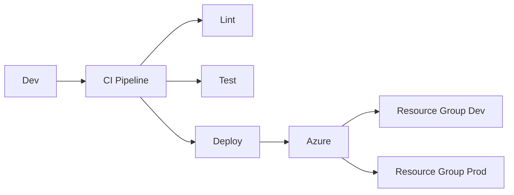

# Azure Bicep avanzado: testing, linting y despliegue seguro multi-entorno

## Resumen
Bicep permite IaC declarativo en Azure, pero en producción necesitas testing, linting y despliegue seguro por entorno. Este post va al grano: cómo testear plantillas, usar linting, parametrizar para dev/prod y evitar errores comunes.

## ¿Qué es Bicep avanzado?
- Modularización y reutilización
- Testing de plantillas antes de deploy
- Linting para calidad y seguridad
- Parametrización por entorno (dev, prod, test)
- Integración con pipelines CI/CD

## Arquitectura / Cómo funciona


## Testing de plantillas Bicep
1. Validar sintaxis:
```bash
bicep build main.bicep
```
2. Test de despliegue (dry-run):
```bash
az deployment sub validate \
  --location westeurope \
  --template-file main.bicep \
  --parameters environment="dev"
```
3. Test unitario con [PSRule for Azure](https://github.com/Azure/PSRule.Rules.Azure):
```bash
pwsh -c "Invoke-PSRule -Path ./main.bicep"
```

## Linting y calidad
- Usar [bicep linter](https://learn.microsoft.com/azure/azure-resource-manager/bicep/linter):
```bash
bicep build main.bicep
bicep linter main.bicep
```
- Reglas custom en `.bicepconfig.json`:
```json
{
  "analyzers": {
    "core": {
      "rules": {
        "no-hardcoded-secrets": "warning",
        "secure-parameters": "error"
      }
    }
  }
}
```

## Parametrización multi-entorno
- Usar parámetros y archivos por entorno:
```bash
az deployment group create \
  --resource-group rg-dev \
  --template-file main.bicep \
  --parameters @dev.parameters.json
az deployment group create \
  --resource-group rg-prod \
  --template-file main.bicep \
  --parameters @prod.parameters.json
```
- Ejemplo de parámetros:
```json
{
  "environment": {"value": "dev"},
  "adminPassword": {"value": "SuperSecret123!"}
}
```

## Integración CI/CD
- Pipeline YAML ejemplo:
```yaml
trigger:
  - main
pool:
  vmImage: 'ubuntu-latest'
steps:
  - script: bicep build main.bicep
    displayName: 'Build Bicep'
  - script: bicep linter main.bicep
    displayName: 'Lint Bicep'
  - script: pwsh -c "Invoke-PSRule -Path ./main.bicep"
    displayName: 'Test Bicep'
  - script: az deployment group create --resource-group rg-dev --template-file main.bicep --parameters @dev.parameters.json
    displayName: 'Deploy Dev'
```

## Buenas prácticas
- Nunca hardcodear secretos en plantillas
- Usar Key Vault para parámetros sensibles
- Validar y testear antes de cada despliegue
- Mantener módulos reutilizables y versionados
- Revisar resultados de linting y testing en cada PR

## Costes
- Bicep: gratis
- PSRule: gratis
- Azure DevOps: desde $0 (hasta 1,800 min/mes)

## Referencias
- [Bicep Linter](https://learn.microsoft.com/azure/azure-resource-manager/bicep/linter)
- [PSRule for Azure](https://learn.microsoft.com/azure/ps-rule-azure/)
- [Multi-environment deployments](https://learn.microsoft.com/azure/azure-resource-manager/bicep/deploy-multiple-environments)
