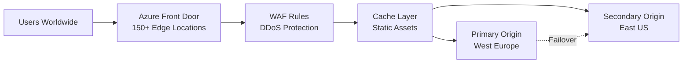

# Azure Front Door: prepara tu infraestructura para Black Friday

## Resumen

**Black Friday** y Cyber Monday generan picos de tráfico 10-50x normales. **Azure Front Door** te da CDN global, WAF, load balancing inteligente y failover automático para manejar esos picos sin caídas. En este post verás cómo configurar Front Door para alta disponibilidad y performance.

<!-- more -->

## ¿Por qué Azure Front Door para Black Friday?

**Problemas típicos en Black Friday:**

- **Latencia alta:** Usuarios globales accediendo desde LATAM, Asia, Europa
- **Origin overload:** Backend no aguanta 50,000 req/seg
- **DDoS attacks:** Competidores o bots atacan tu site
- **Single point of failure:** Un region down = site down
- **Cache ineficiente:** Mismo contenido descargado millones de veces

**Solución Front Door:**



---

## Setup básico Azure Front Door

### Crear Front Door Standard/Premium

```bash
# Variables
RESOURCE_GROUP="rg-ecommerce-prod"
FRONT_DOOR_NAME="fd-ecommerce"
SKU="Premium_AzureFrontDoor"  # Premium incluye WAF avanzado

# Crear Front Door
az afd profile create \
  --profile-name $FRONT_DOOR_NAME \
  --resource-group $RESOURCE_GROUP \
  --sku $SKU

# Crear endpoint
az afd endpoint create \
  --profile-name $FRONT_DOOR_NAME \
  --endpoint-name ecommerce-frontend \
  --resource-group $RESOURCE_GROUP \
  --enabled-state Enabled

# Crear origin group (backends)
az afd origin-group create \
  --profile-name $FRONT_DOOR_NAME \
  --origin-group-name webapp-origins \
  --resource-group $RESOURCE_GROUP \
  --probe-request-type GET \
  --probe-protocol Https \
  --probe-path /health \
  --probe-interval-in-seconds 30 \
  --sample-size 4 \
  --successful-samples-required 3 \
  --additional-latency-in-milliseconds 50

# Agregar origin primario (West Europe)
az afd origin create \
  --profile-name $FRONT_DOOR_NAME \
  --origin-group-name webapp-origins \
  --origin-name webapp-westeurope \
  --resource-group $RESOURCE_GROUP \
  --host-name webapp-prod-we.azurewebsites.net \
  --origin-host-header webapp-prod-we.azurewebsites.net \
  --priority 1 \
  --weight 1000 \
  --enabled-state Enabled \
  --http-port 80 \
  --https-port 443

# Agregar origin secundario (East US - failover)
az afd origin create \
  --profile-name $FRONT_DOOR_NAME \
  --origin-group-name webapp-origins \
  --origin-name webapp-eastus \
  --resource-group $RESOURCE_GROUP \
  --host-name webapp-prod-eus.azurewebsites.net \
  --origin-host-header webapp-prod-eus.azurewebsites.net \
  --priority 2 \  # Mayor priority = backup
  --weight 500 \
  --enabled-state Enabled

# Crear route
az afd route create \
  --profile-name $FRONT_DOOR_NAME \
  --endpoint-name ecommerce-frontend \
  --route-name default-route \
  --resource-group $RESOURCE_GROUP \
  --origin-group webapp-origins \
  --supported-protocols Http Https \
  --https-redirect Enabled \
  --forwarding-protocol HttpsOnly \
  --link-to-default-domain Enabled
```

---

## Caching strategy para Black Friday

### Configurar cache rules

```bash
# Rule 1: Cache imágenes por 7 días
az afd rule create \
  --profile-name $FRONT_DOOR_NAME \
  --rule-set-name CachingRules \
  --rule-name CacheImages \
  --resource-group $RESOURCE_GROUP \
  --order 1 \
  --match-variable RequestPath \
  --operator BeginsWith \
  --match-values "/images/" "/assets/" \
  --action-name CacheExpiration \
  --cache-behavior OverrideAlways \
  --cache-duration "7.00:00:00"

# Rule 2: Cache API productos por 5 minutos
az afd rule create \
  --profile-name $FRONT_DOOR_NAME \
  --rule-set-name CachingRules \
  --rule-name CacheAPIProducts \
  --resource-group $RESOURCE_GROUP \
  --order 2 \
  --match-variable RequestPath \
  --operator BeginsWith \
  --match-values "/api/products" \
  --action-name CacheExpiration \
  --cache-behavior OverrideAlways \
  --cache-duration "00:05:00"

# Rule 3: NO cache checkout/cart
az afd rule create \
  --profile-name $FRONT_DOOR_NAME \
  --rule-set-name CachingRules \
  --rule-name NoCacheCheckout \
  --resource-group $RESOURCE_GROUP \
  --order 3 \
  --match-variable RequestPath \
  --operator Contains \
  --match-values "/checkout" "/cart" "/api/orders" \
  --action-name CacheExpiration \
  --cache-behavior BypassCache
```

### Query string caching

```bash
# Cache basado en query strings específicos (ej: ?color=red&size=L)
az afd route update \
  --profile-name $FRONT_DOOR_NAME \
  --endpoint-name ecommerce-frontend \
  --route-name default-route \
  --resource-group $RESOURCE_GROUP \
  --query-string-caching-behavior IncludeSpecifiedQueryStrings \
  --query-parameters "color" "size" "variant"
```

---

## WAF: protección contra ataques

### Configurar WAF policy

```bash
# Crear WAF policy
az network front-door waf-policy create \
  --name waf-blackfriday \
  --resource-group $RESOURCE_GROUP \
  --sku Premium_AzureFrontDoor \
  --mode Prevention  # Detection solo monitoriza, Prevention bloquea

# Regla custom: Rate limiting (max 100 req/min por IP)
az network front-door waf-policy custom-rule create \
  --policy-name waf-blackfriday \
  --resource-group $RESOURCE_GROUP \
  --name RateLimitRule \
  --priority 100 \
  --rule-type RateLimitRule \
  --action Block \
  --rate-limit-threshold 100 \
  --rate-limit-duration-in-minutes 1 \
  --match-condition \
    MatchVariable=RequestUri \
    Operator=Contains \
    MatchValue="/api/"

# Regla: Bloquear IPs sospechosas
az network front-door waf-policy custom-rule create \
  --policy-name waf-blackfriday \
  --resource-group $RESOURCE_GROUP \
  --name BlockBadIPs \
  --priority 200 \
  --rule-type MatchRule \
  --action Block \
  --match-condition \
    MatchVariable=RemoteAddr \
    Operator=IPMatch \
    MatchValue="203.0.113.0/24,198.51.100.0/24"  # IPs maliciosas

# Managed rules: OWASP Top 10
az network front-door waf-policy managed-rules add \
  --policy-name waf-blackfriday \
  --resource-group $RESOURCE_GROUP \
  --type Microsoft_DefaultRuleSet \
  --version 2.1 \
  --action Block

# Managed rules: Bot protection
az network front-door waf-policy managed-rules add \
  --policy-name waf-blackfriday \
  --resource-group $RESOURCE_GROUP \
  --type Microsoft_BotManagerRuleSet \
  --version 1.0

# Asociar WAF policy a Front Door
az afd security-policy create \
  --profile-name $FRONT_DOOR_NAME \
  --resource-group $RESOURCE_GROUP \
  --security-policy-name waf-policy \
  --domains ecommerce-frontend \
  --waf-policy /subscriptions/$SUB_ID/resourceGroups/$RESOURCE_GROUP/providers/Microsoft.Network/frontdoorwebapplicationfirewallpolicies/waf-blackfriday
```

---

## Load balancing inteligente

### Weighted routing

```bash
# Distribuir tráfico: 80% West Europe, 20% East US
az afd origin update \
  --profile-name $FRONT_DOOR_NAME \
  --origin-group-name webapp-origins \
  --origin-name webapp-westeurope \
  --resource-group $RESOURCE_GROUP \
  --weight 800

az afd origin update \
  --profile-name $FRONT_DOOR_NAME \
  --origin-group-name webapp-origins \
  --origin-name webapp-eastus \
  --resource-group $RESOURCE_GROUP \
  --weight 200
```

### Latency-based routing

```bash
# Front Door automáticamente enruta al origin con menor latencia
az afd origin-group update \
  --profile-name $FRONT_DOOR_NAME \
  --origin-group-name webapp-origins \
  --resource-group $RESOURCE_GROUP \
  --additional-latency-in-milliseconds 50  # Tolerar 50ms diferencia antes de failover
```

### Health probes y failover

```bash
# Configurar health probe agresivo
az afd origin-group update \
  --profile-name $FRONT_DOOR_NAME \
  --origin-group-name webapp-origins \
  --resource-group $RESOURCE_GROUP \
  --probe-interval-in-seconds 10 \  # Check cada 10s (default 30s)
  --probe-path /health \
  --successful-samples-required 2 \  # 2/4 probes exitosos para marcar healthy
  --sample-size 4
```

**Health check endpoint en backend:**

```csharp
// ASP.NET Core health check
app.MapGet("/health", () =>
{
    // Verificar DB connection, external APIs, etc.
    var dbHealthy = CheckDatabaseConnection();
    var cacheHealthy = CheckRedisConnection();

    if (!dbHealthy || !cacheHealthy)
        return Results.StatusCode(503);  // Unhealthy

    return Results.Ok(new { status = "healthy", timestamp = DateTime.UtcNow });
});
```

---

## Custom domain y SSL

### Configurar dominio custom

```bash
# Agregar custom domain
az afd custom-domain create \
  --profile-name $FRONT_DOOR_NAME \
  --custom-domain-name www-example-com \
  --resource-group $RESOURCE_GROUP \
  --host-name www.example.com \
  --minimum-tls-version TLS12 \
  --certificate-type ManagedCertificate  # Auto-renovado por Azure

# Asociar domain a route
az afd route update \
  --profile-name $FRONT_DOOR_NAME \
  --endpoint-name ecommerce-frontend \
  --route-name default-route \
  --resource-group $RESOURCE_GROUP \
  --custom-domains www-example-com

# Obtener CNAME validation
az afd custom-domain show \
  --profile-name $FRONT_DOOR_NAME \
  --custom-domain-name www-example-com \
  --resource-group $RESOURCE_GROUP \
  --query "validationProperties.validationToken"
```

**Agregar en DNS:**

```
CNAME www   →   ecommerce-frontend-xxx.z01.azurefd.net
TXT   _dnsauth.www   →   <validationToken>
```

---

## Monitoring y alertas Black Friday

### Metrics críticas

```bash
# Dashboard Front Door
az monitor metrics list \
  --resource /subscriptions/$SUB_ID/resourceGroups/$RESOURCE_GROUP/providers/Microsoft.Cdn/profiles/$FRONT_DOOR_NAME \
  --metric "RequestCount" "TotalLatency" "BackendHealthPercentage" "OriginRequestCount" "WebApplicationFirewallRequestCount" \
  --start-time "2025-11-29T00:00:00Z" \
  --end-time "2025-11-29T23:59:59Z" \
  --interval PT5M \
  --aggregation Total Average
```

### Alertas críticas

```bash
# Alerta: Backend health < 80%
az monitor metrics alert create \
  --name alert-backend-unhealthy \
  --resource-group $RESOURCE_GROUP \
  --scopes /subscriptions/$SUB_ID/resourceGroups/$RESOURCE_GROUP/providers/Microsoft.Cdn/profiles/$FRONT_DOOR_NAME \
  --condition "avg BackendHealthPercentage < 80" \
  --window-size 5m \
  --evaluation-frequency 1m \
  --action ag-blackfriday-oncall \
  --description "Backend health degraded"

# Alerta: Latency > 2 segundos
az monitor metrics alert create \
  --name alert-high-latency \
  --resource-group $RESOURCE_GROUP \
  --scopes /subscriptions/$SUB_ID/resourceGroups/$RESOURCE_GROUP/providers/Microsoft.Cdn/profiles/$FRONT_DOOR_NAME \
  --condition "avg TotalLatency > 2000" \
  --window-size 5m \
  --action ag-blackfriday-oncall

# Alerta: WAF blocking spike
az monitor metrics alert create \
  --name alert-waf-blocking-spike \
  --resource-group $RESOURCE_GROUP \
  --scopes /subscriptions/$SUB_ID/resourceGroups/$RESOURCE_GROUP/providers/Microsoft.Network/frontdoorwebapplicationfirewallpolicies/waf-blackfriday \
  --condition "total BlockedRequestCount > 1000" \
  --window-size 5m \
  --action ag-security-team
```

---

## Pre-warming y load testing

### Pre-warmar cache antes de Black Friday

```bash
#!/bin/bash
# Script: warm-cache.sh
# Ejecutar 1 hora antes de Black Friday

FRONT_DOOR_URL="https://www.example.com"

# Top 100 URLs más visitadas
URLS=(
  "/products/bestsellers"
  "/products/category/electronics"
  "/products/category/clothing"
  "/deals/black-friday"
  # ... más URLs
)

echo "Warming cache..."
for url in "${URLS[@]}"; do
  curl -s -o /dev/null "$FRONT_DOOR_URL$url"
  echo "Warmed: $url"
  sleep 0.1
done

echo "Cache warming completed"
```

### Load test con Azure Load Testing

```yaml
# loadtest-blackfriday.yaml
testId: blackfriday-2025
displayName: "Black Friday Load Test"
testPlan: jmeter-test.jmx
engineInstances: 20  # 20 load generators
env:
  - name: TARGET_URL
    value: https://www.example.com
  - name: THREADS
    value: "5000"  # 5,000 usuarios concurrentes
  - name: RAMP_UP
    value: "300"  # Ramp-up en 5 minutos
  - name: DURATION
    value: "3600"  # Test de 1 hora
```

```bash
# Ejecutar load test
az load test create \
  --load-test-resource loadtest-prod \
  --resource-group $RESOURCE_GROUP \
  --test-id blackfriday-2025 \
  --load-test-config-file loadtest-blackfriday.yaml
```

---

## Checklist preparación Black Friday

**2 semanas antes:**
- [ ] Configurar Front Door con multi-origin (primary + backup)
- [ ] Implementar WAF rules (rate limiting, bot protection)
- [ ] Configurar cache rules para assets estáticos
- [ ] Setup custom domain con SSL
- [ ] Crear alertas de monitoring críticas
- [ ] Load test con tráfico 5x normal

**1 semana antes:**
- [ ] Validar health checks funcionan correctamente
- [ ] Test manual de failover (apagar primary origin)
- [ ] Revisar WAF logs para ajustar false positives
- [ ] Comunicar runbook a equipo on-call
- [ ] Backup de configuración Front Door

**1 día antes:**
- [ ] Pre-warming de cache (top 100 URLs)
- [ ] Verificar origins están healthy
- [ ] Load test con tráfico 10x normal
- [ ] Validar dashboards y alertas funcionan
- [ ] Freeze de deployments (no cambios en producción)

**Durante Black Friday:**
- [ ] Monitoring continuo (cada 5 min)
- [ ] Revisar WAF blocks para ataques
- [ ] Estar listo para escalar backends si necesario
- [ ] Documentar incidentes para post-mortem

---

## Troubleshooting común

### Problem a: Cache no funciona

```bash
# Verificar cache hit ratio
az monitor metrics list \
  --resource /subscriptions/$SUB_ID/resourceGroups/$RESOURCE_GROUP/providers/Microsoft.Cdn/profiles/$FRONT_DOOR_NAME \
  --metric "CacheHitRatio" \
  --start-time "2025-11-29T00:00:00Z" \
  --interval PT5M
```

**Fix típico:** Headers `Cache-Control: no-cache` en backend → remover o override en Front Door

### Problema: WAF bloqueando legítimo tráfico

```bash
# Ver blocked requests
az monitor diagnostic-settings create \
  --name waf-logs \
  --resource /subscriptions/$SUB_ID/resourceGroups/$RESOURCE_GROUP/providers/Microsoft.Network/frontdoorwebapplicationfirewallpolicies/waf-blackfriday \
  --logs '[{"category":"FrontdoorAccessLog","enabled":true},{"category":"FrontdoorWebApplicationFirewallLog","enabled":true}]' \
  --workspace /subscriptions/$SUB_ID/resourceGroups/$RESOURCE_GROUP/providers/Microsoft.OperationalInsights/workspaces/law-prod
```

**Query Log Analytics:**

```kusto
AzureDiagnostics
| where Category == "FrontdoorWebApplicationFirewallLog"
| where action_s == "Block"
| summarize Count = count() by ruleName_s, clientIP_s
| order by Count desc
```

---

## Costes Black Friday

**Estimación:**

```
Front Door Premium: $35/month base + $0.25/GB egress + $0.018/10k requests
WAF: Incluido en Premium
Origins: 2x App Service P3V3 (~$400/month c/u durante Nov-Dic)

Black Friday (1 día):
- 50M requests: $90
- 5 TB egress: $1,250
- Origins escalados: $27 (1 día)

Total Black Friday: ~$1,400
Tráfico normal (resto mes): ~$500

Total Noviembre: ~$1,900 (vs $15,000 sin CDN/caching)
```

---

## Referencias

- [Azure Front Door Documentation](https://learn.microsoft.com/azure/frontdoor/)
- [WAF Best Practices](https://learn.microsoft.com/azure/web-application-firewall/afds/waf-front-door-best-practices)
- [Caching Best Practices](https://learn.microsoft.com/azure/frontdoor/front-door-caching)
- [Azure Load Testing](https://learn.microsoft.com/azure/load-testing/)
