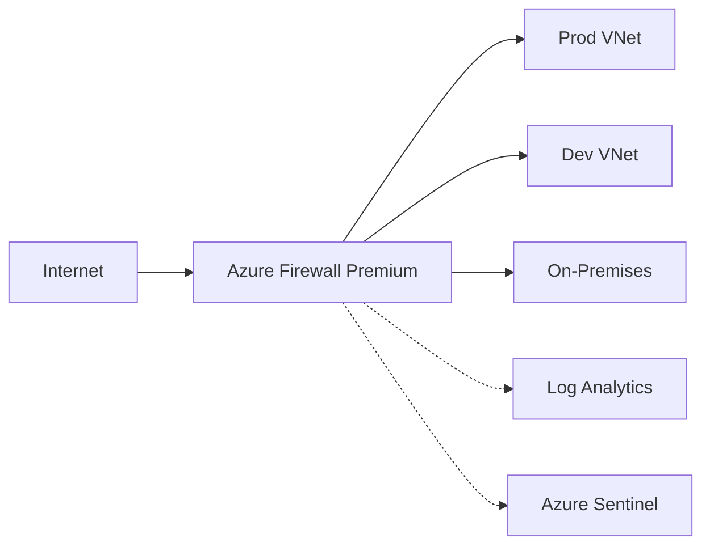

# Azure Firewall Premium: inspección TLS, Threat Intelligence y reglas avanzadas

## Resumen
Azure Firewall Premium añade inspección TLS, Threat Intelligence y reglas personalizadas para proteger redes cloud y híbridas. Este post va directo: cómo activar TLS inspection, usar Threat Intelligence, crear reglas avanzadas y monitorizar tráfico. Para admins y arquitectos que quieren seguridad real en producción.

## ¿Qué es Azure Firewall Premium?
- Firewall gestionado, escalable y centralizado
- Inspección TLS (decrypted traffic)
- Threat Intelligence (bloqueo IPs maliciosas)
- FQDN filtering, IDPS, reglas de aplicación y red
- Integración con Log Analytics y Sentinel

## Arquitectura / Cómo funciona


## Activar Firewall Premium y TLS Inspection
1. Crear Firewall Premium:
```bash
RESOURCE_GROUP="rg-fw-prod"
LOCATION="westeurope"
FW_NAME="fw-premium-prod"
VNET_NAME="vnet-fw-prod"
SUBNET_NAME="AzureFirewallSubnet"

az network firewall create \
  --name $FW_NAME \
  --resource-group $RESOURCE_GROUP \
  --location $LOCATION \
  --sku Premium
```
2. Crear certificado para TLS inspection:
```bash
# Generar certificado raíz (usando OpenSSL)
openssl req -x509 -newkey rsa:4096 -keyout tls.key -out tls.crt -days 365 -nodes -subj "/CN=AzureFirewallTLS"
# Subir a Key Vault
az keyvault certificate import \
  --vault-name kv-fw-prod \
  --name fw-tls-root \
  --file tls.crt
```
3. Configurar TLS inspection:
```bash
az network firewall policy create \
  --name fw-policy-premium \
  --resource-group $RESOURCE_GROUP \
  --location $LOCATION \
  --sku Premium
az network firewall policy tls-inspection create \
  --policy-name fw-policy-premium \
  --resource-group $RESOURCE_GROUP \
  --key-vault-secret-id <KV_CERT_SECRET_ID>
```

## Threat Intelligence
- Dos modos: "Alert" (solo avisa) y "Deny" (bloquea IPs maliciosas)
```bash
az network firewall policy threat-intel-set \
  --policy-name fw-policy-premium \
  --resource-group $RESOURCE_GROUP \
  --action Deny
```

## Reglas avanzadas
- Application rules: FQDN, URL, TLS
- Network rules: IP, port, protocol
- IDPS: detección y bloqueo de ataques
```bash
# Application rule: solo permite https://github.com
az network firewall policy rule-collection-group application-rule-collection create \
  --policy-name fw-policy-premium \
  --resource-group $RESOURCE_GROUP \
  --name app-allow-github \
  --priority 100 \
  --action Allow \
  --rules '[{"name":"AllowGithub","sourceAddresses":["*"],"protocols":[{"protocolType":"Https","port":443}],"targetFqdns":["github.com"]}]'

# Network rule: solo permite TCP 443 a IP específica
az network firewall policy rule-collection-group network-rule-collection create \
  --policy-name fw-policy-premium \
  --resource-group $RESOURCE_GROUP \
  --name net-allow-prod \
  --priority 200 \
  --action Allow \
  --rules '[{"name":"AllowProd443","sourceAddresses":["10.0.0.0/24"],"destinationAddresses":["20.30.40.50"],"destinationPorts":["443"],"protocols":["TCP"]}]'
```

## Monitorización y logging
- Integrar con Log Analytics:
```bash
az monitor diagnostic-settings create \
  --resource /subscriptions/$SUB_ID/resourceGroups/$RESOURCE_GROUP/providers/Microsoft.Network/azureFirewalls/$FW_NAME \
  --workspace $LOG_ANALYTICS_ID \
  --name fw-logs \
  --logs '[{"category":"AzureFirewallApplicationRule","enabled":true},{"category":"AzureFirewallNetworkRule","enabled":true},{"category":"AzureFirewallDnsProxy","enabled":true}]'
```
- Queries KQL útiles:
```kusto
// Top 10 destinos bloqueados
AzureDiagnostics
| where Category == "AzureFirewallNetworkRule"
| where action_s == "Deny"
| summarize Count = count() by destination_ip_s
| top 10 by Count desc

// Detección de ataques IDPS
AzureDiagnostics
| where Category == "AzureFirewallIdpsSignature"
| summarize Count = count() by signature_name_s
| top 10 by Count desc
```

## Buenas prácticas
- Usar TLS inspection solo para tráfico interno/confidencial
- Mantener certificados actualizados en Key Vault
- Threat Intelligence en modo "Deny" para entornos críticos
- Revisar logs y alertas semanalmente
- Segmentar reglas por entorno (dev, prod)
- Integrar con Sentinel para correlación de incidentes

## Costes
- Firewall Premium: ~$1,500/mes por unidad
- Log Analytics: ~$2.30/GB
- Sentinel: ~$2.46/GB

## Referencias
- [Azure Firewall Premium](https://learn.microsoft.com/azure/firewall/premium-features)
- [TLS Inspection](https://learn.microsoft.com/azure/firewall/premium-features#tls-inspection)
- [Threat Intelligence](https://learn.microsoft.com/azure/firewall/threat-intel)
- [Diagnostic Logging](https://learn.microsoft.com/azure/firewall/log-analytics)
- [IDPS](https://learn.microsoft.com/azure/firewall/idps)
