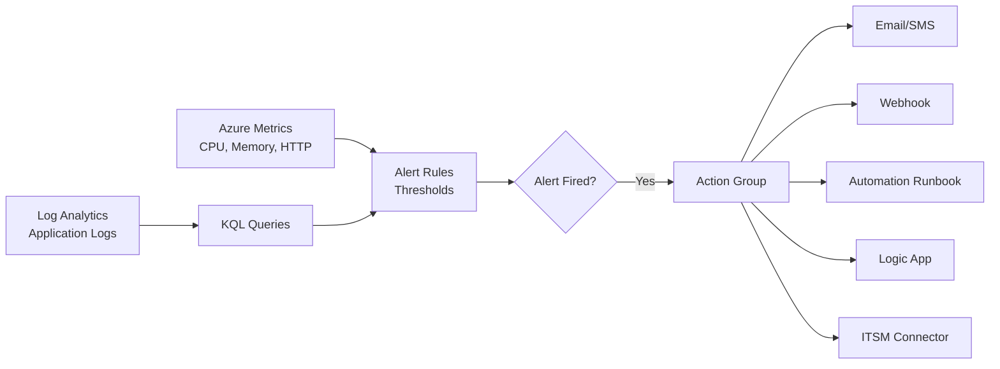

# Azure Monitor Alerts y Action Groups: monitoring proactivo en 2025

## Resumen

**Azure Monitor Alerts** detecta problemas antes de que los usuarios los reporten. Con **Action Groups** automatizas la respuesta (email, SMS, webhook, runbook, Logic App). En este post verás cómo configurar alertas de métricas y logs, action groups, y KQL queries para monitoring efectivo.

<!-- more -->

## ¿Qué son Azure Monitor Alerts?

**Alertas = Detección proactiva de problemas**



**Tipos de alertas:**

- **Metric alerts:** Basadas en métricas de recursos (CPU > 80%)
- **Log alerts:** Basadas en queries KQL (errores en logs)
- **Activity log alerts:** Eventos de control plane (VM deleted, RG created)
- **Smart detection alerts:** AI detecta anomalías (Application Insights)

---

## Metric alerts: métricas de recursos

### Alerta básica: CPU alta

```bash
# Variables
RESOURCE_GROUP="rg-prod"
VM_ID="/subscriptions/$SUB_ID/resourceGroups/$RESOURCE_GROUP/providers/Microsoft.Compute/virtualMachines/vm-web-01"
ACTION_GROUP_ID="/subscriptions/$SUB_ID/resourceGroups/$RESOURCE_GROUP/providers/microsoft.insights/actionGroups/ag-oncall"

# Alerta: CPU > 80% por 5 minutos
az monitor metrics alert create \
  --name alert-vm-cpu-high \
  --resource-group $RESOURCE_GROUP \
  --scopes $VM_ID \
  --condition "avg Percentage CPU > 80" \
  --window-size 5m \
  --evaluation-frequency 1m \
  --action $ACTION_GROUP_ID \
  --description "VM CPU above 80% for 5 minutes" \
  --severity 2  # 0=Critical, 1=Error, 2=Warning, 3=Informational, 4=Verbose
```

### Alerta multi-resource: todas las VMs

```bash
# Alerta aplicada a TODAS las VMs en el resource group
az monitor metrics alert create \
  --name alert-all-vms-memory \
  --resource-group $RESOURCE_GROUP \
  --scopes /subscriptions/$SUB_ID/resourceGroups/$RESOURCE_GROUP \
  --condition "avg Available Memory Bytes < 1073741824" \  # < 1 GB
  --window-size 5m \
  --evaluation-frequency 1m \
  --action $ACTION_GROUP_ID \
  --description "VM memory below 1GB" \
  --severity 1 \
  --target-resource-type "Microsoft.Compute/virtualMachines" \
  --target-resource-region "westeurope"
```

### Alerta dinámica: anomalías automáticas

```bash
# Dynamic threshold: Azure ML detecta patrones y alertas en anomalías
az monitor metrics alert create \
  --name alert-app-requests-anomaly \
  --resource-group $RESOURCE_GROUP \
  --scopes $APP_SERVICE_ID \
  --condition "avg Requests > dynamic High 3 of 4 violations out of 5 aggregated points" \
  --window-size 5m \
  --evaluation-frequency 1m \
  --action $ACTION_GROUP_ID \
  --description "Abnormal request spike detected"

# Parámetros dynamic threshold:
# - Sensitivity: Low, Medium, High (qué tan sensible a desviaciones)
# - Violations: X of Y periods (ej: 3 de 4 ventanas)
```

### Alerta multi-condición: AND/OR logic

```bash
# Alerta si CPU > 80% AND Memory < 1GB
az monitor metrics alert create \
  --name alert-vm-resource-exhaustion \
  --resource-group $RESOURCE_GROUP \
  --scopes $VM_ID \
  --condition "avg Percentage CPU > 80" \
  --add-condition "avg Available Memory Bytes < 1073741824" \
  --condition-operator "AND" \
  --window-size 5m \
  --action $ACTION_GROUP_ID \
  --severity 0  # Critical
```

---

## Log alerts: queries KQL

### Alerta: errores en Application Insights

```bash
# Alerta basada en query KQL
az monitor scheduled-query create \
  --name alert-app-errors \
  --resource-group $RESOURCE_GROUP \
  --scopes $APP_INSIGHTS_ID \
  --condition "count > 10" \
  --condition-query "exceptions | where timestamp > ago(5m) | count" \
  --window-size 5m \
  --evaluation-frequency 5m \
  --action $ACTION_GROUP_ID \
  --description "More than 10 exceptions in 5 minutes" \
  --severity 1
```

**Query KQL más compleja:**

```kusto
// Detectar errores HTTP 500 en API específica
requests
| where timestamp > ago(5m)
| where resultCode >= 500
| where url contains "/api/orders"
| summarize ErrorCount = count() by operation_Name, resultCode
| where ErrorCount > 5
```

```bash
# Alerta con query compleja
az monitor scheduled-query create \
  --name alert-api-orders-errors \
  --resource-group $RESOURCE_GROUP \
  --scopes $APP_INSIGHTS_ID \
  --condition "count > 0" \
  --condition-query "requests | where timestamp > ago(5m) | where resultCode >= 500 | where url contains '/api/orders' | summarize ErrorCount = count() by operation_Name, resultCode | where ErrorCount > 5" \
  --window-size 5m \
  --evaluation-frequency 5m \
  --action $ACTION_GROUP_ID
```

### Alerta: alta latencia en base de datos

```kusto
// SQL Database query duration > 5 segundos
AzureDiagnostics
| where ResourceType == "SERVERS/DATABASES"
| where Category == "QueryStoreRuntimeStatistics"
| where duration_d > 5000  // milisegundos
| summarize SlowQueries = count() by query_id_d, database_name_s
| where SlowQueries > 10
```

```bash
az monitor scheduled-query create \
  --name alert-sql-slow-queries \
  --resource-group $RESOURCE_GROUP \
  --scopes $LOG_ANALYTICS_ID \
  --condition "count > 0" \
  --condition-query "<KQL query arriba>" \
  --window-size 15m \
  --evaluation-frequency 15m \
  --action $ACTION_GROUP_ID
```

### Alerta: uso de API key revocada

```kusto
// Detectar intentos de autenticación con API key revocada
AppServiceHTTPLogs
| where TimeGenerated > ago(5m)
| where CsUriStem contains "/api/"
| where ScStatus == 401
| extend ApiKey = extract(@"apikey=([^&]+)", 1, CsUriQuery)
| where ApiKey in ("revoked-key-1", "revoked-key-2", "revoked-key-3")
| summarize Attempts = count() by CsHost, CIp, ApiKey
```

---

## Action Groups: automatizar respuesta

### Action Group básico: email + SMS

```bash
# Crear action group
az monitor action-group create \
  --name ag-oncall \
  --resource-group $RESOURCE_GROUP \
  --short-name "OnCall" \
  --email admin email=admin@example.com \
  --email devops email=devops@example.com \
  --sms oncall countrycode=34 phonenumber=612345678

# Agregar webhook
az monitor action-group update \
  --name ag-oncall \
  --resource-group $RESOURCE_GROUP \
  --add-action webhook alert-webhook https://alerts.example.com/webhook usecommonalertsschema
```

### Action: ejecutar Automation Runbook

```bash
# Runbook: restart VM automáticamente
az monitor action-group update \
  --name ag-oncall \
  --resource-group $RESOURCE_GROUP \
  --add-action automationrunbook restart-vm \
    automationaccountid=$AUTOMATION_ACCOUNT_ID \
    runbookname=Restart-AzureVM \
    webhookresourceid=$WEBHOOK_ID \
    isglobalrunbook=false
```

**Runbook PowerShell:**

```powershell
# Restart-AzureVM.ps1
param(
    [Parameter(Mandatory=$true)]
    [object]$WebhookData
)

$alert = ConvertFrom-Json -InputObject $WebhookData.RequestBody
$resourceId = $alert.data.essentials.alertTargetIDs[0]

# Extraer VM name
$vmName = ($resourceId -split '/')[-1]
$resourceGroup = ($resourceId -split '/')[4]

# Conectar con Managed Identity
Connect-AzAccount -Identity

# Restart VM
Write-Output "Restarting VM: $vmName in RG: $resourceGroup"
Restart-AzVM -ResourceGroupName $resourceGroup -Name $vmName -NoWait
```

### Action: Logic App (integración Slack, Teams, PagerDuty)

```bash
# Trigger Logic App desde alert
az monitor action-group update \
  --name ag-oncall \
  --resource-group $RESOURCE_GROUP \
  --add-action logicapp alert-to-slack \
    resourceid=$LOGIC_APP_ID \
    callbackurl="https://prod-XX.westeurope.logic.azure.com:443/workflows/xxx/triggers/manual/paths/invoke?api-version=2016-10-01&sp=%2Ftriggers%2Fmanual%2Frun&sv=1.0&sig=xxx"
```

**Logic App workflow (alert → Slack):**

```json
{
  "definition": {
    "$schema": "https://schema.management.azure.com/providers/Microsoft.Logic/schemas/2016-06-01/workflowdefinition.json#",
    "triggers": {
      "manual": {
        "type": "Request",
        "kind": "Http",
        "inputs": {
          "schema": {
            "type": "object",
            "properties": {
              "schemaId": { "type": "string" },
              "data": {
                "type": "object",
                "properties": {
                  "essentials": {
                    "type": "object",
                    "properties": {
                      "alertRule": { "type": "string" },
                      "severity": { "type": "string" },
                      "description": { "type": "string" }
                    }
                  }
                }
              }
            }
          }
        }
      }
    },
    "actions": {
      "Post_to_Slack": {
        "type": "ApiConnection",
        "inputs": {
          "host": {
            "connection": {
              "name": "@parameters('$connections')['slack']['connectionId']"
            }
          },
          "method": "post",
          "path": "/chat.postMessage",
          "body": {
            "channel": "#alerts",
            "text": "🚨 *Alert Fired*\n*Rule:* @{triggerBody()?['data']?['essentials']?['alertRule']}\n*Severity:* @{triggerBody()?['data']?['essentials']?['severity']}\n*Description:* @{triggerBody()?['data']?['essentials']?['description']}"
          }
        }
      }
    }
  }
}
```

### Action: ITSM Connector (ServiceNow)

```bash
# Crear ticket automático en ServiceNow
az monitor action-group update \
  --name ag-oncall \
  --resource-group $RESOURCE_GROUP \
  --add-action itsm create-incident \
    workspaceId=$LOG_ANALYTICS_ID \
    connectionId=$ITSM_CONNECTION_ID \
    ticketConfiguration='{"PayloadRevision":0,"WorkItemType":"Incident","UseTemplate":false,"WorkItemData":"{}","CreateOneWIPerCI":false}'
```

---

## Smart Detection: Application Insights AI

### Habilitar smart detection

```bash
# Smart detection automáticamente detecta:
# - Failure anomalies (spike en errores)
# - Performance anomalies (latencia inusual)
# - Memory leak detection
# - Slow page load times

# Configurar action group para smart detection
az monitor app-insights component update \
  --app $APP_INSIGHTS_NAME \
  --resource-group $RESOURCE_GROUP \
  --set "properties.smartDetectionAlertRules[0].actionGroups"="['$ACTION_GROUP_ID']"
```

**Ejemplo detección automática:**

- Baseline normal: 50 errores/hora
- Detección: 500 errores/hora (10x)
- Smart detection fires → Action group ejecuta

---

## Suppression rules: evitar alert fatigue

### Suppress durante maintenance window

```bash
# No enviar alertas los domingos (mantenimiento)
az monitor metrics alert update \
  --name alert-vm-cpu-high \
  --resource-group $RESOURCE_GROUP \
  --add-action $ACTION_GROUP_ID \
    suppress="{'recurrence':{'days':['Sunday'],'startTime':'00:00:00','endTime':'23:59:59'}}"
```

### Suppress por tags

```bash
# No alertar VMs con tag "environment=dev"
az monitor metrics alert create \
  --name alert-prod-vms-only \
  --resource-group $RESOURCE_GROUP \
  --scopes /subscriptions/$SUB_ID/resourceGroups/$RESOURCE_GROUP \
  --condition "avg Percentage CPU > 90" \
  --target-resource-type "Microsoft.Compute/virtualMachines" \
  --criteria "tags.environment == 'production'"
```

---

## Dashboard de alertas

### Crear dashboard en Azure Portal

```bash
# Exportar dashboard como JSON
az portal dashboard create \
  --name dashboard-alerts \
  --resource-group $RESOURCE_GROUP \
  --input-path dashboard-alerts.json
```

**dashboard-alerts.json (excerpt):**

```json
{
  "lenses": {
    "0": {
      "parts": {
        "0": {
          "metadata": {
            "type": "Extension/Microsoft_Azure_Monitoring/PartType/AlertsManagementSummaryPart",
            "settings": {
              "content": {
                "timeContext": {
                  "durationMs": 86400000,  // Last 24h
                  "createdTime": "2025-12-01T00:00:00.000Z"
                },
                "severity": ["Sev0", "Sev1", "Sev2"],
                "alertState": "New"
              }
            }
          }
        },
        "1": {
          "metadata": {
            "type": "Extension/Microsoft_Azure_Monitoring/PartType/MetricsChartPart",
            "inputs": [{
              "name": "ResourceIds",
              "value": ["/subscriptions/$SUB_ID/resourceGroups/$RESOURCE_GROUP/providers/Microsoft.Compute/virtualMachines/vm-web-01"]
            }],
            "settings": {
              "content": {
                "metrics": [
                  {
                    "resourceMetadata": { "id": "$VM_ID" },
                    "name": "Percentage CPU",
                    "aggregationType": 4,  // Average
                    "namespace": "Microsoft.Compute/virtualMachines"
                  }
                ]
              }
            }
          }
        }
      }
    }
  }
}
```

---

## Queries KQL útiles

### Top 10 alertas más frecuentes

```kusto
AzureMetrics
| where TimeGenerated > ago(30d)
| where MetricName == "Alert"
| summarize Count = count() by AlertRule = tostring(parse_json(Properties).alertRule)
| top 10 by Count desc
```

### Tiempo de resolución de alertas

```kusto
AlertsManagementResources
| where type == "microsoft.alertsmanagement/alerts"
| extend ResolvedTime = todatetime(properties.essentials.lastModifiedDateTime)
| extend FiredTime = todatetime(properties.essentials.startDateTime)
| extend ResolutionTime = datetime_diff('minute', ResolvedTime, FiredTime)
| summarize AvgResolutionTime = avg(ResolutionTime) by AlertRule = tostring(properties.essentials.alertRule)
| order by AvgResolutionTime desc
```

### Alertas por severidad (último mes)

```kusto
AlertsManagementResources
| where type == "microsoft.alertsmanagement/alerts"
| where properties.essentials.startDateTime > ago(30d)
| summarize Count = count() by Severity = tostring(properties.essentials.severity)
| render piechart
```

### Alertas no resueltas > 24h

```kusto
AlertsManagementResources
| where type == "microsoft.alertsmanagement/alerts"
| where properties.essentials.monitorCondition == "Fired"
| extend FiredTime = todatetime(properties.essentials.startDateTime)
| where FiredTime < ago(24h)
| project
    AlertRule = properties.essentials.alertRule,
    Severity = properties.essentials.severity,
    FiredTime,
    Resource = properties.essentials.targetResourceName,
    Description = properties.essentials.description
| order by FiredTime asc
```

---

## Alert automation con Bicep/Terraform

### Bicep template

```bicep
// alert-vm-cpu.bicep
param location string = resourceGroup().location
param vmId string
param actionGroupId string

resource cpuAlert 'Microsoft.Insights/metricAlerts@2018-03-01' = {
  name: 'alert-vm-cpu-high'
  location: 'global'  // Alerts son global
  properties: {
    description: 'Alert when VM CPU > 80%'
    severity: 2
    enabled: true
    scopes: [
      vmId
    ]
    evaluationFrequency: 'PT1M'
    windowSize: 'PT5M'
    criteria: {
      'odata.type': 'Microsoft.Azure.Monitor.SingleResourceMultipleMetricCriteria'
      allOf: [
        {
          name: 'HighCPU'
          metricName: 'Percentage CPU'
          metricNamespace: 'Microsoft.Compute/virtualMachines'
          operator: 'GreaterThan'
          threshold: 80
          timeAggregation: 'Average'
        }
      ]
    }
    actions: [
      {
        actionGroupId: actionGroupId
      }
    ]
  }
}
```

```bash
# Deploy
az deployment group create \
  --resource-group $RESOURCE_GROUP \
  --template-file alert-vm-cpu.bicep \
  --parameters vmId=$VM_ID actionGroupId=$ACTION_GROUP_ID
```

### Terraform

```hcl
# alert-vm-cpu.tf
resource "azurerm_monitor_metric_alert" "vm_cpu" {
  name                = "alert-vm-cpu-high"
  resource_group_name = var.resource_group_name
  scopes              = [var.vm_id]
  description         = "Alert when VM CPU > 80%"
  severity            = 2
  frequency           = "PT1M"
  window_size         = "PT5M"

  criteria {
    metric_namespace = "Microsoft.Compute/virtualMachines"
    metric_name      = "Percentage CPU"
    aggregation      = "Average"
    operator         = "GreaterThan"
    threshold        = 80
  }

  action {
    action_group_id = var.action_group_id
  }
}
```

---

## Buenas prácticas

**Configuración alertas:**

- **Severity correcta:** Critical (Sev0) solo para production down, Warning (Sev2) para degradaciones
- **Avoid alert storms:** Usar suppression rules para mantenimientos
- **Meaningful names:** `alert-{resource}-{metric}-{condition}` (ej: alert-sql-cpu-high)
- **Action groups por equipo:** Separar on-call, security team, operations

**Thresholds:**

- **Basados en SLIs/SLOs:** Si SLO = 99.9% uptime, alertar a 99.5%
- **Histórico:** Analizar métricas 30 días para determinar threshold realista
- **Dynamic thresholds:** Usar para métricas con patrones variables (traffic web)

**KQL queries:**

- **Performance:** Evitar queries > 15 min window (timeout)
- **Efficient filters:** Filtrar por `timestamp` primero, luego otros campos
- **Test en Log Analytics:** Validar query retorna data esperada antes de crear alert

**Action groups:**

- **Rate limiting:** Azure limita emails (max 100/hora), SMS (max 10/hora)
- **Webhooks:** Implementar retry logic en receptor (alerts pueden duplicarse)
- **Runbooks:** Idempotentes (ejecutar 2x no debe causar problemas)

**Testing:**

```bash
# Test action group manualmente
az monitor action-group test-notifications create \
  --action-group-name ag-oncall \
  --resource-group $RESOURCE_GROUP \
  --notification-type Email Sms Webhook
```

---

## Troubleshooting

### Problema: Alerta no firing

```bash
# Verificar alert está enabled
az monitor metrics alert show \
  --name alert-vm-cpu-high \
  --resource-group $RESOURCE_GROUP \
  --query "enabled"

# Ver evaluation history
az monitor metrics alert show \
  --name alert-vm-cpu-high \
  --resource-group $RESOURCE_GROUP \
  --query "evaluationHistory"
```

### Problema: Action group no ejecuta

```bash
# Ver fired alerts
az monitor activity-log list \
  --resource-group $RESOURCE_GROUP \
  --namespace "Microsoft.Insights" \
  --offset 1h

# Verificar webhook response
# Logs del receptor webhook deben mostrar POST request de Azure
```

### Problema: KQL query timeout

```kusto
// Optimizar query con filtros tempranos
// MAL:
requests
| summarize Count = count() by operation_Name
| where Count > 100
| where timestamp > ago(5m)

// BIEN:
requests
| where timestamp > ago(5m)  // Filtrar primero
| summarize Count = count() by operation_Name
| where Count > 100
```

---

## Costes

**Pricing:**

```
Metric alerts: $0.10/alert/month (primeros 10 gratis)
Log alerts: $0.25/alert/month + $0.20 per GB data scanned
Activity log alerts: Gratis

Action groups: Gratis
Notifications:
  - Email: Gratis (hasta 1,000/mes)
  - SMS: $0.50 por SMS (max 10/hora por número)
  - Webhook: Gratis
  - Automation runbook: $0.002 per job minute

Ejemplo típico (50 alerts):
- 30 metric alerts: $2/month
- 20 log alerts: $5/month + data scan ($10/month aprox)
- Total: ~$20/month
```

---

## Referencias

- [Azure Monitor Alerts](https://learn.microsoft.com/azure/azure-monitor/alerts/alerts-overview)
- [KQL Quick Reference](https://learn.microsoft.com/azure/data-explorer/kql-quick-reference)
- [Action Groups](https://learn.microsoft.com/azure/azure-monitor/alerts/action-groups)
- [Smart Detection](https://learn.microsoft.com/azure/azure-monitor/app/proactive-diagnostics)
