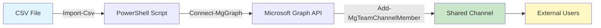

# Añadir miembros a canales compartidos de Teams en modo bulk

## Resumen

Añadir usuarios (internos y externos) uno a uno en canales compartidos de Teams es tedioso. Este post muestra cómo automatizar el proceso usando PowerShell, Microsoft Graph y un archivo CSV como origen de datos para añadir múltiples usuarios de forma eficiente.

<!-- more -->

## ¿Qué son los canales compartidos en Teams?

Los **canales compartidos** permiten colaborar con personas de tu organización y externas sin necesidad de cambiar de tenant. Puedes añadir:

- **Usuarios internos** de tu propia organización
- **Usuarios externos** que mantienen su identidad de origen mediante **B2B Direct Connect**

A diferencia de los guest users tradicionales, los participantes externos en canales compartidos conservan su tenant original.

**Características clave:**

- Soportan usuarios internos y externos en el mismo canal
- Usuarios externos no necesitan cuentas guest (B2B Collaboration)
- Los usuarios externos conservan su tenant original
- Configuración de B2B Direct Connect solo necesaria para usuarios externos
- Usan UPN (User Principal Name) para identificación

## Limitaciones importantes

!!! warning "Restricciones críticas"
    - **Guest users NO pueden añadirse** a canales compartidos (incluso si su UserType es "Member")
    - Debes usar el **UPN del usuario**, no su email (si difieren en Microsoft Entra ID)
    - Requiere configuración previa de **B2B Direct Connect** entre organizaciones
    - Las políticas de **Information Barriers** pueden bloquear la adición

## Arquitectura de la solución



## Prerrequisitos

**Configuración de tenant:**

```powershell
# Solo para usuarios externos: verificar B2B Direct Connect
Connect-MgGraph -Scopes "Policy.Read.All"
Get-MgPolicyCrossTenantAccessPolicyDefault
```

**Módulos PowerShell necesarios:**

```powershell
# Instalar Microsoft.Graph (módulo principal)
Install-Module -Name Microsoft.Graph -Scope CurrentUser

# Si solo necesitas Teams, puedes instalar el submódulo específico
Install-Module Microsoft.Graph.Teams -Scope CurrentUser

# Verificar instalación
Get-Module Microsoft.Graph* -ListAvailable
```

**Permisos necesarios:**

- `ChannelMember.ReadWrite.All` (application o delegated)
- Permisos de propietario del canal compartido

## Obtener usuarios desde un chat existente

Si ya tienes los usuarios en un chat de Teams, puedes exportar la lista:

### Opción 1: Desde Teams UI

1. Abre el chat en Teams
2. Haz clic en los participantes (icono de personas arriba)
3. Copia manualmente los nombres y emails

### Opción 2: PowerShell (más eficiente)

```powershell
# Instalar módulo si no lo tienes
Install-Module -Name Microsoft.Graph -Scope CurrentUser

# Listar chats donde participas
Connect-MgGraph -Scopes "Chat.Read"
$Chats = Get-MgUserChat -UserId "tu_upn@tuorganizacion.com" -All

# Ver detalles de un chat específico (usa Topic para identificarlo)
$Chats | Select-Object Id, Topic, ChatType | Format-Table

# Obtener miembros de un chat específico
$ChatId = "TU_CHAT_ID"
$ChatMembers = Get-MgChatMember -ChatId $ChatId

# Exportar a CSV
$ChatMembers | ForEach-Object {
    $Member = Get-MgUser -UserId $_.UserId -ErrorAction SilentlyContinue
    if ($Member) {
        [PSCustomObject]@{
            DisplayName = $Member.DisplayName
            UPN = $Member.UserPrincipalName
            Role = ""  # Ajustar manualmente si necesitas owners
        }
    }
} | Export-Csv -Path ".\members_from_chat.csv" -NoTypeInformation

Write-Host "CSV generado: members_from_chat.csv"
```

## Formato del archivo CSV

Crea un archivo `members.csv` con esta estructura (puedes generarlo desde el chat como se explicó arriba):

```csv
DisplayName,UPN,Role
Juan Pérez,jperez@tuorganizacion.com,
María García,mgarcia@tuorganizacion.com,owner
Carlos López,clopez@partnerdomain.com,
Ana Torres,atorres@otropartner.com,
```

```

**Campos:**

- `DisplayName`: Nombre completo del usuario
- `UPN`: User Principal Name
  - **Usuarios internos**: `usuario@tuorganizacion.com`
  - **Usuarios externos**: `usuario@organizacionexterna.com`
- `Role`: Vacío para miembros normales, `owner` para propietarios

!!! tip "UPN vs Email"
    Usa el UPN exacto de Entra ID. Si un usuario externo tiene email diferente al UPN, usa el UPN.

## Script PowerShell completo

```powershell
# Variables de configuración
$TeamId = "YOUR_TEAM_ID"
$ChannelId = "YOUR_CHANNEL_ID"
$CsvPath = ".\members.csv"

# Conectar a Microsoft Graph
Connect-MgGraph -Scopes "ChannelMember.ReadWrite.All"

# Importar CSV
$Members = Import-Csv -Path $CsvPath

# Contadores para reporte
$SuccessCount = 0
$ErrorCount = 0
$ErrorLog = @()

# Procesar cada miembro
foreach ($Member in $Members) {
    try {
        # Construir objeto de miembro
        $MemberParams = @{
            "@odata.type" = "#microsoft.graph.aadUserConversationMember"
            "user@odata.bind" = "https://graph.microsoft.com/v1.0/users('$($Member.UPN)')"
        }

        # Asignar rol si es owner
        if ($Member.Role -eq "owner") {
            $MemberParams["roles"] = @("owner")
        }

        # Añadir miembro al canal
        New-MgTeamChannelMember -TeamId $TeamId `
                                -ChannelId $ChannelId `
                                -BodyParameter $MemberParams

        Write-Host "✅ Añadido: $($Member.DisplayName) ($($Member.UPN))" -ForegroundColor Green
        $SuccessCount++

    } catch {
        $ErrorMessage = $_.Exception.Message
        Write-Host "❌ Error: $($Member.DisplayName) - $ErrorMessage" -ForegroundColor Red
        $ErrorCount++

        $ErrorLog += [PSCustomObject]@{
            DisplayName = $Member.DisplayName
            UPN = $Member.UPN
            Error = $ErrorMessage
        }
    }
}

# Resumen final
Write-Host "`n=== RESUMEN ===" -ForegroundColor Cyan
Write-Host "Total procesados: $($Members.Count)"
Write-Host "Éxitos: $SuccessCount" -ForegroundColor Green
Write-Host "Errores: $ErrorCount" -ForegroundColor Red

# Exportar log de errores si existen
if ($ErrorLog.Count -gt 0) {
    $ErrorLog | Export-Csv -Path ".\errors_$(Get-Date -Format 'yyyyMMdd_HHmmss').csv" -NoTypeInformation
    Write-Host "`nLog de errores guardado en: errors_$(Get-Date -Format 'yyyyMMdd_HHmmss').csv"
}

# Desconectar
Disconnect-MgGraph
```

## Obtener TeamId y ChannelId

**Listar equipos:**

```powershell
Get-MgTeam | Select-Object DisplayName, Id
```

**Listar canales de un equipo:**

```powershell
Get-MgTeamChannel -TeamId "TEAM_ID" | Select-Object DisplayName, Id, MembershipType
```

!!! note "Identificar canales compartidos"
    Los canales compartidos tienen `MembershipType = "shared"`

## Errores comunes y soluciones

| Error | Causa | Solución |
|-------|-------|----------|
| `User not found` | UPN incorrecto o usuario no existe | Verificar UPN exacto en Entra ID (interno o externo) |
| `Forbidden` | Falta B2B Direct Connect (solo externos) | Configurar cross-tenant access settings |
| `Guest users cannot be added` | Intentas añadir un guest user | Solo B2B Direct Connect; los guests no son compatibles |
| `Insufficient privileges` | Permisos insuficientes | Necesitas ser owner del canal + permisos Graph API |
| `Already a member` | Usuario ya existe en el canal | Normal si reejecutas el script, puedes ignorar |

## Verificar usuarios añadidos

```powershell
# Listar todos los miembros del canal compartido
Get-MgTeamChannelMember -TeamId $TeamId -ChannelId $ChannelId |
    Select-Object DisplayName, Email, Roles, UserId
```

## Alternativa: Usar Add-MgTeamChannelAllMember

Para añadir múltiples usuarios en una **única llamada API** (más eficiente):

```powershell
# Construir array de miembros
$AllMembers = @()
foreach ($Member in $Members) {
    $MemberObject = @{
        "@odata.type" = "#microsoft.graph.aadUserConversationMember"
        "user@odata.bind" = "https://graph.microsoft.com/v1.0/users('$($Member.UPN)')"
        "roles" = if ($Member.Role -eq "owner") { @("owner") } else { @() }
    }
    $AllMembers += $MemberObject
}

# Añadir todos en una sola operación
$BodyParams = @{
    values = $AllMembers
}

Invoke-MgGraphRequest -Method POST `
    -Uri "https://graph.microsoft.com/v1.0/teams/$TeamId/channels/$ChannelId/members/add" `
    -Body ($BodyParams | ConvertTo-Json -Depth 10)
```

!!! tip "Cuándo usar cada método"
    - `New-MgTeamChannelMember`: Control granular + logging detallado por usuario
    - `Add-MgTeamChannelAllMember`: Máxima velocidad para grandes volúmenes (batching)

## Buenas prácticas

1. **Exportar desde chat existente**: Si ya tienes los usuarios en un chat, usa el script PowerShell para generar el CSV automáticamente
2. **Validar UPNs antes de ejecutar**: Verifica que todos los UPNs existen (internos y externos)
3. **Procesar en lotes pequeños**: Si tienes >100 usuarios, divide el CSV
4. **Guardar logs de errores**: Usa el `-ErrorLog` del script para auditoría
5. **B2B Direct Connect solo para externos**: Los usuarios internos no necesitan configuración adicional
6. **No asumas UPN = Email**: Muchos tenants usan UPNs diferentes al email principal

## Referencias

- [Shared channels in Microsoft Teams](https://learn.microsoft.com/en-us/microsoftteams/shared-channels)
- [Microsoft Graph - Add members to channel](https://learn.microsoft.com/en-us/graph/api/channel-post-members)
- [Get chat members - Microsoft Graph](https://learn.microsoft.com/en-us/graph/api/chat-list-members)
- [B2B Direct Connect documentation](https://learn.microsoft.com/en-us/entra/external-id/b2b-direct-connect-overview)
- [Configure cross-tenant access settings](https://learn.microsoft.com/en-us/entra/external-id/cross-tenant-access-settings-b2b-direct-connect)
