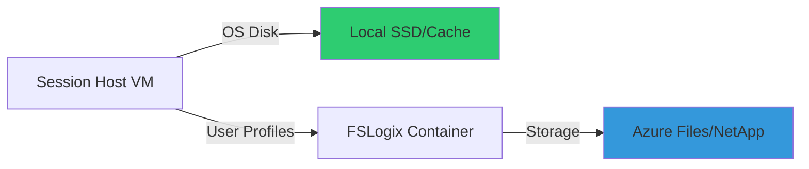

# Ephemeral OS Disks en Azure Virtual Desktop

## Resumen

Azure Virtual Desktop ahora soporta **Ephemeral OS Disks** (Public Preview desde octubre 2025), una característica que mejora significativamente el rendimiento y velocidad de aprovisionamiento en entornos de escritorios virtuales. Los discos efímeros almacenan el sistema operativo en el almacenamiento local de la VM en lugar de en Azure Storage remoto, proporcionando latencias más bajas y tiempos de reimagen más rápidos, ideales para cargas de trabajo stateless.

## ¿Qué son los Ephemeral OS Disks?

Los Ephemeral OS Disks son discos de sistema operativo creados en el almacenamiento local de la máquina virtual (SSD local, cache o disco temporal) en lugar de almacenarse en Azure Storage remoto. Esta arquitectura ofrece ventajas clave para entornos AVD donde la persistencia del sistema operativo no es crítica.

**Características principales:**

- Almacenamiento en disco local (cache o temp disk de la VM)
- Aprovisionamiento y reimagen ultra rápidos
- Menor latencia en operaciones de lectura/escritura
- Optimizado para host pools de tipo pooled
- No persistente: reinicio/reimagen/delete únicamente (no soporta stop/deallocate)

## ¿Por qué usar Ephemeral OS Disks en AVD?

**Beneficios concretos:**

1. **Rendimiento mejorado**: Operaciones I/O directas sobre almacenamiento local
2. **Provisioning más rápido**: Creación de session hosts en menos tiempo
3. **Reimagen acelerado**: Reset de VMs al estado original en segundos
4. **Coste optimizado**: No se consumen recursos de Azure Storage remoto
5. **Ideal para VDI stateless**: Los perfiles de usuario se persisten en FSLogix/Azure Files

## Arquitectura y funcionamiento



**Diferencia clave con discos persistentes:**

| Aspecto | Ephemeral OS Disk | Managed OS Disk |
|---------|------------------|-----------------|
| **Ubicación** | Almacenamiento local VM | Azure Storage remoto |
| **Latencia I/O** | Muy baja | Mayor (red) |
| **Persistencia** | No persistente | Persistente |
| **Operaciones** | Restart/Reimage/Delete | Start/Stop/Deallocate/Snapshot |
| **Coste** | Incluido en VM | Coste adicional storage |

**Placement options:**

- **OS Cache**: Para imágenes ≤ 127 GiB (ej: Windows Server)
- **Temp Disk**: Para imágenes que requieren >127 GiB y VM con disco temporal suficiente

## Requisitos y limitaciones

### Requisitos

- Host pool de tipo **Pooled** con Session Host Configuration
- Tamaño de imagen ≤ cache/temp disk disponible en VM size elegida
- Solo soportado en Azure (no Azure Government durante preview)

### Limitaciones importantes

**No soporta:**

- Deallocate de VMs (solo restart, reimage, delete)
- VM snapshots
- Azure Disk Encryption
- Azure Backup
- Azure Site Recovery
- OS Disk Swap
- NVMe y Premium SSD (durante preview)

**Configuración de autoscaling:**

- Usar Dynamic Autoscaling con **Minimum percentage of active hosts = 100%**
- Evita operaciones stop/deallocate incompatibles con ephemeral disks

## Configuración práctica

### Paso 1: Crear host pool con Ephemeral OS Disk (Portal)

```yaml
# Configuración requerida en Azure Portal

Host Pool Type: Pooled
Management Type: Automated
Session Host Configuration: Enabled

# En la pestaña Virtual Machines:
Image: Windows 11 Enterprise multi-session
Virtual Machine Size: Standard_D8s_v3 (temp disk 200 GiB)
OS Disk Type: Standard SSD (auto-selected)
Ephemeral OS Disk: Enabled
Placement: Temp Disk
```

### Paso 2: Crear session host configuration con PowerShell

```powershell
# Variables del entorno
$resourceGroup = "avd-rg"
$hostPoolName = "avd-ephemeral-pool"
$location = "westeurope"
$vmPrefix = "avd-eph"
$vmSize = "Standard_D8s_v3"
$subnetId = "/subscriptions/<SUB_ID>/resourceGroups/<RG>/providers/Microsoft.Network/virtualNetworks/<VNET>/subnets/<SUBNET>"

# Crear session host configuration con ephemeral disk
$parameters = @{
    FriendlyName = "Ephemeral Session Hosts"
    HostPoolName = $hostPoolName
    ResourceGroupName = $resourceGroup
    VMNamePrefix = $vmPrefix
    VMLocation = $location
    ImageInfoType = "Marketplace"
    MarketplaceInfoPublisher = "MicrosoftWindowsDesktop"
    MarketplaceInfoOffer = "Windows-11"
    MarketplaceInfoSku = "win11-22h2-avd"
    MarketplaceInfoExactVersion = "latest"
    VMSizeId = $vmSize
    DiskInfoType = "Standard_LRS"  # Standard SSD requerido en preview
    NetworkInfoSubnetId = $subnetId
    DomainInfoJoinType = "AzureActiveDirectory"
    VMAdminCredentialsUsernameKeyVaultSecretUri = "https://<VAULT>.vault.azure.net/secrets/<SECRET>/..."
    VMAdminCredentialsPasswordKeyVaultSecretUri = "https://<VAULT>.vault.azure.net/secrets/<SECRET>/..."
}

New-AzWvdSessionHostConfiguration @parameters
```

### Paso 3: Validar tamaños de VM compatibles

```powershell
# Listar VM sizes con soporte ephemeral disk
$location = "westeurope"
$vmSizes = Get-AzComputeResourceSku -Location $location |
    Where-Object {$_.ResourceType -eq 'virtualMachines'}

foreach ($vmSize in $vmSizes) {
    foreach ($capability in $vmSize.Capabilities) {
        if ($capability.Name -eq "EphemeralOSDiskSupported" -and $capability.Value -eq "True") {
            [PSCustomObject]@{
                VMSize = $vmSize.Name
                EphemeralSupported = $capability.Value
                CacheSize = ($vmSize.Capabilities | Where-Object {$_.Name -eq "CachedDiskBytes"}).Value
                TempDiskSize = ($vmSize.Capabilities | Where-Object {$_.Name -eq "MaxResourceVolumeMB"}).Value
            }
        }
    }
}
```

### Paso 4: Configurar autoscaling para ephemeral disks

```powershell
# Crear scaling plan con configuración específica para ephemeral
$scalingParams = @{
    HostPoolName = $hostPoolName
    ResourceGroupName = $resourceGroup
    ScheduledDateTimeZone = "W. Europe Standard Time"
    UpdateLogOffDelayMinute = 15
    UpdateMaxVmsRemoved = 10
    UpdateDeleteOriginalVM = $true  # Importante: eliminar VMs en lugar de deallocate
    UpdateLogOffMessage = "El sistema se reiniciará para mantenimiento en 15 minutos"
}

New-AzWvdSessionHostManagement @scalingParams
```

## Migración de host pools existentes

Para migrar un host pool con managed disks a ephemeral:

```powershell
# 1. Actualizar session host configuration
$updateParams = @{
    HostPoolName = $hostPoolName
    ResourceGroupName = $resourceGroup
    VMSizeId = "Standard_D8s_v3"  # VM size con temp disk suficiente
    DiskInfoType = "Standard_LRS"
}

Update-AzWvdSessionHostConfiguration @updateParams

# 2. Programar update para aplicar cambios (reemplaza session hosts)
# Nota: Esto recreará los session hosts con ephemeral disks

# 3. Monitorizar progreso
$progress = Get-AzWvdSessionHostManagementsUpdateStatus @updateParams |
    Format-List PercentComplete, ProgressSessionHostsCompleted, EndTime

$progress
```

## Buenas prácticas

**Persistencia de datos:**

- Usar FSLogix Profile Containers para perfiles de usuario
- Almacenar datos en Azure Files o Azure NetApp Files
- Configurar redirección de carpetas conocidas (OneDrive, Documents)

**Gestión de ciclo de vida:**

- Implementar lógica restart/delete en scripts de autoscaling
- Evitar usar stop/deallocate (genera pérdida de datos)
- Programar reimaging periódico para refresh de session hosts

**Sizing correcto:**

- Verificar que image size ≤ cache/temp disk disponible
- Para Windows 11 multi-session (127 GiB): usar VMs con temp disk ≥ 127 GiB
- Preferir temp disk placement sobre cache para mayor espacio disponible

**Monitorización:**

- Alertas sobre tasa de reimage/restart
- Métricas de latencia de disco en Azure Monitor
- Revisar logs de deployment failures relacionados con tamaño insuficiente

## Troubleshooting común

**Error: "Insufficient local storage"**

```powershell
# Causa: VM size sin suficiente cache/temp disk
# Solución: Cambiar a VM size mayor o con temp disk adecuado

# Verificar tamaño requerido
$imageSize = 127  # GiB para Windows 11 multi-session
Get-AzComputeResourceSku -Location $location |
    Where-Object {$_.Name -eq "Standard_D8s_v3"} |
    Select-Object Name, @{N="TempDiskGB";E={[math]::Round(($_.Capabilities |
        Where-Object {$_.Name -eq "MaxResourceVolumeMB"}).Value / 1024)}}
```

**Error: "NVMe placement not supported"**

```text
Causa: Selección de NVMe como placement durante preview
Solución: Usar Temp Disk o Cache placement en Azure Portal
```

**Pérdida de datos tras deallocate:**

```text
Causa: Operación stop/deallocate borra OS state en ephemeral disks
Solución: Configurar autoscaling con UpdateDeleteOriginalVM = $true
Usar restart en lugar de deallocate para operaciones manuales
```

## Referencias

- [Ephemeral OS disks on Azure Virtual Desktop](https://learn.microsoft.com/en-us/azure/virtual-desktop/deploy/session-hosts/ephemeral-os-disks)
- [What's new in Azure Virtual Desktop - October 2025](https://learn.microsoft.com/en-us/azure/virtual-desktop/whats-new#october-2025)
- [Ephemeral OS disks for Azure VMs](https://learn.microsoft.com/en-us/azure/virtual-machines/ephemeral-os-disks)
- [Troubleshoot ephemeral OS disks in AVD](https://learn.microsoft.com/en-us/troubleshoot/azure/virtual-desktop/troubleshoot-ephemeral-os-disks)
- [Session host update and configuration](https://learn.microsoft.com/en-us/azure/virtual-desktop/session-host-update-configure)
